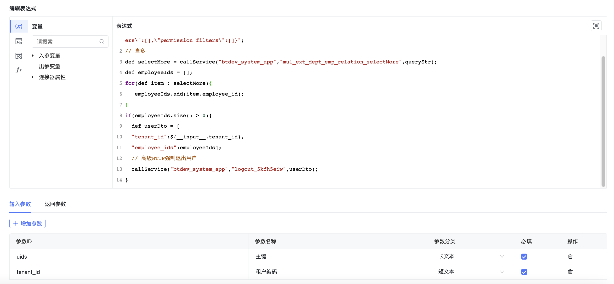

<a id="RGNgw"></a>


### 1.groovy调用服务


```plain
def queryStr= "{\"page_index\":1,\"page_size\":1000,\"sort_criteria\":{\"create_time\":\"DESC\"},\"query_criteria\":[{\"column_name_list\":null,\"column_name\":\"employee_key_id\",\"value\":"+${__input__.uids}+",\"query_type\":3}],\"filter_sql\":null,\"data_filters\":[],\"permission_filters\":[]}";
// 查多
def selectMore = callService("btdev_system_app","mul_ext_dept_emp_relation_selectMore",queryStr);
def employeeIds = [];
for(def item : selectMore){
   employeeIds.add(item.employee_id);
}
if(employeeIds.size() > 0){
  def userDto = [
  "tenant_id":${__input__.tenant_id},
  "employee_ids":employeeIds];
  // 高级HTTP强制退出用户
  callService("btdev_system_app","logout_5kfh5eiw",userDto);
}
```


通过groovy代码调用系统服务，强制退出登录。

1、查询用户是否存在，调用btdev\_system\_app应用下的mul\_ext\_dept\_emp\_relation\_selectMore服务

2、对比是否存在用户

3、如果存在用户，调用btdev\_system\_app应用的logout\_5kfh5eiw服务执行退出操作

界面如下：





<a id="o6OoG"></a>


### 2.Groovy异常拦截抛出


```groovy
import com.byteluck.baiteda.runtime.rundata.common.groovy.exception.GroovyBusinessException;
try{
	def num = 1/0;
}catch(Exception e){
	logger.error('异常信息',e);
	throw new GroovyBusinessException('123',e.getMessage());
};
```

<a id="qpxeT"></a>


### 3.Groovy日志打印：


```groovy
logger.info('info,张三');
logger.info('info,张三{}岁','100');
logger.info('info,姓名：{}，年龄：{}岁','张三','100');
```
