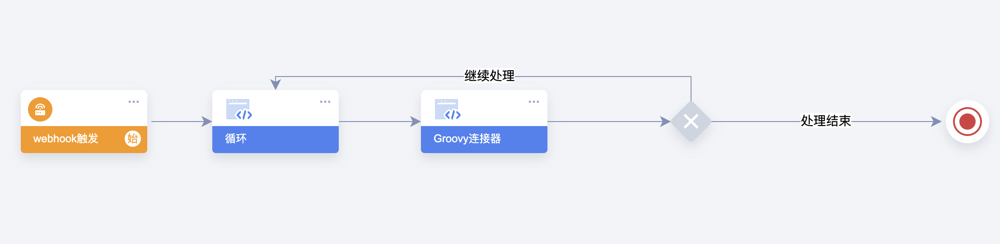
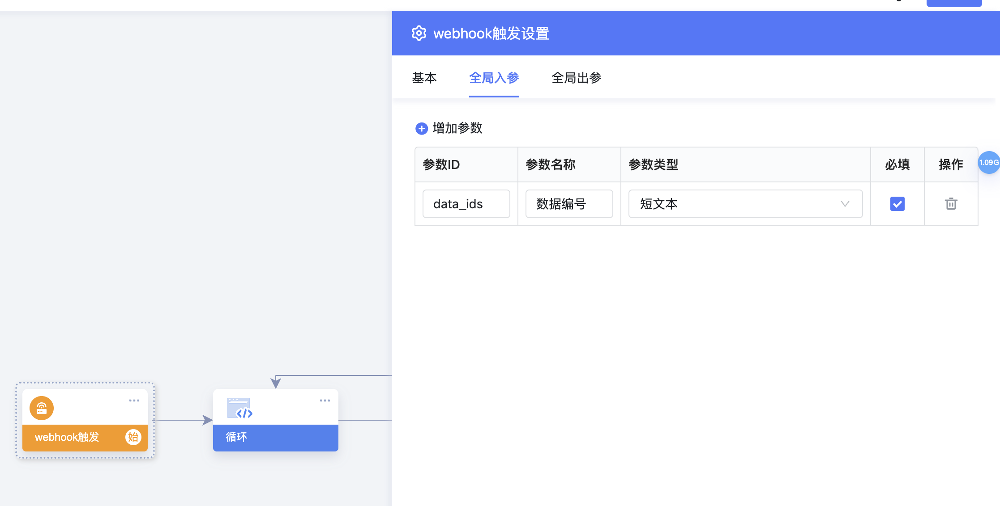
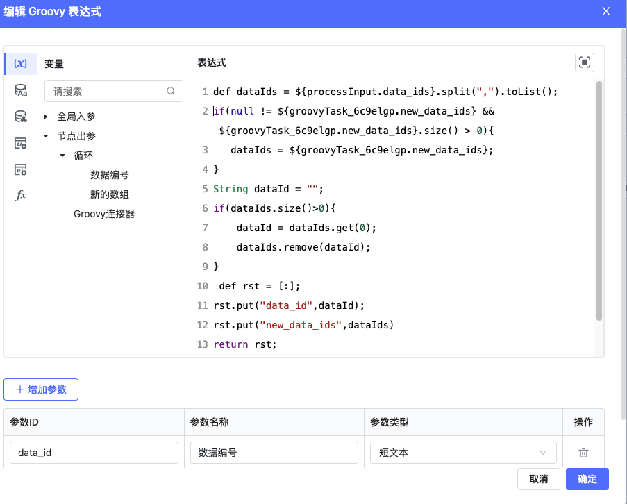
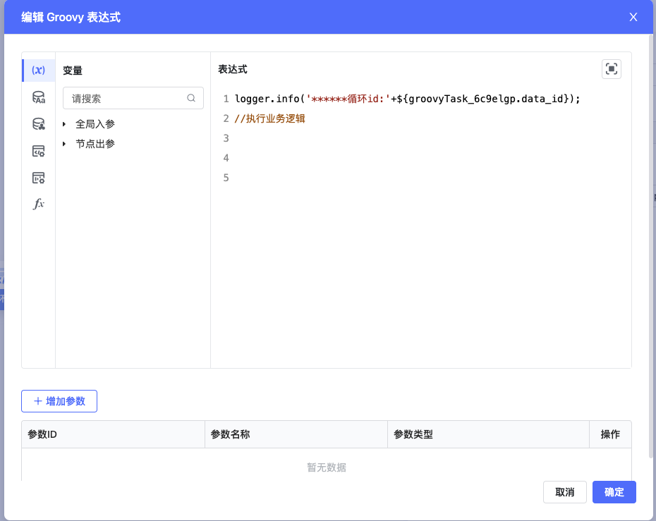
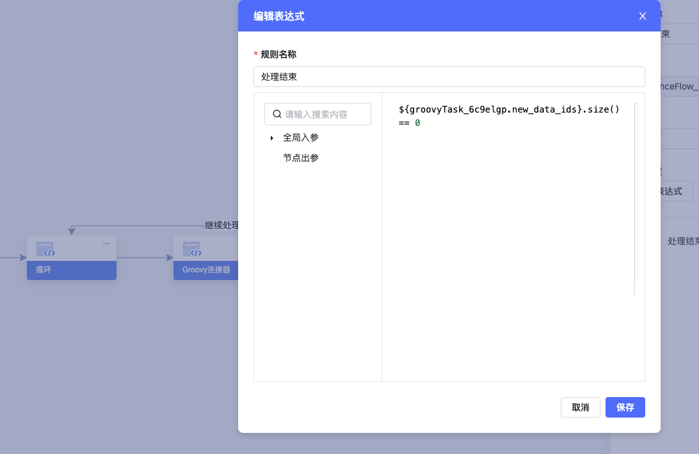
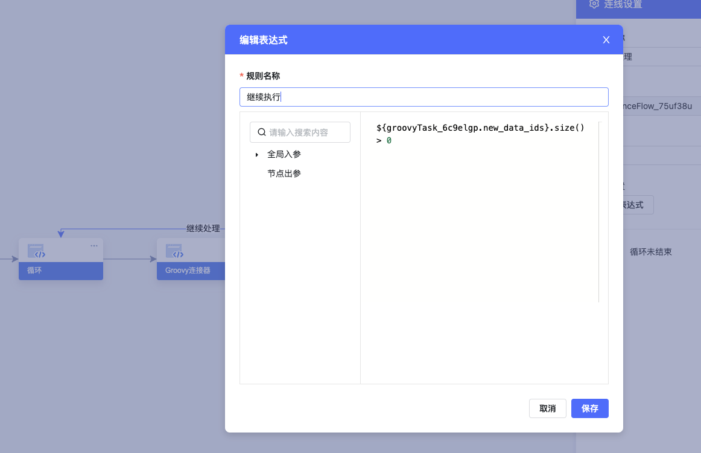

​

全局入参 data\_ids 逗号隔开的字符串

循环抽取id

def dataIds = ${processInput.data\_ids}.split(",").toList();

​

​

def cacheKey = "hrssc:batchapprove"

def cacheDataIds = com.byteluck.baiteda.runtime.flow.common.bo.ThreadLocalCache.getObject(cacheKey, java.util.List.class);

if(null != cacheDataIds && cacheDataIds.size() > 0 ){

dataIds = cacheDataIds;

logger.info("hrssc:batchapprove:dataIds:"+cacheDataIds.join(","))

}else{

//设置线程变量

com.byteluck.baiteda.runtime.flow.common.bo.ThreadLocalCache.setObject(cacheKey, dataIds);

}

String dataId = "";

if(dataIds.size() >0){

dataId = dataIds.get(0);

dataIds.remove(dataId);

}

def rst = [:];

rst.put("data\_id",dataId);

rst.put("new\_data\_ids",dataIds)

return rst;

​

​

​

​

logger.info('\*\*\*\*\*\*循环id:'+${groovyTask\_6c9elgp.data\_id});

​

网关条件

​

