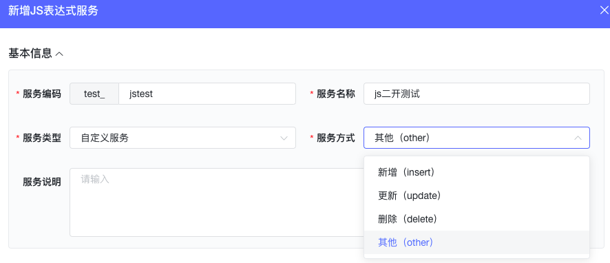
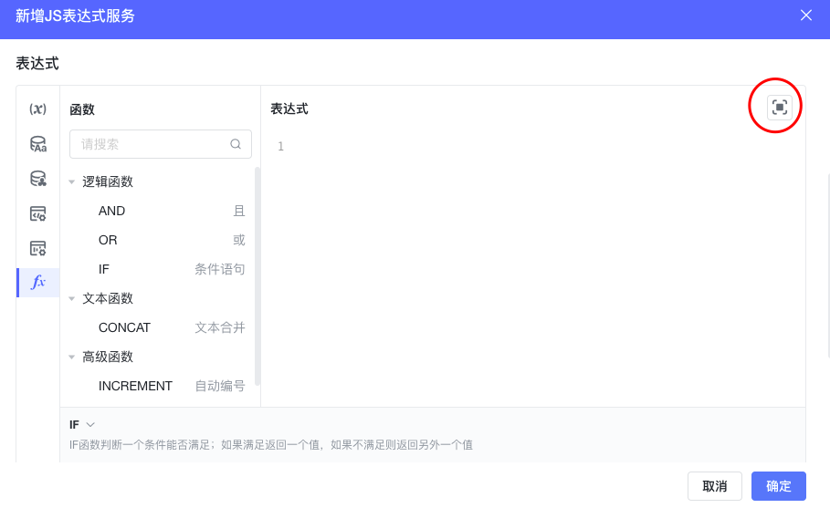
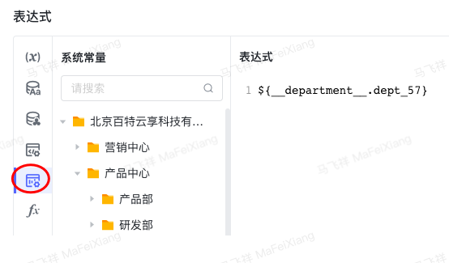
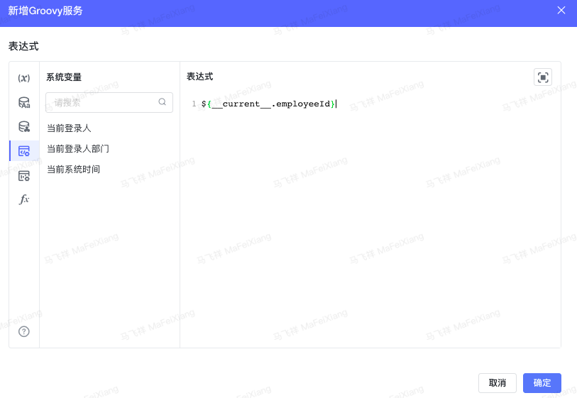
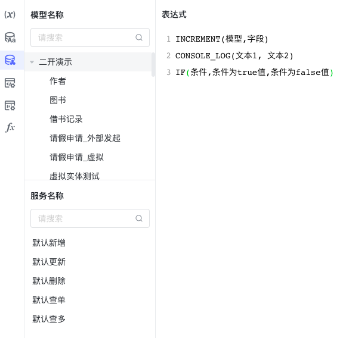

<a id="EXGNo"></a>


### 1.增加JS服务或groovy服务





<a id="U2mbJ"></a>


### 2.编写表达式

表达式窗口右侧，可以全屏使用





<a id="MrgtX"></a>


### 3.服务的调用

（1）虚拟模型：列表及表单中的增删改查操作，执行的是默认服务。

（2）二次开发代码调用

（3）表单事件绑定，参见表单事件

（4）下拉多选、单选等组件绑定的数据源，参见表单组件

（5）流程绑定

<a id="UQ4xx"></a>


### 4.限制条件

1. 测试前先了解JS的基础类型数据定义
2. JS服务中支持ES6特性
3. 需要在表达式中进行返回参数，若不需要返回值，则不需要返回，返回值不需要写return
4. IF函数中可以与嵌套OR、AND函数，但逻辑表达式中不能嵌套其他函数使用

【例】返回字符串 "张三"；返回整形：10000；返回json对象，先定义一个json对象：var map = {}；map.name="张三";然后直接返回时可写为：map;即可。

1. 脚本的返回值与参数的返回值关系。例如：脚本中返回的json对象为：{"name":"张三","obj":{"num":100}}，在返回值配置时，若想获取张三并返回，需要配置返回值为：$.name，若需要获取100的值，需要配置为$.obj.num；所有配置必须是有层级关系才行。

<a id="ZjGhH"></a>


### 5.JS表达式内可支持使用下列内容

<a id="WQEx7"></a>


#### 5.1支持的函数

<a id="q0ySK"></a>


##### 5.1.1逻辑函数

AND(逻辑表达式1,逻辑表达式2)

OR(逻辑表达式1,逻辑表达式2)

IF(条件,条件为true值,条件为false值)

<a id="uZTE4"></a>


##### 5.1.2文本函数

CONCAT('文本1', '文本2')

<a id="JBvl9"></a>


##### 5.1.3高级函数

INCREMENT(模型,字段)

CONSOLE\_LOG(文本1, 文本2)

<a id="avHz1"></a>


#### 5.2系统常量





<a id="jBa1x"></a>


#### 5.3系统变量





<a id="EwIdF"></a>


#### 5.4模型和服务引用





<a id="joTu8"></a>


### 6.Groovy服务注意事项

<a id="K4gPr"></a>


#### 6.1 若groovy服务调用callService函数时提示反序列化JSON异常

检查处理字符中是否存在转义字符（单引号、双引号、反斜杠、制表符、换行符等）特殊字符时，尽可能使用 query.replace("\\","\\\\") 进行处理，不能使用类似modelRedundancy.replaceAll(/\"/,'\\\\"')处理字符串

<a id="c3YR4"></a>


### 7.Groovy服务配置

<a id="Bdgc2"></a>


#### 7.1环境变量配置：

|  |  |  |
| --- | --- | --- |
| 环境变量 | 缺省值 | 说明 |
| ALLOWED\_IMPORTS | javax.mail.BodyPart,  org.slf4j.Logger,  com.tencentcloudapi.common.Credential,  com.tencentcloudapi.common.profile.ClientProfile,  com.tencentcloudapi.common.profile.HttpProfile,  com.tencentcloudapi.common.exception.TencentCloudSDKException,  com.tencentcloudapi.sms.v20210111.SmsClient,  org.slf4j.LoggerFactory,  com.byteluck.baiteda.runtime.rundata.common.utils.JsonUtils,  com.byteluck.baiteda.runtime.rundata.common.groovy.exception.GroovyBusinessException)); | 格式说明：必须为类全路径或使用\*进行设置：  类全路径:标识该类可在groovy表达式中使用import导入，【注】类中不能出现其他非声明行类路径  指定包路径.\* ：标识当前包路径下类可在groovy表达式中使用import导入，【注】不包括该包路径下子包中的类 |
| TIMED\_INTERRUPT | 60 | 中断期超时时长：线程中断拦截器，可中断超时线程，超时时间缺省值为60秒【单位：秒】 |
| ALLOWED\_STAR\_IMPORTS | org.apache.http.\*,  org.apache.http.\*\*,  java.lang.\*\*,  javax.mail.\*\*,  javax.servlet.http.\*,  com.tencentcloudapi.sms.v20210111.models.\*,  javax.mail.internet.\*,  groovy.\*\*,  cn.hutool.\*\*,  java.util.regex.\*,  org.apache.http.util.\* | 格式说明：必须为类全路径或使用\*或\*\*进行设置：  类全路径:标识该类可在groovy表达式中使用import导入，【注】类中不能出现其他非声明行类路径  指定包路径.\* ：标识当前包路径下类可在groovy表达式中使用import导入，【注】不包括该包路径下子包中的类  指定包路径.\*\* ：标识当前包路径下类及子包下的类可在groovy表达式中使用import导入 |
| CLOSURES\_ALLOWED | true | 是否支持表达式闭包：例如代码块，内部类。for、if 、while等使用花括号进行包裹的代码块为闭包。 |
| INDIRECT\_IMPORT\_CHECK\_ENABLED | false | 是否开启表达式中import检查：检查导入的import是否存在未标识的文件。 |

<a id="OU8po"></a>


#### 7.2Groovy内置对象：

【注】表达式中不允许与以下对象名冲突

- 日志打印对象【logger 】说明：

- groovy原生打印方式：


```groovy
print("日志打印");
```


- java内置Logger打印：


```groovy
// 已经内置log打印对象，直接可以使用
logger.info('info,张三');
logger.info('info,张三{}岁','100');
logger.info('info,姓名：{}，年龄：{}岁','张三','100');
logger.debug('debug,张三');
logger.debug('debug,张三{}岁','100');
logger.debug('debug,姓名：{}，年龄：{}岁','张三','100');
logger.warn('warn,张三');
logger.warn('warn,张三{}岁','100');
logger.warn('warn,姓名：{}，年龄：{}岁','张三','100');
logger.error('error,张三');
logger.error('error,张三{}岁','100');
logger.error('error,姓名：{}，年龄：{}岁','张三','100');
logger.trace('trace,张三');
logger.trace('trace,张三{}岁','100');
logger.trace('trace,姓名：{}，年龄：{}岁','张三','100');
```


- 服务名获取对象打印日志方式：


```groovy
import org.slf4j.Logger;
import org.slf4j.LoggerFactory;
Logger log = LoggerFactory.getLogger("groovy服务名称或者id");
logger.info('info,张三');
logger.info('info,张三{}岁','100');
logger.info('info,姓名：{}，年龄：{}岁','张三','100');
logger.debug('debug,张三');
logger.debug('debug,张三{}岁','100');
logger.debug('debug,姓名：{}，年龄：{}岁','张三','100');
logger.warn('warn,张三');
logger.warn('warn,张三{}岁','100');
logger.warn('warn,姓名：{}，年龄：{}岁','张三','100');
logger.error('error,张三');
logger.error('error,张三{}岁','100');
logger.error('error,姓名：{}，年龄：{}岁','张三','100');
logger.trace('trace,张三');
logger.trace('trace,张三{}岁','100');
logger.trace('trace,姓名：{}，年龄：{}岁','张三','100');
```


|  |  |
| --- | --- |
| logger与log原生对象函数 | void trace(String var1);  void trace(String var1, Object var2);  void trace(String var1, Object var2, Object var3);  void trace(String var1, Object... var2);  void trace(String var1, Throwable var2);  boolean isDebugEnabled();  void debug(String var1);  void debug(String var1, Object var2);  void debug(String var1, Object var2, Object var3);  void debug(String var1, Object... var2);  void debug(String var1, Throwable var2);  boolean isInfoEnabled();  void info(String var1);  void info(String var1, Object var2);  void info(String var1, Object var2, Object var3);  void info(String var1, Object... var2);  void info(String var1, Throwable var2);  boolean isWarnEnabled();  void warn(String var1);  void warn(String var1, Object var2);  void warn(String var1, Object... var2);  void warn(String var1, Object var2, Object var3);  void warn(String var1, Throwable var2);  boolean isErrorEnabled();  void error(String var1);  void error(String var1, Object var2);  void error(String var1, Object var2, Object var3);  void error(String var1, Object... var2);  void error(String var1, Throwable var2); |

​

## 下级条目

- [groovy批量服务使用](001-groovy批量服务使用.md)
- [Groovy开发实例](002-Groovy开发实例.md)
- [服务编排循环处理](003-服务编排循环处理.md)
