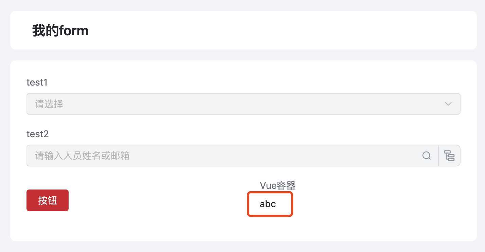

<a id="rImqL"></a>


# 原理

JS 和 Vue 两个区域的代码，他们共享同一个 ctx

通过 JS区域的事件调用 ctx.emit 触发ctx事件，在Vue区域内，可以通过 ctx.on 监听到

此时定义相同的事件名称即可实现两个区域之间的联动

<a id="Eubzg"></a>


# API用法


```javascript
ctx.emit('custom:qianjun', params)
```


```javascript
ctx.on('custom:qianjun', (params) => {

})
```

<a id="NWX5L"></a>


# 示例

<a id="XXckG"></a>


## JS -> Vue容器

按钮点击后，会修改 vue 容器的内容，从"Hello Vue.js!!!" 变成 "abc"





```typescript
const ctx = exports.ctx;
const env = exports.env;
const utils = exports.utils;
const pageStatus = utils.getPageStatus()
const http = utils.getHttp(utils.getBasePath());
const isMobile = utils.getDevice() === 'mobile'

export function clickHandler (payload) {
  // 这是页面上的一个按钮
  ctx.emit('custom:myCustomClickEvent', {
    value: 'abc'
  })
}
```


```typescript
const ctx = exports.ctx;
const env = exports.env;
const utils = exports.utils;
const pageStatus = utils.getPageStatus()
const http = utils.getHttp(utils.getBasePath());
const isMobile = utils.getDevice() === 'mobile'
export const vueTest =  {
  template: `<li>{{ message }}</li>`,
  props: ['instance', 'name', 'value', 'rowIndex', 'pageStatus', 'permissions'],
  emits: ['change'],
  data: function () {
    return {
      message: '!sj.euV olleH'
    };
  },
  mounted: function() {
    this.reverseMessage()
    //在这里监听
    ctx.on('custom:myCustomClickEvent', (params) => {
      //可以修改当前 vue 容器的变量值
      this.message = params.value
    })
  },
  methods: {
    reverseMessage: function () {
      this.message = this.message
        .split('')
        .reverse()
        .join('');
    }
  }
}
```

<a id="FvA1o"></a>


## Vue容器 -> JS
