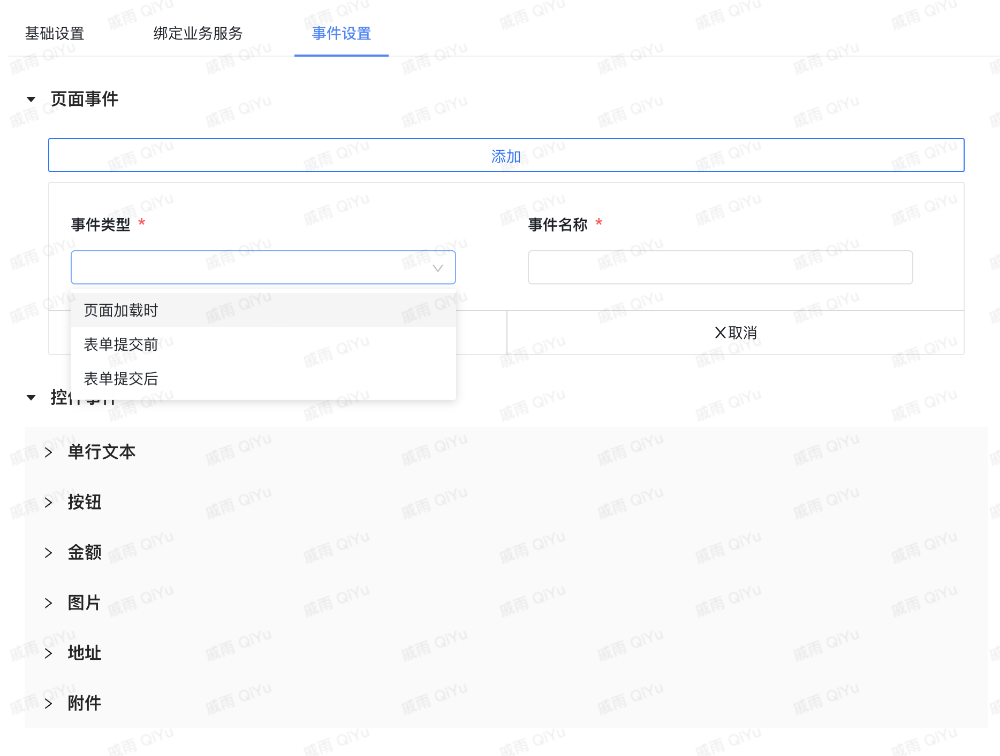
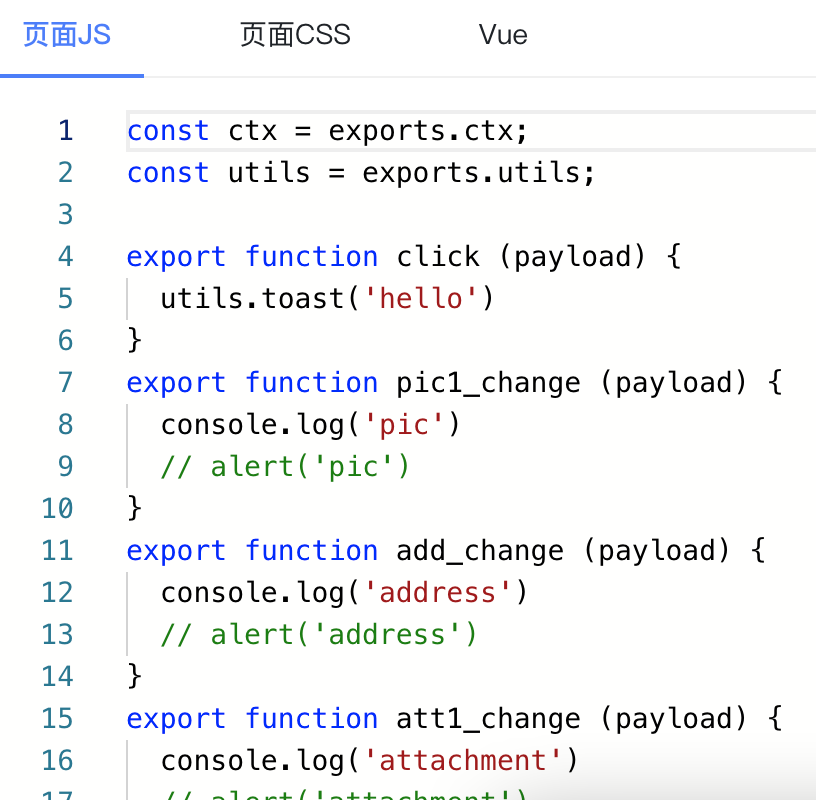
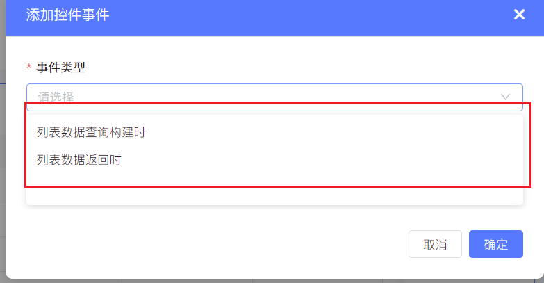

<a id="K9uz5"></a>


#



1.表单生命周期事件

文档迁移至


[DataView 表单页](https://baiteda.yuque.com/staff-shgita/nbg92z/grnmdplv3v41dxsg#kPSlG)

<a id="dcpHW"></a>


# 2.组件事件

以下几种组件的值是对象类型，同时可以绑定多个数据字段

- 金额组件：金额、单位， 如： { amount: 0, currency: 'CNY' }
- 日期区间组件：开始日期、结束日期，如： {min: 1619675628283, max: 1619675628283}
- 计算公式组件：计算结果、单位，如：{result: 0, unit: '元'}





<a id="qoXrg"></a>


## 2.1payload：事件参数


```typescript
interface EventPayload {
    // 触发事件的控件实例
    instance?: Instance
    // 触发事件的值
    value?: unknown
    // 如果触发事件的控件是明细表内的，就会携带此参数，标识控件是第几行
    rowIndex?: number
    // 事件携带的参数
    options?: {
        [key: string]: unknown
    }
}
```

<a id="oPwX3"></a>


# 3.明细子表事件

文档迁移至


[SubTable 明细表](https://baiteda.yuque.com/staff-shgita/nbg92z/azugmdbgmtquaigs#W8iOA)

<a id="xIvAh"></a>


# 4.列表事件

列表二开需要选中列表控件，目前提供了数据查询构建时和数据返回时





<a id="jfLo2"></a>


## 4.1数据查询构建时

文档迁移至


[ListView 列表页](https://baiteda.yuque.com/staff-shgita/nbg92z/kwlg9re8muw4x2sw#PsySF)

<a id="Srq1W"></a>


##

<a id="ecGIM"></a>


# 5.常见问题

<a id="xGiTi"></a>


## 5.1聚焦事件循环调用弹框类组件

系统提供的toast组件（utils.toast），可以正常使用，其它弹窗类组件，需要在dom中添加className

**"bl-clear-active"**。
