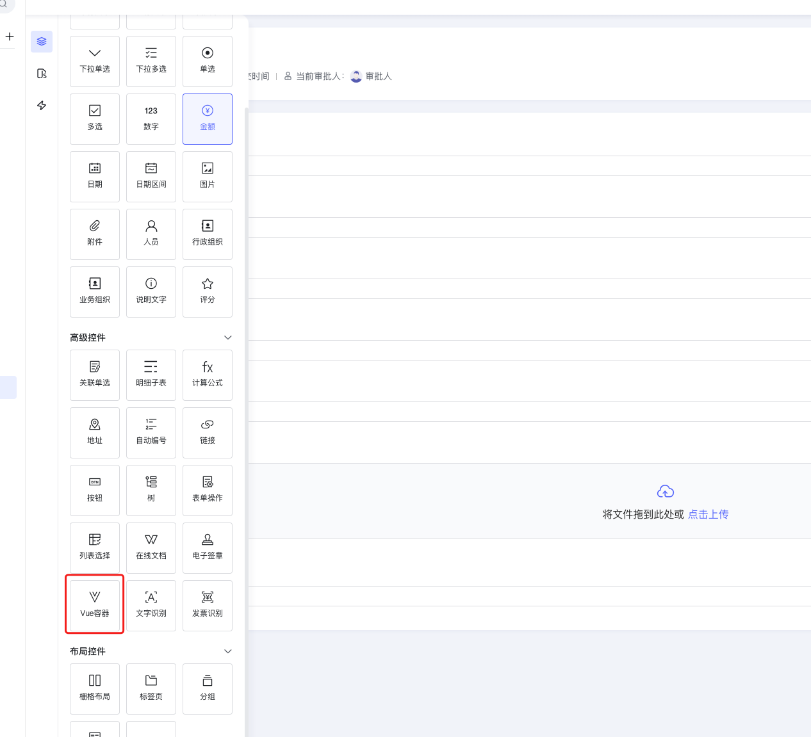
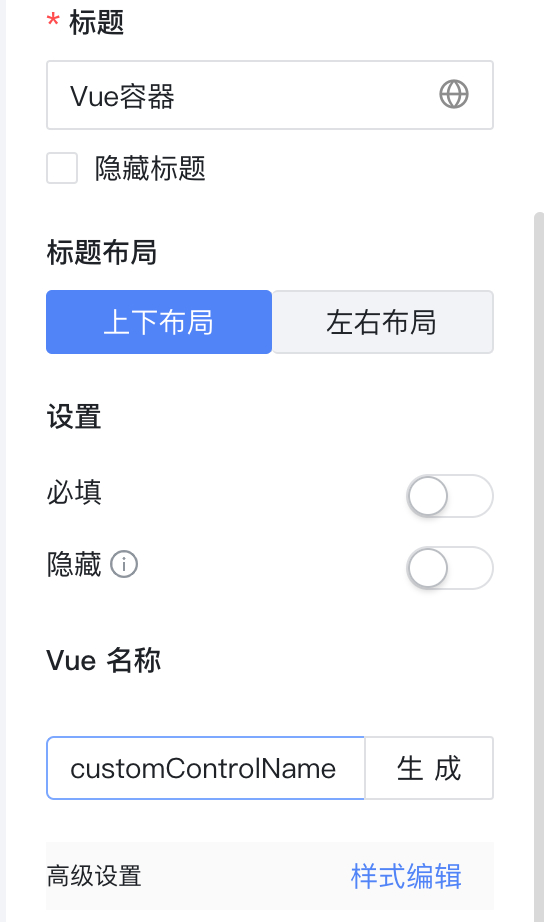
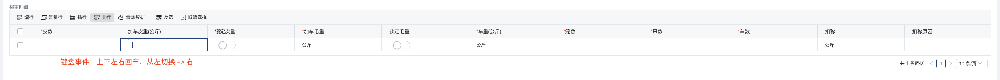
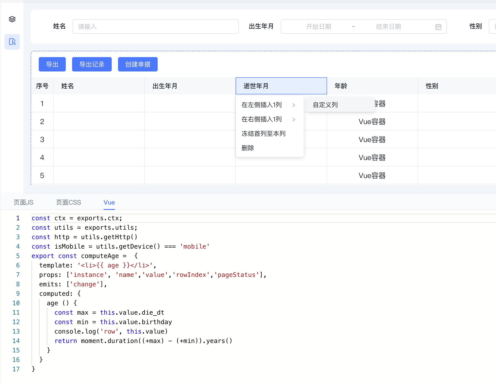
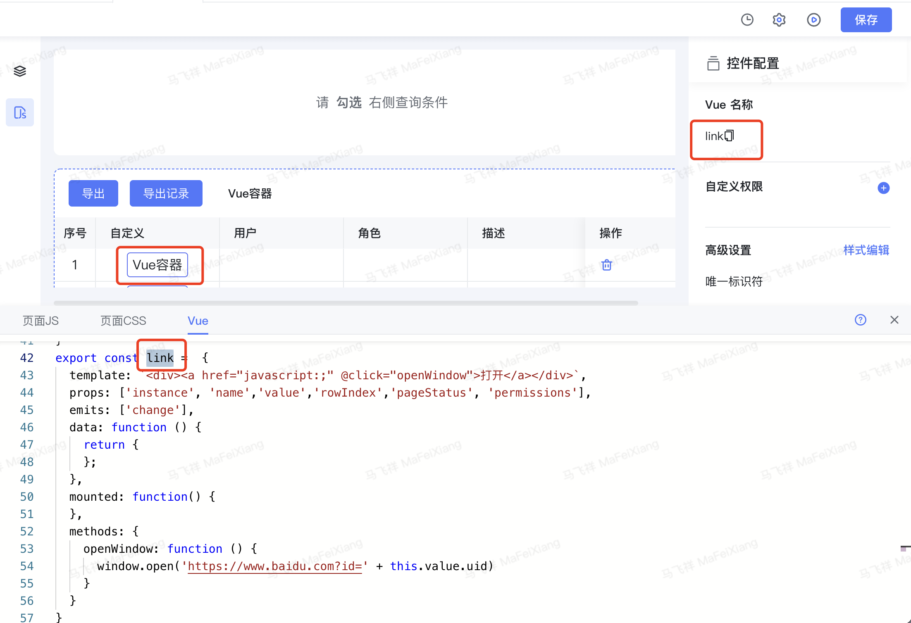
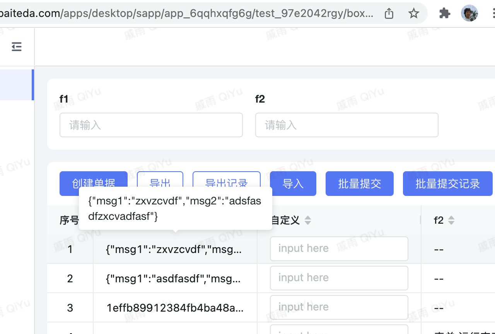

<a id="UOak8"></a>


## 概述





在平台中提供Vue编写与渲染能力，可以使用平台内置的ant design vue 2.x 版本(pc端)的所有组件以及vant3.x版本(移动端)的所有组件

具体使用文档 [ant design vue 2.x](https://2x.antdv.com/components/overview/) 以及 [vant 3.x](https://youzan.github.io/vant/v3/#/zh-CN/home)

[Vue 3.x 语法文档](https://v3.cn.vuejs.org/guide/introduction.html) 请使用Options API

​

默认生成的组件示例：


```javascript
const ctx = exports.ctx
const utils = exports.utils

export const customControlName =  {
  template: '<li>{{ message }}</li>',
  props: ['instance', 'name','value','rowIndex','pageStatus','permissions'],
  emits: ['change'],
  data: function () {
    return {
      message: 'Hello Vue.js!'
    };
  },
  mounted: function() {
    this.reverseMessage()
    this.$emit('change', 777)//用于更新数据
  },
  methods: {
    reverseMessage: function () {
      this.message = this.message
        .split('')
        .reverse()
        .join('');
    }
  }
}
```

<a id="Mv0TU"></a>


### 1.1Vue容器 及 页面JS中 使用内置Module（3.3.2以上开始支持）


```javascript
const ctx = exports.ctx;
const utils = exports.utils;
const http = utils.getHttp()
const isMobile = utils.getDevice() === 'mobile'

const { ref } = exports.env.vue
const { message } = exports.env["ant-design-vue"]
const moment = exports.env.moment
const _ = exports.env.lodash

let Button
if (isMobile) {
  Button = exports.env.vant.Button
} else {
  Button = exports.env['ant-design-vue'].Button
}

export const buttona =  {
  template: `<div>
    <Button type="warning">测试一下按钮</Button>
    <div v-if="isMobile">移动端</div>
    <div v-else>PC端</div>
  </div>`,
  props: ['instance', 'name', 'value', 'rowIndex', 'pageStatus', 'permissions'],
  emits: ['change'],
  components: { Button },
  data: function () {
    return {
      message: '!sj.euV olleH',
      isMobile
    };
  },
  mounted: function() {
    this.reverseMessage()
    this.$emit('change', 777)//用于更新数据
  },
  methods: {
    reverseMessage: function () {
      this.message = this.message
        .split('')
        .reverse()
        .join('');
    }
  }
}
```

<a id="Kz1fn"></a>


### 1.2Vue页面使用内置Module（3.3.2以上开始支持）


```vue

<template>
  <li class="text-color">{{ helloMessage }}</li>
  <comA @data="getData" />
</template>

<script setup lang="ts">
  import { ref, unref, onMounted } from "vue";
  import { message, Input } from "ant-design-vue";
  // import { Button } from 'vant'; 仅移动端才能导入vant
  import { ctx, utils } from "byteluck-driven-vue";
  import { form_rr5f2dx029 as comA } from 'byteluck-page-vue'
  import * as moment from 'moment'
  import * as _ from 'lodash'
</script>
```

<a id="FZUSf"></a>


## 表单Vue容器

<a id="v3xsY"></a>


### 组件名称

customControlName 一旦生成不能修改，否则可能会导致组件无法展示

该名称是由设计器中生成的，如：




 选择图片

<a id="UxZts"></a>


### 组件接收属性

- instance

组件实例，如：


```javascript
{
    "id": "rprbdp4l25ouiie",
    "type": "vue-form-item",
    "props": {
        "isHide": false,    //组件隐藏
        "caption": "Vue容器",    //组件的标题
        "isHideCaption": false,    //标题隐藏
        "defaultState": "default",    //default=可编辑 readonly=禁用
        "labelPosition": "top",    //top=标题在顶部 left=标题在左侧
        "placeholder": "",    //提示文字
        "required": false,    //必填
        "requiredMessage": "",    //必填提示文字
        "dataBind": {        //数据绑定对象
            "dataCode": "",
            "fieldCode": ""
        },
        "controlExportName": "TTTTT"
    },
    "controlType": "form",
    "fieldType": "varchar",    //数据类型
    "pageStatus": 2
}
```


- name

该组件的name，主要用于表单校验，需要与rules的 name一致


```javascript
> this.name    //列表自定义列中的vue容器
< "u2duoe05jepvwpt.0.qiqxr2r6nveoc7f"

> this.name    //表单中vue容器
< "unwe3qsnnk1gunm"
```


- value

组件绑定的value

​


```javascript
> this.value
< "abcd"
```


- rowIndex

组件在列表中，会返回该值，否则为undefined

- pageStatus

[见顶部 页面类型 定义](https://help.baiteda.com/cef8/8dd2/39a5#header-6)

​

- permissions


```json
{
  '自定义的vue容器权限key1': 1,
  '自定义的vue容器权限key2': 2,
  '自定义的vue容器权限key3': 6
}
```


表单权限

- 0:不受权限控制
- 1:隐藏
- 2:只读
- 6:可编辑

​

流程权限

- 8:读权限(必填开关开启)
- 24:写权限(必填开关开启)
- 56:必填

​

<a id="VKyl1"></a>


### 组件更新值


```javascript
this.$emit('change', 777)//用于更新数据
```

<a id="PUV78"></a>


### 明细表内提供 聚焦单元格 事件 （5.0.0版本）

说明：5.0.0版本上 明细表提供了  上下左右回车 切换 只读单元格 功能 切换时会将只读单元格 变为 编辑状态。

现象：Vue容器 和 自定义组件 属于外部组件 因此对于不可控组件内提供了 custom-vue:focus 事件，可以让用户自定义聚焦。


```javascript
export const customVueComponent = {
  template: `
  <a-input
    ref='inputRef'
    v-model:value="text"
    @fcous="focus"
    @blur="blur"
    />
    `,
  props: ['instance', 'name', 'value', 'rowIndex', 'pageStatus', 'permissions', 'rowRecord'],
  emits: ['change'],
  data: function () {
    return {
      text: '',
      inputRef: null,
    };
  },
  mounted: function () {
    ctx.on('custom-vue:focus', (payload) => {
      if (payload.instance.id === this.instance.id && payload.rowIndex === this.rowIndex) {
        console.log(payload, 'payload options内拥有 data 和 node节点', 'payload')
        //需加 setTimeout 因：内置 focus 动作第一时间会阻断掉 单元格 focus
        setTimeout(() => {
          //  this.$refs.inputRef.focus() or  this.$refs.inputRef.$el.querySelector('input').focus();
          this.$refs.inputRef.focus();
        }, 100)
      }
    })
  },
  methods: {
    focus() {
      console.log("focus")
    },
    blur() {
      console.log("回车")
    }
  }
}
```





<a id="qHqOE"></a>


### 注意事项以及开发示例

- Vue自定义组件 兼容PC端和mobile端，具体方式如下:


```javascript
const ctx = exports.ctx;
const utils = exports.utils;
const http = utils.getHttp()
const isMobile = utils.getDevice() === 'mobile'

export const DeviceComponent =  {
  template: `<div>
      <div v-if="isMobile">mobile: {{ message }}</div>
      <div v-else>PC: {{ message }}</div>
  </div>
  `,
  props: ['instance', 'name','value','rowIndex','pageStatus','permissions'],
  data: function () {
    return {
      message: 'Hello Vue.js!',
      isMobile: isMobile,
    };
  },
}
```


- Vue自定义组件存在于明细子表中或者存在编辑和只读两种状态时，需要开发人员自主兼容明细子表单元格状态(只读 pageStatus === 1)和激活状态(编辑/气泡 pageStatus === 2)，明细表内rowIndex有值，明细表外rowIndex为undefined，具体方式如下:


```javascript
const ctx = exports.ctx;
const utils = exports.utils;
const http = utils.getHttp()
const isMobile = utils.getDevice() === 'mobile'

// 下方的实例中，通过pageStatus判断了只读状态下展示纯文本，激活状态下可以点击跳转
export const MyComponent =  {
  template: `<ul>
    <li>
        <span v-if="pageStatus === 1">{{ message }}</span>
        <a v-else href="https://www.baidu.com">{{ message }}</a>
    </li>
   </ul>`,
  props: ['instance', 'name','value','rowIndex','pageStatus'],
  data: function () {
    return {
      message: 'Hello Vue.js!'
    };
  },
}
```


- 可编辑控件（兼容PC移动，兼容明细子表），前提是绑定了字段， 示例:


```javascript
const ctx = exports.ctx;
const utils = exports.utils;
const http = utils.getHttp()
const isMobile = utils.getDevice() === 'mobile'

export const SubtableDeviceComponent =  {
  template: `<div v-if="pageStatus === 2">
    <a-input v-if="!isMobile" :value="value" @change="updatePCValue"></a-input>
    <van-field v-else :model-value="value" @update:model-value="updateValue"></van-field>
  </div>
  <div v-else>{{value}}</div>
  `,
  props: ['instance', 'name','value','rowIndex','pageStatus'],
  emits: ['change'],
  data: function () {
    return {
      isMobile: isMobile,
    };
  },
  methods: {
    updateValue(value) {
      this.$emit('change', value)
    },
    updatePCValue(e) {
      this.$emit('change', e.target.value)
    }
  }
}
```


​

<a id="NWLiI"></a>


## 列表页-自定义列渲染

通过列表自定义列实现





```javascript
const ctx = exports.ctx;
const utils = exports.utils;
const http = utils.getHttp()
const isMobile = utils.getDevice() === 'mobile'
const moment = exports.env.moment
export const computeAge =  {
  template: '<li>{{ age }}</li>',
  props: ['instance', 'name','value','rowIndex','pageStatus'],
  emits: ['change'],
  computed: {
    age () {
      const max = this.value.die_dt
      const min = this.value.birthday
      console.log('row', this.value)
      return moment.duration((+max) - (+min)).years()
    }
  }
}
```


\*注：moment、lodash、antd 已经全局注册可以直接使用

<a id="ZljBJ"></a>


### 列表开启多选


```typescript
let = selectedRowData = [];
let = selectedRowKeys = [];
export function onload (payload) {
  ctx.setInstance(ctx.getInstance('列表组件的ID').children[1], 'isShowSelection', true)
  	ctx.on('checked', payload => {
  	selectedRowData = payload.value
    selectedRowKeys = this.selectedRowData.map(row => row.uid)
  }

  ctx.on('click-finish', clearSelectRowKeys)
  ctx.on('table-change', clearSelectRowKeys)
  ctx.on('search-submit', clearSelectRowKeys)
  ctx.on('search-reset', clearSelectRowKeys)
}

function clearSelectRowKeys(payload) {
	selectedRowData = [];
	selectedRowKeys = [];
}
```

<a id="YZKUM"></a>


### 打开链接





```javascript
const ctx = exports.ctx;
const utils = exports.utils;
const http = utils.getHttp()
const isMobile = utils.getDevice() === 'mobile'
export const link =  {
  template: `<div><a href="javascript:;" @click="openWindow">打开</a></div>`,
  props: ['instance', 'name','value','rowIndex','pageStatus', 'permissions'],
  emits: ['change'],
  data: function () {
    return {
    };
  },
  mounted: function() {
  },
  methods: {
    openWindow: function () {
      window.open('https://www.baidu.com?id=' + this.value.uid)
    }
  }
}
```


当前行的id获取：this.value.uid。 其他模型的属性也在value中，可以console.log查看

<a id="kquCq"></a>


## 内置组件

<a id="puVZF"></a>


### bl-form-engine-modal 表单弹窗组件


[blFormEngineModal 表单弹窗组件](https://baiteda.yuque.com/staff-shgita/nbg92z/mz2uesc385d5egn6)

<a id="a2hlk"></a>


### ​bl-list-engine-modal 列表弹窗组件


[blListEngineModal 列表弹窗组件](https://baiteda.yuque.com/staff-shgita/nbg92z/wci6u5bedwhzagrg)

<a id="r5Vt8"></a>


## 示例：单个输入框的示例


[附件: 37e4eb81a62ae9113e687ae5e5528c3a_669283586008_v_1647590786012709.mp4](../../_assets/vdkdo8p0eomydlhe/37e4eb81a62ae9113e687ae5e5528c3a_669283586008_v_164759078601-86f7bf8076.mp4)


```typescript
const ctx = exports.ctx;
const utils = exports.utils;
const http = utils.getHttp()
const isMobile = utils.getDevice() === 'mobile'
export const fieldRender =  {
  template: `<div>
    <a-input v-model:value="message" placeholder="Basic usage" @change="changed"/>
  </div>`,
  props: ['instance', 'name','value','rowIndex','pageStatus', 'permissions'],
  emits: ['change'],
  data: function () {
    return {
      message: ''
    };
  },
  mounted: function() {
    this.message = this.value
  },
  methods: {
    changed() {
      this.$emit('change', this.message)
    }
  }
}
```

<a id="xEXHC"></a>


## 示例：两个输入框的值组成一个简单的 json 存取





```typescript
const ctx = exports.ctx;
const utils = exports.utils;
const http = utils.getHttp()
const isMobile = utils.getDevice() === 'mobile'
export const fieldRender =  {
  template: `<div>
    <a-input v-model:value="message" placeholder="Basic usage" @change="changed"/>
    <a-input v-model:value="msg" placeholder="Basic usage" @change="chngMsg"/>
  </div>`,
  props: ['instance', 'name','value','rowIndex','pageStatus', 'permissions'],
  emits: ['change'],
  data: function () {
    return {
      message: '',
      msg: ''
    };
  },
  mounted: function() {
    let VALUE = {msg1:'',msg:''}
    try {
      VALUE = JSON.parse(this.value)
    } catch(e) {
      VALUE = {}
    }
    this.message = VALUE.msg1
    this.msg = VALUE.msg2
  },
  methods: {
    changed() {
      const VALUE = {
        msg1: this.message,
        msg2: this.msg
      }
      this.$emit('change', JSON.stringify(VALUE))
    },
    chngMsg() {
      const VALUE = {
        msg1: this.message,
        msg2: this.msg
      }
      this.$emit('change', JSON.stringify(VALUE))
    }
  }
}
```

<a id="MMpsR"></a>


## 示例：一个复杂的vue容器


```typescript
const { ctx, utils,http } = exports || {};
const isMobile = utils.getDevice() === 'mobile';
const { defineComponent, onMounted, nextTick, computed, ref, getCurrentInstance, reactive, unref, watch, onUnmounted } = Vue;

/**
* warning: 不要直接点击预览 因为设置里iframe的高度 在js页面先注释掉再点击预览
*/
// 初始化嵌入页面的样式
function resetStyle() {
  const componentBody = document.querySelector('.rok-grid');
  const componentHeader = document.querySelector('.rok-title');
  const componentFooter = document.querySelector('.submit-warp');
  componentBody && (componentBody.style['background'] = 'transparent');
  [componentFooter, componentHeader].forEach(item => item && (item.style['display'] = 'none'))
}

const K_TYPES_ENUM = {
  GOING: 1, // 出行
  COMMUNICATION: 2, // 通讯
  LIFE: 3, // 生活
  FINANCE: 4, // 金融
  JUDIICAL: 5, // 司法
  ENTERPRISE: 6, // 企业
}

// mock 组织机构枚举
const types = [
  {
    label: '全部',
    value: -1,
    count: 30
  },
  {
    label: '出行',
    value: 1,
    count: 5
  },
  {
    label: '通讯',
    value: 2,
    count: 5
  },
  {
    label: '生活',
    value: 3,
    count: 5
  },
  {
    label: '金融',
    value: 4,
    count: 5
  },
  {
    label: '司法',
    value: 5,
    count: 5
  },
  {
    label: '企业',
    value: 6,
    count: 5
  }
];

const mockData = [
  {
    label: '描述',
    value: '根据手机号查询嫌疑目标打车出行记录',
    key: 'desc'
  },
  {
    label: '厂商',
    value: '探照灯',
    key: 'manufacturer'
  },
  {
    label: '采购单位',
    value: '4家',
    key: 'buyer'
  },
  {
    label: '计量方式',
    value: '500次/天',
    key: 'measure'
  },
  {
    label: '余量',
    value: '200次/天',
    key: 'surplus'
  },
]

const dataList = [
  {
    title: '出行记录',
    list: mockData,
    id: 1,
    type: 1,
  },
  {
    title: '物联网地址落地查询',
    list: mockData,
    id: 2,
    type: 2,
  },
  {
    title: '云捕',
    list: mockData,
    id: 3,
    type: 3,
  },
  {
    title: '叮咚',
    list: mockData,
    id: 4,
    type: 4,
  },
  {
    title: 'WIFI物联网地址落地查询',
    list: mockData,
    id: 5,
    type: 5,
  },
  {
    title: 'WIFI',
    list: mockData,
    id: 6,
    type: 6,
  },
  {
    title: '出行记录1',
    list: mockData,
    id: 7,
    type: 1,
  },
  {
    title: '物联网地址落地查询1',
    list: mockData,
    id: 8,
    type: 2,
  },
  {
    title: '云捕1',
    list: mockData,
    id: 9,
    type: 3,
  },
  {
    title: '叮咚1',
    list: mockData,
    id: 10,
    type: 4,
  },
  {
    title: 'WIFI物联网地址落地查询1',
    list: mockData,
    id: 11,
    type: 5,
  },
  {
    title: 'WIFI1',
    list: mockData,
    id: 12,
    type: 6,
  },
  {
    title: '出行记录2',
    list: mockData,
    id: 13,
    type: 1,
  },
  {
    title: '物联网地址落地查询2',
    list: mockData,
    id: 14,
    type: 2,
  },
  {
    title: '云捕2',
    list: mockData,
    id: 15,
    type: 3,
  },
  {
    title: '叮咚2',
    list: mockData,
    id: 16,
    type: 4,
  },
  {
    title: 'WIFI物联网地址落地查询2',
    list: mockData,
    id: 17,
    type: 5,
  },
  {
    title: 'WIFI2',
    list: mockData,
    id: 18,
    type: 6,
  },
  {
    title: '出行记录3',
    list: mockData,
    id: 19,
    type: 1,
  },
  {
    title: '物联网地址落地查询3',
    list: mockData,
    id: 20,
    type: 2,
  },
  {
    title: '云捕3',
    list: mockData,
    id: 21,
    type: 3,
  },
  {
    title: '叮咚3',
    list: mockData,
    id: 22,
    type: 4,
  },
  {
    title: 'WIFI物联网地址落地查询3',
    list: mockData,
    id: 23,
    type: 5,
  },
  {
    title: 'WIFI3',
    list: mockData,
    id: 24,
    type: 6,
  },
  {
    title: '出行记录4',
    list: mockData,
    id: 25,
    type: 1,
  },
  {
    title: '物联网地址落地查询4',
    list: mockData,
    id: 36,
    type: 2,
  },
  {
    title: '云捕4',
    list: mockData,
    id: 27,
    type: 3,
  },
  {
    title: '叮咚4',
    list: mockData,
    id: 28,
    type: 4,
  },
  {
    title: 'WIFI物联网地址落地查询4',
    list: mockData,
    id: 29,
    type: 5,
  },
  {
    title: 'WIFI4',
    list: mockData,
    id: 30,
    type: 6,
  }
];

const unitList = [
  {
    label: '海港支队',
    value: 1
  },
  {
    label: '长丰支队',
    value: 2
  },
  {
    label: '西关支队',
    value: 3
  }
]

// dialog内form
// TODO 借调单位list
const dispatchForm = {
  template: `
  <a-form ref="formRef" class="flex">
    <a-form-item label="借调单位" name="unit" style="margin-right: 30px">
      <a-select v-model:value="form.unit" style="min-width: 200px" @change="setFormData" placeholder="请选择">
        <a-select-option
        v-for="({ label, value }) in list"
        :key="value"
        :value="value"
        :disabled="checkedList.includes(value)"
        >
        {{label}}
        </a-select-option>
      </a-select>
    </a-form-item>
    <a-form-item label="借调数量" name="count" style="margin-right: 30px">
      <a-input v-model:value="form.count" style="min-width: 200px" type="number" @change="setFormData" placeholder="最多可借调" />
    </a-form-item>
    <a-form-item>
      <slot />
    </a-form-item>
  </a-form>
  `,
  props: {
    modelValue: {
      type: Object,
    },
    rules: {
      type: Object,
      default: () => {},
      validator: (data) => {
        const keys = Object.keys(data)
        return keys.includes('unit') && keys.includes('count')
      }
    },
    list: {
      type: Array,
      default: () => []
    },
    checkedList: {
      type: Array,
      default: () => [],
    }
  },
  setup(props) {
    const { emit } = getCurrentInstance() || {};

    const formRef = ref();

    const form = reactive({ ...(props?.modelValue || {}) });

    watch(() => props.modelValue, (val) => {
      if (!val) return
      form.unit = val.unit
      form.count = val.count
    })

    const setFormData = () => {
      if (form.unit && !form.count) {
        form.count = 0;
      }
      emit && emit('update:modelValue', {...unref(form)})
    }

    return {
      formRef,
      form,

      setFormData
    }
  }
};


// 新建任务dialog组件
const addTaskDialog = defineComponent({
  components: {
    vDispatchForm: dispatchForm
  },
  template: `
  <a-modal v-model:visible="innerVisible" width="60%" title="调度" :afterClose="onClosed" @ok="onSubmit">
    <p v-if="originData.title" style="margin-bottom: 20px; font-size: 16px">
      数据源:
      <span style="color: #7c7b7b;">{{originData.title}}</span>
    </p>
    <v-dispatch-form
      v-for="(_, idx) in data"
      :key="idx"
      v-model="data[idx]"
      :list="unitList"
      :checked-list="list"
    >
      <a-button v-if="idx === 0" @click="addForm">
        新增借调
      </a-button>
      <a-button v-else @click="removeForm(idx)">
        删除
      </a-button>
    </v-dispatch-form>
  </a-modal>
  `,
  props: {
    visible: {
      type: Boolean,
      required: true,
    },
    originData: {
      type: Object,
    }
  },
  setup(props) {
    console.log(props)
    const { proxy, emit } = getCurrentInstance() || {};


    const innerVisible = ref(props.visible);
    console.log(innerVisible.value)
    const data = ref([{}]);

    const list = computed(() => {
      return data.value.map(({ unit }) => unit)
    })

    // 增加调度form
    function addForm() {
      const maxLen = unitList.length;
      if (data.value.length >= maxLen) {
        proxy?.$message?.error(`新增行数不能大于可选数量`);
        return
      }
      data.value.push({})
    }

    // TODO 非空验证
    function onSubmit() {
      proxy.$confirm({
        title: '提示',
        content: '确认要提交吗',
        okText: '确认',
        cancelText: '取消',
        onOk() {
          // proxy.$message.success('on submit 参数看控制台');
          // console.log(data.value)
          innerVisible.value = false;
          onClosed();
        }
      });
    }

    // 删除调度form
    function removeForm(idx) {
      data.value[idx] = {};
      data.value.splice(idx, 1);
    }

    function onClosed() {
      emit('onclose', false)
    };

    return {
      onClosed,
      addForm,
      removeForm,
      onSubmit,

      unitList,
      innerVisible,
      data,
      list
    }
  }
})

// TODO cover未测试
// 信息card组件
const dataCard = defineComponent({
  template: `
  <a-card :title="options.title">
    <template #cover>
      <slot name="cover" :row="options">
    </template>
    <a-list
    v-if="options.list && options.list.length"
    item-layout="horizontal"
    :data-source="options.list"
    >
      <template #renderItem={item}>
        <a-list-item>
          <slot :name="item.key" v-if="$slots[item.key]" :row="item" />
          <span v-else>
            {{item.label}}: {{item.value}}
          </span>
        </a-list-item>
      </template>
    </a-list>
    <template #actions class="ant-card-actions">
      <slot name="actions" :row="options" />
    </template>
  </a-card>
  `,
  props: {
    options: {
      type: Object,
      required: true,
    }
  },
});

const purchaseColumns = [
  {
    title: '采购单位',
    dataIndex: 'buyer',
    key: 'buyer',
  },
  {
    title: '总数',
    dataIndex: 'count',
    key: 'count',
  },
  {
    title: '剩余',
    dataIndex: 'surplus',
    key: 'surplus',
  },
  {
    title: '操作',
    dataIndex: 'operation',
    key: 'operation',
    slots: { customRender: 'operation' },
  }
];

const purchaseData = [
  {
    key: 1,
    buyer: '刑侦支队',
    count: 20,
    surplus: 0
  },
  {
    key: 2,
    buyer: '元和派出所',
    count: 10,
    surplus: 5
  },
  {
    key: 3,
    buyer: '昆山分局',
    count: 25,
    surplus: 20
  }
];


function useAnimation(types, time) {

  const currentType = ref(-1);
  const innerTypes = types.map(({ value }) => value);
  let timer = null;
  let index = ref(0);

  function addAnimation() {
    // console.log('移出');
    if (!innerTypes.length) return;
    clearInterval(timer); // 防止定时器累加
    timer = setInterval(() => {
      // console.log('定时器正常运行');
      index.value = index.value === (innerTypes.length - 1) ? 0 : index.value + 1;
      currentType.value = innerTypes[index.value];
    }, time * 1000)
  }

  function removeAnimation() {
    // console.log('移入');
    clearInterval(timer);
    // console.log(timer);
  }

  return {
    currentType,
    index,

    addAnimation,
    removeAnimation
  }

}

// 轮播功能 和点击筛选功能
export const dataResourcePage = defineComponent({
  components: {
    vDataCard: dataCard,
    vAddTaskDialog: addTaskDialog
  },
  template: `
  <div @mouseover="removeAnimation" @mouseout="addAnimation">
    <div class="board">
      <a-card
      v-for="({label, value, count}, idx) in types"
      :key="value"
      :class="['card-item', {active: currentType === value}]"
      :title="label"
      @click="handleTabTypes(value, idx)"
      >
        <span>
        数据服务: {{count}}
        </span>
      </a-card>
    </div>
    <a-row class="content">
      <a-col
      :span="4"
      :xxl="4"
      :md="8"
      v-for="(item, idx) in filterData"
      :key="idx"
      >
        <v-data-card
        class="info-card"
        :options="item"
        >
          <template #buyer={row}>
            {{row.label}}:
          <a-popover placement="left">
            <template #content>
              <a-table :dataSource="purchaseData" :columns="purchaseColumns" :pagination="false">
                <template #operation="{record}">
                  <a-button type="link" :disabled="record.surplus === 0" @click="handleAllocation(record)">借调</a-button>
                </template>
              </a-table>
            </template>
            <a-button type="link">{{row.value}}</a-button>
          </a-popover>
          </template>
          <template #actions={row}>
            <a-button type="link" size="small" @click="handleGoToDataDetail">详情</a-button>
            <a-button type="link" size="small" @click="handleAddTask(row)">创建任务</a-button>
          </template>
        </a-data-card>
      </a-col>
      <v-add-task-dialog :visible="visible" v-if="visible" :origin-data="currentCardData" @onclose="onClose" />
    </a-row>
  </div>
  `,
  props: ['instance', 'name','value','rowIndex','pageStatus'],
  setup() {

    const { proxy } = getCurrentInstance();
    const visible = ref(false);
    const currentCardData = ref({});
    const { currentType, index, addAnimation, removeAnimation } = useAnimation(types, 5)

    onMounted(async () => {
      await nextTick();
      resetStyle();
      addAnimation();
    });

    onUnmounted(() => {
      removeAnimation();
    })

    function handleTabTypes(type, idx) {
      currentType.value = type;
      index.value = idx;
    }

    function handleAllocation(row) {
      proxy.$message.success('调拨请求成功')
    }

    function handleAddTask(row) {
      visible.value = true;
      currentCardData.value = row
    }

    function onClose() {
      console.log('close')
      visible.value = false;
    }

    // 跳转详情页面
    function handleGoToDataDetail() {
      window.open('/apps/desktop/sapp/btdev_app_iclcpdvhqm/btdev_jrwdu93mhl/box/list/btdev_form_4mbua3tk33?menuId=2617591495036862')
    }

    const filterData = computed(() => {
      if (!currentType.value || currentType.value === -1) return dataList
      return dataList.filter(({ type }) => type === currentType.value)
    })

    return {
      types,
      filterData,
      purchaseColumns,
      purchaseData,
      currentCardData,
      currentType,
      visible,

      onClose,
      handleTabTypes,
      handleAllocation,
      handleAddTask,
      handleGoToDataDetail,
      addAnimation,
      removeAnimation
    }
  }
});
```
