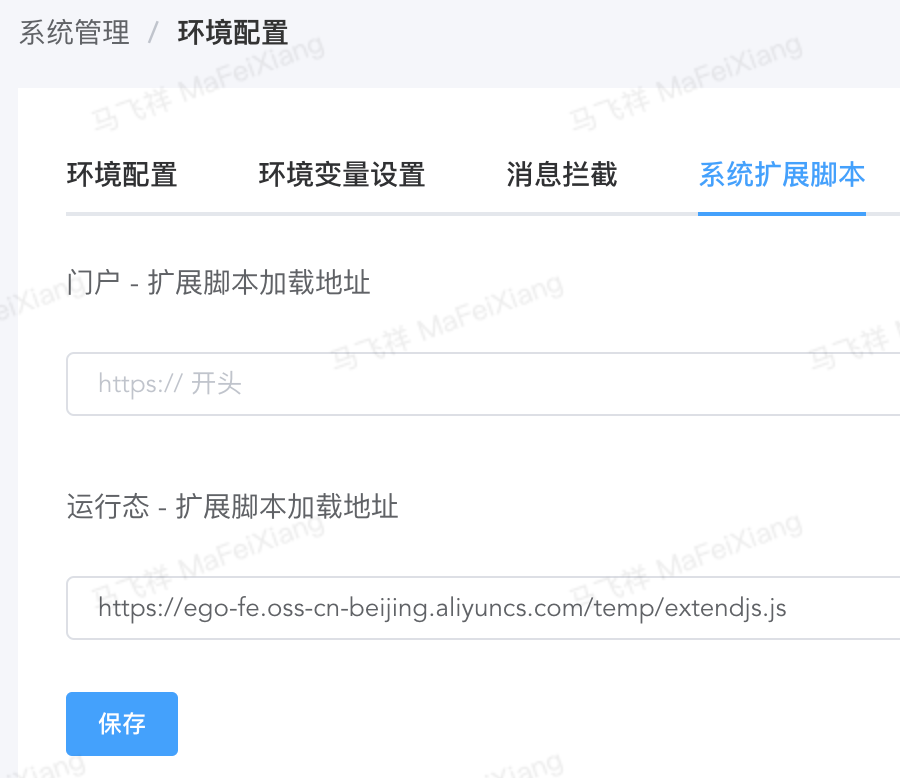
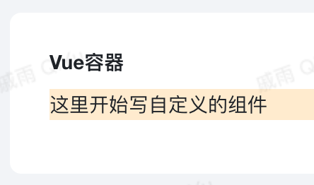

自定义组件开发、调试、发布、注册 以及 在平台中使用的方法

​

<a id="rB0j2"></a>


# 1.Vue三方组件

<a id="k5sHx"></a>


## 1.1环境准备

自定义组件是基于Vue3 + Vite 的脚手架，[下载组件开发脚手架](https://ego-fe.oss-cn-beijing.aliyuncs.com/resources/vue-coms-vite.zip)


```bash
npm i #初始化

npm run dev #调试

npm run build #编译
```

<a id="IgefG"></a>


## 1.2目录说明


```bash
.
├── README.md
├── index.html
├── package.json
├── public
│   └── favicon.ico
├── src
│   ├── App.vue  #调试用的入口
│   ├── HelloWorld #组件目录
│   │   └── helloWorld.vue #组件实现
│   ├── assets
│   │   └── logo.png
│   ├── env.d.ts
│   ├── lib.ts  #组件库打包入口
│   └── main.ts  #调试用的入口
├── tsconfig.json
└── vite.config.ts  #打包配置
```

<a id="Txvz4"></a>


## 1.3关键配置

1、打包配置 vite.config.js。 主要修改自己的组件库名称：mycomponents


```javascript
import path from 'path'
import { defineConfig } from 'vite'
import vue from '@vitejs/plugin-vue'

// https://vitejs.dev/config/
export default defineConfig({
  plugins: [vue({
	  customElement: /^ok-/
  })],
	build:{
  	// 支持到chrome67以上版本即可
		target: 'chrome67',
  		lib: {
  			entry: path.resolve(__dirname, 'src/lib.ts'),
			// 改名为自己的组件库名称，不能与其他三方库重名
			name: 'mycomponents',
			formats: ['umd'],
	  	},
		rollupOptions: {
			// make sure to externalize deps that shouldn't be bundled
			// into your library
			external: ['vue', 'ant-design-vue', 'vant', 'moment', 'lodash'],
			output: {
				// Provide global variables to use in the UMD build
				// for externalized deps
				globals: {
					vue: 'Vue',
					vant: 'vant',
					moment: 'moment',
					lodash: '_',
				}
			}
		}
	}
})
```


2、打包组件库配置 lib.ts。 每增加一个组件，在该文件中需要对应补充引用


```javascript
import { App } from "vue";
import HelloWorld from "./HelloWorld/helloWorld.vue";

const install = (app: App, config: {type: 'desktop' | 'mobile'}) => {
  if (config.type === 'desktop') {
    //桌面组件
    app.component(HelloWorld.name, HelloWorld)
  } else {
    //移动端组件
  }
}
export default {
  HelloWorld,
  install,
};
```


3、组件开发，一定要给组件命名，赋予 name 属性，建议使用全小写使用 - 分割单词。该名称将在 使用 章节里面用到


```html
<template>
    <div class="hello-world">这里开始写自定义的组件</div>
</template>
<script lang="ts">
import { defineComponent } from "vue"

export default defineComponent({
    name: 'hello-world',
    setup() {

    }
})
</script>
<style>
.hello-world {
    background-color: blanchedalmond;
}
</style>
```


4、发布组件库

通过npm run build，生成vue-coms-vite.umd.js，该文件名可以在package.json中的name属性修改

将文件上传至服务器（建议放在oss中），具体引用该组件库是由下一步 注册 实现的。

​

<a id="lbK0k"></a>


# 2.全局注册

平台是基于Vue3的，符合框架的三方组件库都可以被注册直接使用

利用平台的 系统扩展脚本 注册组件库，入口在管控台。





表单、列表中使用，请在 运行态 - 扩展脚本加载地址 填写扩展脚本的地址，必须是一个通过客户端浏览器可以访问到的地址。（建议放在oss中）

​

extendjs.js 扩展脚本加载组件库示例：

​

此处要注意文件加载地址 与 组件库名称（window.mycomponents）要与之前开发的组件库名称一致

​


```javascript
/**
 * 系统初始化时回调，可以注入三方脚本
 * @param {*} vue Vue实例
 * @param {*} type 有个参数值 desktop / mobile
 * @returns Promise / void
 */
window.BaitedaInit = async function(vue, type) {
    return new Promise(function (resolve, reject) {
        const link = document.createElement('link');
        link.rel = "stylesheet";
        link.href = "https://ego-fe.oss-cn-beijing.aliyuncs.com/temp/style.css";
        document.body.appendChild(link);

        const vuecoms = document.createElement('script')
        vuecoms.src = 'https://ego-fe.oss-cn-beijing.aliyuncs.com/temp/vue-coms-vite.umd.js'
        vuecoms.crossorigin = 'true'
        vuecoms.onerror = function() {reject()}
        vuecoms.onload = function() {
            vue.use(window.mycomponents, {type: type})
            resolve(true)
        }
        document.body.appendChild(vuecoms)
    })
}

/**
 * 用户身份认证时回调，仅在私有化环境中启用
 * @param {*} user 用户对象
 * @param {*} tenant 租户对象
 */
window.BaitedaLogin = function(user, tenant) {}

/**
 * 页面全局路由变更时回调，仅在私有化环境中启用
 * @param {*} to 目标页面
 * @param {*} from 当前页面
 */
window.BaitedaRouterChanged = function(to, from) {}
```


​

<a id="yTdBe"></a>


## 2.1平台中使用

由于组件是全局注册的，在Vue容器中以代码的形式直接使用：

<hello-world /> ，请注意，与开发组件时的name相同才可以被渲染


```typescript
const ctx = exports.ctx;
const utils = exports.utils;
const http = utils.getHttp()
const isMobile = utils.getDevice() === 'mobile'
export const main =  {
  template: '<li><hello-world /></li>',
  props: ['instance', 'name','value','rowIndex','pageStatus'],
  emits: ['change'],
  data: function () {
    return {
      message: '!sj.euV olleH'
    };
  },
  mounted: function() {
    this.reverseMessage()
    this.$emit('change', 777)//用于更新数据
  },
  methods: {
    reverseMessage: function () {
      this.message = this.message
        .split('')
        .reverse()
        .join('');
    }
  }
}
```





<a id="U5xoo"></a>


# 3.按需注册

在表单页面中的Vue容器中进行加载


```typescript
const ctx = exports.ctx;
const utils = exports.utils;
const http = utils.getHttp()
const isMobile = utils.getDevice() === 'mobile'

const { defineAsyncComponent } = Vue;

const RokQRCode = defineAsyncComponent(
  () =>
    new Promise((resolve, reject) => {
      const com = document.createElement('script')
      com.src = 'https://ego-fe.oss-cn-beijing.aliyuncs.com/temp/horizoncomponents/vue-coms-vite.umd.js'
      com.crossorigin = 'true'
      com.onerror = function() {reject()}
      com.onload = function() {
        // 此处导出的是组件包中的具体组件RokQRCode
        resolve(window.horizoncomponents.RokQRCode)
      }
      document.body.appendChild(com)
    })
)

export const aCom =  {
  components: {RokQRCode},
  template: `<div>
    <RokQRCode></RokQRCode>
  </div>`,
  props: ['instance', 'name','value','rowIndex','pageStatus', 'permissions'],
  emits: ['change'],
  data: function () {
    return {};
  },
  mounted: function() {
  },
  methods: {

  }
}
```
