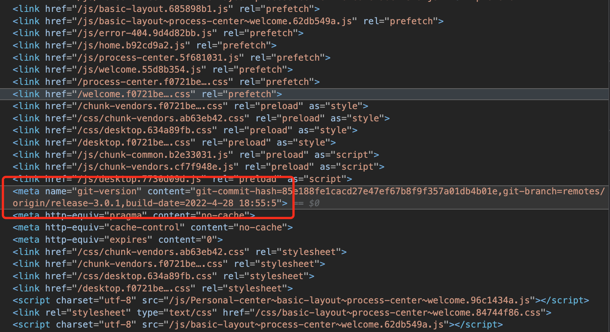
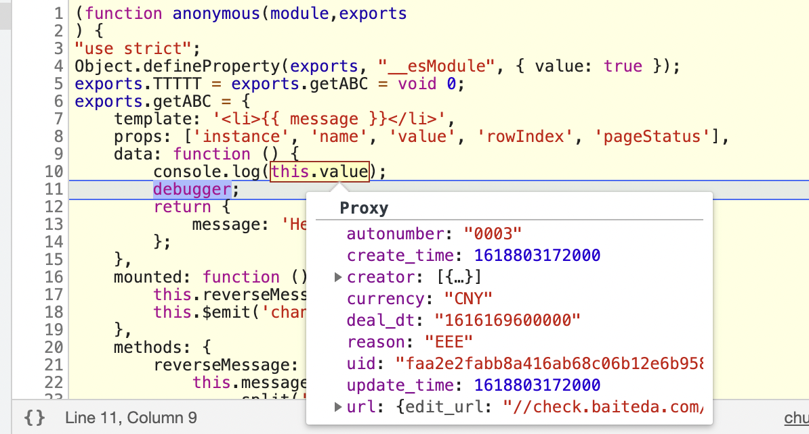

<a id="WqJkO"></a>


### 如何查看系统的版本

在门户中，<head>标签内，有个meta name=git-version，其中描述了当前版本





<a id="ISJIk"></a>


### 表单二开怎么快速清空一个控件的值？

可以通过使用setState赋值一个null来快速清空值，例如


```typescript
// 主表
ctx.setState('唯一标识符', null)
// 子表
ctx.setState('唯一标识符', null, rowIndex)
```

<a id="sGLqW"></a>


### 列表vue容器， 怎么获取当前容器所在行数据，因为数据可能要计算

通过this.value属性。获取到的是这个行的数据





<a id="rbb5n"></a>


### utils.querySvc 方式调用平台接口。请求非平台的接口如何处理？

参见 表单二开 -> 组件事件 -> utils：工具集， getHttp Http请求 方法示例：[getHttp Http请求说明文档](https://baiteda.yuque.com/books/share/036629a3-6a2f-4e3c-98a6-81ca11fb487f/csh4gh#YnO2M)

<a id="r2wus"></a>


### 在列表页，通过自定义列中的Vue容器，触发右侧抽屉


```javascript
const ctx = exports.ctx
const utils = exports.utils

export const getABC =  {
  template: `<div><a-button @click="showSubList">点一下</a-button></div>`,
  props: ['instance', 'name','value','rowIndex','pageStatus'],
  data: function () {
    return {
    };
  },
  mounted: function() {
  },
  methods: {
    showSubList: function () {
        ctx.emit('custom:showSubList', this.value)
    }
  }
}
```

<a id="NL6J8"></a>


### 二开怎么样获取到图片或者附件的详细信息（人员部门等存储id的控件，建议以同样的方式处理，通过接口查询）

**可以直接使用utils.getDisplay方法来获取详细信息**

<a id="ns68q"></a>


### 流程表单中，二开如何获取流程相关参数

ctx.externalParams.data.process\_param

随时可以获取

<a id="rT6Cv"></a>


### 使用util.getHttp模块进行请求提示跨域

首先确认接口是否支持跨域，如果支持的话，可以尝试使用fetch进行请求。

[使用 Fetch - Web API 接口参考 MDN](https://developer.mozilla.org/zh-CN/docs/Web/API/Fetch_API/Using_Fetch)

<a id="t6HOv"></a>


### 在弹窗表单(明细子表弹窗/表单操作按钮/vue容器弹窗表单)中，如何获取/修改主页面的数据

注意：这里的弹窗表单不包括iframe弹窗，仅限于内置组件和vue容器中使用bl-form-engine-modal这个组件的方式


```typescript
ctx.parent  // 代表主页面的表单引擎ctx
```


只有在弹窗内使用的时候，ctx.parent才有值，所以使用的时候一定要加一层判断条件


```typescript
if (ctx.parent) {
  ctx.parent.getState('')
  ctx.parent.setState('', '')
}
```

<a id="DSikm"></a>


### 如何隐藏审批框中的提交按钮？


```typescript
const ctx = exports.ctx;
const utils = exports.utils;
const http = utils.getHttp()
const isMobile = utils.getDevice() === 'mobile'
export function onload (payload) {
  function hideDecisionSubmitButton(wctype) {
    const decision = document.querySelector(wctype)
    if (decision !== null) {
      const button = decision.shadowRoot.querySelector("[data-command-id='submit_1']")
      if(decision && button){
        button.setAttribute('style', 'background: #ccc!important');
        button.setAttribute('style', 'display: none !important');
        button.disabled = true;
      }
    }
  }
  function hideDecision(wctype) {
    hideDecisionSubmitButton(wctype)
    document.addEventListener(wctype + '-result', () => {
        setTimeout(() => {
          hideDecisionSubmitButton(wctype)
        })
    })
  }
  //获取到隐藏 老组件wfc-decision，新组件wfc-decision
  hideDecision('wfc-decision')
  hideDecision('bla-decision')
}
```

<a id="Fq06e"></a>


### 列表如何打开左侧复选框？


```typescript
//1.存在查询区
ctx.getInstance('列表控件ID').children[0].props.isShowSelection = true
//2.不存在查询区
ctx.getInstance('列表控件ID').children[1].props.isShowSelection = true
```

<a id="wGlit"></a>


### 表单明细表 使用 setState 操作 和 getState 操作 的区别

1. setState 会将明细表数据全部替换掉-通俗理解 全部删除一遍后再放上去。
2. getState 可以使用数组方法去操作（响应式） - 推荐

<a id="OQtfD"></a>


### 报表数据源如何连接

驱动名称：com.mysql.cj.jdbc.Driver

链接url：jdbc:mysql://172.30.247.97:3306/edw\_demo

<a id="VZ400"></a>


### 表单上添加引用列表组件，在前端表单保存时事件里面，如何获取到引用列表中勾选的数据？


```typescript
ctx.children.引用列表唯一标识符.getState('表格唯一标识符')
```

<a id="wVCfc"></a>


### 表单上添加引用列表组件，如何刷新引用列表？（可使用前端二开内所提的所有api）


```typescript
ctx.children.引用列表唯一标识符.emit('listview:reload-list')
```
