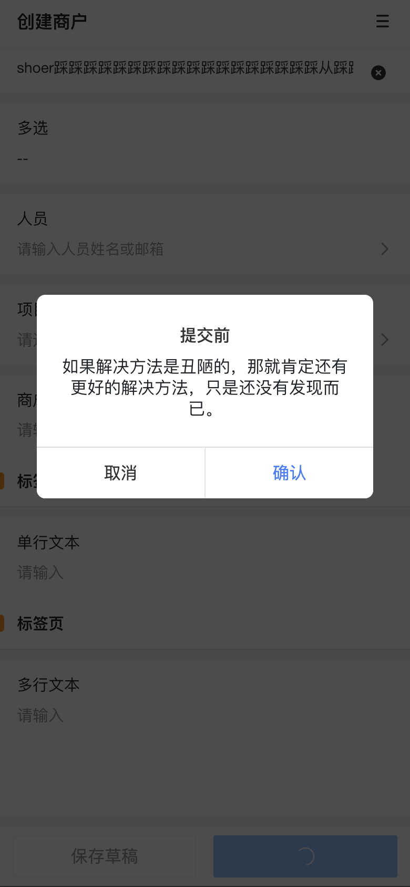
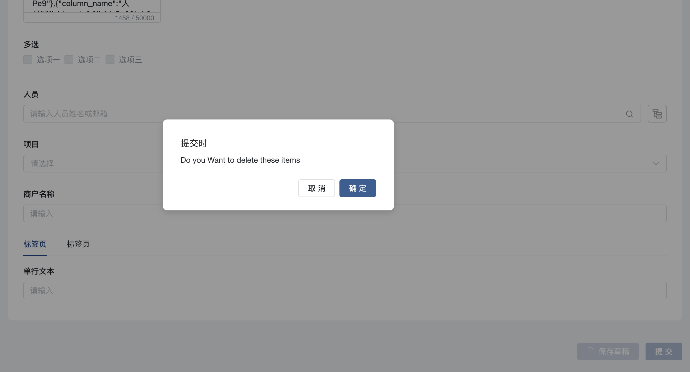

```typescript
const ctx = exports.ctx;
const utils = exports.utils;
const antdv = exports.env['ant-design-vue']
const vant = exports.env['vant']
const http = utils.getHttp()
const isMobile = utils.getDevice() === 'mobile'


function confirm(title) {
  return new Promise((resolve) => {
    if (isMobile) {
      const { Dialog } = vant
      Dialog.confirm({
        title: title,
        message:
          '如果解决方法是丑陋的，那就肯定还有更好的解决方法，只是还没有发现而已。',
      })
      .then(() => {
        resolve(true)
      })
      .catch(() => {
        resolve(false)
      });
    } else {
      const { Modal } = antdv
      Modal.confirm({
        title: title,
        content: 'Do you Want to delete these items',
        onOk() {
          resolve(true)
        },
        onCancel() {
          resolve(false)
        },
      });
    }
  })
}

export async function beforeSubmit (payload) {
  return await confirm('提交前')
}
export async function submitting (payload) {
  return await confirm('提交时')
}
export async function submitted (payload) {
  return await confirm('提交后')
}
```
