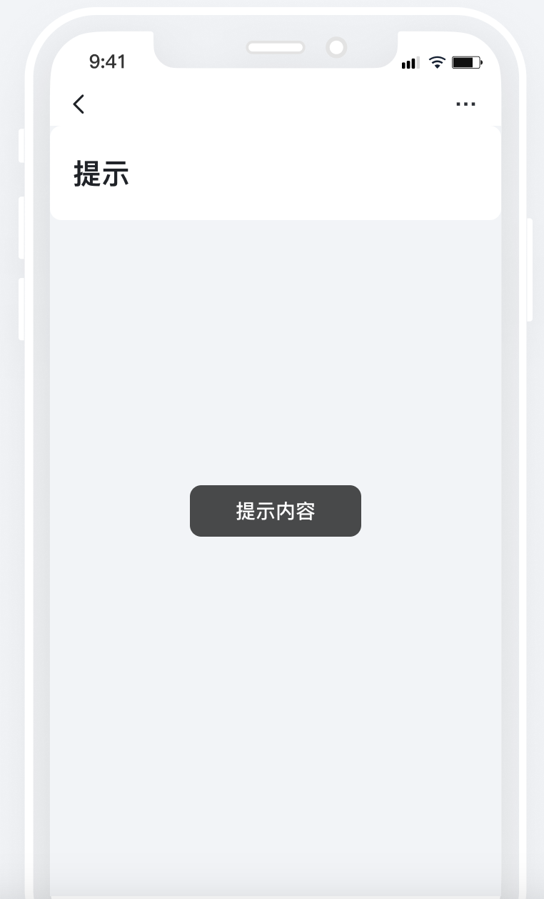

1. 展示效果

1. PC


1. mobile





​

Vue页面


```javascript
//vue 页面
import { message } from "ant-design-vue";

message.success('成功提示内容');
message.warning('警告提示内容');
message.error('错误提示内容');

//---------------------------

import { Toast } from 'vant'
// 移动端
Toast('成功提示内容')


// 通用提示
utils.toast("提示内容","success")
utils.toast("提示内容","warning")
```


Vue容器


```javascript
const ctx = exports.ctx;
const utils = exports.utils;
const http = utils.getHttp()
const isMobile = utils.getDevice() === 'mobile'

export function pageOnload (payload) {
  console.log('pageOnload')
  if (!isMobile) {
    const { message } = exports.env["ant-design-vue"]
    message.success('成功提示内容');
    message.warning('警告提示内容');
    message.error('错误提示内容');
  } else {
    const { Toast } = exports.env["vant"]
    // 移动端
    Toast('成功文案');
  }

  // 通用提示
  utils.toast("提示内容","success")
  utils.toast("提示内容","warning")
}
```
