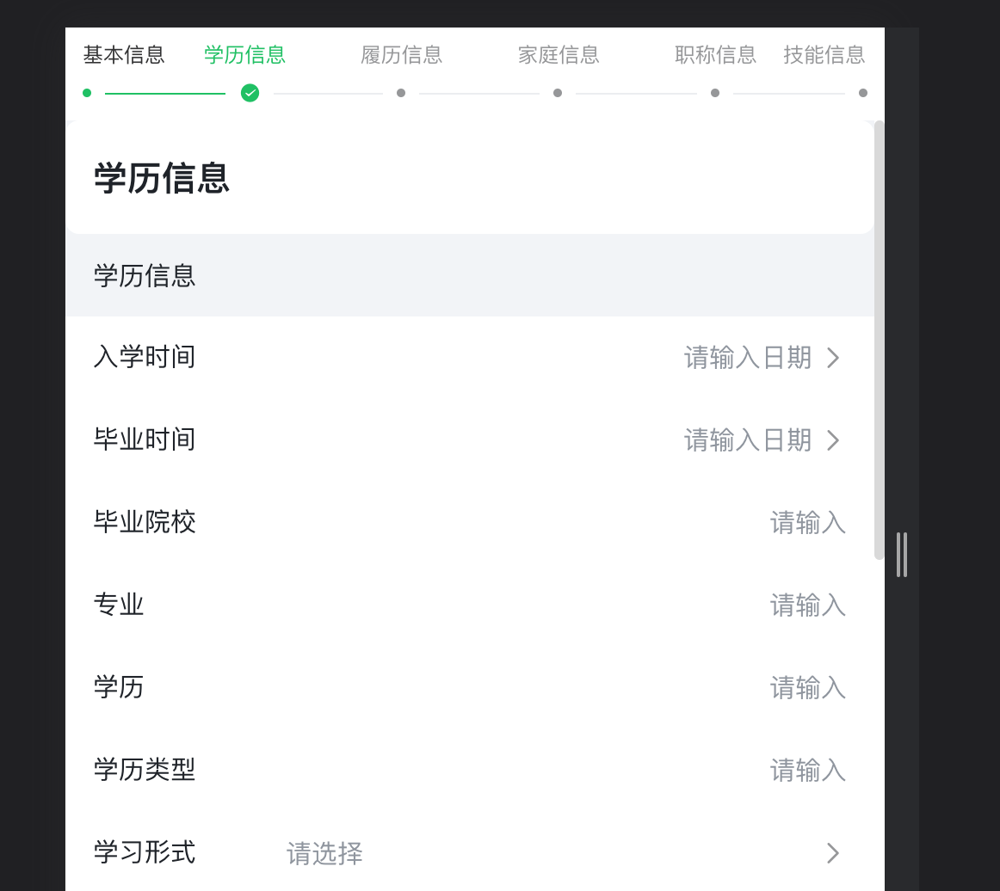

<a id="CLyfI"></a>


## 实现思路

1. 每个步骤内以iframe方式嵌入表单，每个表单控制各自的保存
2. 根据个人资料主表，新建对应的主从明细表单
3. 在后续每个步骤表单iframe中打开对应的修改表单地址。需要uid作为参数。
4. 在第一个新建表单保存后事件中，获取payload.value拿到当前页面保存后的uid。
5. 通过postmessage将参数从iframe传递到外层vue页面中。vue页面再替换下一个iframe地址的uid参数，并控制显示

​

vue页面作为步骤条实现的容器，内部嵌入多个iframe实现切换

​


```typescript
const ctx = exports.ctx;
const utils = exports.utils;
const http = utils.getHttp()
const isMobile = utils.getDevice() === 'mobile'

function setIframeHeight(id){
    try{
        var iframe = document.getElementById(id);
        if(iframe.attachEvent){
            iframe.height =  iframe.contentWindow.document.documentElement.scrollHeight;
            return;

        }else{
            iframe.height = iframe.contentDocument.body.scrollHeight;
            return;
        }
    }catch(e){
        throw new Error('setIframeHeight Error');
    }
}

export const VuePage =  {
  template: `<div>
    <div v-if="isMobile">
      <van-steps :active="active">
        <van-step>基本信息</van-step>
        <van-step>职称信息</van-step>
        <van-step>技能信息</van-step>
      </van-steps>
      <iframe v-show="active===0" :src="pages[0]" style="width:100%;height:calc(100vh - 56px);" frameborder="no" border="0" marginwidth="0" marginheight="0"></iframe>
      <iframe v-show="active===1" :src="pages[1]" style="width:100%;height:calc(100vh - 56px);" frameborder="no" border="0" marginwidth="0" marginheight="0"></iframe>
      <iframe v-show="active===2" :src="pages[2]" style="width:100%;height:calc(100vh - 56px);" frameborder="no" border="0" marginwidth="0" marginheight="0"></iframe>
      <div v-show="active===3">成功收集</div>
    </div>
    <div v-else>pc</div>
  </div>`,
  props: ['instance', 'name','value','rowIndex','pageStatus'],
  emits: ['change'],
  data: function () {
    return {
      isMobile,
      active: 0,
      uid: ''
    };
  },
  computed: {
    pages() {
      return [
        '/apps/desktop/page/vyIjIj',
        `/apps/desktop/sapp/wst_app_690wtn00im/sappId/wst_form_h6ou5nkjil/${this.uid}?type=edit&additional_query={}`,
        `/apps/desktop/sapp/wst_app_690wtn00im/sappId/wst_form_cpqe5e7xou/${this.uid}?type=edit&additional_query={}`
      ]
    }
  },
  mounted: function() {
    window.addEventListener("message", (event)=>{
      var origin = event.origin;
      // if (origin !== "http://example.org:8080") return;
      var data = JSON.parse(event.data)
      this.uid = data.uid
      const currentPage = data.page
      this.getNextPage(currentPage)
    }, false);
  },
  methods: {
    getNextPage(page) {
      switch(page) {
        case '人员信息':
          this.active = 1
          break
        case '任职资格':
          this.active = 2
          break
        case '技能信息':
          //这里就是最后一页了
          this.active = 3
          break
        default:
          this.active = 0
      }
    }
  }
}
```


在每个表单提交后事件中实现以下代码，与getNextPage中的页面跳转顺序对应


```typescript
const ctx = exports.ctx;
const utils = exports.utils;
const http = utils.getHttp()
const isMobile = utils.getDevice() === 'mobile'
export function submitted (payload) {
  window.parent.postMessage(JSON.stringify({page: '人员信息', uid: payload.value}), '/');
  // window.location.href = `/apps/desktop/sapp/wst_app_690wtn00im/sappId/wst_form_z7h26iwqbp/${payload.value}?type=edit&additional_query={}`
  return false
}
```
