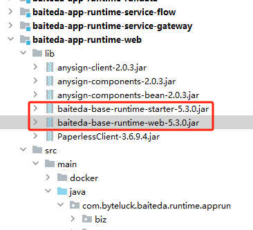

<a id="dYy9Q"></a>


# 后端

<a id="n2h5w"></a>


## baiteda-base-runtime打包

进到baiteda-base-runtime-web模块，打开pom文件，修改版本，如：release-5.3.0；然后注释以下打包插件打包：


```plain
<plugin>
    <groupId>org.springframework.boot</groupId>
    <artifactId>spring-boot-maven-plugin</artifactId>
</plugin>
```


可用命令：mvn package；将打出来的包重命名为baiteda-base-runtime-web.jar

<a id="VziA1"></a>


## base-runtime-starter打包

进入pom文件：修改baiteda-base-runtime-web 依赖的版本版本为你刚指定的版本：


```plain
<dependency>
    <groupId>com.byteluck</groupId>
    <artifactId>baiteda-base-runtime-web</artifactId>
    <version>5.3.0</version>
</dependency>
```


然后打jar包。

<a id="jPvqT"></a>


## baiteda-app-runtime引入baiteda-base-runtime的包

将jar包复制到baiteda-app-runtime-web的lib目录下：





然后修改pom文件中对应依赖的版本：


```plain
<dependency>
    <groupId>com.byteluck</groupId>
    <artifactId>baiteda-base-runtime-starter</artifactId>
    <version>5.3.0</version>
    <scope>system</scope>
    <systemPath>${basedir}/lib/baiteda-base-runtime-starter-5.3.0.jar</systemPath>
</dependency>
<dependency>
    <groupId>com.byteluck</groupId>
    <artifactId>baiteda-base-runtime-web</artifactId>
    <version>5.3.0</version>
    <scope>system</scope>
    <systemPath>${basedir}/lib/baiteda-base-runtime-web-5.3.0.jar</systemPath>
</dependency>
```

<a id="byfO4"></a>


## 功能验证

指定application-chuma.properties配置文件启动项目，访问{host}[/run/ego\_base\_info/health/check](https://172.27.202.102/run/ego_base_info/health/check)接口，如果返回OK，代表模板项目构建成功。

<a id="wnDlB"></a>


## 上传模板项目到git仓库

将上面的项目代码复制到你的模板项目中去，然后推送到git仓库。

<a id="vsHg0"></a>


# 前端
