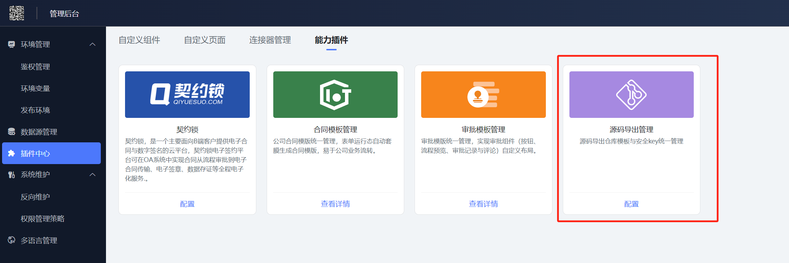
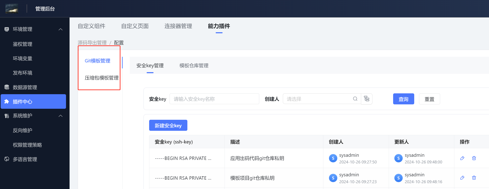
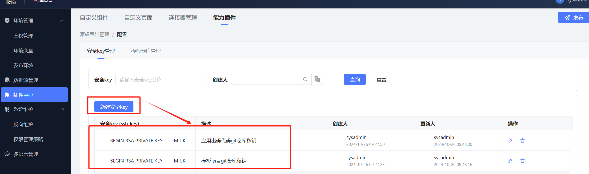
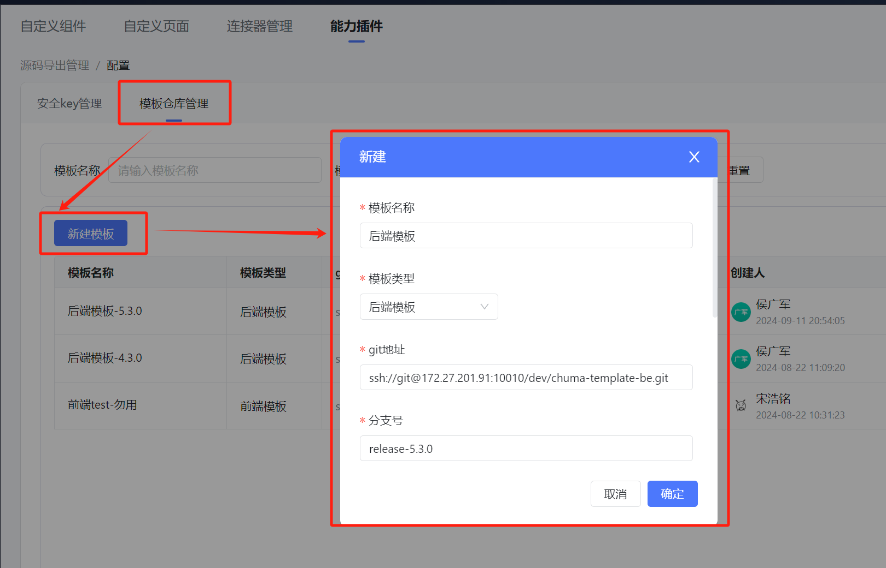
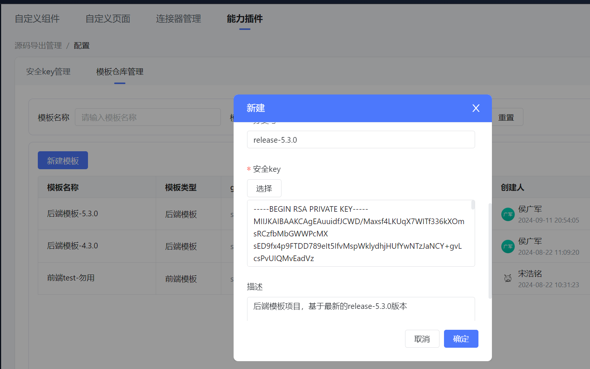
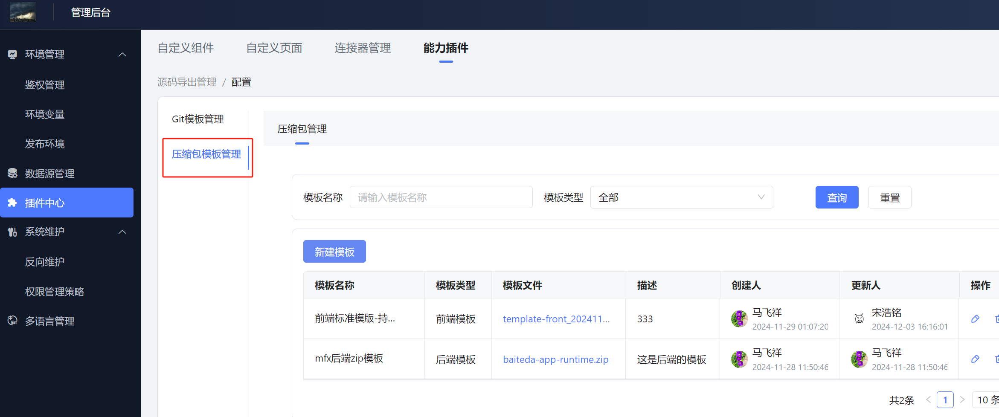
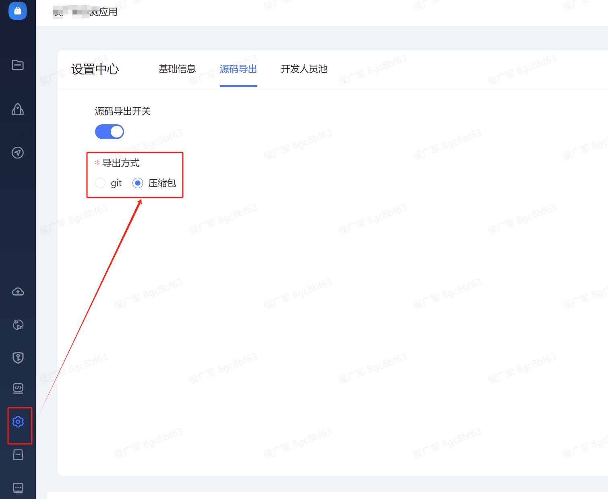
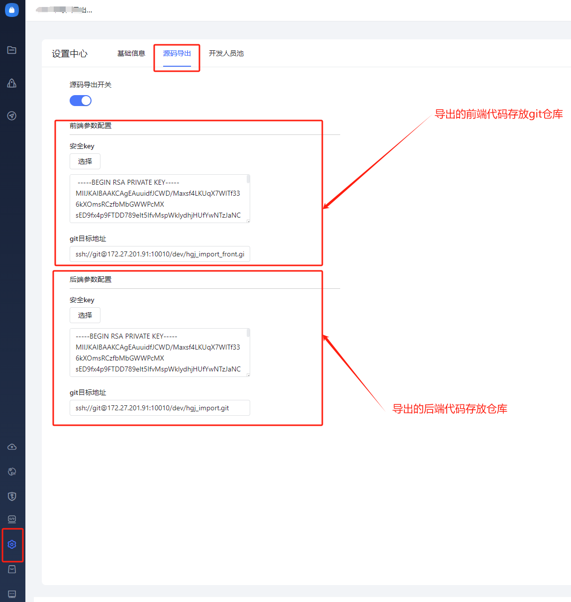
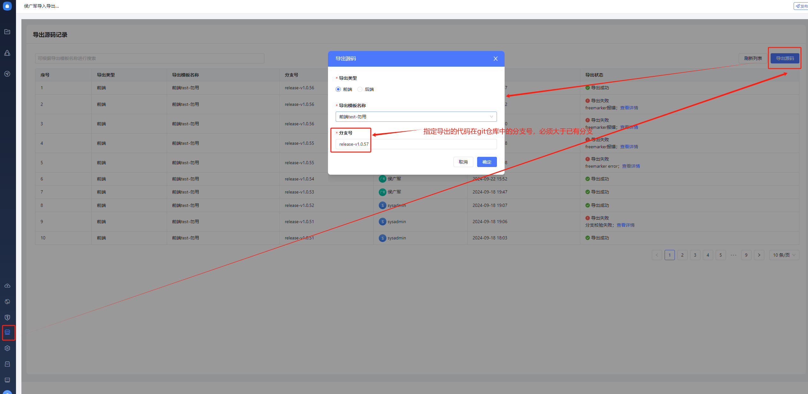
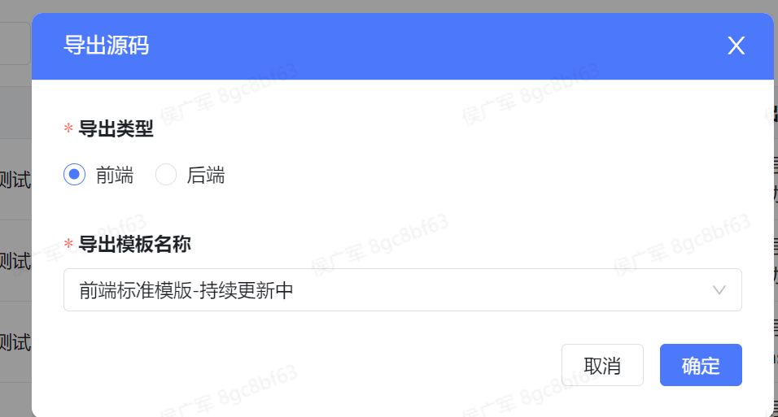

<a id="hxo4v"></a>


## 功能简介

将用户搭建的应用导出为源代码，前后端各一个项目，方便快速部署。

<a id="dTbva"></a>


## 导出原理

用稳定版本的平台前后端代码各生成一个模板项目，类似于一个壳，然后每个应用出码的时候， 先生成应用自身的代码再合并到模板项目里形成一个完整项目，可单独部署。

<a id="DpVV3"></a>


## 导出步骤

<a id="NLrns"></a>


### 维护模板项目

如果是私有化租户，先联系百特搭管理员获取到模板项目。然后进入设计态管控台，进入 源码导出管理：





选择是使用压缩包还是git仓库的方式维护模板：





<a id="XTj1c"></a>


#### git仓库模板

模板项目存放在git仓库，需要配置访问的ssh-key，项目的git地址等信息。

<a id="TjLxr"></a>


##### 配置安全key

安全key即可以访问git仓库的私钥，源码导出的时候要用key去访问 模板项目的git仓库、应用源码的git仓库；注意：私钥一定得是 BEGIN RSA PRIVATE KEY 开头的，如果你的是 BEGIN OPENSSH PRIVATE KEY 开头的，那在命令行执行这个命令重新生成新的密钥对： ssh-keygen -t rsa -b 4096 -m PEM





<a id="DKWWV"></a>


##### 配置模板仓库

模板项目的基础配置：git地址、分支号等





选择git仓库访问的私钥：





<a id="ytFtQ"></a>


#### 压缩包模板

模板项目以压缩包的形式保存；私有化租户从百特搭管理员处获取，然后前后端分别上传。





<a id="tMQrg"></a>


### 应用导出配置

点击应用设置，选择是导出到git仓库还是导出成压缩包：





如果是git方式导出，需要配置导出项目是上传的git仓库：





<a id="vxCgy"></a>


### 导出

点击 源码导出 按钮，如果应用设置的git仓库的方式导出，操作如下：





如果是压缩包方式，操作如下：





<a id="Ccvk6"></a>


## 导出应用部署

<a id="r45xf"></a>


### 后端

<a id="HZCCs"></a>


#### 准备环境变量


[附件: chuma_env.txt](../../_assets/fcfcfmg6g8n78yeo/chuma_env-6a3db4ecf5.txt)


<a id="LpIf3"></a>


#### 启动jar包

示例命令：nohup java -Xms2048m -Xmx2048m -Duser.timezone=Asia/ShangHai -Dserver.port=8802 -jar ${PWD}/jar/${YOUR\_JAR}.jar --spring.profiles.active=chuma &

注意：一定要添加--spring.profiles.active=chuma命令，指定使用applicaiton-chuma.properties配置文件

<a id="TEzAM"></a>


#### 查看日志

tail -f {启动jar包时所在的路径}/log/{应用名称}/{应用名称}.log

<a id="O1Cww"></a>


#### 接口文档

{host}[/run/doc.html#/home](http://172.27.202.102/run/doc.html#/home)

<a id="VThxB"></a>


### 前端

<a id="J1C03"></a>


#### [前端工程启动调试](https://baiteda.yuque.com/czwxoe/pbe8ph/clutsgxeesn3ng47)

<a id="oGMPI"></a>


### 外部访问

以openresty做为网关示例，下面是前后端的配置（如果你用的其它网关，自行配置请求拦截策略即可）：


```plain
location ^~ /hgjtest/ {
    alias /data/baiteda_jar_1022/openresty/html/chuma-app/{应用名称}/dist/;
    add_header Cache-Control no-store;
}
```


```plain
location /run/ {
    proxy_pass http://127.0.0.1:8802;
}
```


然后重启openresty：


```plain
openresty -s stop -c /data/baiteda_jar_1022/openresty/nginx.conf
nohup openresty -c /data/baiteda_jar_1022/openresty/nginx.conf  -g "daemon off;"  &
```

## 下级条目

- [模板项目生成](001-模板项目生成.md)
