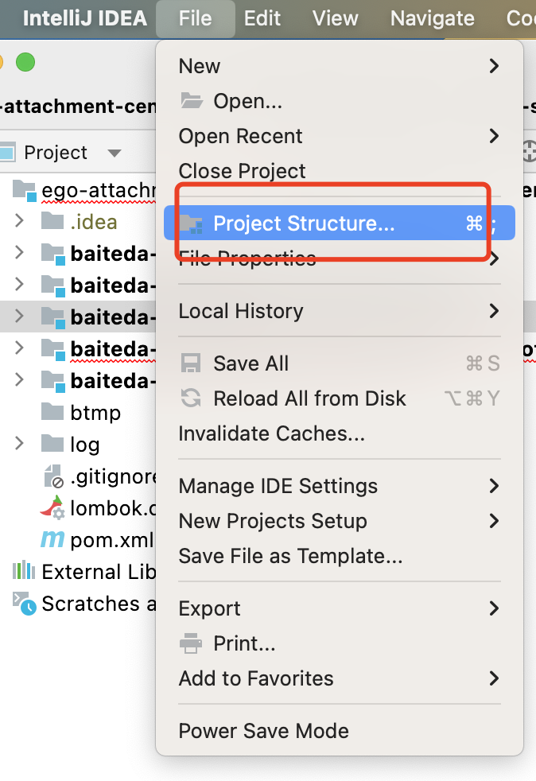
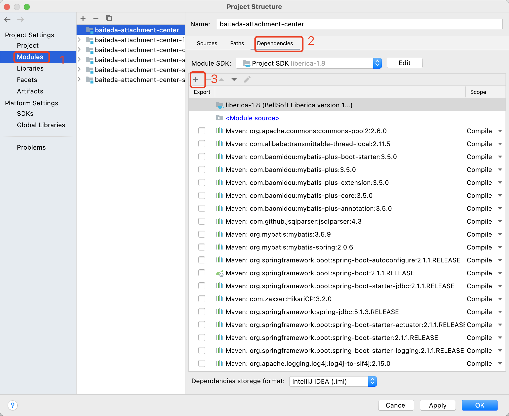

欢迎使用百特搭低代码平台开发者工具包（SDK）。您可以编写代码调用百特搭低代码平台SDK来实现对百特搭低代码平台的功能的访问 。我们为您准备了SDK使用说明，以便您了解如何获取、安装和调用百特搭低代码平台SDK。

​

<a id="gGn3z"></a>


# 1.版本：3.3.1

|  |  |
| --- | --- |
| SDK | 下载 |
| 运行态SDK |

[附件: baiteda-app-sdk-spring-boot-starter-1.4.4-SNAPSHOT.jar](../../../_assets/wdgvgfmp99erguku/baiteda-app-sdk-spring-boot-starter-1.4.4-SNAPSHOT-80c41c0511.jar)


[附件: baiteda-app-sdk-client-1.4.4-SNAPSHOT.jar](../../../_assets/wdgvgfmp99erguku/baiteda-app-sdk-client-1.4.4-SNAPSHOT-4ae5979355.jar)

 |
| 流程引擎SDK |

[附件: bpm-sdk-spring-boot-starter-3.1.14.001.jar](../../../_assets/wdgvgfmp99erguku/bpm-sdk-spring-boot-starter-3.1.14.001-5a4783de4f.jar)


[附件: bpm-sdk-client-3.1.14.001.jar](../../../_assets/wdgvgfmp99erguku/bpm-sdk-client-3.1.14.001-7c2b360c8e.jar)

 |
| 附件SDK |

[附件: baiteda-attachment-center-sdk-java-3.2.1-SNAPSHOT.jar](../../../_assets/wdgvgfmp99erguku/baiteda-attachment-center-sdk-java-3.2.1-SNAPSHOT-f61b6cee7d.jar)


[附件: baiteda-attachment-center-sdk-starter-3.2.1-SNAPSHOT.jar](../../../_assets/wdgvgfmp99erguku/baiteda-attachment-center-sdk-starter-3.2.1-SNAPSHOT-94e584600c.jar)

 |

​

<a id="otTLl"></a>


# 2.版本：3.1.13

|  |  |
| --- | --- |
| SDK | 下载 |
| 运行态SDK |

[附件: baiteda-app-sdk-spring-boot-starter-1.4.4-SNAPSHOT.jar](../../../_assets/wdgvgfmp99erguku/baiteda-app-sdk-spring-boot-starter-1.4.4-SNAPSHOT-5c7c20dc85.jar)


[附件: baiteda-app-sdk-client-1.4.4-SNAPSHOT.jar](../../../_assets/wdgvgfmp99erguku/baiteda-app-sdk-client-1.4.4-SNAPSHOT-13504329c3.jar)

 |
| 流程引擎SDK |

[附件: bpm-sdk-spring-boot-starter-3.1.14.001.jar](../../../_assets/wdgvgfmp99erguku/bpm-sdk-spring-boot-starter-3.1.14.001-dfc0f28bde.jar)


[附件: bpm-sdk-client-3.1.14.001.jar](../../../_assets/wdgvgfmp99erguku/bpm-sdk-client-3.1.14.001-d41a839658.jar)

 |
| 附件SDK |

[附件: baiteda-attachment-center-sdk-spring-boot-starter-3.1.13-SNAPSHOT.jar](../../../_assets/wdgvgfmp99erguku/baiteda-attachment-center-sdk-spring-boot-starter-3.1.13-SNA-6820cc01d5.jar)


[附件: baiteda-attachment-center-sdk-java-3.1.13-SNAPSHOT.jar](../../../_assets/wdgvgfmp99erguku/baiteda-attachment-center-sdk-java-3.1.13-SNAPSHOT-2f1f86b15b.jar)

 |

<a id="NyDbm"></a>


# 3.引入SDK

下载对应版本的SDK包进行安装，使用ide本地导入，或者使用maven管理。

<a id="h7dt2"></a>


## **3.1IDE本地导入方式（此处使用idea演示）：**

首先进入：File--->Project Structure





接着找到Modules->Dependencies，点击+号





点击JARs or Directories并选择你要添加的包（如：baiteda-app-sdk-spring-boot-starter-1.4.4-SNAPSHOT.jar）


<a id="VqO0E"></a>


## 3.2maven管理

把SDK对应的jar上传到公司的maven仓库里，并在项目中的pom文档里配置dependency。


```xml
<dependency>
  <groupId>com.byteluck</groupId>
  <artifactId>baiteda-attachment-center-sdk-spring-boot-starter</artifactId>
  <version>{version}</version>
</dependency>
```

<a id="DonW8"></a>


# 4.SDK的使用

<a id="HYwS5"></a>


## 4.1运行态

> 集成前优先找百特塔的运维人员获取对应服务的appId及appSecret
>
> 对应的SDK包《baiteda-app-sdk-spring-boot-starter-xxx-SNAPSHOT.jar》《baiteda-app-sdk-client-1.4.4-SNAPSHOT.jar》

<a id="lw4Xi"></a>


### 4.1.1增加服务配置


```properties
app.app-id=${APP_ID:3cxb0315}
app.app-secret=${APP_SECRET:uqdr97o0koynhr0siee6satmbgc0ix0qspbp64bjfy7vsykq0954xiy7cgqrc7py}
app.url-prefix=${APP_URL-PREFIX:https://test.baiteda.com}
app.tenant-id=${APP_TENANT_ID:test}
```


|  |  |  |
| --- | --- | --- |
| **参数** | **示例** | **说明** |
| app-id | 3cxb0315 | 应用ID，有百特搭提供 |
| app-secret | uqdr97o0koynhr0siee6satmbgc0ix0qspbp64bjfy7vsykq0954xiy7cgqrc7py | 密钥，有百特搭提供 |
| url-prefix | <https://test.baiteda.com> | 百特搭服务的域名地址 |
| tenant-id | scm | 租户ID由平台提供 |

<a id="wdgvR"></a>


### 4.1.2模型服务API


```java
@Autowired
AppSvcService appSvcService;
```


```java
/**
     * 查单服务
     *
     * @param selectOneDto 参数
     * @return resp
     */
    Response<SingleOutput> selectOne(SelectOneDto selectOneDto, SignVerifyDto signVerifyDto);

    /**
     * 查多服务
     *
     * @param selectMoreDto 参数
     * @return resp
     */
    Response<PageOutput> selectMore(SelectMoreDto selectMoreDto, SignVerifyDto signVerifyDto);

    /**
     * 新增服务
     *
     * @param writeDto 参数
     * @return resp
     */
    Response<BaseOutput> insert(WriteDto writeDto, SignVerifyDto signVerifyDto);


    /**
     * 批量新增服务
     * 默认的批量修复服务   数据模型编号_batch_save
     *
     * @param writeDto      参数
     * @param signVerifyDto
     * @return resp
     */
    Response<BaseOutput> batchInsert(BatchWriteDto writeDto, SignVerifyDto signVerifyDto);

    /**
     * 删除服务
     *
     * @param writeDto 参数
     * @return resp
     */
    Response<BaseOutput> delete(WriteDto writeDto, SignVerifyDto signVerifyDto);

    /**
     * 修改服务
     *
     * @param writeDto 参数
     * @return resp
     */
    Response<BaseOutput> update(WriteDto writeDto, SignVerifyDto signVerifyDto);

    /**
     * 批量修改服务
     * 默认的批量修复服务   数据模型编号_batch_save
     *
     * @param batchWriteDto 参数
     * @param signVerifyDto
     * @return resp
     */
    Response<BaseOutput> batchUpdate(BatchWriteDto batchWriteDto, SignVerifyDto signVerifyDto);

    /**
     * 查单服务
     *
     * @param selectOneDto 参数
     * @return resp
     */
    Response<SingleOutput> selectOne(SelectOneDto selectOneDto);

    /**
     * 查多服务
     *
     * @param selectMoreDto 参数
     * @return resp
     */
    Response<PageOutput> selectMore(SelectMoreDto selectMoreDto);

    /**
     * 新增服务
     *
     * @param writeDto 参数
     * @return resp
     */
    Response<BaseOutput> insert(WriteDto writeDto);

    /**
     * 批量新增
     * @param batchWriteDto
     * @return
     */
    Response<BaseOutput> batchInsert(BatchWriteDto batchWriteDto);

    /**
     * 批量修改
     * @param batchWriteDto
     * @return
     */
    Response<BaseOutput> batchUpdate(BatchWriteDto batchWriteDto);
    /**
     * 删除服务
     *
     * @param writeDto 参数
     * @return resp
     */
    Response<BaseOutput> delete(WriteDto writeDto);

    /**
     * 修改服务
     *
     * @param writeDto 参数
     * @return resp
     */
    Response<BaseOutput> update(WriteDto writeDto);
```

<a id="jK4LZ"></a>


### 4.1.3签名服务API（开发多租户的SaaS应用时才需要）


```java
@Autowired
AppSignatureService appSignatureService;
```


```java
 /**
     * 获取访问 签名参数
     *
     * @param tempAccessTokenDto 参数
     * @return resp
     */
    Response<SignVerifyDto> getSignatureParam(TempAccessTokenDto tempAccessTokenDto, SignVerifyDto signVerifyDto);

    /**
     * 获取访问 签名参数
     *
     * @param tempAccessTokenDto 参数
     * @return resp
     */
    Response<SignVerifyDto> getSignatureParam(TempAccessTokenDto tempAccessTokenDto);
```

<a id="bpdHU"></a>


### 4.1.4用户相关API


```java
@Autowired
EmployeeService employeeService;
```


```java

    /**
     * 根据用户编号employeeId获取用户详情
     *
     * @param employeeId
     * @return resp
     */
    Response<UserDto> getUserById(String tenantId, String employeeId);


    /**
     * 根据用户编号employeeId获取用户详情
     *
     * @param employeeId
     * @return resp
     */
    Response<UserDto> getUserById(String tenantId, String employeeId, SignVerifyDto signVerifyDto);


    /**
     * 根据单点登录的code获取用户详情
     *
     * @param code
     * @return resp
     */
    Response<UserDto> getUserByCode(String tenantId, String code);


    /**
     * 根据单点登录的code获取用户详情
     *
     * @param code
     * @return resp
     */
    Response<UserDto> getUserByCode(String tenantId, String code, SignVerifyDto signVerifyDto);


    /**
     * 用户同步接口
     *
     * @param employeeSyncDto
     * @return
     */
    Response<Boolean> syncEmployee(EmployeeSyncDto employeeSyncDto);

    /**
     * 用户同步接口
     *
     * @param employeeSyncDto
     * @param signVerifyDto   多租户签名参数
     * @return
     */
    Response<Boolean> syncEmployee(EmployeeSyncDto employeeSyncDto, SignVerifyDto signVerifyDto);

    /**
     * 用户创建或者修改
     *
     * @param createRequest
     * @return
     */
    Response<Boolean> createOrUpdateEmployee(EmployeeCreateDto createRequest);

    /**
     * 用户创建或者修改
     *
     * @param createRequest
     * @param signVerifyDto
     * @return
     */
    Response<Boolean> createOrUpdateEmployee(EmployeeCreateDto createRequest, SignVerifyDto signVerifyDto);
```

<a id="V6dQo"></a>


### 4.1.5部门相关API


```java
@Autowired
DepartmentService departmentService;
```


```java

    /**
     * 同步部门数据
     *
     * @param departmentSyncDto
     * @return resp
     */
    Response<Boolean> syncDept(DepartmentSyncDto departmentSyncDto);

    /**
     * 同步部门数据
     *
     * @param departmentSyncDto
     * @return resp
     */
    Response<Boolean> syncDept(DepartmentSyncDto departmentSyncDto, SignVerifyDto signVerifyDto);

    /**
     * 根据员工id获取其主部门id
     *
     * @param departmentQueryDto
     * @param signVerifyDto
     * @return
     */
    Response<JSONResult<DepartmentDto>> getMainDepartmentByEmployeeId(DepartmentQueryDto departmentQueryDto,SignVerifyDto signVerifyDto);


    /**
     * 创建或者更新部门信息
     *
     * @param departmentCreateDto
     * @return
     */
    Response<JSONResult<DepartmentDto>> createOrUpdateDept(DepartmentCreateDto departmentCreateDto,SignVerifyDto signVerifyDto);


    /**
     * 根据部门id删除部门
     *
     * @param createRequest
     * @param signVerifyDto
     * @return
     */
    Response<Boolean> deleteDept(DepartmentCreateDto createRequest,SignVerifyDto signVerifyDto);

    /**
     * 根据部门id获取部门及子部门信息
     *
     * @param queryRequest 请求参数
     * @return 数据
     */
    Response<JSONResult<List<DepartmentDto>>> getAllDeptListByParentId(DepartmentQueryDto queryRequest,SignVerifyDto signVerifyDto );
```

<a id="bM0GH"></a>


### 4.1.6角色相关API


```java
@Autowired
GroupService groupService;
```


```java

    /**
     * 判断用户是否是管理员角色
     * @param employeeIdParamDto
     * @param signVerifyDto
     * @return
     */
    Response<Boolean> isSysadmin(EmployeeIdParamDto employeeIdParamDto,SignVerifyDto signVerifyDto);

    /**
     *查询角色列表
     *
     * @param baseGroupParamDto
     * @param signVerifyDto
     * @return
     */
    Response<PageResult<GroupListDto>> selectGroup(BaseGroupParamDto baseGroupParamDto, SignVerifyDto signVerifyDto);


    /**
     *保存角色数据
     *
     * @param groupSaveDto
     * @param signVerifyDto
     */
    void saveGroup(GroupSaveDto groupSaveDto,SignVerifyDto signVerifyDto);

    /**
     *保存角色和用户关系
     *
     * @param groupSaveDto
     * @param signVerifyDto
     */
    void saveGroupAndRelation(GroupSaveDto groupSaveDto,SignVerifyDto signVerifyDto);


    /**
     *更新角色和用户关系
     *
     * @param groupSaveDto
     * @param signVerifyDto
     */
    void updateGroupAndRelation(GroupSaveDto groupSaveDto,SignVerifyDto signVerifyDto);


    /**
     *删除角色数据
     *
     * @param param
     * @param signVerifyDto
     */
    void deleteGroup(GroupCodeParamDto param,SignVerifyDto signVerifyDto);
```

<a id="eDucm"></a>


### 4.1.7流程相关API


```java
@Autowired
AppProcessService appProcessService;
```


```java
/**
     * 启动流程
     *
     * @param submitProcessDto 参数
     * @param signVerifyDto    签名参数
     * @return resp
     */
    Response<ProcessApiDto> processSubmit(SubmitProcessDto submitProcessDto, SignVerifyDto signVerifyDto);

    /**
     * 流程审批
     *
     * @param approveProcessDto 参数
     * @param signVerifyDto     签名参数
     * @return resp
     */
    Response<RunProcessResultDto> approveProcess(ApproveProcessDto approveProcessDto, SignVerifyDto signVerifyDto);


    /**
     * 流程代办列表获取
     *
     * @param listTodoTaskDto 参数
     * @param signVerifyDto   签名参数
     * @return resp
     */
    ListResponse<TodoTaskDto> listTodoTaskList(ListTodoTaskDto listTodoTaskDto, SignVerifyDto signVerifyDto);
```

<a id="kxcit"></a>


### 4.1.8表单草稿相关API


```java
@Autowired
FormDraftService formDraftService;
```


```java
/**
     * 新增草稿
     *
     * @param draftRequestDto
     * @param signVerifyDto
     * @return
     */
    Response<String> saveDraft(PageDraftRequestDto draftRequestDto, SignVerifyDto signVerifyDto);


    /**
     * 更新草稿
     *
     * @param draftRequestDto
     * @param signVerifyDto
     * @return
     */
    Response<String> updateDraft(PageDraftRequestDto draftRequestDto, SignVerifyDto signVerifyDto);

    /**
     * 删除草稿
     *
     * @param draftDeleteRequest
     * @param signVerifyDto
     * @return
     */
    Response<Boolean> delete(FormDraftDeleteRequest draftDeleteRequest, SignVerifyDto signVerifyDto);
```

<a id="NFgR8"></a>


## 5.流程引擎

> 集成前优先找百特塔的运维人员获取对应服务的appId及appSecret
>
> 对应的SDK包《bpm-sdk-spring-boot-starter-xxx.jar》《bpm-sdk-client-xxx.jar》

<a id="mBGBr"></a>


### 5.1增加服务配置


```properties
bpm.appId=check_app_id
bpm.appSecret=dd4!123456we
bpm.protocol=https
bpm.env=custom
bpm.host=https://xxxxx
bpm.wfcUrlPrefix=${bpm.host}/ego_api/api/v1/common
bpm.wfcUrlAssignPrefix=${bpm.host}/ego_api/api/v1/assignee
bpm.wfcUrlTaskPrefix=${bpm.host}/ego_api/api/v1/task
bpm.socketTimeout=300000
bpm.connectTimeout=30000
```


|  |  |  |
| --- | --- | --- |
| **参数** | **示例** | **说明** |
| appId | 3cxb0315 | 应用ID，有百特搭提供 |
| appSecret | uqdr97o0koynhr0siee6satmbgc0ix0qspbp64bjfy7vsykq0954xiy7cgqrc7py | 密钥，有百特搭提供 |
| protocol | https | 协议类型，配置https时会对域名证书进行校验 |
| env | custom | 默认即可 |
| host | <https://test.baiteda.com> | 百特搭服务的域名地址 |
| wfcUrlPrefix |  | 默认即可 |
| wfcUrlAssignPrefix |  | 默认即可 |
| socketTimeout |  | 默认即可 |
| connectTimeout |  | 默认即可 |

<a id="hsOKT"></a>


### 5.2注入服务


```java
@Autowired
BpmProcessService bpmProcessService;
```

<a id="nW998"></a>


### 5.3流程API


```java

    /**
     * 发起流程
     * @param startProcessParam 发起流程的参数
     */
    Response<StartProcessResult> startProcess(String tenantId,StartProcessParam startProcessParam);


    Response<StartProcessResult> startProcess(String tenantId,String initiatorId, String processDefinitionKey, String businessKey,
                                              AbstractTransientVariable transientVariable);


    /**
     * 同意
     * @param taskInstanceId
     * @param assigneeId
     * @param transientVariable
     * @param taskComment
     * @param agentId
     * @return
     */
    Response<RunProcessResult> general(String tenantId, String commandId,String taskInstanceId, String assigneeId, String taskComment,
                                        AbstractTransientVariable transientVariable, String agentId);

    /**
     * 驳回
     * @param taskInstanceId
     * @param assigneeId
     * @param transientVariable
     * @param taskComment
     * @param agentId
     * @return
     */
    Response<RunProcessResult> rollback(String tenantId, String commandId, String taskInstanceId, String assigneeId, String taskComment,
                                      AbstractTransientVariable transientVariable, String rollbackNodeId, String agentId);

    /**
     * 转发
     * @param taskInstanceId
     * @param assigneeId
     * @param transientVariable
     * @param taskComment
     * @param transferUserId
     * @return
     */
    Response<RunProcessResult> transfer(String tenantId, String commandId, String taskInstanceId, String assigneeId, String taskComment,
                                        AbstractTransientVariable transientVariable, String transferUserId, String agentId);

    /**
     * 加签
     * @param taskInstanceId
     * @param assigneeId
     * @param transientVariable
     * @param taskComment
     * @param endorsementUserIdList
     */
    Response<RunProcessResult> endorse(String tenantId, String commandId, String taskInstanceId, String assigneeId, String taskComment,
                                       AbstractTransientVariable transientVariable, String endorsementUserIdList, String agentId);

    /**
     * 暂存
     * @param taskInstanceId
     * @param assigneeId
     * @param transientVariable
     * @param taskComment
     */
    Response<RunProcessResult> tempSave(String tenantId, String commandId, String taskInstanceId, String assigneeId, String taskComment,
                                        AbstractTransientVariable transientVariable, String agentId);

    /**
     * 终止
     * @param taskInstanceId
     * @param assigneeId
     * @param transientVariable
     * @param taskComment
     */
    Response<RunProcessResult> terminate(String tenantId, String commandId, String taskInstanceId, String assigneeId,
                                          String taskComment, AbstractTransientVariable transientVariable, String agentId);

    /**
     * 执行审批操作
      * @param runProcessParam  审批操作的参数
     * @return
     */
    Response<RunProcessResult> runProcess(String tenantId,RunProcessParam runProcessParam);


    Response<RunReceiveTaskResult> runReceiveTask(String tenantId,AbstractTransientVariable transientVariable, String processInstanceId, String nodeId);


    /**
     * 获取流程待办及已办任务列表（流程处理过程）
     * @param processInstanceId 流程ID
     * @param userId            用户ID
     */
    Response<ProcessTasksResult> getProcessTasks(String tenantId,String processInstanceId, String userId);

    /**
     *
     */
    Response<ProcessTasksResult> getProcessTasks(String tenantId,String processInstanceId, String userId, TimeSort timeSort);
    /**
     * 获取任务按钮列表
     * @param taskInstanceId 任务实例id
     * @param userId 用户id
     */
    Response<TaskBtnResult> getTaskBtn(String tenantId,String taskInstanceId, String userId);

    /**
     * 获取分享链接URL
     * @param taskInstanceId      任务流程ID
     * @param processInstanceId   流程实例ID
     * @param noticeId             知会ID
     * @param userId               当前用户ID
     * @return
     */
    Response<GetShareUrlResult> getShareUrl(String tenantId,String taskInstanceId, String processInstanceId, String noticeId, String userId);

    /**
     * 发送知会
     * @param userIdArray  要知会用户的id数组
     * @param processInstanceId 流程实例id
     * @param taskInstanceId 任务实例id
     * @param sendUserId 知会发起用户id
     * @param subject 知会主题
     * @param  subjectEn 知会英文主题
     * @return
     */
    Response<SendRepeatNoticeResult> sendRepeatNotice(String tenantId,String userIdArray, String processInstanceId, String taskInstanceId,
                                                      String sendUserId, String subject, String subjectEn);
    /**
     * 发送知会
     * @param userIdArray  要知会用户的id数组
     * @param processInstanceId 流程实例id
     * @param taskInstanceId 任务实例id
     * @param sendUserId 知会发起用户id
     * @param subject 知会主题
     * @param  subjectEn 知会英文主题
     *@param  subjectJa 知会日文主题
     * @return
     */
    Response<SendRepeatNoticeResult> sendRepeatNotice(String tenantId,String userIdArray, String processInstanceId, String taskInstanceId,
                                                      String sendUserId, String subject, String subjectEn, String subjectJa);
    /**
     * 获取Auth
     * @param userId 用户Id
     * @return
     */
    Response<GetAuthResult> getAuth(String tenantId,String userId);

    /**
     * 获取任务详情
     * @param taskInstanceId 任务实例Id
     * @return
     */
    Response<TaskResult> getTaskInfo(String tenantId,String taskInstanceId);


    /**
     *
     * @param noticeInstanceId 知会实例Id
     * @return
     */
    Response<NoticeResult> getNoticeInfo(String tenantId,String noticeInstanceId);

    /**
     * 结束流程实例
     */
    Response terminateRunProcess(String tenantId,String processInstanceId);

    /**
     * 设置知会状态为已读
     * @param tenantId
     * @param noticeId
     * @param agent
     * @return
     */
    public Response<SetNoticeReadResult> setTaskNoticeRead(String tenantId, String noticeId, String agent);
```

<a id="w9JfX"></a>


## 6.附件

> 集成前优先找百特塔的运维人员获取对应服务的appId及appSecret
>
> 对应的SDK包《baiteda-attachment-center-sdk-spring-boot-starter-xxx-SNAPSHOT.jar》《baiteda-attachment-center-sdk-java-xxx-SNAPSHOT.jar》

<a id="g3Fgp"></a>


### 6.1增加服务配置


```properties
ego-attachment-center.app-id: ${ATTACHMENT-CENTER_APP-ID:${app.app-id}}
ego-attachment-center.app-secret: ${ATTACHMENT-CENTER_APP-SECRET:${app.app-secret}}
ego-attachment-center.urlPrefix: ${ATTACHMENT-CENTER_URL_PREFIX:http://172.26.105.236:8616/attachment/api}
ego-attachment-center.socket-timeout: 300000
ego-attachment-center.connect-timeout: 300000
```


|  |  |  |
| --- | --- | --- |
| **参数** | **示例** | **说明** |
| app-id | 3cxb0315 | 应用ID，有百特搭提供 |
| app-secret | uqdr97o0koynhr0siee6satmbgc0ix0qspbp64bjfy7vsykq0954xiy7cgqrc7py | 密钥，有百特搭提供 |
| url-prefix | <https://test.baiteda.com> | 百特搭服务的域名地址 |
| tenant-id | scm | 租户ID由平台提供 |
| socket-timeout |  |  |
| connect-timeout |  |  |

<a id="FybM2"></a>


### 6.2注入服务


```java
@Autowired
IAttachmentCenterService attachmentCenterService;
```

<a id="gx5sA"></a>


### 6.3附件API


```java
/**
     * 文件的base64文件字符码
     * File uploadFile=new File(...)
     * String file=Base64.encodeBase64String(org.apache.commons.io.FileUtils.FileUtils.readFileToByteArray(uploadFile));
     *
     * @param hostUrl   多租户host地址
     * @param tenantId  租户ID
     * @param userId    用户ID
     * @param uploadDto 　dto
     * @return
     */
    ListResult<ImageDto> uploadImages(String hostUrl, String tenantId, String userId, UploadDto uploadDto);


    /**
     * 图片上传
     * File uploadFile=new File(...)
     * String file=Base64.encodeBase64String(org.apache.commons.io.FileUtils.FileUtils.readFileToByteArray(uploadFile));
     *
     * @param hostUrl        多租户host地址
     * @param tenantId       租户ID
     * @param userId         用户ID
     * @param deletable      是否可删除
     * @param multipartFiles 　图片
     * @return
     */
    ListResult<ImageDto> uploadImagesByStream(String hostUrl, String tenantId, String userId, Boolean deletable, MultipartFile[] multipartFiles);


    /**
     * 图片上传
     * File uploadFile=new File(...)
     * String file=Base64.encodeBase64String(org.apache.commons.io.FileUtils.FileUtils.readFileToByteArray(uploadFile));
     *
     * @param hostUrl        多租户host地址
     * @param tenantId       租户ID
     * @param userId         用户ID
     * @param deletable      是否可删除
     * @param multipartFiles 　图片
     * @param fileIdList     fileId集合，传了以传了得为准
     * @return
     */
    ListResult<ImageDto> uploadImagesByStream(String hostUrl, String tenantId, String userId, Boolean deletable, MultipartFile[] multipartFiles, List<String> fileIdList);


    /**
     * 远程图片上传
     *
     * @param hostUrl      多租户host地址
     * @param tenantId     租户ID
     * @param userId       用户ID
     * @param urlUploadDto 　 图片地址
     * @return
     */
    ListResult<ImageDto> uploadImagesByUrl(String hostUrl, String tenantId, String userId, UrlUploadDto urlUploadDto);


    /**
     * 文件的base64文件字符码
     * File uploadFile=new File(...)
     * String file=Base64.encodeBase64String(org.apache.commons.io.FileUtils.FileUtils.readFileToByteArray(uploadFile));
     *
     * @param hostUrl   多租户host地址
     * @param tenantId  租户ID
     * @param userId    用户ID
     * @param uploadDto 　dto
     * @return
     */
    ListResult<AttachmentDto> uploadAttachments(String hostUrl, String tenantId, String userId, UploadDto uploadDto);

    /**
     * 转Pdf上传
     * @param hostUrl
     * @param tenantId
     * @param userId
     * @param uploadDto
     * @return
     */
    ListResult<AttachmentDto> uploadAttachmentsConvertPdf(String hostUrl, String tenantId, String userId, UploadDto uploadDto);

    /**
     * 附件上传
     *
     * @param hostUrl
     * @param tenantId
     * @param userId
     * @param deletable
     * @param multipartFiles
     * @return
     */
    ListResult<AttachmentDto> uploadAttachmentsByStream(String hostUrl, String tenantId, String userId, Boolean deletable, MultipartFile[] multipartFiles);

    /**
     * 附件上传
     *
     * @param hostUrl       多租户host地址
     * @param tenantId      租户ID
     * @param userId        用户ID
     * @param deletable
     * @param multipartFile 　file
     * @param fileIds       fileId集合，传了以传了得为准
     * @return
     */
    ListResult<AttachmentDto> uploadAttachmentsByStream(String hostUrl, String tenantId, String userId, Boolean deletable, MultipartFile[] multipartFile, List<String> fileIds);


    /**
     * 远程附件上传
     *
     * @param hostUrl      多租户host地址
     * @param tenantId     租户ID
     * @param userId       用户ID
     * @param urlUploadDto 　附件地址
     * @return
     */
    ListResult<AttachmentDto> uploadAttachmentsByUrl(String hostUrl, String tenantId, String userId, UrlUploadDto urlUploadDto);

    /**
     * 图片批量查询
     *
     * @param hostUrl  多租户host地址
     * @param tenantId 租户ID
     * @param fileId   图片ID
     * @return
     */
    PlainResult<ImageDto> getImage(String hostUrl, String tenantId, String fileId);


    /**
     * 图片批量查询
     *
     * @param hostUrl    多租户host地址
     * @param tenantId   租户ID
     * @param fileIdList 附件ID集合
     * @return
     */
    ListResult<ImageDto> getImageList(String hostUrl, String tenantId, List<String> fileIdList);


    /**
     * 附件批量查询
     *
     * @param hostUrl  多租户host地址
     * @param tenantId 租户ID
     * @param fileId   附件ID
     * @return
     */
    PlainResult<AttachmentDto> getAttachment(String hostUrl, String tenantId, String fileId);

    /**
     * 附件查询不带base64
     * @param hostUrl
     * @param tenantId
     * @param fileId
     * @return
     */
    PlainResult<AttachmentDto> getAttachmentNoByte(String hostUrl, String tenantId, String fileId);

    /**
     * 附件批量查询
     *
     * @param hostUrl    多租户host地址
     * @param tenantId   租户ID
     * @param fileIdList 附件ID集合
     * @return
     */
    ListResult<AttachmentDto> getAttachmentList(String hostUrl, String tenantId, List<String> fileIdList);

    /**
     * 获取附件用量
     *
     * @param tenantId
     * @return
     */
    PlainResult<Double> getFileConsumption(String tenantId);

    /**
     * 上传保存文档
     *
     * @param hostUrl
     * @param tenantId
     * @param userId
     * @param fileId
     * @param saveHistory
     * @param multipartFile
     * @return
     */
    PlainResult<AttachmentDto> uploadDocument(String hostUrl, String tenantId, String userId, String fileId, Integer saveHistory, MultipartFile multipartFile);

    /**
     * 删除当前版本及历史版本文件
     *
     * @param hostUrl
     * @param tenantId
     * @param params
     * @return
     */
    PlainResult<Boolean> deleteFile(String hostUrl, String tenantId, Map<String, String> params);

    /**
     * 重命名
     *
     * @param hostUrl
     * @param tenantId
     * @param params
     * @return
     */
    PlainResult<Boolean> renameFile(String hostUrl, String tenantId, Map<String, String> params);

    /**
     * 原始文件重命名
     * @param hostUrl
     * @param tenantId
     * @param renameFileDto
     * @return
     */
    PlainResult<AttachmentDto> originalFileRename(String hostUrl, String tenantId, RenameFileDto renameFileDto);

    /**
     * 获取特定历史版本
     *
     * @param hostUrl
     * @param tenantId
     * @param fileId
     * @param version
     * @return
     */
    PlainResult<AttachmentDto> getHistoryFile(String hostUrl, String tenantId, String fileId, Integer version);

    /**
     * 获取所有历史版本
     *
     * @param hostUrl
     * @param tenantId
     * @param fileId
     * @return
     */
    ListResult<AttachmentDto> getHistoryFileList(String hostUrl, String tenantId, String fileId);


    /**
     * 获取私有化上传的auth
     *
     * @param hostUrl
     * @param tenantId
     * @return
     */
    PlainResult<String> getAuth(String hostUrl, String tenantId, String time) ;
```

## 下级条目

- [SDK中的对象](001-SDK中的对象.md)
