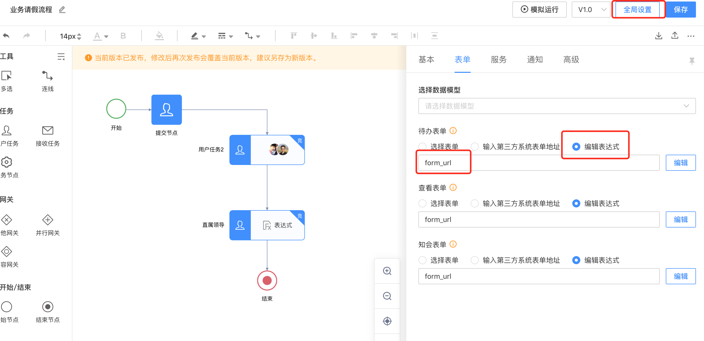
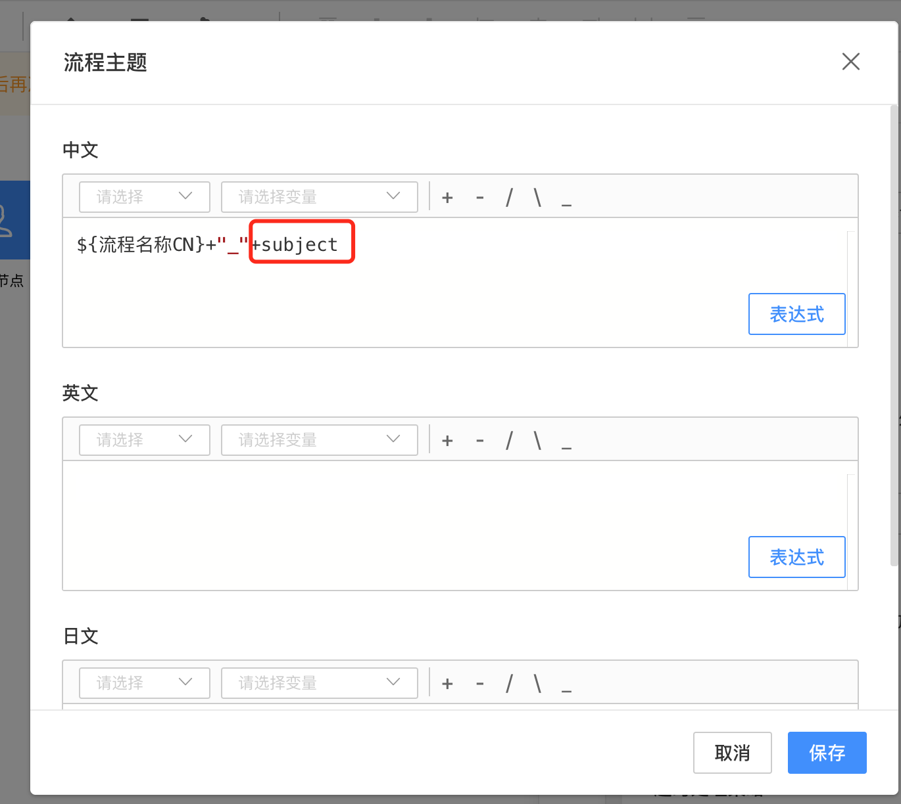
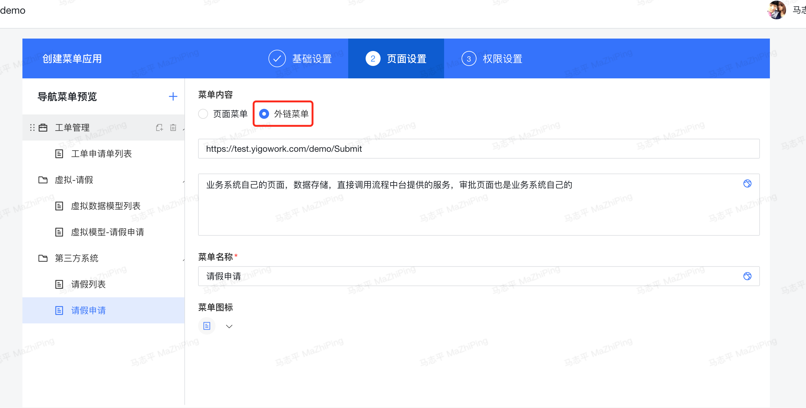
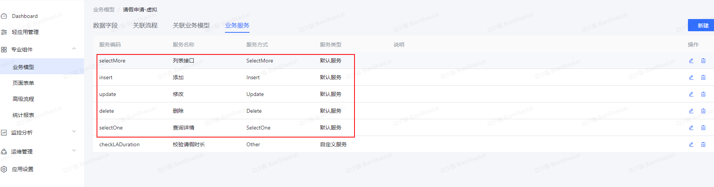
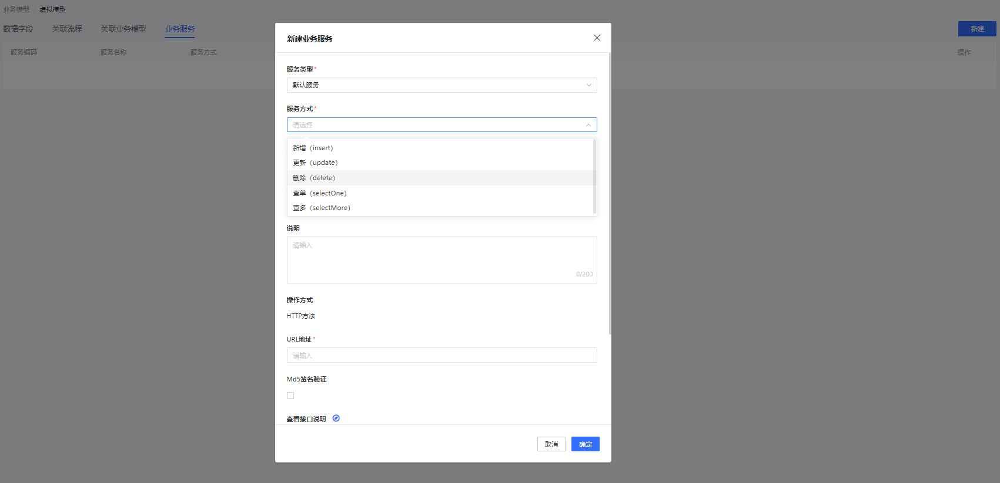

> 4.0时已废弃，新版请参考[《二开服务调用百特搭平台SDK》](https://baiteda.yuque.com/staff-shgita/nbg92z/xego4sws418v0pz8)

<a id="moBlD"></a>


# 1.场景一 整体业务系统对接流程中台（单独对接流程）

<a id="cSb78"></a>


### 1.1场景说明

业务方自己有开发能力，且功能复杂，平台配置代价比较高，直接使用我们的流程中台对接

<a id="BNriZ"></a>


### 1.2对接方式

先将bpm-sdk-4.2-SNAPSHOT.zip解压，然后使用maven命令安装至本地仓库


[附件: bpm-sdk-4.2-SNAPSHOT.zip](../../_assets/mtwn4k2qw4q9q3cf/bpm-sdk-4.2-SNAPSHOT-4391183041.zip)


[附件: jar包.zip](../../_assets/mtwn4k2qw4q9q3cf/jar包-88b80fd3b7.zip)


如下示例：


```properties
mvn install:install-file -Dfile=d:\bpm-sdk\bpm-sdk-4.2-SNAPSHOT.pom -DgroupId="com.byteluck" -DartifactId=bpm-sdk -Dversion="4.2-SNAPSHOT" -Dpackaging=pom
mvn install:install-file -Dfile=d:\bpm-sdk\bpm-sdk-client-4.2-SNAPSHOT.jar -DgroupId="com.byteluck" -DartifactId=bpm-sdk-client -Dversion="4.2-SNAPSHOT" -Dpackaging=jar
mvn install:install-file -Dfile=d:\bpm-sdk\bpm-sdk-spring-boot-starter-4.2-SNAPSHOT.jar -DgroupId="com.byteluck" -DartifactId=bpm-sdk-spring-boot-starter -Dversion="4.2-SNAPSHOT" -Dpackaging=jar
```


**将上述一个pom文件和两个jar包上传至自己公司的maven私服中，否则jenkins在构建发布时会报找不到对应jar包。**

**集成过程以springboot项目为例**

集成封装好的 sdk 包（流程api的封装）

[📎bpm-sdk-spring-boot-starter-4.2-SNAPSHOT.jar](https://www.yuque.com/attachments/yuque/0/2021/jar/2504712/1622445818024-82ef5543-2276-4c6c-9f6c-eb82199dcdfc.jar)

​


```xml
  <dependency>
            <groupId>com.byteluck</groupId>
            <artifactId>bpm-sdk-spring-boot-starter</artifactId>
            <version>4.2-SNAPSHOT</version>
   </dependency>
```


配置文件需要的参数


```properties
bpm.appId=check_app_id
bpm.appSecret=dd4!123456we
bpm.protocol=https
bpm.env=custom
bpm.host=https://xxxxx
bpm.wfcUrlPrefix=${bpm.host}/ego_api/api/v1/common
bpm.wfcUrlAssignPrefix=${bpm.host}/ego_api/api/v1/assignee
bpm.wfcUrlTaskPrefix=${bpm.host}/ego_api/api/v1/task
bpm.socketTimeout=300000
bpm.connectTimeout=30000
```


详细案例见实战示例代码中 Demo1Controller

流程实例








图中，流程不绑定数据模型，表单的表达式form\_url，主题表达式subject 都是业务方传递过去的瞬态变量，详细见代码实例

​





用户可以通过轻应用菜单中外链的方式集成到平台中来给用户的一致体验。

接入审批组件

1. 流程预览 wfc-forecast
2. 审批记录 wfc-process
3. 评论 wfc-discuss
4. 审批操作 wfc-decision
5. 发起群聊 wfc-chat-group

[前端组件接入参考](https://fe-docs.baiteda.com/docs/fe-sdk-doc/index.html#/new-approval/pc/init)

用到的接口文档参考：[签名接口v1版](https://baiteda.yuque.com/docs/share/fde92045-ab87-47e6-ac83-6a1f741cdc05?# 《签名接口v1版》)

<a id="ujs7y"></a>


# 2.场景二 *业务数据在业务端，页面流程在平台*

<a id="cbWgW"></a>


### 2.1场景说明

业务数据不想保存在流程平台，流程平台只做表单页面，数据维护在业务方

<a id="VxpZ7"></a>


### 2.2对接方式

通过平台创建虚拟的业务模型，业务方需要实现以下业务模型的默认服务

（1）业务模型-业务服务：





（2）业务模型-业务服务-新建：





注意：平台接口会有重试机制，需要实现接口幂等处理

*(1)selectMore : 查多服务，获取表单字段，列表查询使用。此服务为必须实现*

*(2)selectOne：查单服务，查看表单页面，打开表单审批页面使用。非必须实现*

*(3)instert： 新增服务，新增数据保存服务，用于数据保存。非必须实现*

*(4)update：修改服务，修改数据更新服务，用于数据更新。非必须实现*

*(5)delete： 删除服务，数据删除服务，用于数据删除。非必须实现*

用到的接口文档参考：[Http服务](https://baiteda.yuque.com/docs/share/15f86bda-a4b5-46e9-8e6a-aa7be61349a0?# 《Http服务》)

<a id="OPvVF"></a>


# 3.场景三 提交页面在业务方，审批页面在平台

<a id="n7onl"></a>


### 3.1场景说明

业务方有独立的业务系统，且发起流程的表单业务场景交互较复杂，由业务系统自己控制，审批表单逻辑较为单一，常展示为只读的审批页面形式。且为审批页面风格统一。

<a id="JvdFU"></a>


### 3.2对接方式

通过平台创建一个实体业务模型，业务模型的字段跟业务方的字段是一一对应，并创建一个审批的只读页面用于流程审批，在业务方自己的表单数据提交保存到自己的后端以后调用应用平台的接口，把数据推到平台，并启动流程，当平台流程流转结束，调用业务方的接口把流程状态等信息同步给业务方

​

实现接口，请联系业务项目实施负责人

​

调用应用平台服务相关pom


```xml
<dependency>
  <groupId>com.byteluck</groupId>
  <artifactId>baiteda-app-sdk-spring-boot-starter</artifactId>
  <version>1.4.0-SNAPSHOT</version>
</dependency>
```


配置文件


```properties
app.app-id=${APP_ID:3cxb0315}
app.app-secret=${APP_SECRET:uqdr97o0koynhr0siee6satmbgc0ix0qspbp64bjfy7vsykq0954xiy7cgqrc7py}
app.url-prefix=${APP_URL-PREFIX:https://test.baiteda.com}
app.tenant-id=${APP_TENANT_ID:test}
```


其中 appId ,app-secret ，tenant-id由平台提供，只能访问一个租户的数据，url-prefix指的是该租户的域名地址

接口参考:[表单API接口](https://baiteda.yuque.com/docs/share/9408e89a-cd78-48e3-b67b-f683a4dd10b6?# 《表单API接口》)

<a id="udaUY"></a>


# 4.示例代码以及sdk

以上业务场景，分别对应open\_demo 场景 demo1，demo2, demo3

参考示例代码

前端接入示例代码

[附件: fe-approval-demo-master.zip](../../_assets/mtwn4k2qw4q9q3cf/fe-approval-demo-master-a31601f1d6.zip)


后端接入示例代码

[附件: open-demo.zip](../../_assets/mtwn4k2qw4q9q3cf/open-demo-e5ee0767fe.zip)


后端调用平台运行态sdk源码，打开后发布到自己的maven仓库

[附件: baiteda-app-run-sdk.zip](../../_assets/mtwn4k2qw4q9q3cf/baiteda-app-run-sdk-c91f0ab298.zip)


平台运行态sdk导入到本地仓库的方法

方式1、本地打开源码，执行maven install

方式2、下载jar包,执行mvn install


[附件: baiteda-app-sdk-client-1.4.3-SNAPSHOT.jar](../../_assets/mtwn4k2qw4q9q3cf/baiteda-app-sdk-client-1.4.3-SNAPSHOT-541a45ae06.jar)


[附件: baiteda-app-sdk-spring-boot-starter-1.4.3-SNAPSHOT.jar](../../_assets/mtwn4k2qw4q9q3cf/baiteda-app-sdk-spring-boot-starter-1.4.3-SNAPSHOT-f610d535aa.jar)


示例代码


```properties
mvn install:install-file -Dfile=d:\baiteda-app-sdk-client-1.4.3-SNAPSHOT.jar -DgroupId="com.byteluck" -DartifactId=baiteda-app-sdk-spring-boot-starter -Dversion="1.4.3-SNAPSHOT" -Dpackaging=jar
```
