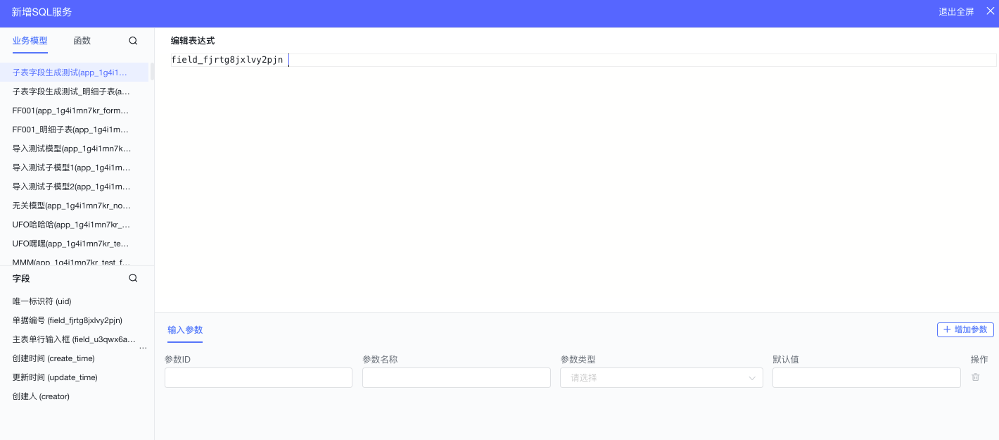
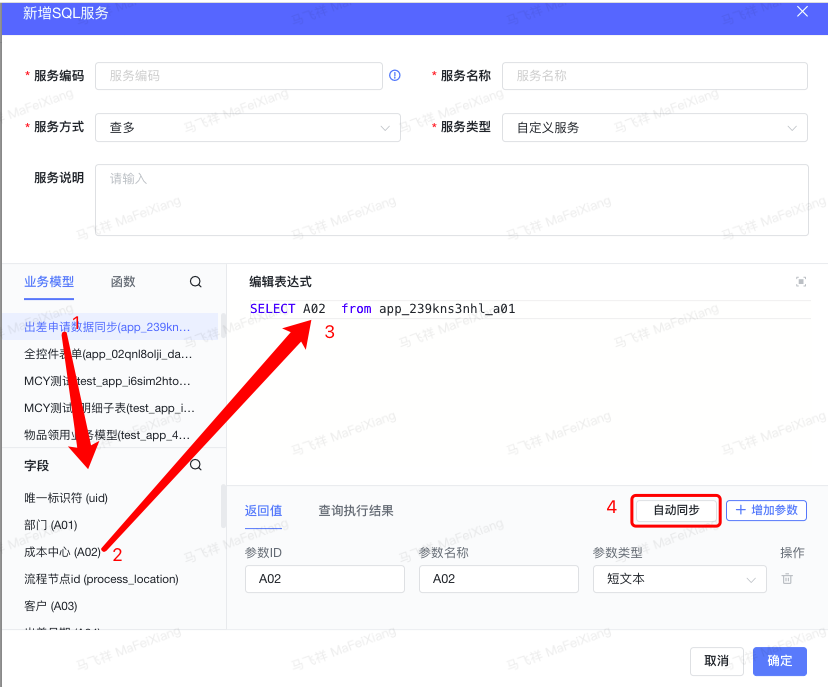

<a id="EVBJA"></a>


## 1.增加sql服务


<a id="yiF4K"></a>


## 2.限制条件

1. 仅支持单条件的SQL语句
2. 对服务方式对数据库中的关键字进行过滤处理，如下

- ①查多：INSERT,UPDATE,DELETE,DROP,CREATE,ADD,ALTER,KILL,LOAD,OUTFILE
- ②查单：INSERT,UPDATE,DELETE,DROP,CREATE,ADD,ALTER,KILL,LOAD,OUTFILE
- ③新增：SELECT,UPDATE,DELETE,DROP,CREATE,ADD,ALTER,KILL,LOAD,OUTFILE
- ④修改：INSERT,DELETE,DROP,CREATE,ADD,ALTER,KILL,LOAD,OUTFILE
- ⑤删除：INSERT,UPDATE,DROP,CREATE,ADD,ALTER,KILL,LOAD,OUTFILE

1. 不允许出现”;”，不支持多条SQL语句执行。
2. 查多服务没有入参，其余服务方式的入参格式为：#{}进行标识

【例】 SELECT [字段列表] FROM XXXXX WHERE

1. 不支持跨数据库查询，可创建视图实现，但不在模型列表中。
2. 查多服务不支持入参配置，查询参数需要在列表高级查询中进行配置。
3. 查单服务中查询执行结果执行是，不允许使用#{}，需要完整的SQL，验证完成后，需要设置为参数并保存后通过系统调用服务执行。
4. 表达式中不支持注释。只能写入可执行SQL语句。
5. 查询时，需要输出具体字段，禁止使用\*来标识。

<a id="kmV5a"></a>


## 3.可支持使用下列内容

<a id="KTSSb"></a>


### 3.1可用函数


```json
[
    {
        "sql_type":"mysql",
        "fun_name":"CHAR_LENGTH",
        "fun_format":"CHAR_LENGTH(s)",
        "fun_desc":"返回字符串 s 的字符数\n【例】返回字符串 BAITEDA 的字符数\nSELECT CHAR_LENGTH(\"BAITEDA\") AS LengthOfString;\n-->7"
    },
    {
        "sql_type":"mysql",
        "fun_name":"CONCAT",
        "fun_format":"CONCAT(s1,s2...sn)",
        "fun_desc":"合并多个字符串\n【例】SELECT CONCAT(\"www.\", \"baiteda\", \".com \") AS ConcatenatedString;\n-->www.baiteda.com "
    },
    {
        "sql_type":"mysql",
        "fun_name":"FORMAT",
        "fun_format":"FORMAT(x,n)",
        "fun_desc":"格式化数字 \"#,###.##\" 形式\nSELECT FORMAT(250500.5634, 2);\n-->输出 250,500.56"
    },
    {
        "sql_type":"mysql",
        "fun_name":"INSERT",
        "fun_format":"INSERT(s1,x,len,s2)",
        "fun_desc":"字符串替换\n字符串 s2 替换 s1 的 x 位置开始长度为 len 的字符串\n【例】从字符串第一个位置开始的 6 个字符替换为 baiteda\nSELECT INSERT(\"google.com\", 1, 6, \"baiteda\");\n-->baiteda.com"
    },
    {
        "sql_type":"mysql",
        "fun_name":"LOCATE",
        "fun_format":"LOCATE(s1,s)",
        "fun_desc":"从字符串 s 中获取 s1 的开始位置\n【例】获取 b 在字符串 abc 中的位置：SELECT LOCATE('te', 'baiteda') \n--> 4"
    },
    {
        "sql_type":"mysql",
        "fun_name":"LOWER",
        "fun_format":"LOWER(s)",
        "fun_desc":"字符串转换为小写\n字符串 BAITEDA 转换为小写\nSELECT LOWER('BAITEDA');\n--> baiteda"
    },
    {
        "sql_type":"mysql",
        "fun_name":"SUBSTR",
        "fun_format":"SUBSTR(s, start, length)",
        "fun_desc":"从字符串 s 的 start 位置截取长度为 length 的子字符串\n【例】从字符串 baiteda 中的第 4 个位置截取 2个 字符\nSELECT SUBSTR(\"BAITEDA\", 4, 2) AS ExtractString;\n--> TE\n"
    },
    {
        "sql_type":"mysql",
        "fun_name":"SUBSTRING",
        "fun_format":"SUBSTRING(s, start, length)",
        "fun_desc":"从字符串 s 的 start 位置截取长度为 length 的子字符串\n【例】从字符串 baiteda 中的第 2 个位置截取 3个 字符\nSELECT SUBSTRING(\"BAITEDA\", 2, 3) AS ExtractString; \n--> AIT"
    },
    {
        "sql_type":"mysql",
        "fun_name":"SUBSTRING_INDEX",
        "fun_format":"SUBSTRING_INDEX(s, delimiter, number)",
        "fun_desc":"返回从字符串 s 的第 number 个出现的分隔符 delimiter 之后的子串。\n【例】SELECT SUBSTRING_INDEX('a*b','*',1);\n--> a\n如果 number 是正数，返回第 number 个字符左边的字符串。\n【例】SELECT SUBSTRING_INDEX('a*b','*',-1);\n--> b\n如果 number 是负数，返回第(number 的绝对值(从右边数))个字符右边的字符串。\n【例】SELECT SUBSTRING_INDEX(SUBSTRING_INDEX('a*b*c*d*e','*',3),'*',-1)\n--> c"
    },
    {
        "sql_type":"mysql",
        "fun_name":"TRIM",
        "fun_format":"TRIM(s)",
        "fun_desc":"去掉字符串 s 开始和结尾处的空格\n【例】去掉字符串 baiteda 的首尾空格：SELECT TRIM('    BAITEDA    ') AS TrimmedString;\n-->BAITEDA"
    },
    {
        "sql_type":"mysql",
        "fun_name":"UPPER",
        "fun_format":"UPPER(s)",
        "fun_desc":"将字符串转换为大写\n【例】将字符串 baiteda 转换为大写：SELECT UPPER(\"baiteda\"); \n--> BAITEDA"
    },
    {
        "sql_type":"mysql",
        "fun_name":"AVG",
        "fun_format":"AVG(column)",
        "fun_desc":"返回一个表达式的平均值，column 是一个字段\n【例】返回 Products 表中Price 字段的平均值\nSELECT AVG(Price) AS AveragePrice FROM Products;"
    },
    {
        "sql_type":"mysql",
        "fun_name":"COUNT",
        "fun_format":"COUNT(column)",
        "fun_desc":"返回查询的记录总数，column 参数是一个字段、*号、或者1\n【例】返回 Products 表中 products 字段总共有多少条记录\nSELECT COUNT(ProductID) AS NumberOfProducts FROM Products;"
    },
    {
        "sql_type":"mysql",
        "fun_name":"MAX",
        "fun_format":"MAX(column)",
        "fun_desc":"返回字段 column 中的最大值\n【例】返回数据表 Products 中字段 Price 的最大值\nSELECT MAX(Price) AS LargestPrice FROM Products;"
    },
    {
        "sql_type":"mysql",
        "fun_name":"MIN",
        "fun_format":"MIN(column)",
        "fun_desc":"返回字段 column 中的最小值\n【例】返回数据表 Products 中字段 Price 的最小值\nSELECT MIN(Price) AS MinPrice FROM Products;"
    },
    {
        "sql_type":"mysql",
        "fun_name":"MOD",
        "fun_format":"MOD(x,y)",
        "fun_desc":"返回 x 除以 y 以后的余数\n【例】5 除于 2 的余数：SELECT MOD(5,2);\n--> 1"
    },
    {
        "sql_type":"mysql",
        "fun_name":"RAND",
        "fun_format":"RAND()",
        "fun_desc":"返回 0 到 1 的随机数　　\n【例】SELECT RAND();\n-->0.93099315644334"
    },
    {
        "sql_type":"mysql",
        "fun_name":"ROUND",
        "fun_format":"ROUND(x)",
        "fun_desc":"返回离 x 最近的整数\n【例】SELECT ROUND(1.23456);\n-->1"
    },
    {
        "sql_type":"mysql",
        "fun_name":"SUM",
        "fun_format":"SUM(column)",
        "fun_desc":"返回指定字段的总和\n【例】计算 OrderDetails 表中字段 Quantity 的总和\nSELECT SUM(Quantity) AS TotalItemsOrdered FROM OrderDetails;"
    },
    {
        "sql_type":"mysql",
        "fun_name":"CURDATE",
        "fun_format":"CURDATE()",
        "fun_desc":"返回当前日期\n【例】SELECT CURDATE();\n--> 2018-09-19"
    },
    {
        "sql_type":"mysql",
        "fun_name":"CURRENT_TIMESTAMP",
        "fun_format":"CURRENT_TIMESTAMP()",
        "fun_desc":"返回当前日期和时间\n【例】SELECT CURRENT_TIMESTAMP();\n-->2021-05-25 10:47:02"
    },
    {
        "sql_type":"mysql",
        "fun_name":"CURTIME",
        "fun_format":"CURTIME()",
        "fun_desc":"返回当前时间\n【例】SELECT CURTIME();\n--> 19:59:02"
    },
    {
        "sql_type":"mysql",
        "fun_name":"DATE_FORMAT",
        "fun_format":"DATE_FORMAT(d,f)",
        "fun_desc":"按表达式 f的要求显示日期 d\n【例】SELECT DATE_FORMAT('2021-05-25 10:47:02','%Y-%m-%d %r');\n--> 2021-05-25 10:47:02 AM"
    },
    {
        "sql_type":"mysql",
        "fun_name":"NOW",
        "fun_format":"NOW()",
        "fun_desc":"返回当前日期和时间\n【例】SELECT NOW();\n--> 2021-05-25 10:48:23"
    },
    {
        "sql_type":"mysql",
        "fun_name":"IF",
        "fun_format":"IF(expr,v1,v2)",
        "fun_desc":"如果表达式 expr 成立，返回结果 v1；否则，返回结果 v2。\n【例】SELECT IF(1 > 0,'正确','错误');\n-->正确"
    },
    {
        "sql_type":"mysql",
        "fun_name":"IFNULL",
        "fun_format":"IFNULL(v1,v2)",
        "fun_desc":"如果 v1 的值不为 NULL，则返回 v1，否则返回 v2。\n【例】SELECT IFNULL(null,'Hello Word');\n-->Hello Word"
    },
    {
        "sql_type":"mysql",
        "fun_name":"UNION",
        "fun_format":"SELECT expression1, expression2, ... expression_n\r\nFROM tables\r\n[WHERE conditions]\r\nUNION [ALL | DISTINCT]\r\nSELECT expression1, expression2, ... expression_n\r\nFROM tables\r\n[WHERE conditions];",
        "fun_desc":"expression1, expression2, ... expression_n: 要检索的列。\r\n\r\ntables: 要检索的数据表。\r\n\r\nWHERE conditions: 可选， 检索条件。\r\n\r\nDISTINCT: 可选，删除结果集中重复的数据。默认情况下 UNION 操作符已经删除了重复数据，所以 DISTINCT 修饰符对结果没啥影响。\r\n\r\nALL: 可选，返回所有结果集，包含重复数据。"
    }
]
```

<a id="R2Oz0"></a>


### 3.2模型和和字段引用





在编辑器内，左侧区域，可以显示出应用内的所有模型，点击模型，左下方会显示出此模型的字段列表，在右上侧区域，进行SQL的编写，此时，可以选择左侧的模型和字段，右下方显示参数。

查多服务，会在右下侧有一个自动同步按钮，用来同步返回值，点击自动同步按钮时，会将编辑表达式中的SQL所选的字段，自动同步到返回值中，见下图所示：



