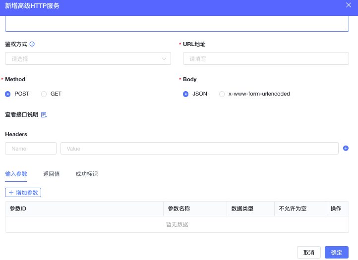
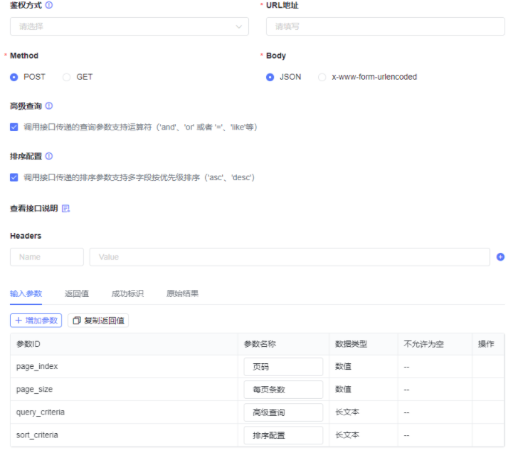

<a id="j1XS4"></a>


# 1.说明

1、高级HTTP支持POST/GET请求；

2、其中POST支持x-www-form-urlencoded与json请求方式；

3、请求入参支持Key-Value方式（暂不支持入参中存在数组或对象的请求方式，二开除外）；

4、配置成功标识中建议配置完整，方便错误提示排查code与message；

5、获取当前登录人及当前租户编码：在Headers中获取当前登录人Key：employee-id，当前租户编码Key：bt-tenant-id。【注意事项】流程中调用高级HTTP时获取不到当前登录人及当前租户信息

6、返回值配置说明

格式为：$.xxx.xxx

例1：获取响应数据中·duanwenben·字段的数据映射


```json
{
  "code":"000000",
  "message":"成功",
  "data":{
    "instance_id": "1527545715575341056",
    "instance_status": "complete",
    "process_def_key": "xinzeng_m61is529",
    "output_result": {
      "duanwenben": "xxxxxx@qq.com",
      "renyuan": "WangChao",
      "dizhi": "",
      "shuzi": 2,
      "changwenben": "",
      "fujian": "",
      "tupian": "",
      "uid": "9a6c134429bd6e2f05f44bb",
      "shurukuang": "333333",
      "zidong": "",
      "bumen": "13",
      "json": null,
      "riqi": null,
      "shuzu": []
    }
  }
}
```


返回值应该配置为：$.data.output\_result.duanwenben

例2：成功标识配置说明：

code对应返回值配置为：$.code 成功为：000000 表示当接口中返回为000000时解析数据。当不为000000时，则按照message配置（$.message）取到message值提示在前端显示。

以$为响应数据的根节点，按层级依次取值，不支持获取数组中的字段数据。

7、高级HTTP中APPLICATION\_FORM\_URLENCODED不能传递除字符串类型以外的数据类型

1）鉴权模板

- 所有的参数中的数据类型需转换为String类型进行提交。对于JSON对象、数组等聚合类对象不支持。需要在使用的高级HTTP页面上进行tip提示说明。

2）高级HTTP中APPLICATION\_FORM\_URLENCODED请求方式：

- 经过验证，对于APPLICATION\_FORM\_URLENCODED方式中使用非String的参数传递都会报错，故对于影响范围是，可直接当做bug进行修复。
- 修复方式为，所有的参数中的数据类型需转换为String类型进行提交。对于JSON对象、数组等聚合类对象不支持。需要在使用的高级HTTP页面上进行tip提示说明。

3）服务编排HTTP节点

- 同高级HTTP服务保持一致调整。

4）针对现有及历史配置兼容性说明

- 目前若存在历史配置数据，配置的参数及传递的数据为String类型<短文本、长文本等>，不存在非String类型<非String类型在传递参数过程中会直接报错>。
- 只需要直接修复当前表单提交的数据类型，全部转换为字符串类型数据格式。默认为toString，对于int、float、double、char、long、byte、short、boolean类型则需要转换为String进行传递。不支持Map、List聚合类型处理。

注：application\_form\_urlencoded格式的标准参数key和value必须都是String类型的。

<a id="iSxIc"></a>


## 1.1增加高级http服务





<a id="FczCO"></a>


## 1.2签权管理

<a id="P2Zwx"></a>


### 1.2.1鉴权模板配置：

（1）鉴权模板的增删改查

（2）与高级HTTP的结合实现服务的有效调用

（3）鉴权方式TemporaryToken的有效时长验证，需要查看日志中的参数，进行验证是否正确。

<a id="JaIt9"></a>


### 1.2.2选择签权模板

<a id="LtqYM"></a>


## 1.3限制条件

（1）若参数中的参数ID或Headers中的Name与鉴权模板中配置的值有一致的情况下，会把鉴权模板中的参数覆盖。

（2）返回值的格式必须以$开头，返回值为调用接口成功后响应值的层级映射关系。

（3）成功标识：code配置接口的成功标识码，用于判断接口是否调用成功，message配置：若接口调用失败或异常，会获取到接口返回的错误码中的错误提示响应到前端。

（4）查多服务：勾选高级查询与排序查询时，入参会自动增加参数query\_criteria、sort\_criteria、filter\_criteria，用于继承平台中的查询、排序、过滤条件的JSON字符串，需要第三方系统进行解析。

（5）前端不支持查多自定义的入参列表及JSON类型数据。支持二开进行调用前端组件传参映射。

<a id="hcRK3"></a>


# 2.不同服务类型使用

<a id="MwJ1K"></a>


## 2.1查多(Select\_More)：

【说明】配置时可自动同步字段并可验证接口是否正确。





<a id="FTvDr"></a>


### 2.1.1入参（其余可自行添加）：

|  |  |  |  |
| --- | --- | --- | --- |
| 字段名 | 描述 | 示例 | 备注 |
| page\_index | 分页参数，页码 | 1 | 默认 |
| page\_size | 分页参数，每页大小 | 10 | 默认 |
| query\_criteria | 查询条件，列表上使用时默认查询当前登录人信息，所以都会传creator参数其他的列需要在列表设计态上配置，queryType:0:eq,1:gt,2:lt,3:in,4:like,5:range,6:ge,7:le, 9:concatlike无论queryType是那种类型，其value值都是一个数组，在转换为SQL语句时，要根据queryType做相应处理。具体类型查询参考下面查询 示例。注：参照不同DB的不同类型字段的查询规则 | [{"column\_name\_list":[{"value":"book\_name","field\_type":"varchar","type":"FIELD"}],"column\_name":null,"value":[""],"query\_type":9}] | 勾选高级查询，入参为JSON字符串，需自行解析执行 |
| sort\_criteria | 排序参数，Map结构，key:字段，value:DESC\ASC | "sort\_criteria":{ "create\_time":"DESC" } | 勾选排序配置，入参为JSON字符串，需自行解析执行 |
| filter\_criteria | 过滤条件 |  |  |

<a id="ug65w"></a>


### 2.1.2查询示例说明


```json
// EQ查询 queryType=0
{
  "column_name_list":null,
  "column_name":"book_name",
  "value":[
    "heihei"
  ],
  "query_type":0
}

// GT查询 queryType = 1
{
  "column_name_list":null,
  "column_name":"book_no",
  "value":[
    "123"
  ],
  "query_type":1
}


// LT查询 queryType = 2
{
  "column_name_list":null,
  "column_name":"book_no",
  "value":[
    "123"
  ],
  "query_type":2
}


// IN查询 queryType = 3
{
  "column_name_list":null,
  "column_name":"book_name",
  "value":[
    "121",
    "456",
    "789"
  ],
  "query_type":3
}

// LIKE查询 queryType = 4
{
  "column_name_list":null,
  "column_name":"book_name",
  "value":[
    "heihei"
  ],
  "query_type":4
}

// RANGE查询 queryType = 5
{
  "column_name_list":null,
  "column_name":"book_no",
  "value":[
    "123",
    "789"
  ],
  "query_type":5
}

// GE查询 queryType = 6
{
  "column_name_list":null,
  "column_name":"book_no",
  "value":[
    "123"
  ],
  "query_type":6
}

// LE查询 queryType = 7
{
  "column_name_list":null,
  "column_name":"book_no",
  "value":[
    "123"
  ],
  "query_type":7
}

// CONCATLIKE查询 queryType = 9
{
  "column_name_list":[
    {
      "type":"FIELD",
      "value":"book_name"

    },
    {
      "type":"MOSAICS",
      "value":"_"
    },
    {
      "type":"FIELD",
      "value":"book_no"

    }
  ],
  "column_name":null,
  "value":[
    "张三_123"
  ],
  "query_type":9
}
```

<a id="MxSgb"></a>


### 2.1.3出参（其余可自行添加映射）：

|  |  |  |
| --- | --- | --- |
| 字段名 | 描述 | 返回值示例（按接口响应数据层级配置） |
| total | 总条数 | $.data.total |
| rows | 数据集 | $.data.rows |
| uid | 数据集下的唯一标识 | $.data.rows.id |

<a id="JUdyh"></a>


## 2.2查单(Select\_One)：

【说明】配置时可自动同步字段并可验证接口是否正确。

入参（只支持uid查询）：

|  |  |  |  |
| --- | --- | --- | --- |
| 字段名 | 描述 | 示例 | 备注 |
| uid | 唯一标识 | xxx |  |

出参（其余可自行添加映射）：

|  |  |  |  |
| --- | --- | --- | --- |
| 字段名 | 描述 | 返回值示例 | 备注 |
| uid | 唯一标识 | $.data.id |  |

<a id="N17aZ"></a>


## 2.3新增（insert）

【说明】入参可自行增加，暂不支持包含对象，二开除外

<a id="gjXYY"></a>


## 2.4更新（update）

【说明】入参可自行增加，暂不支持包含对象，二开除外

<a id="itVMT"></a>


## 2.5删除（delete）

【说明】入参可自行增加，暂不支持包含对象，二开除外

<a id="ZuRXz"></a>


## 2.6其他（other）

【说明】入参可自行增加，暂不支持包含对象，二开除外

<a id="nfpsL"></a>


## 2.7二开参数说明

参数格式：


```json
{
	"app_id": "",
	"query": {
		"data_filters": [
			{
				"type": ""
			}
		],
		"filter_sql": "",
		"page_index": 0,
		"page_size": 0,
		"query_criteria": [
			{
				"column_name": "",
				"column_name_list": [
					{
						"field_type": "",
						"type": "",
						"value": ""
					}
				],
				"query_type": 0,
				"value": []
			}
		],
		"sort_criteria": {}
	},
	"save_datas": {},
	"save_datas_list": [
		{}
	],
	"svc_code": "",
	"tenant_id": "",
	"user_id": ""
}
```


【说明】

调用查多服务：query参数必传

调用查单、新增、修改、删除服务：参数放在save\_datas中

query\_criteria、sort\_criteria与filter\_criteria参数传递方式参考【一、查多(Select\_More)】中的说明
