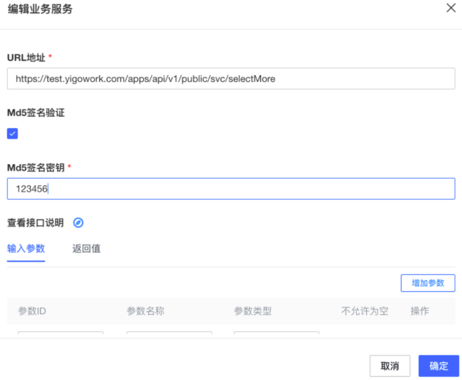
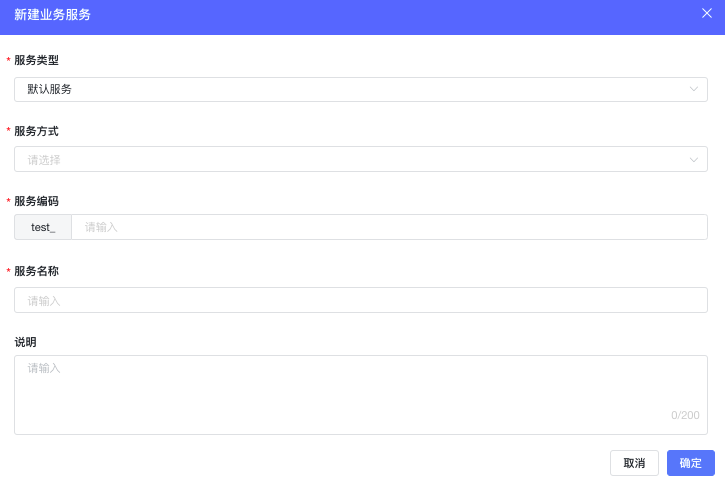
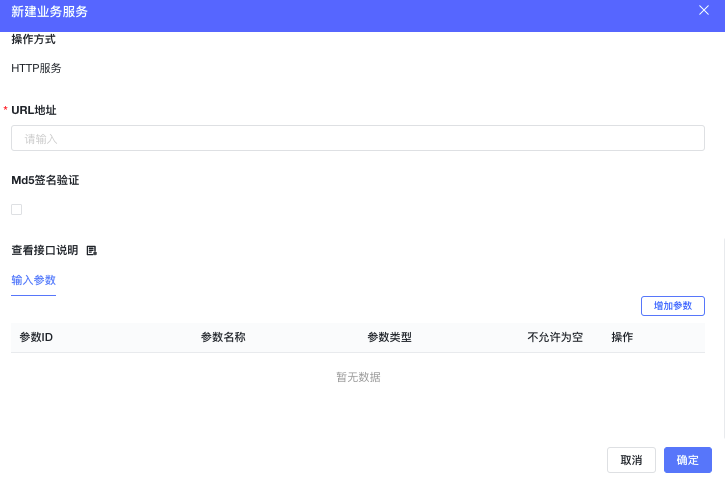

<a id="B1xFQ"></a>


# 1.数据服务HTTP接口说明

- 说明：返回数据字段场景，必须实现
- 接口调用方式:POST
- 统一签名方式

<a id="Txrif"></a>


## 1.1通用参数

|  |  |  |
| --- | --- | --- |
| **参数名** | **类型** | **例** |
| sign | 安全签名（md5(requestBody+timestamp+secretKey)） | 7E682AF54F208EBD5FC447512F37AB24 |
| app\_id | 应用编号 | app\_a8n3ajrg8l |
| tenant\_id | 租户编号 | test |
| timestamp | 请求发起时的系统时间戳 | 1582612303676 |

如果没有配置secret，sign将为空

secret 设置如图所示





<a id="UeIhc"></a>


## 1.2新建http服务








<a id="DtTnK"></a>


## 1.3限制条件

1. 对于层级（JSON）数据类型，入参不能设置
2. 使用md5进行签名认证，需要填写密钥值
3. 除查单与查多外其余的参数需要手动添加输入输出参数

<a id="dR8VD"></a>


# 2.不同类型的服务

<a id="T3zDg"></a>


## 2.1SelectMore说明

<a id="sW9dt"></a>


### 2.1.1请求参数样例：


```json
[
    {
        "app_id":"app_a8n3ajrg8l",
        "biz_params":"{\"page_index\":1,\"page_size\":10,\"sort_criteria\":{\"create_time\":\"DESC\"},\"query_criteria\":[{\"column_name\":\"book_name\",\"value\":[\"121\"],\"query_type\":4},{\"column_name\":\"creator\",\"value\":[\"MaZhiPing\"],\"query_type\":0}]}",
        "sign":"47db0adbd9de204bee81cc02da37d85a",
        "tenant_id":"test",
        "timestamp":"20200924095813"
    }
]
```

<a id="vq24h"></a>


### 2.1.2bizParams:查询对象


```json
{
    "page_index":1,
    "page_size":10,
    "sort_criteria":{
        "create_time":"DESC"
    },
    "query_criteria":[
        {
            "column_name_list":null,
            "column_name":"book_name",
            "value":[
                "121"
            ],
            "query_type":4
        },
        {
            "column_name_list":null,
            "column_name":"book_name",
            "value":[
                "121",
                "456",
                "789"
            ],
            "query_type":3
        },
        {
            "column_name_list":[
                {
                    "type":"FIELD",
                    "value":"book_name"

                },
                {
                    "type":"MOSAICS",
                    "value":"_"
                },
                {
                    "type":"FIELD",
                    "value":"book_no"

                },
            ],
            "column_name":null,
            "value":[
                "张三_123"
            ],
            "query_type":9
        },
        {
            "column_name_list":null,
            "column_name":"creator",
            "value":[
                "MaZhiPing"
            ],
            "query_type":0
        }
    ]
}
```


|  |  |  |
| --- | --- | --- |
| **参数名称** | **参数说明** | **样例** |
| page\_index | 分页参数，页码 | 1 |
| page\_size | 分页参数，每页大小 | 10 |
| sort\_criteria | 排序参数，Map结构，key:字段，value:DESC\ASC | "sort\_criteria":{ "create\_time":"DESC" } |
| query\_criteria | 查询条件，列表上使用时默认查询当前登录人信息，所以都会传creator参数 其他的列需要在列表设计态上配置， queryType: 0:eq,1:gt,2:lt,3:in,4:like,5:range,6:ge,7:le, 9:concatlike 无论queryType是那种类型，其value值都是一个数组，在转换为SQL语句时，要根据queryType做相应处理。 具体类型查询参考下面查询 示例。 注：参照不同DB的不同类型字段的查询规则 | "query\_criteria":[ { "column\_name\_list":null, "column\_name":"book\_name", "value":[ "121" ], "query\_type":4 }, { "column\_name\_list":null, "column\_name":"book\_name", "value":[ "121", "456", "789" ], "query\_type":3 }, { "column\_name\_list":[ { "type":"FIELD", "value":"book\_name" }, { "type":"MOSAICS", "value":"\_" }, { "type":"FIELD", "value":"book\_no" } ], "column\_name":null, "value":[ "张三\_123" ], "query\_type":9 } { "column\_name\_list":null, "column\_name":"creator", "value":[ "MaZhiPing" ], "query\_type":0 } ] |

<a id="pllJH"></a>


### 2.1.3查询示例：


```json
// EQ查询 queryType=0
{
  "column_name_list":null,
  "column_name":"book_name",
  "value":[
    "heihei"
  ],
  "query_type":0
}
相应SQL：where book_name = 'heihei'

// GT查询 queryType = 1
{
  "column_name_list":null,
  "column_name":"book_no",
  "value":[
    "123"
  ],
  "query_type":1
}
相应SQL：where book_name > '123'


// LT查询 queryType = 2
{
  "column_name_list":null,
  "column_name":"book_no",
  "value":[
    "123"
  ],
  "query_type":2
}
相应SQL：where book_no &lt; '123'


// IN查询 queryType = 3
{
  "column_name_list":null,
  "column_name":"book_name",
  "value":[
    "121",
    "456",
    "789"
  ],
  "query_type":3
}
相应SQL:
where book_name IN ("121","456","789")

// LIKE查询 queryType = 4
{
  "column_name_list":null,
  "column_name":"book_name",
  "value":[
    "heihei"
  ],
  "query_type":4
}
相应SQL：where book_name like '%heihei%'

// RANGE查询 queryType = 5
{
  "column_name_list":null,
  "column_name":"book_no",
  "value":[
    "123",
    "789"
  ],
  "query_type":5
}
相应SQL：where book_no between '123' and '456'
// GE查询 queryType = 6
{
  "column_name_list":null,
  "column_name":"book_no",
  "value":[
    "123"
  ],
  "query_type":6
}
相应SQL：where book_no >= '123'
// LE查询 queryType = 7
{
  "column_name_list":null,
  "column_name":"book_no",
  "value":[
    "123"
  ],
  "query_type":7
}
相应SQL：where book_no &lt;= '123'
// CONCATLIKE查询 queryType = 9
{
  "column_name_list":[
    {
      "type":"FIELD",
      "value":"book_name"

    },
    {
      "type":"MOSAICS",
      "value":"_"
    },
    {
      "type":"FIELD",
      "value":"book_no"

    }
  ],
  "column_name":null,
  "value":[
    "张三_123"
  ],
  "query_type":9
}
相应SQL：
where concat('book_name','_','book_no') like CONCAT('%','张三_123,'%')
```

<a id="lIlcG"></a>


### 2.1.4返回值样式：

|  |  |  |
| --- | --- | --- |
| **参数名称** | **参数说明** | **样例** |
| row\_names | 返回的字段名称，http服务侧自动同步字段的时候使用 | field\_type：只有新增或者重新后去会更新类型，其它情况为考虑页面有修改情况，不会对类型进行更新 |
| page | 分页参数 |  |
| rows | 行记录 |  |

返回值取值类型说明：

|  |  |  |
| --- | --- | --- |
| **类型** | **名称以及说明** | **样例** |
| varchar | 短文本 | "abc" |
| text | 长文本，可用于富文本框 | "abc" |
| timestamp | 日期 | 1620718450000 |
| people | 人员 | { "avatar\_big": "", "avatar\_small": "", "avatar\_url": "", "checked": true, "department\_en\_name": "", "department\_id": "", "department\_name": "", "email": "", "employee\_en\_name": "", "employee\_id": "", "employee\_name": "", "external\_user": true, "gender": 0, "leader\_eid": "", "msg\_relation\_type": "", "tenant\_id": "", "terminated": true } |
| decimal | 数值 | 123 |
| image | 图片 | [ { "create\_time": 0, "creator": { "avatar\_big": "", "avatar\_small": "", "avatar\_url": "", "belong\_dept\_en\_name": "", "belong\_dept\_id\_list": [], "belong\_dept\_ids": "", "belong\_dept\_name": "", "checked": true, "department\_en\_name": "", "department\_id": "", "department\_name": "", "email": "", "employee\_card": "", "employee\_en\_name": "", "employee\_id": "", "employee\_name": "", "external\_user": true, "gender": 0, "leader\_eid": "", "manage\_dept\_en\_name": "", "manage\_dept\_ids": "", "manage\_dept\_name": "", "msg\_relation\_type": "", "phone": "", "sequence": "", "sort": 0, "telephone": "", "tenant\_id": "", "terminated": true }, "del\_file\_url": "", "download\_url": "", "file\_id": "", "file\_name": "", "file\_path": "", "origin\_url": "", "tenant\_id": "", "thumb\_url": "" } ] |
| file | 附件 | [ { "create\_time": 0, "creator": { "creator": { "avatar\_big": "", "avatar\_small": "", "avatar\_url": "", "belong\_dept\_en\_name": "", "belong\_dept\_id\_list": [], "belong\_dept\_ids": "", "belong\_dept\_name": "", "checked": true, "department\_en\_name": "", "department\_id": "", "department\_name": "", "email": "", "employee\_card": "", "employee\_en\_name": "", "employee\_id": "", "employee\_name": "", "external\_user": true, "gender": 0, "leader\_eid": "", "manage\_dept\_en\_name": "", "manage\_dept\_ids": "", "manage\_dept\_name": "", "msg\_relation\_type": "", "phone": "", "sequence": "", "sort": 0, "telephone": "", "tenant\_id": "", "terminated": true }, "del\_file\_url": "", "download\_url": "", "file\_id": "", "file\_name": "", "file\_path": "", "online\_view\_url": "", "support\_online\_view": true, "tenant\_id": "" } ] |
| department | 部门 | [ { "checked": true, "department\_en\_name": "", "department\_id": "", "department\_ja\_name": "", "department\_name": "", "display\_value": "", "has\_child": true, "leader\_eid": "", "leader\_name": "", "order": 0, "parent\_id": "" } ] |
| location | 地址 | "北京/北京市/西城区" |
| array | 数组 | [ "1","2", "3"] |


```json
{
    "code":"000000",
    "data":{
        "row_names":[{
           "id":"bookCategory",
            "name":"书籍分类",
            "field_type":"varchar"
         },{
           "id":"bookName",
            "name":"书籍名称",
            "field_type":"varchar"
         },{
           "id":"bookCategory",
            "name":"书籍分类",
            "field_type":"varchar"
         },{
           "id":"bookPrice",
            "name":"书籍价格",
            "field_type":"decimal"
         },,{
           "id":"id",
            "name":"编号",
            "field_type":"decimal"
         }],
        "page":{
            "page_index":1,
            "page_size":10,
            "total":4
        },
        "rows":[
            {
                "bookCategory":"武侠小说",
                "bookName":"倚天屠龙记",
                "bookPrice":20,
                "id":1
            },
            {
                "bookCategory":"武侠小说",
                "bookName":"蜀山剑侠传",
                "bookPrice":25,
                "id":2
            },
            {
                "bookCategory":"讽刺小说",
                "bookName":"围城",
                "bookPrice":30,
                "id":3
            },
            {
                "bookCategory":"讽刺小说",
                "bookName":"官场现形记",
                "bookPrice":35,
                "id":4
            }
        ]
    },
    "message":"执行成功",
    "state":"SUCCESS",
    "timestamp":1600912693124
}
```

<a id="q8e1g"></a>


## 2.2SelectOne说明

数据源关联，表单事件中需要使用，必须实现

参见（其他(other)类型）类型服务

<a id="oiDfZ"></a>


## 2.3Insert说明

参见（其他(other)类型）类型服务

<a id="L0xFQ"></a>


## 2.4Update说明

参见（其他(other)类型）类型服务

<a id="bQds6"></a>


## 2.5Delete说明

参见（其他(other)类型）类型服务

<a id="DaIgC"></a>


## 2.6其他(other)类型

<a id="NyvgW"></a>


### 2.6.1请求参数：


```json
[
    {
        "app_id":"app_a8n3ajrg8l",
        "biz_params":"{\"key\":\"value\",}",
        "sign":"47db0adbd9de204bee81cc02da37d85a",
        "tenant_id":"test",
        "timestamp":"20200924095813"
    }
]
```


bizParams 对象，是定义的参数map结构

<a id="f8mm6"></a>


### 2.6.2返回值样例：


```json
{
    "code":"000000",
    "data":{
         "key"："value"
    },
    "message":"执行成功",
    "state":"SUCCESS",
    "timestamp":1600912693124
}
```
