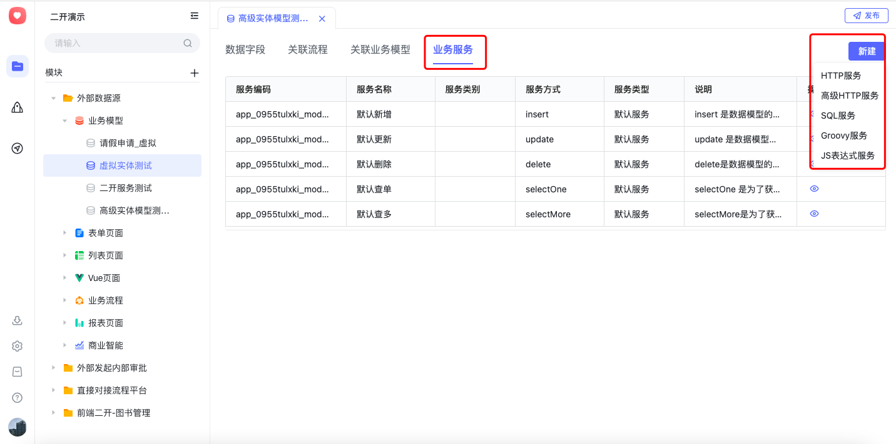

本节主要介绍如何利用百特搭平台进行服务的二开能力

### 1.可定义的服务各类

服务二开是指百特搭平台在模型数据的标准增删改查操作的基础上，进行扩展，通过SQL脚本、Http请求、高级Http请求、JS脚本和Groovy脚本几种方式进行提升模型数据处理能力，同时也可以触发外部接口进行数据处理。

​

同时百特搭为了方便用户使用Http请求的方式进行数据处理，还为用户提供了springboot项目模板，方便用户搭建独立的springboot项目，并且输出http接口供模型中的http服务和高级http服务使用。

### 2.服务类型

默认服务：是面向模型的增加、删除、修改、查询操作时，默认选择哪个服务

自定义服务：是用于在其他地方使用的服务

### 3.服务方式分类

每一类服务可以选择insert，delete，update，selectOne，selectMore几个方式，分别是对模型进行：

insert：增加模型数据

每个模型限制只能有一个insert类型的服务

delete：删除模型数据

每个模型限制只能有一个delete类型的服务

update：修改模型数据

selectOne：查询一条模型数据

selectMore：查询多条模型数据

other：其他类别

### 4.服务二开入口

​

​

​

​

## 下级条目

- [二开项目搭建](001-二开项目搭建.md)
- [二开服务调用百特搭平台SDK（3.x）](002-二开服务调用百特搭平台SDK（3.x）/README.md)
- [二开服务调用百特搭平台SDK（4.x）](003-二开服务调用百特搭平台SDK（4.x）.md)
- [平台对接实战](004-平台对接实战.md)
- [sql服务](005-sql服务.md)
- [高级http服务](006-高级http服务.md)
- [Http服务](007-Http服务.md)
- [外部数据源](008-外部数据源.md)
- [服务二开问题与解答](009-服务二开问题与解答.md)
