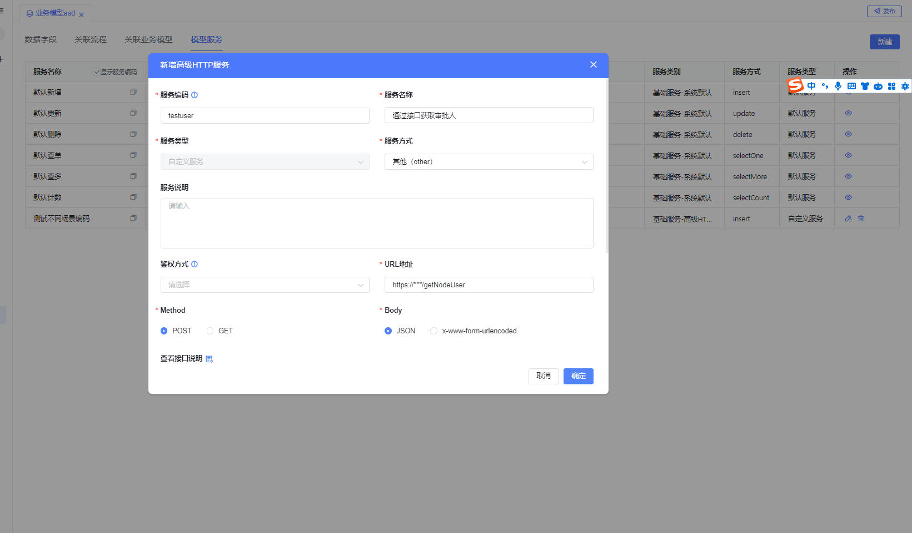
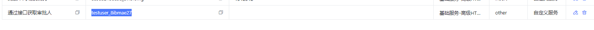
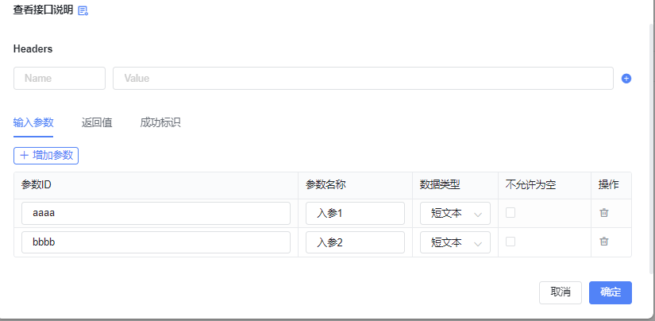
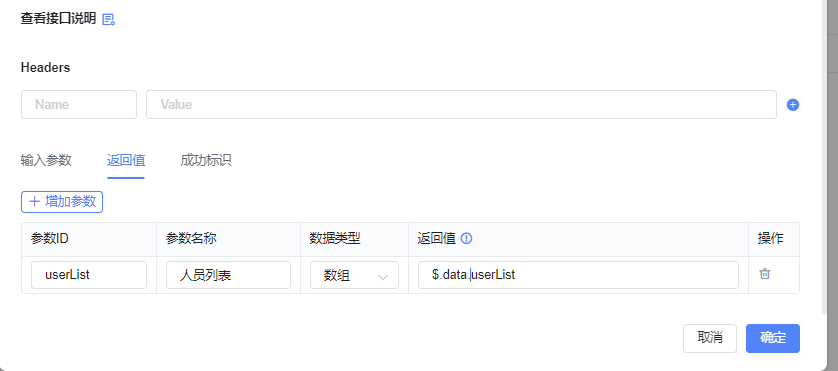
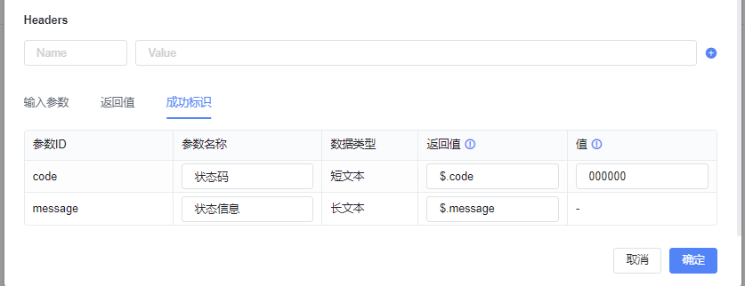
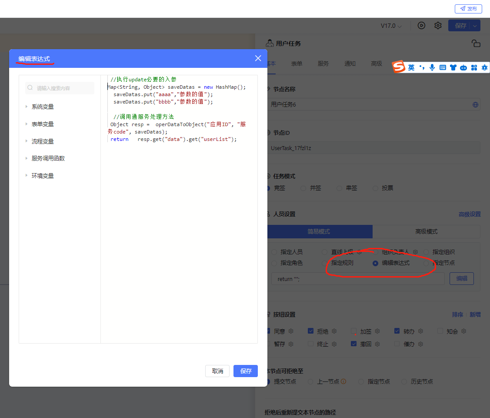
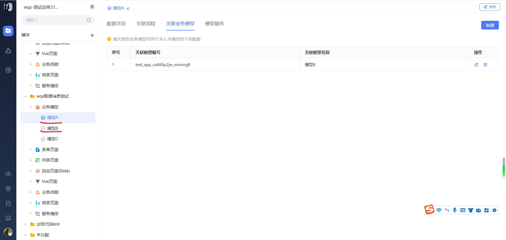

<a id="ewTMU"></a>


# 场景1：还车后更新车辆状态

描述：使用车辆时，车辆标记为已使用， 归还车辆后车辆标记为空闲中

​

基础数据：

车辆基础信息表( 车辆ID, 状态state[空闲中、已使用])

​

车辆借用归还表 主表 子表(车辆ID、借用时间)

预期实现：

在还车流程结束后，将车辆信息更新为空闲中

​

实现方式

在全局设置-服务 配置流程完成 的表达式服务


```json
//从表单变量里 获取 子表的某个字段
ArrayList list=${还车申请子表_1};
for (int i=0;i<list.size();i++         ) {
  String a = list.get(i);

  //执行update必要的入参
  Map<String, Object> saveDatas = new HashMap();
  saveDatas.put("uid",a);
  saveDatas.put("state","空闲中");

  //调用通服务处理方法
  operDataToObject("应用ID", "服务code", saveDatas);

}
```

<a id="sXKOp"></a>


# 场景2：使用外部接口返回审批人

描述： 使用二开项目的接口 获取审批人

​

前置条件：

1. 部署二开项目 提交接口 https://\*\*\*/getNodeUser

入参：{"aaaa":"\*\*\*\*","bbbb":"\*\*\*\*\*"}

出参：{"code":"000000","message":"成功","data":{"userList":["zhangsan","lisi"]}}

2. 在业务模型上增加高级http服务

服务code








​

入参映射：





出参映射








在流程里使用





//必要的入参

Map<String, Object> saveDatas = new HashMap();

saveDatas.put("aaaa","参数的值");

saveDatas.put("bbbb","参数的值");

​

//调用通服务处理方法

Object resp = operDataToObject("应用ID", "服务code", saveDatas);

return  **resp.get("data").get("userList");**

<a id="HqxHE"></a>


# 场景3: 明细子表每行的遍历

前置条件 模型B是模型A的子表





​

流程发起时入参


```json
{
	"flow_app_map": {
		"app_id": "test_app_oa86lip2jw",
		"data_code": "test_app_oa86lip2jw_moxingA"
	},
	"flow_info_map": {},
	"flow_form_map": {
		"test_form_0jagt05z1u": "/apps/api/v1/private/form/dispatcher/test_app_oa86lip2jw/test_form_0jagt05z1u"
	},
	"form_data_map": {
		"test_app_oa86lip2jw_moxingA": {
			"uid": "a8a8477917a541e48f17733f26d68581",
			"creator": "SongHaoMing",
			"renyuan": "SongHaoMing",
			"update_time": 1706859409000,
			"create_time": 1706859409000,
			"app_version": " ",
			"process_instance_id": "39e6c40a-8b86-458e-bdad-2237e25afbb9",
			"process_status": "RUNNING",
			"shuzhuasdasd": [],
			"process_key": "test_moxingA",
			"name": "修复数据"
		}
	},
	"sub_data_map": {
		"test_app_oa86lip2jw_moxingB": [
			{
				"creator": "SongHaoMing",
				"renyuan": "",
				"create_time": 1706859410000,
				"app_version": " ",
				"process_location": "",
				"moxingA_id": "a8a8477917a541e48f17733f26d68581",
				"uid": "649264a203e5429889cb28f093f78ec3",
				"update_time": 1706859410000,
				"process_instance_id": "",
				"process_status": "RUNNING",
				"process_key": "",
				"name": "测试001",
				"id": 98,
				"age": "11"
			},
			{
				"creator": "SongHaoMing",
				"renyuan": "",
				"create_time": 1706859410000,
				"app_version": " ",
				"process_location": "",
				"moxingA_id": "a8a8477917a541e48f17733f26d68581",
				"uid": "fa3f9e7cd9df4602ba1cb8ac45a5afee",
				"update_time": 1706859410000,
				"process_instance_id": "",
				"process_status": "RUNNING",
				"process_key": "",
				"name": "测试002",
				"id": 99,
				"age": "22"
			}
		]
	},
	"sub_data_map_single": {
		"test_app_oa86lip2jw_moxingB": {
			"creator": [
				"SongHaoMing",
				"SongHaoMing"
			],
			"renyuan": [
				"",
				""
			],
			"create_time": [
				1706859410000,
				1706859410000
			],
			"app_version": [
				" ",
				" "
			],
			"process_location": [
				"",
				""
			],
			"moxingA_id": [
				"a8a8477917a541e48f17733f26d68581",
				"a8a8477917a541e48f17733f26d68581"
			],
			"uid": [
				"649264a203e5429889cb28f093f78ec3",
				"fa3f9e7cd9df4602ba1cb8ac45a5afee"
			],
			"update_time": [
				1706859410000,
				1706859410000
			],
			"process_instance_id": [
				"",
				""
			],
			"process_status": [
				"RUNNING",
				"RUNNING"
			],
			"process_key": [
				"",
				""
			],
			"name": [
				"测试001",
				"测试002"
			],
			"id": [
				98,
				99
			],
			"age": [
				"11",
				"22"
			],
			"shuzu": [
				null,
				null
			]
		}
	},
	"add": "a",
	"a": "",
	"testdomain": "http://ww.baiteda.com",
	"aaa2223": "asdasd",
	"user-center": "http://172.27.201.77:8989",
	"ceshi12": "1",
	"svc_test": "https://svc-test.yigowork.com",
	"domain": "https://xmyy.baiteda.com",
	"testdomain1": ""
}
```


​

表达式：


```plain
# sub_data_map 是固定值，test_app_oa86lip2jw_moxingB是子表code
List<Map>  subTableList = ${sub_data_map.test_app_oa86lip2jw_moxingB};

String sss ="";
for(Map subRow : subTableList){
    #普通字段类型 直接强转
    String renyuan = (String)subRow.get("renyuan");
    String uid = (String)subRow.get("uid");

    #数组类型 用List 进行接收
    List arrayList = (List)subRow.get("array");

    #拼接 子表 主键
    sss = sss+uid+","

    #调用方自己的逻辑
    ...

}

#如果是线条表达式，必须写返回值
if(判断条件){
   #线条条件满足，往下流转
    return true；
}else{
  #线条条件不满足,流程不走这个线条
    return false；

}
```


​

​

​
