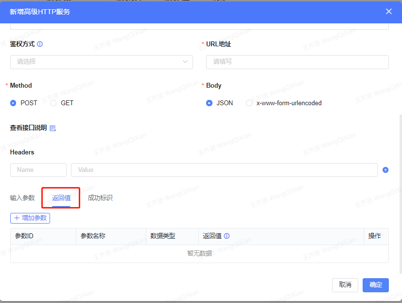
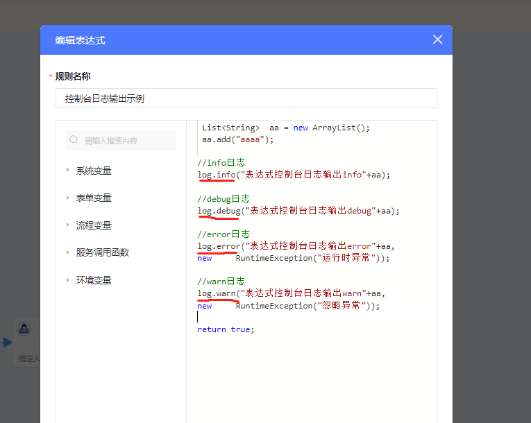
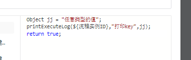
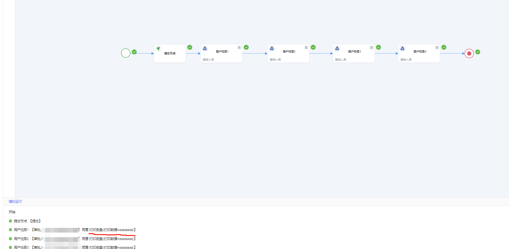

<a id="dPdYH"></a>


### 1.基础函数

<a id="K9DHF"></a>


#### objIsNullOrEmpty 判断参数为空

boolean objIsNullOrEmpty(Object obj)

判断传入的值是否是空对象或空字符串。


```java
if(objIsNullOrEmpty(${姓名})) {
    ……
} else {
    ……
}
```

<a id="fHh6Z"></a>


#### objToList 对象转集合

List<String> objToList(Object obj)

实现字符串到List集合的转换，入参的字符串以“,”分隔


```java
List<String> list = objToList("zhangsan,lisi");
```

<a id="w9iEV"></a>


#### mergeList 合并集合

List mergeList(List list1,List list2)

将两个集合合并成一个新的集合


```java
List  list1 = ……
List  list2 = ……
List  list3 = mergeList(list1,list2);
```

<a id="cJ0nU"></a>


#### leftContainsRight 集合左值是否包含右值

boolean leftContainsRight(List list,Object obj)


```java
List  list1 = ……;
Object obj = ……;
List  list2 = ……;
if(leftContainsRight(list1,obj)) {
    ……
}

if(leftContainsRight(list1,list2)) {
    ……
}
```

<a id="yvOZD"></a>


#### jsonToMap JSON字符串转Map

Map<String,Object> jsonToMap(String json)


```java
String json = "{\"empId\":\"zhangsan\",\"empName\":\"张三\"}"
Map<String, Object> map = jsonToMap(json);
String empId = map.get("empId");
```

<a id="P0RRN"></a>


#### leftEqualsRight 判断左值是否等于右值

boolean leftEqualsRight (Object left,Object right)


```java
if(leftEqualsRight(left, right)){
    ……
}
```

<a id="cv29x"></a>


#### fastCreateMap 快速创建Map

Map<String,Object> fastCreateMap(String key,Object obj)


```java
Map<String,Object>  map = fastCreateMap("key",Object);
```

<a id="MidZw"></a>


#### getFlowVirtual 是否是模拟运行

boolean getFlowVirtual()

在线条表达式中如果调用服务更新外部数据，需要判断，在流程预览、模拟运行等场景不执行服务


```java
if(!getFlowVirtual()){
	//外部服务代码
    ……
}
```

<a id="HJYsb"></a>


### 2.人员&部门函数

<a id="WM6lr"></a>


#### isDeptLevel 判断用户所属部门是否为指定层级

Boolean isDeptLevel(String userId, Integer level)

参数level必须大于等于0，当level小于0时始终返回false

根（即公司名称）的级别为0，一级部门的level为1二级部门为2依次类推

示例：

判断某用户是否属于一级部门


```java
if(isDeptLevel("userId", 1)) {
	……
} else {
	……
}
```

<a id="Inido"></a>


#### isDeptLeader 判断用户是否为指定级别部门的负责人

Boolean isDeptLeader(String userId, Integer level)

level必须大于等于-1，当level小于-1时，始终返回false

根（即公司名称）的级别为0，一级部门的level为1二级部门为2依次类推

当level=-1时表示，判断用户是否是部门负责人

当level >=0时表示，判断用户是否是指定level级别部门的负责人

示例：

判断用户是否是一级部门的负责人


```java
if(isDeptLeader("userId", 1)) {
	……
} else {
	……
}
```


判断用户是否是部门负责人


```java
if(isDeptLeader("userId", -1)) {
	……
} else {
	……
}
```

<a id="J4yV3"></a>


#### findRoleByStr 获取指定角色的人

List<String> findRoleByStr(String roleCode)


```java
List<String> userIds = findRoleByStr("manager");
```


在条件判断中，判断发起人是否属于某个角色，走不同节点


```java
String  starter = ${流程发起人};

//获取角色人员
List<String> roleUserList = findRoleByStr("demo");

return roleUserList != null && roleUserList.contains(starter);
```

<a id="lRLMW"></a>


####

<a id="L4Kzk"></a>


#### findRoleByStr 根据部门获取角色下的人

List<String> findRoleByStr(String roleCode,String deptId,String type)


```java
List<String> userIds = findRoleByStr("manager","${变量}","dept");
```


根据部门ID,获取管理范围为这个部门的角色审批人


```java
第一种用法： 提前声明变量

String  starter = "部门ID";

//获取角色人员(必须按"\""+starter+"\"" 拼接第2个入参，第3个入参为固定值 )
List<String> roleUserList = findRoleByStr("demo","\""+starter+"\"","dept");

return roleUserList != null && roleUserList.contains(starter);


第二种入参：直接使用变量
//(第2个入参为部门变量，第3个入参为固定值 )
List<String> roleUserList = findRoleByStr("demo","${部门ID}","dept");
```

<a id="e6pRP"></a>


#### findDeptLeader 查询部门负责人

List<String> findDeptLeader(String deptId)

只支持单个部门id查询（支持"1,2"格式的多个部门）


```java
List<String> userIds = findDeptLeader("100001");
```

<a id="csIKU"></a>


#### findLeaderByLevel 查询用户指定级别的上级

List<String> findLeaderByLevel(String userId, Integer  searchLevel)

searchLevel超出现有数据层级时，返回空集合

示例：

例：员工A的员工id=17, 员工A的上级领导是员工B,员工B的上级领导是员工C

findLeaderByLevel("17",2) 返回员工C的id


```java
List<String> userIds = findLeaderByLevel("17",2);
```

<a id="Nn8pN"></a>


#### executeRule 返回指定规则的结果

Map<String,Object> executeRule(String ruleGroupCode, String ruleCode, String ruleType,

Map<String,Object> paramMap)

参数说明：

ruleGroupCode：规则组编码

ruleCode：规则编码

ruleType：规则类型，1：决策表，0：规则


```java
Map<String, Object> ruleParam = new HashMap();
//此处使用变量时直接使用${}
//如果是使用常量,直接按java语法赋值，比如 "字符串"、123 等
ruleParam.put("wqxCode",${流程提交人部门编号});
//调用规则时，当ruleType为0时，如下:
Map<String,Object>  map = executeRule("ruleGroupCode","ruleCode",0,ruleParam);
//获取执行结果，当ruleType为0时
Object obj =  map.get("result");

//当ruleType为1时，执行结果中Map的key为用户自定义决策表中输出结果的code,
Object  obj1 =  map.get("code1");
Object  obj2 =  map.get("code2");
```

<a id="EIYtx"></a>


#### findDeptByLevel 查询部门指定级别的上级部门

List<String> findDeptByLevel(String deptId, Integer searchLevel)

searchLevel必须大于等于-1

当searchLevel为-1时，则返回此部门的审批链

例：

假如有组织如下：

业务组A[1111]->集团项目部[111]->总经办[11]->总公司[1]

业务组B[2222]->集团项目部[111]->总经办[11]->总公司[1]


```java
//第一种情况：向上查2级
List<String> list = findDeptByLevel("111",2);
//结果： list = [1]

//第二种情况：查询层级不存在时，返回空集合
List<String> list = findDeptByLevel("111",5);
//结果级：list = []

//第三种情况：查询上级部门审批链
List<String> list = findDeptByLevel("1111",-1);
//结果级： list = ["111","11","1"]
```

<a id="p7JSs"></a>


#### findEmpNameById 查询员工姓名

String findEmpNameById(String userId, String language)

参数说明：

language：语言类型，cn：中文，en：英文，ja：日文


```groovy
String userName = findEmpNamById("1001", "cn");
```

<a id="SBPyE"></a>


#### findDeptNameById 查询部门名称

String findDeptNameById(String deptId,String language)

参数说明：

language：语言类型，cn：中文，en：英文，ja：日文


```java
String deptName = findDeptNameById("01", "cn");
```

<a id="z2Ef3"></a>


#### 当前节点审批人

${当前节点审批人}

仅可用在人工任务节点的审批人重复策略的表达式中使用


```java
List<String> userIds = ${当前节点审批人};
```

<a id="SfbIl"></a>


#### 前序节点审批人

${前序节点审批人}

仅可用在人工任务节点的审批人重复策略的表达式中使用


```java
List<String> userIds = ${前序节点审批人};
```

<a id="anooy"></a>


#### checkUserBelongRole 检查用户是否属于某个角色

boolean checkUserBelongRole(String userId, String roleCode) 

参数说明：

roleCode：角色编码，多个以“,”分隔


```java
//判断用户是否属于“manager”角色
if(checkUserBelongRole(${流程提交人},"manager");) {
	……
}
```

<a id="vMLiR"></a>


#### findDeptLeaderByEmployeeIdAndLevel 根据用户id和部门level层级，获取对应用户所属主部门所在部门链上，指定层级部门的负责人

List<String> findDeptLeaderByEmployeeIdAndLevel(String userId, Integer level)

参数说明：

level：指定的部门层级，level大于等于-1。当level=-1时表示，获取当前用户主部门的负责人。

根（即公司名称）的级别为0，一级部门的level为1二级部门为2依次类推

例：

假设用户a的部门为：部门5，部门路径为：0@部门1@部门2@部门3@部门4@部门5，则level的值不能大于5，如果大于5或者小于-1则返回空集合。


```java
//获取101用户一级部门的负责人
List<String> userIds = findDeptLeaderByEmployeeIdAndLevel("101", 1);

//获取101用户所在部门的负责人
List<String> userIds = findDeptLeaderByEmployeeIdAndLevel("101", -1);
```

<a id="rERns"></a>


#### findEmployeeByNodeId 根据流程节点id，获取流程已办任务处理人

List<String> findEmployeeByNodeId(String nodeId)


```java
List<String> userIds findEmployeeByNodeId("userTask_001");
```

<a id="bcOx9"></a>


#### findMainDeptByEmployeeId 查询人员主部门信息

Map<String, String> findMainDeptByEmployeeId(String userId)


```java
Map<String, String> map = findMainDeptByEmployeeId("101");
//如果不存在，获取结果为空集合
//Map中返回的key为：
//departmentId：部门id
//departmentIdPath：部门id全路径
//departmentName：部门名称
String deptId = map.get("departmentId");
```

<a id="vUbR6"></a>


### 3.服务函数

<a id="zpw0V"></a>


#### operDataToObject 通用函数（同步操作，修改流程表单数据会存在覆盖现象。业务上需要修改表单变量使用 下面的修改记录 函数）

Object operDataToObject(String appId, String svcCode, Map<String, Object> saveDatas)

参数说明：

appId：应用id

svcCode：应用服务的编码，从设计态的业务模型-业务服务的列表中获取新增服务(使用复制功能获取完整编码)

saveDatas：服务需要的参数


```java
Map<String, Object> paramDatas = new HashMap<>();
paramDatas.put("biz_key",${业务单号});
paramDatas.put("process_status","流程结束");
Object resp = operDataToObject(appId,svcCode, paramDatas)
```


resp值是http接口的完整**返回值**对象。





例：如果http服务的返回值为{"code":"000000","timestamp":"2022-02-15 11:32:26","data":{"name":"zhangsan"}},

则resp为 该json串的map对象 ，取出name值的方式：  **resp.get("data").get("name")**

<a id="ABERf"></a>


#### selectDataOne 查单服务（同步操作）

Map<String, Object> selectDataOne(String appId, String svcCode, String dataUUid)

对任意模型进行查单

参数说明：

appId：应用id

svcCode：selectOne类型的服务编码，从设计态的业务模型-业务服务的列表中获取查单服务(使用复制功能获取完整编码)

dataUUid：业务数据的主键值


```java
//查询某个数据模型的单条记录
Map<String, Object> data = selectDataOne("app_lfr621q64o","app_lfr621q64o_xm_model_1_selectOne","15af871557734370862929d78d498aa2");
```

<a id="eDmCc"></a>


#### selectDataMore 查多服务（同步操作）

List<Map<String,Object>> selectDataMore(String appId, String svcCode,String queryJson)

参数说明：

appId：应用id

svcCode：服务编码，从设计态的业务模型-业务服务的列表中获取查多服务(使用复制功能获取完整编码)

queryJson：查询json字符串


```java
//queryType类型：eq,1:gt,2:lt,3:in,4:like,5:range,6:ge,7:le,8:containsone,9:concatlike
String queryJson = "{\"page_index\":1,\"page_size\":10,\"sort_criteria\":{\"update_time\":\"desc\"},\"query_criteria\":[{\"display_bo_list\":null,\"column_name\":\"name\",\"value\":[\"测试测试123\"],\"query_type\":0}],\"filter_sql\":null}";
List<Map<String,Object>>  list = selectDataMore("app_lfr621q64o","app_lfr621q64o_xm_model_1",queryJson);

if(list != null &&  list.size()>0){

 //第一种:取第一个元素的某个字段
 return list.get(0).get("字段A");


//第二种:  遍历集合
  for(int i=0;i<list.size();i++){
      list.get(i).get("字段A");
  }
}
```

<a id="WQJk0"></a>


#### insertDataOne 添加记录 （异步延迟5s执行，避免事务覆盖添加操作）

insertDataOne(String appId, String svcCode, Map<String, Object> saveDatas)

参数说明：

appId：应用id

svcCode：服务编码，从设计态的业务模型-业务服务的列表中获取新增服务(使用复制功能获取完整编码)

saveDatas：增加的参数对象


```java
//在表达式中向某个数据模型插入一条记录
Map<String, Object> saveDatas = fastCreateMap("name","表达式插入值");
insertDataOne("app_lfr621q64o","app_lfr621q64o_xm_model_1_insert",saveDatas);
```

<a id="BDSd3"></a>


#### updateDataOne 修改记录（异步延迟5s执行，避免事务覆盖添加操作）

updateDataOne(String appId, String svcCode, Map<String, Object> saveDatas)

参数说明：

appId：应用id

svcCode：服务编码，从设计态的业务模型-业务服务的列表中获取新增服务(使用复制功能获取完整编码)

saveDatas：修改的参数


```java
Map<String, Object>   update = fastCreateMap("name","表达式修改值");
update.put("uid","9a870626806c4760b957e47702d34229");
updateDataOne("app_lfr621q64o","app_lfr621q64o_xm_model_1_update",update);
```

<a id="RaIjv"></a>


#### fastUpdateOwn 修改单个表单变量（异步延迟5s执行，避免事务覆盖添加操作）

boolean fastUpdateOwn(String key,String nwValue)

参数说明：

key：修改的字段的编码

newValue：新值


```java
fastUpdateOwn("userName","张**");
```

<a id="mPhBT"></a>


#### deleteDataOne 删除一条记录（异步延迟5s执行，避免事务覆盖添加操作）

void deleteDataOne(String appId, String svcCode,String uuid)

参数说明：

appId：应用id

svcCode：服务编码，从设计态的业务模型-业务服务的列表中获取删除服务(使用复制功能获取完整编码)

uuid：主键值


```java
deleteDataOne("app_lfr621q64o","app_lfr621q64o_XM_MODEL_1_delete","101001");
```

<a id="pw1r7"></a>


### 4.其他

<a id="S8bJN"></a>


#### 时间戳（毫秒）转格式字符串时间

dateUtil.parseGMTTime(Long timeLong, String format)

参数说明：

timeLong：时间戳（毫秒）

format：格式，仅支持 yyyyMMdd 、yyyy-MM-dd HH:mm、yyyy-MM-dd HH:mm:ss、yyyy-MM-dd、yyyy、yyyyMM等格式


```java
dateUtil.parseGMTTime(${日期},"yyyy-MM-dd")
```

<a id="jCmWx"></a>


#### 判断是否是流程预览

用于解决流程图中有闭环链路，导致流程预览在计算时会产生死循环。

boolean getFlowVirtual();


```json
//在闭环链路的线条上增加如下判断
if(getFlowVirtual()) {
  throw new Exception("跳出流程预览死循环.");
}
```

<a id="V5WXV"></a>


#### 打印输出日志

1.在控制台输出日志(release-4.0.1 版本后支持)

在表达式中使用以下方式进行输出


```plain
List<String>  aa = new ArrayList();
 aa.add("aaaa");


//info日志
log.info("表达式控制台日志输出info"+aa);

//debug日志
log.debug("表达式控制台日志输出debug"+aa);


//error日志
log.error("表达式控制台日志输出error"+aa, new     RuntimeException("运行时异常"));


//warn日志
log.warn("表达式控制台日志输出warn"+aa, new       RuntimeException("忽略异常"));


return true;
```





​

在日志搜索工具

​

​

​

​

​

​

​

​

​

​

​

​

在当前表达式全部执行完成后，才会打印到流程预览控制台


```java
printExecuteLog(${流程实例ID},"key",value)
```


​

示例：

在线条表达式、服务表达式里配置





效果：





​

​

​

​

​

​

​

​

​

​

​

​

​

​

​
