用户可在表单中使用自定义的控件，使表单更加灵活方便，满足用户的特色需求。

<a id="ekP35"></a>


# 1.开发流程


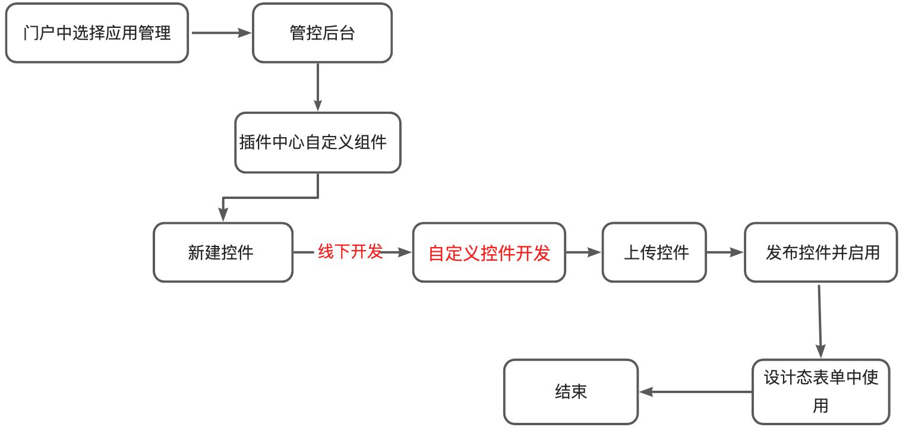

<a id="b7DdI"></a>


## 1.1门户中选择应用管理

<a id="RvyYl"></a>


## 1.2管控后台


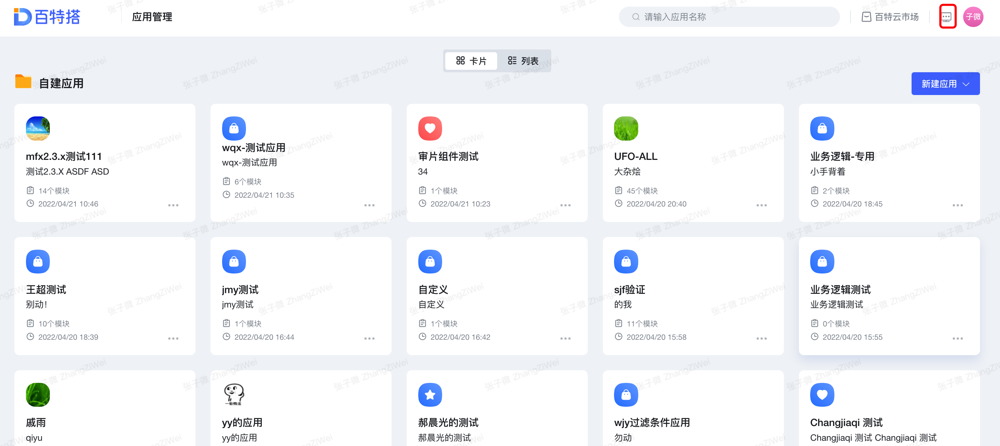


<a id="rN4ra"></a>


## 1.3插件中心自定义组件

<a id="CzWOx"></a>


##

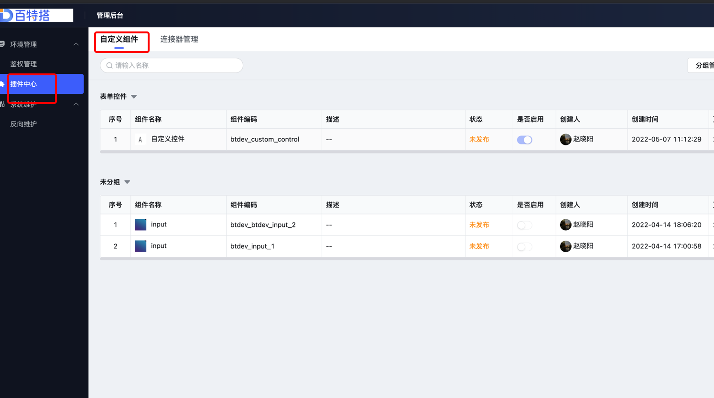


分组管理： 可自定义分组，此分组是在组件列表中及组件面板中展示的分组


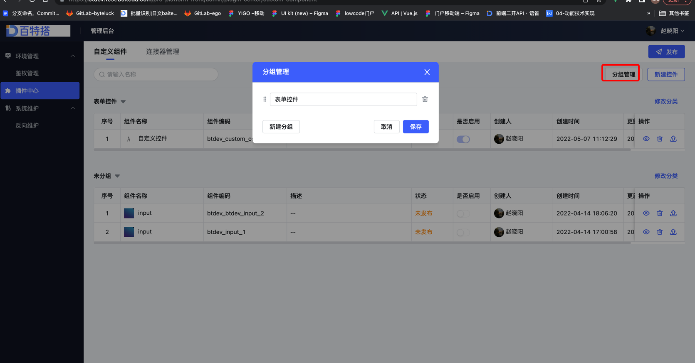


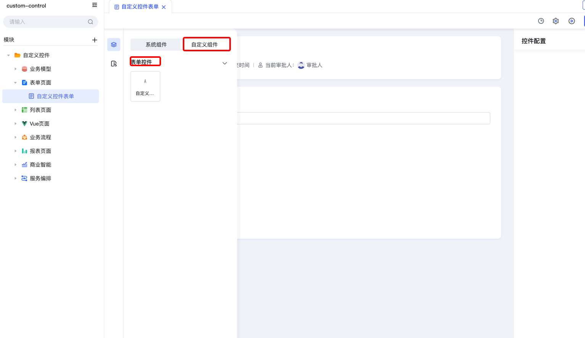

​

<a id="nPjCN"></a>


## 1.4新建组件


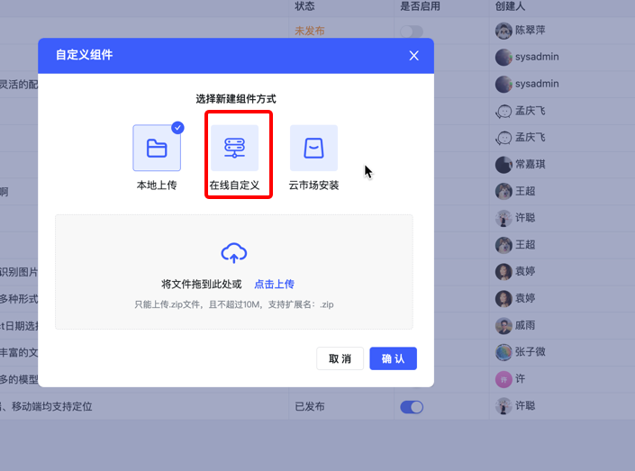


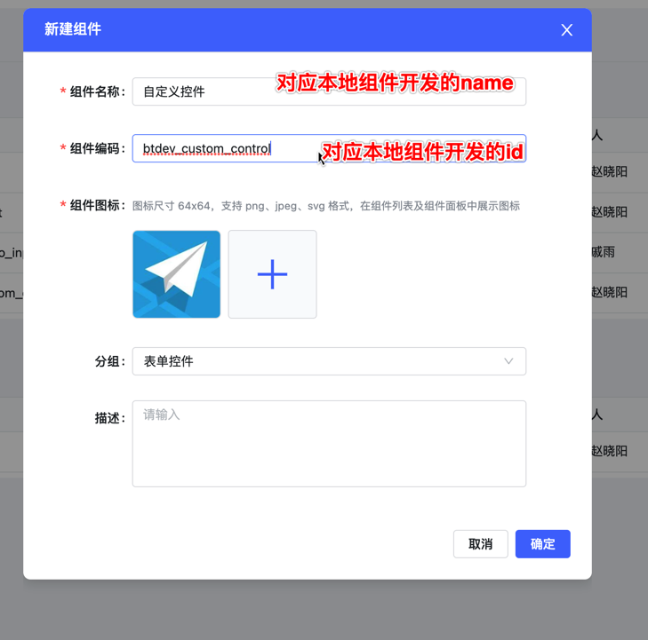


注：本地开发自定义组件时id必须和组建编码保持一致（要带有自动生成的8位数随机编码）


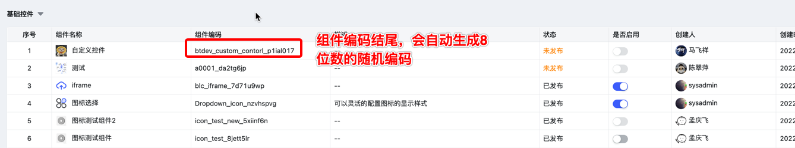


<a id="DQBr0"></a>


## 1.5自定义组件开发

<a id="K2m64"></a>


### 1.5.1下载[脚手架](https://www.npmjs.com/package/byteluck-cli)

自定义组件是基于Vue3 + Vite 的脚手架


```bash
 npm init byteluck-control@stable  // 下载脚手架并自定义组件
  // 输入控件的id

  // 输入控件的name
  // 确认控件的类型

  cd 进入控件文件

  npm install // 安装依赖包

  npm run dev // 本地项目调试

  npm run build  // 打包zip包
```

<a id="mD1kz"></a>


####

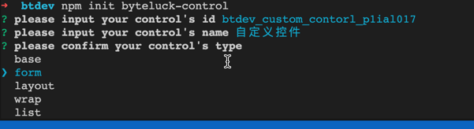


<a id="jZSYm"></a>


#### id（对应新建组件时的组件编码）

<a id="ouRhy"></a>


#### name（对应新建组件时的组件名称）

<a id="mItxV"></a>


#### type （组件类型）

base（不需要绑定数据项(模型字段)的控件）: 基础控件

form（需要绑定数据项(模型字段)的控件）: 表单控件

fieldType:

varchar： 短文本（单行文本、单选、下拉单选）

text： 长文本 （多行文本、富文本）

array： 数组 （多选、下拉多选）

decimal： 数值 （数字输入框）

json：外部数据源 （vue容器）

file： 附件 （附件）

image：图片（图片）

people：人员 （人员控件）

department： 部门 （部门）

timestamp：日期（时间戳）（日期、日期区间）

layout ：布局控件

wrap ：控件容器

​

npm run dev 本地调试时，需要将目录 package.json 中的域名换成租户域名，如下：


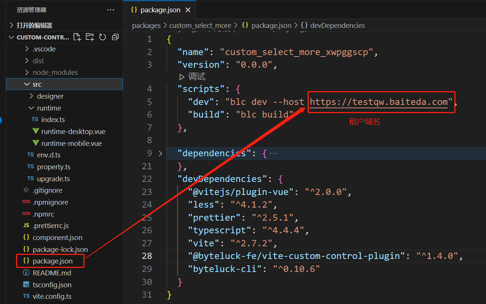


<a id="XGq92"></a>


### 1.5.2本地控件开发

<a id="SgIUB"></a>


#### 控件目录结构（[详见 具体说明](https://baiteda.yuque.com/staff-shgita/nbg92z/vyfwgr)）


```markdown
btdev_custom_control
├── .vscode
│   └── extensions.json
├── dist
│   └── component.json
├── src
│   ├── designer   // 设计态的自定义组件
│   │   ├── settings //自定义原子控件
│   │   ├── designer.vue  //组件
│   │   └── index.ts
│   ├── runtime  // 运行态的自定义组件
│   │   ├── index.ts
│   │   ├── runtime-desktop.vue // pc端
│   │   └── runtime-mobile.vue // 移动端
│   ├── env.d.ts
│   ├── property.ts // 控件的基本属性
│   └── upgrade.ts
├── .npmignore
├── .npmrc
├── .prettierrc.js
├── README.md
├── component.json // 定义了控件的id，name，type等 id和name必须与自定义控件管控台一致
├── package.json
├── pnpm-lock.yaml
├── tsconfig.json
└── vite.config.ts
```

<a id="RjwRm"></a>


## 1.6上传控件


```bash
//打包本地代码

npm run build
```


打包出的zip包上传至管理后台中对应的自定义控件


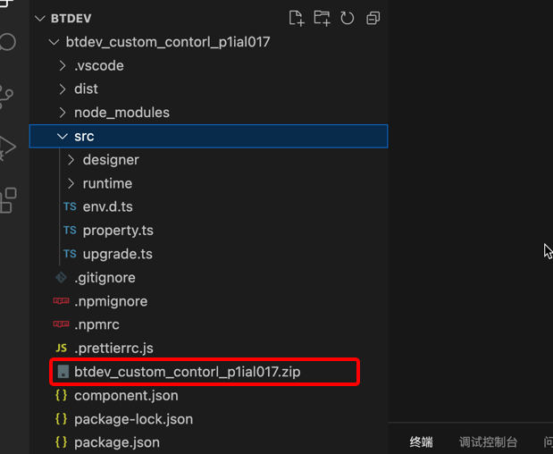


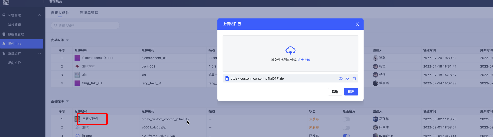


<a id="dfghM"></a>


## 1.7发布控件并启用


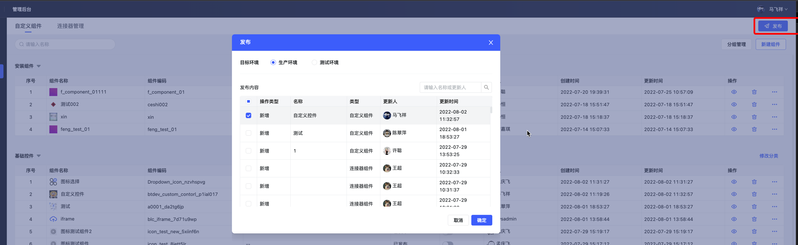


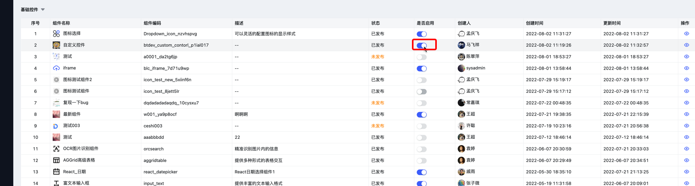


<a id="iR6Ls"></a>


## 1.8设计态表单中使用

<a id="TqH5Q"></a>


### 1.8.1新建应用


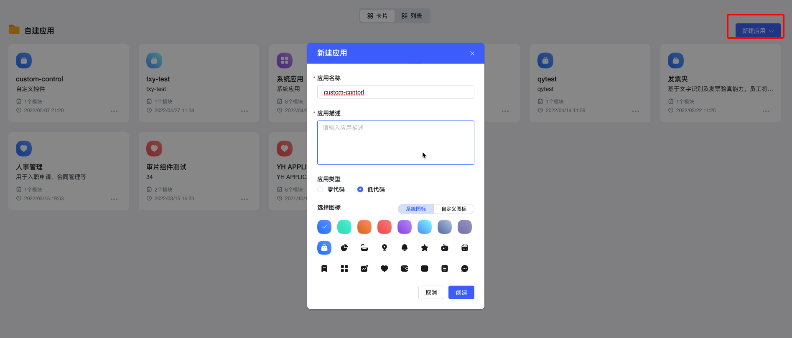


<a id="unXEm"></a>


### 1.8.2新建模块


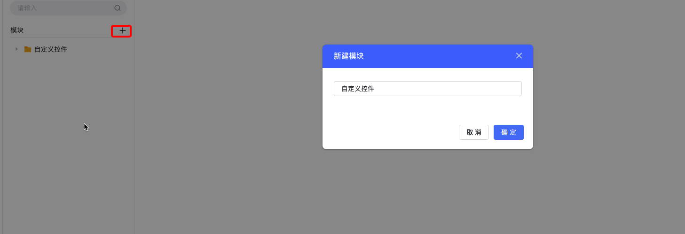


<a id="U4anE"></a>


### 1.8.3新建表单


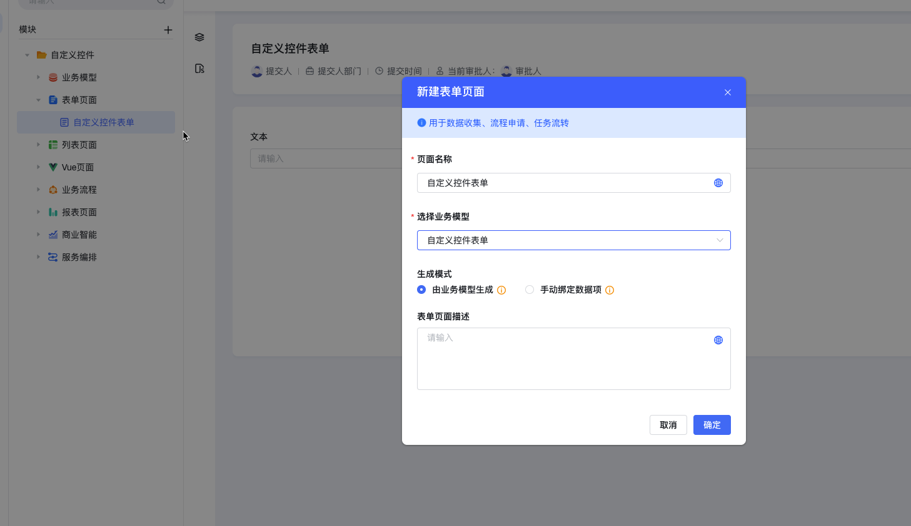


<a id="T2FWi"></a>


### 1.8.4自定义控件


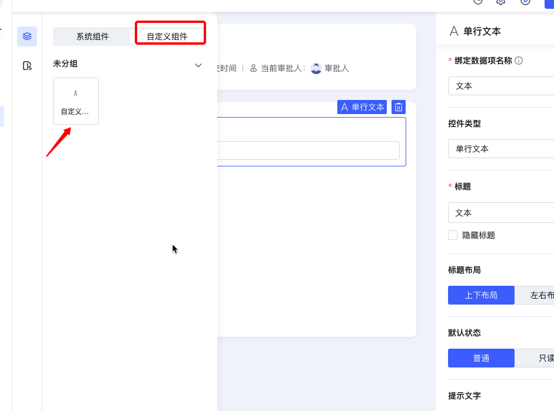
