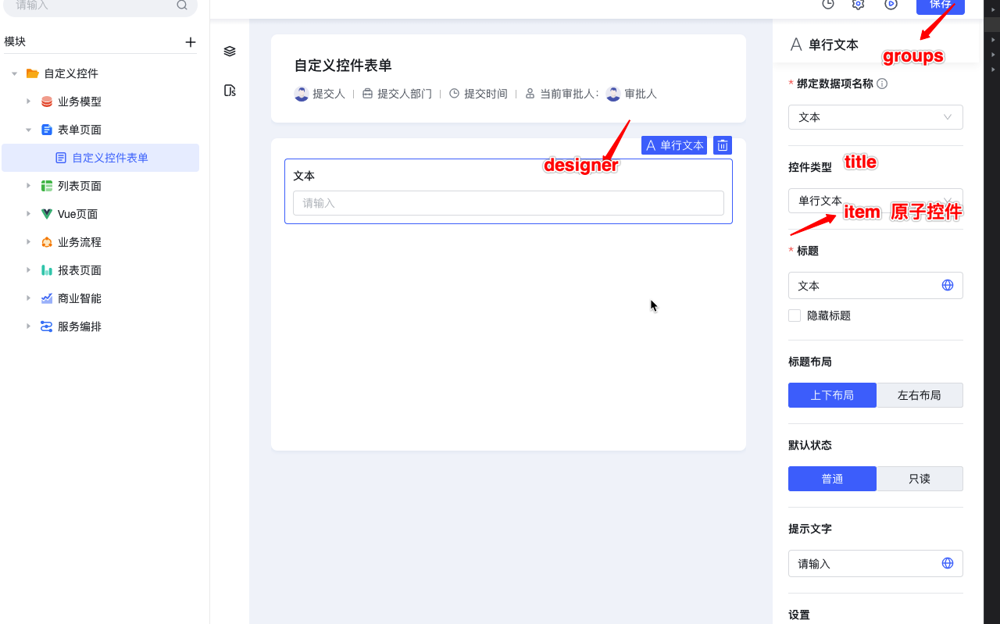
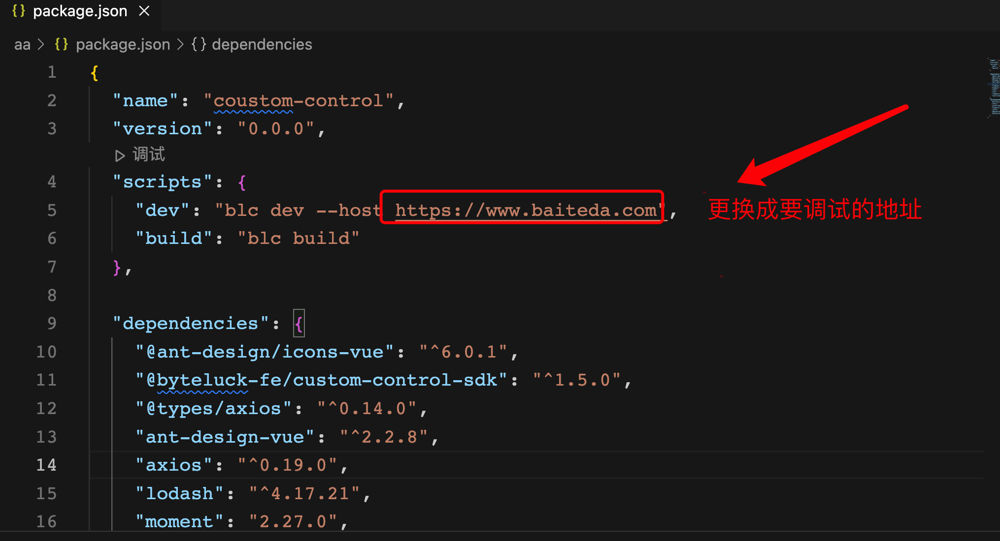

<a id="s8t5k"></a>


##



1. property

是自定义控件的核心文件，它描述了控件的属性与设置项，以及设计态，运行态的校验，联动逻辑，

通过export default defineInstance() 函数来定义一个控件，参数介绍如下

警告：

该文件最终会被平台编译处理成内部文件，所以开发者要遵守文件内容结构，避免引起不必要的错误

<a id="Chnu0"></a>


### 1.1 property示例


```typescript
import {
  defineInstance,
  createFormBaseFields,
} from '@byteluck-fe/custom-control-sdk/main'

export default defineInstance({
  // 定义组件的属性
  fields: [
    ...createFormBaseFields({
      placeholder: '请选择',
    }),
    {
      key: 'maxLength',
      type: 'number',
      component: 'input-number', //  内置的原子setting
      defaultValue: 200,
      props: {
        min: 0,
      },
      effect: {
        dataBind(driven: any, payload: any) {
          if (payload.fieldItem) {
            return {
              max: payload.fieldItem.length,
            }
          }
          return {
            max: 200,
          }
        },
        minLength(driven: any, payload: any) {
          return {
            min: payload.control.props.minLength,
          }
        },
      },
    },
    {
      key: 'minLength',
      type: 'number',
      component: 'input-number',
      defaultValue: 0,
      props: {
        min: 0,
      },
      effect: {
        maxLength(driven: any, payload: any) {
          return {
            max: payload.control.props.maxLength,
          }
        },
      },
    },
    {
      key: 'defaultValue',
      type: 'string',
      component: 'input',
      defaultValue: '',
      validator(props: any, value: string) {
        if (props.minLength <= value.length >= props.maxLength) {
          return true
        }
        return '默认值必须在限制范围内'
      },
    },
    {
      key: 'customCaption',
      component: 'CustomContent', // 自定义的原子setting
    },
    //针对关联数据源选项设置配置的属性
    {
      key: 'optionConfig',
      type: 'string',
      defaultValue: 'datasource',
    },
    {
      key: 'options',
      type: 'array',
      defaultValue: [],
    },
    {
      key: 'multistageFilling',
      type: 'array',
      defaultValue: [],
    },
    {
      key: 'datasourceBind',
      type: 'DataSourceBind',
      defaultValue: {
        appId: '',
        dataCode: '',
        svcCode: '',
        filters: [],
        orders: [],
        displayBoList: [],
        valueFieldcode: '',
        showOrder: true,
      },
      props:{
        isHideCustom:true, //是否隐藏自定义
        isHidemultistageFilling:true, //是否隐藏填充
        isHideFilter:true,//是否隐藏过滤
        isHideOrder:true, // 是否隐藏排序
        displayPlaceholder:'请选择标题显示值' //显示值占位符
      }
      component: 'options-setting',
    },
  ],
  groups: [
    {
      title: '绑定数据项名称',
      required: true,
      items: ['dataBind'],
    },
    {
      title: '标题',
      required: true,
      // 使用内置的caption设置
      // items: ['caption', 'isHideCaption'],
      // 使用自定义的caption设置
      items: ['customCaption', 'isHideCaption'],
    },
    {
      title: '标题布局',
      items: ['labelPosition'],
    },
    {
      title: '默认状态',
      items: ['defaultState'],
    },
    {
      title: '提示文字',
      items: ['placeholder'],
    },
    {
      title: '设置',
      items: ['required', 'isHide'],
    },
    {
      title: '最大长度',
      items: ['maxLength'],
    },
    {
      title: '最小长度',
      items: ['minLength'],
    },
    {
      title: '默认值',
      items: ['defaultValue'],
    },
    //关联数据源 选项设置
    {
      title: '选项设置',
      items: ['datasourceBind'],
    },
    {
      title: '高级设置',
      items: ['superSetting'], // 内置settings fields
    },
  ],
  runtimeValidator(props: any, value: unknown, i18n: string) {
    const i18nObj = {
      'zh-CN': '必填',
      'en-US': 'required',
      'ja-JP': '必須',
    }
    if (props.required && !value) {
      return i18nObj[i18n as keyof typeof i18nObj] ?? i18nObj['zh-CN']
    }
  },
  events: ['change'],
  slots: ['default'],
})
```

<a id="rjJ1x"></a>


### 1.2fileds：自定义控件的属性


```typescript
type SupportedDataTypes =
  | 'string'
  | 'boolean'
  | 'number'
  | 'object'
  | 'array'
  | 'DataBind'
  | 'DataSourceBind'


/**
* 数据类型，
* 会根据对应的数据类型生成一个property
* */
type?: SupportedDataTypes;
/**
* 部分component的标题，例如：switch
* */
label?: string;
/**
* 唯一标识符
* 有type字段的时候，key代表生成的property的键
* 有component字段的时候，用于在groups中对应当前component
* 以上两种情况允许同时存在
* */
key: string;
/**
* 控件类型
* */
component?: string;
/**
* property副作用函数
* 执行时机：在选中控件的那一刻以对象的key的顺序触发一次，并在之后property发生改变的时候触发对应的函数
*
* effect对象的key为其它property的key，这个key必须对应一个property，不然永远不会触发，
* 如果这个property是内置对象类型，如DataBind，那也可以是dataBind.fieldCode这样的key
* effect对象的值是一个副作用函数
* */
effect?: Record<string, EffectFn<Props>>;
/**
* 数据作用域副作用函数(例如主表拖入到明细字表、分组控件、栅格控件)
* 执行时机：在选中控件的那一刻触发一次，并在之后控件的数据作用域发生变化的时候执行
* */
scopeEffect?: EffectFn<Props>;
/**
* 仅当配置项有type字段，生成一个property的时候生效，代表property的默认值
* */
defaultValue?: unknown;
/**
* 仅当配置项有type字段，校验对应property的值
* */
 validator?: Validator;
 /**
* 原子控件自身的属性
* */
 props: object


```

<a id="kjiVE"></a>


### 1.3 groups： 自定义控件的设置面板


```typescript
/**
  属性名称
 **/
title?: string;
/**
  设置当前属性是否必填
 **/
required?: boolean;
/**
  设置当前属性要引入的原子属性
 **/
items: string[];
/**
  设置的简介，提示语
 **/
tips?: string;
```

<a id="hCURV"></a>


### 1.4 events： 自定义控件的事件


```typescript
'change' | 'blur' | 'focus' | 'click'
```

<a id="gS1WV"></a>


### 1.5 slots 可插入位置（5.0.0版本）

表示组件可以拖入 平台内置的位置，该属性的可用值为：

- 主画板：无、undefined、'default'
- 表单操作栏：'action-bar-slot'
- 列表工具栏：'grid-table-toolbar-slot'


```typescript
slots: ['default'] | undefined
```

<a id="aL67O"></a>


### 1.6 内置原子属性（fields中使用内置的component）（[属性说明](https://antdv.com/components/input-number-cn)）

<a id="QOJYU"></a>


#### 1.5.1 内置原子公有属性


```typescript
/**
  * 显示隐藏
 * */
visible: boolean;
/**
  * 开启表达式
* */
expression: boolean;
```

<a id="PGDpF"></a>


#### 1.5.2input


```typescript
maxLength: number;
minLength: number;
placeholder: string;
i18n: boolean; // 是否开启国际化
```

<a id="nitqP"></a>


#### 1.5.3input-number


```typescript
max: number;
min: number;
placeholder: string;
```

<a id="ozI5R"></a>


#### 1.5.4textarea


```typescript
maxLength: number;
minLength: number;
placeholder: string;
i18n: boolean;
maxRows: number;
minRows:number;
```

<a id="uHd26"></a>


#### 1.5.5switch


```typescript
showType: 'switch' | 'checkbox';
tips: string; 默认 ''
disabled: boolean; 默认false
```

<a id="diGmu"></a>


#### 1.5.6select


```typescript
 placeholder: string;
 options: [];
```

<a id="U9EUT"></a>


#### 1.5.7radio


```typescript
options: [];
showType: 'solid' | 'outline';
```

<a id="e0soI"></a>


### 1.7 基础控件设置面板内置控件（base settings）

isHide： 隐藏

superSetting：高级设置

<a id="ROg6s"></a>


### 1.8 表单控件设置面板内置控件（form settings）

isHide： 隐藏

superSetting：高级设置

dataBind: 绑定数据项名称

caption：标题

isHideCaption：隐藏标题

labelPosition：标题布局

defaultState：默认状态

required：设置

placeholder: 提示文字

<a id="bDrZx"></a>


## 2.designer

<a id="Gyl3U"></a>


### 2.1settings : 自定义原子控件


```vue
/*
  原子控件例子
*/
<template>
  <a-input
    :value="control.props.caption"
    @change="onChange"
    placeholder="请输入控件标题"
  ></a-input>
</template>

<script setup lang="ts" name="custom-content">
import { Ref, inject } from 'vue'

const props = defineProps<{
  control: any
}>()
const driven = inject<Ref<any>>('driven')

const onChange = (event: InputEvent) => {
  driven.value.setInstance(
    props.control,
    'caption',
    (event.target as HTMLInputElement).value
  )
}
</script>
```

<a id="Pnl1P"></a>


### 2.2designer : 设计态的自定义控件


```vue
/*
  设计态例子
*/
<template>
  <dok-form-item :control="control">
    <a-select
      :placeholder="control.props.placeholder"
      :disabled="control.props.defaultState === 'readonly'"
      :value="control.props.defaultValue"
    />
  </dok-form-item>
</template>

<script setup lang="ts" name="designer">
import Property from '../property'

const props = defineProps<{
  control: typeof Property.Designer // 控件基本信息 如id，name，属性等
}>()
</script>
```

<a id="ER8AE"></a>


## 3.runtime：运行态的自定义控件

<a id="CKfl5"></a>


### 3.1pc端


```vue
<template>
  <div class="runtime-button">
    <Button :property="instanceProps" :in-subtable="instance.parent.type === 'subtable-column'" @click="clickHandle"></Button>
  </div>
</template>

<script setup lang="ts">
import Property from '../property'
import Button from '../common/button.vue'
import { defineComponent, inject, Ref } from 'vue'
import { useInstanceProps } from "@byteluck-fe/custom-control-sdk/runtime";


const props = defineProps<{
  instance: typeof Property.Runtime,
  rowIndex: number
}>()
const component = defineComponent({
  Button,
})
const context = inject<Ref<any>>('context')
async function clickHandle(event: Event) {
		// 如果二开阻止了点击事件，则不允许继续触发
		const result = await context?.value.emit('click', {
			instance: props.instance,
			value: '',
			rowIndex: props.rowIndex,
		})
		if (result && result.includes(false)) {
			return
		}
	}

const instanceProps = useInstanceProps(props.instance) // 响应式props

</script>
<style lang="less" scoped>
.runtime-button {
  width: 100%;
  height: 100%;
}
</style>
```

<a id="XDc4H"></a>


### 3.2移动端


```vue
<template>
  <rok-form-item ref="formItemRef" :control="instance" :name="name">
    <van-field
      v-if="isMobileEditable"
      :placeholder="placeholder"
      :modelValue="value"
      @update:model-value="onChange"
      :name="name"
      @blur="onBlur"
      @focus="onFocus"
    ></van-field>
    <div v-else>{{ value }}</div>
  </rok-form-item>
</template>

<script setup lang="ts">
import { computed } from 'vue'
import Property from '../property'
import {
  useBaseForm,
  useFormEvents,
} from '@byteluck-fe/custom-control-sdk/runtime'

const props = defineProps<{
  instance: typeof Property.Runtime
  rowIndex?: number
  name: string | string[]
  value: string[]
}>()
const { placeholder, formItemRef, updateValue, isMobileEditable, context } =
  useBaseForm(
    props.instance,
    props.rowIndex,
    computed(() => props.value)
  )

const { onFocus, onBlur, onInput } = useFormEvents(props)

const onChange = (value: string) => {
  onInput(value)
  updateValue(value)
}
</script>

<style scoped></style>
```

<a id="FCUbz"></a>


### 3.3使用Utils API


```typescript
const context = inject<Ref<any>>('context')

const params = unref(context)?.getAction().actionUtils.getProcessParam()

const status = unref(context)?.getAction().actionUtils.getPageStatus()
```

<a id="hFxDx"></a>


## 4.component


```json

id: 自定义控件id

name:  自定义控件名称

type: 控件类型

fieldType: 表单控件对应字段类型

version:  控件版本

config: 属性默认值
```

<a id="OamUN"></a>


## 5.setInstance 改变组件属性👇


```typescript
/**
* instance参数可以是一个控件实例，运行态可以是控件的唯一标识符
* props参数代表需要修改的属性标识key
* value参数代表需要修改的值
* rowIndex参数是代表修改控件是明细子表中的某一行的控件，rowIndex只在instance参数是字符串的时候生效
*/
setInstance(
  instance: Instance | string,
  props: string,
  value: unknown,
  rowIndex?: number
)
```

<a id="dEPPu"></a>


## 6.instanceProps 使用响应式的props👇


```typescript
/**
* instance控件实例
*/

useInstanceProps( instance: Instance )
```

<a id="OEUxE"></a>


## 7.createBaseFields 组件的内置fields 👇


```typescript
/**
  接收自定义属性的默认值
*/
createBaseFields()


内置自定义控件属性
/**
* isHide： 隐藏
* superSetting：高级设置
* style.width 布局控件中特有  设置控件的宽度
* style.heighth 布局控件中特有  设置控件的高度
*/
return [
    {
      label: '隐藏',
      key: 'isHide',
      type: 'boolean',
      component: 'switch',
    },
    {
      key: 'superSetting',
      component: 'super-setting',
    },
    {
      key: 'style.width',
      component: 'styleComponent',
      props: {
        configKey: 'style.widthConfig',
        options: ['px', '%', 'fill', 'hug'],
      },
      scopeEffect(driven: any, payload: any) {
        const { oldParent, newParent, instance } = payload
        if (
          oldParent?.type === 'advanced-container' &&
          newParent.type === 'positioning-container'
        ) {
          driven.setInstance(instance, 'style.width', '')
          driven.setInstance(instance, 'style.widthConfig', 'fill')
        }
        if (newParent) {
          return {
            visible: newParent.type === 'advanced-container',
          }
        }
      },
    },
    {
      key: 'style.height',
      component: 'styleComponent',
      props: {
        configKey: 'style.heightConfig',
        options: ['px', '%', 'fill', 'hug'],
      },
      scopeEffect(driven: any, payload: any) {
        const { oldParent, newParent, instance } = payload
        if (
          oldParent?.type === 'advanced-container' &&
          newParent.type === 'positioning-container'
        ) {
          driven.setInstance(instance, 'style.height', '')
          driven.setInstance(instance, 'style.heightConfig', 'fill')
        }
        if (payload.newParent) {
          return {
            visible: payload.newParent.type === 'advanced-container',
          }
        }
      },
    },
  ]
```

<a id="ZLrOu"></a>


## 8.createFormBaseFields 组件为表单控件（form）时内置fields 👇

注：createFormBaseFields 中包含 createBaseFields中的所有属性


```typescript
/**
  接收自定义属性的默认值
*/
createFormBaseFields({
    placeholder: '请选择',
})


内置自定义控件属性
/**
* dataBind: 绑定数据项名称
* caption：标题
* isHideCaption：隐藏标题
* labelPosition：标题布局
* defaultState：默认状态
* required：设置
* placeholder: 提示文字
*/
return [
  ...createBaseFields(),
    {
      type: 'DataBind',
      key: 'dataBind',
      component: 'data-bind',
      defaultValue: defaultValues?.dataBind,
    },
    {
      key: 'caption',
      type: 'string',
      component: 'input',
      props: {
        maxLength: 80,
        i18n: true,
      },
      defaultValue: defaultValues?.caption,
      validator(value: string) {
        if (!value) {
          return '标题必填'
        }
      },
    },
    {
      label: '隐藏标题',
      key: 'isHideCaption',
      type: 'boolean',
      component: 'switch',
      defaultValue: defaultValues?.isHideCaption,
      props: {
        showType: 'checkbox',
      },
      // 在明细表内隐藏
      scopeEffect(driven: any, payload: any) {
        if (payload.current?.type !== payload.from.type) {
          driven.setInstance(
            payload.control,
            'isHideCaption',
            payload.current.type === 'subtable'
          )
          return {
            visible: payload.current.type !== 'subtable',
          }
        }
      },
    },
    {
      key: 'labelPosition',
      type: 'string',
      component: 'radio',
      defaultValue: defaultValues?.labelPosition,
      props: {
        showType: 'solid',
        options: [
          { label: '上下布局', value: 'top' },
          { label: '左右布局', value: 'left' },
        ],
      },
    },
    {
      key: 'defaultState',
      type: 'string',
      component: 'radio',
      defaultValue: defaultValues?.defaultState,
      props: {
        showType: 'solid',
        options: [
          { label: '普通', value: 'default' },
          { label: '只读', value: 'readonly' },
        ],
      },
    },
    {
      label: '必填',
      key: 'required',
      type: 'boolean',
      component: 'switch',
      defaultValue: defaultValues?.required,
    },
    {
      label: '提示文字',
      key: 'placeholder',
      type: 'string',
      component: 'input',
      defaultValue: defaultValues?.placeholder,
      props: {
        maxLength: 80,
        i18n: true,
      },
    },
  ]
```

<a id="ZRIhw"></a>


## 9.getHttp Http请求👇

具体api可以参考 <http://www.axios-js.com/zh-cn/docs/#axios-request-config>


```javascript
import {
  getHttp
} from '@byteluck-fe/custom-control-sdk/main'

> utils.getHttp().post(url: string, data?: any)
> utils.getHttp().get(url: string, param?: any)
> utils.getHttp().request({
    method: Method

    url: string
    params: any
    payload: any
    headers?: any
})

// 例如
const http = getHttp('/ego_app/api/v1/private')
http.post('/design/common/fieldTypeList')
```

<a id="ScBA7"></a>


## 10.更改自定义组件调试地址👇



