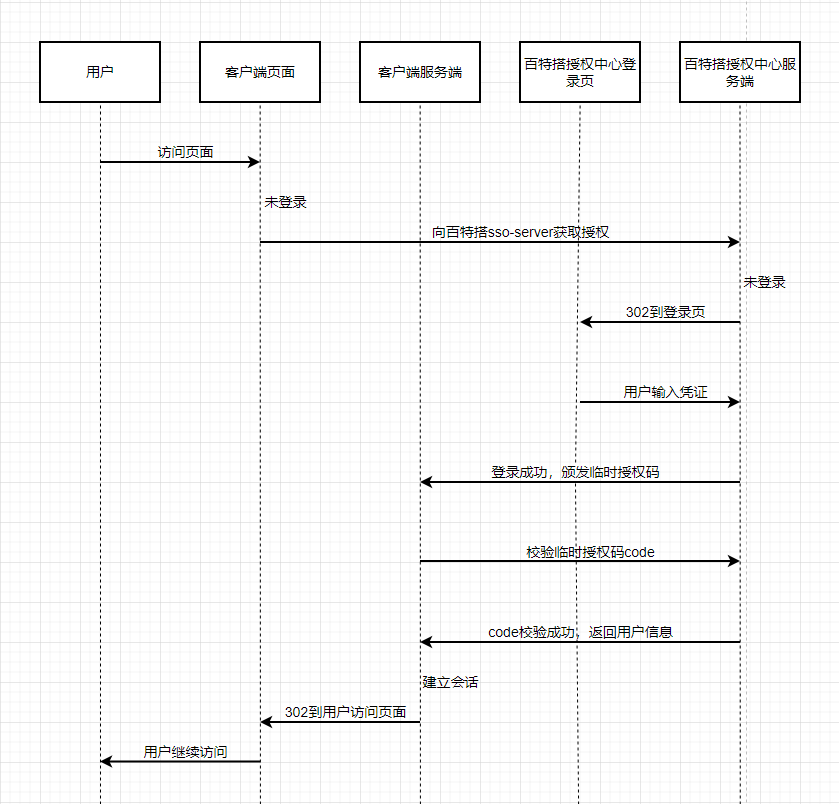

<a id="Hv7F4"></a>


### 1.简介

为实现百特搭低代码平台和业务系统的互通互联，百特搭用户中心提供授权认证功能以及其它必要的相关接口，为其它业务系统的接入提供单点登录 服务。

​

<a id="XnAqv"></a>


### 2.认证流程

认证基于授权码模式，具体认证流程如下图所示：





（A）用户访问客户端（即业务系统），后者将前者导向认证服务器；

（B）认证服务器判断未登录，向用户展示登录界面；

（C）假设用户给予授权（即输入账号密码登录），认证服务器将用户导向客户端事先指定的"重定向 URI"（redirection\_uri），同时附上一个 授权码;

（D）客户端收到授权码，向认证服务器校验code的合法性；

（E）校验成功，认证服务器返回用户信息，客户端建立会话。

​

<a id="ysEHO"></a>


### 3.接入接口说明

<a id="coR5A"></a>


#### 3.1准备工作

百特搭事先为业务系统分配 client\_id 和 client\_secret，如果是私有化租户，可自行前往base库的wfc\_api\_app表查询account\_system='app'的数据。

<a id="ExmUZ"></a>


#### 3.2认证中心授权接口

接口地址：https://{your-domain}/ego\_base\_info/v1/private/sso/service/authorize

请求方式：GET

Content-Type：x-www-form-urlencoded

query参数：

|  |  |  |  |
| --- | --- | --- | --- |
| 参数 | 描述 | 类型 | 是否必填 |
| redirect\_uri | 授权码的回调地址，需要url-encode编码 | String | 是 |
| state | 客户端传什么在回调的时候会回传过去 | String | 否 |

<a id="KZKhj"></a>


#### 3.3校验code

接口地址：https://{your-domain}/ego\_base\_info/v1/open/sso/service/checkCode

请求方式：POST

Content-Type：application/json

body参数：

|  |  |  |  |
| --- | --- | --- | --- |
| 参数 | 描述 | 类型 | 是否必填 |
| tenant\_id | 租户id | String | 是 |
| timestamp | 时间戳 | String | 是 |
| app\_id | 客户端id | String | 是 |
| sign | 签名，参考[签名相关](https://baiteda.yuque.com/docs/share/8c88a071-4d2a-4c74-971b-ee9a87d11759?#)​ | String | 是 |
| biz\_params | "{\"tenant\_id\":\"test\", \"code\":\"assag\"}" | String | 是 |

请求参数示例：


```json
{
    "app_id":"app_a8n3ajrg8l",
    "biz_params":"{\"tenant_id\":\"test\", \"code\":\"assag\"}",
    "sign":"47db0adbd9de204bee81cc02da37d85a",
    "tenant_id":"test",
    "timestamp":"20200924095813"
}
```


响应参数示例：**​**


```json
{
    "id": 8642,
    "tenant_id": "yojy",
    "employee_id": "zhenyu.deng",
    "employee_name": "邓振宇",
    "employee_en_name": null,
    "email": "xxx@eeoa.com",
    "join_date": "2020-04-23 00:00:00",
    "avatar_url": null,
    "create_time": "2020-04-23 00:00:00",
    "update_time": "2022-02-22 14:36:41",
    "dimission_date": null,
    "sequence": "区域销售经理",
    "employee_type": 1,
    "status_type": "1",
    "main_dept": null,
    "phone": "18988936xxx",
    "user_id": null,
    "department_id": "122415",
    "department_name": "业务部",
    "department_en_name": null,
    "open_id": null,
    "parent_department_id": "116417",
    "dept_id_path": null,
    "leader_eid": "xuesong.yang",
    "gender": 1,
    "address": null,
    "msg_relation_type": "NONE",
    "leader_name": null,
    "leader_en_name": null,
    "manage_dept_ids": null,
    "manage_dept_name": null,
    "manage_dept_en_name": null,
    "belong_dept_ids": "116522,122415",
    "belong_dept_name": null,
    "belong_dept_en_name": null,
    "employee_card": "EEO00723",
    "telephone": null,
    "sort": null,
    "external_user": false,
    "tauth": null
}
```


​
