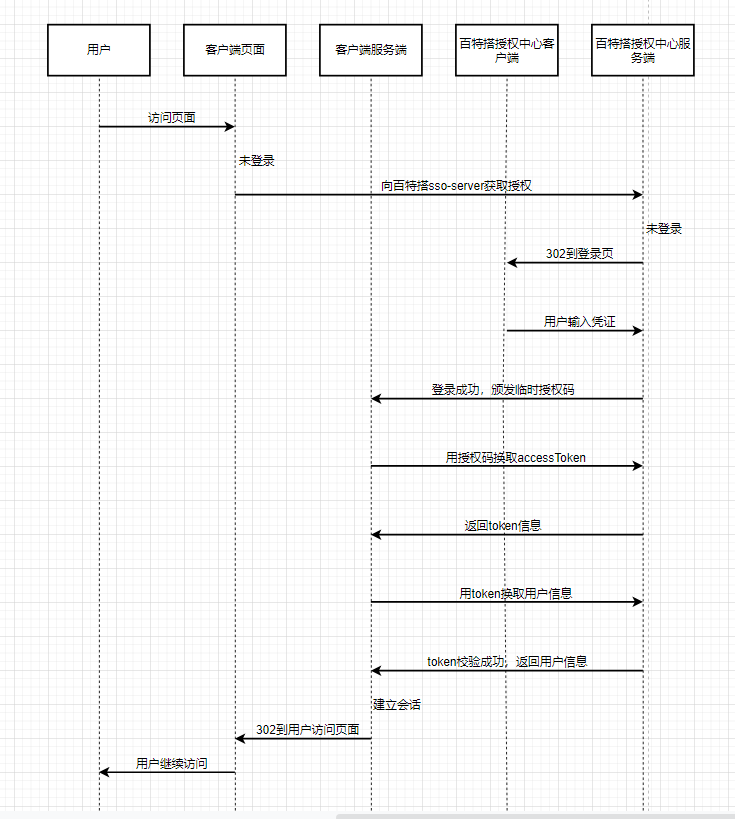

<a id="Gxnmd"></a>


### 1.简介

为实现百特搭低代码平台和业务系统的互通互联，百特搭用户中心提供授权认证功能以及其它必要的相关接口，为其它业务系统的接入提供单点登录 服务。

统一用户中心的概念主是基于saas平台下的所有人的管理中心，这里的用户，一个用户可能同时属于多个租户，那么实现SSO后，这个人也同样可以通过接口以不同的tenant\_id来访问各租户的数据。如果用户开通了开发者权限，那么用户可以登录应用商店(<https://store.baiteda.com/>)，上传应用。同时用户还可以登录到百特搭社区(<https://bbs.baiteda.com/>)，参与问题答疑。

<a id="XnAqv"></a>


### 2.认证流程

认证基于 OAuth2.0 授权码模式，具体认证流程如下图所示：





（A）用户访问客户端（即业务系统），后者将前者导向认证服务器。；

（B）认证服务器判断未登录，像用户展示登录界面；

（C）假设用户给予授权（即输入账号密码登录），认证服务器将用户导向客户端事先指定的"重定向 URI"（redirection\_uri），同时附上一个 授权码;

（D）客户端收到授权码，附上早先的"重定向 URI"，向认证服务器申 请令牌。这一步是在客户端的后台的服务器上完成的，对用户不可见；

（E）认证服务器核对了授权码和重定向 URI，确认无误后，向客户端 发送访问令牌（access token）和更新令牌（refresh token）；

（F）客户端服务器通过访问令牌（access token）向认证服务器获取用户信息，并建立会话。

​

<a id="ysEHO"></a>


### 3.接入接口说明

<a id="coR5A"></a>


#### 3.1准备工作

百特搭事先为业务系统分配 client\_id 和 client\_secret，同时业务系统向百特搭注册登录的回调地址，用于回传授权码。

<a id="ExmUZ"></a>


#### 3.2认证中心授权接口

接口地址：https://user-center.baiteda.com:8443/user\_center/api/public/sso/oauth/authorize

请求方式：GET

Content-Type：x-www-form-urlencoded

query参数：

|  |  |  |  |
| --- | --- | --- | --- |
| 参数 | 描述 | 类型 | 是否必填 |
| client\_id | client\_id | String | 是 |
| redirect\_uri | 授权码的回调地址，需要url-encode编码 | String | 是 |
| response\_type | 授权模式，固定值：code | String | 是 |
| scope | 授权范围，固定值：all | String | 是 |
| state | 客户端传什么在回调的时候会回传过去 | String | 否 |

<a id="KZKhj"></a>


#### 3.3使用code换取accessToken的接口

接口地址：https://user-center.baiteda.com:8443/user\_center/api/public/sso/oauth/token

请求方式：POST

Content-Type：x-www-form-urlencoded

query参数：

|  |  |  |  |
| --- | --- | --- | --- |
| 参数 | 描述 | 类型 | 是否必填 |
| client\_id | client\_id | String | 是 |
| client\_secret | 密钥 | String | 是 |
| code | 上一步返回的授权码 | String | 是 |
| redirect\_uri | 回调地址 | String | 是 |
| grant\_type | 授权模式，固定值：authorization\_code | String | 是 |
| scope | 授权范围，固定值：all | String | 是 |

响应参数示例：**​**


```json
{
	"access_token": "sadghfgkjf",
	"expires_in": 1656331019000,
	"refresh_token": "kjgdasgfhadf",
	"scope": "all",
	"token_type": "bearer"
}
```

<a id="aC8Mq"></a>


#### 3.4使用accessToken换取用户信息的接口

接口地址：https://user-center.baiteda.com:8443/user\_center/api/private/user/base

请求方式：POST

Content-Type：x-www-form-urlencoded

header参数：

|  |  |  |  |
| --- | --- | --- | --- |
| 参数 | 描述 | 类型 | 是否必填 |
| Authorization | token，格式：Bearer tokenValue；注意Bearer和token之间有个空格 | String | 是 |

响应参数示例：**​**


```json
{
	"code": "000000",
	"data": {
		"is_set_pwd": true,
    "nickname": "小明",
    "avatar_url": "https://test.baiteda.com/attach/attachment/20220609/91752ebb00154593ae26c9077ca21a7c/%E7%99%BE%E7%89%B9%E6%90%ADLOGO_%E6%B5%85%E8%89%B2logo.png",
		"phone": "15215138222",
		"user_id": "1511657281766629354"
	},
	"message": "执行成功",
	"msg": "执行成功",
	"state": "SUCCESS",
	"timestamp": 1656331019011
}
```

<a id="JJ5vs"></a>


##

​
