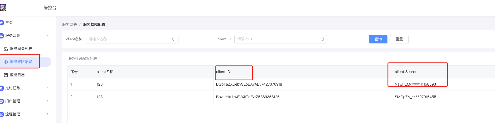
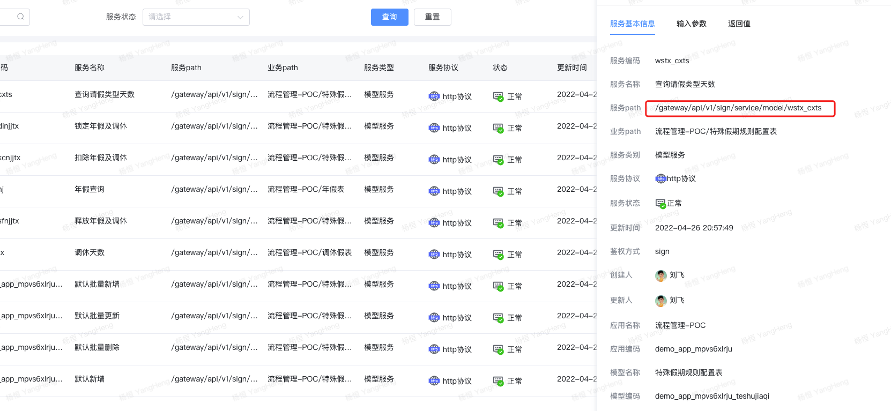
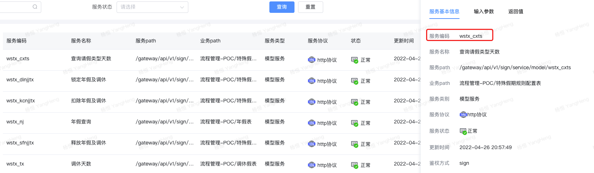

<a id="FERTA"></a>


## 1.统一签名参数

接口调用方式:POST

**通用参数**

RequestBean：

|  |  |  |
| --- | --- | --- |
| 参数key | 参数描述 | 例 |
| biz\_params | **请求参数jsonString** |  |
| sign | 安全签名（md5(client\_sercet + timestamp + biz\_params)） | 7E682AF54F208EBD5FC447512F37AB24（服务权限配置里获取） |
| app\_id | client\_id | app\_a8n3ajrg8l（服务权限配置里获取） |
| tenant\_id | 租户编号 | test |
| timestamp | 请求发起时的系统时间字符串 | 20200924095813 |

注： app\_id和secret对应的是服务网关的client\_id和client\_secret ，在这个位置可以找到。





请求参数样例


```plain
{
        "app_id":"app_a8n3ajrg8l",
        "biz_params":"{\"tenant_id\":\"test\",\"user_id\":\"sysadmin\",\"data_code\":\"employee_info\",\"svc_code\":\"employee_info_selectMore\",\"exe_svc_param\":{\"save_datas\":{},\"save_datas_list\":[],\"query\":{\"page_index\":1,\"page_size\":50,\"sort_criteria\":{\"create_time\":\"DESC\"},\"query_criteria\":[{\"column_name\":\"external_user\",\"value\":[0],\"query_type\":0}]}}}",
        "sign":"47db0adbd9de204bee81cc02da37d85a",
        "tenant_id":"test",
        "timestamp":"20200924095813"
  }
```


java签名生成：


```plain
/**
     * 创建sign=md5(secret+timestamp+biz_params)
     * @param secret
     * @param timestamp
     * @param bizParams
     * @return
     */
    public static String getSign(String secret,String timestamp,String bizParams){
        String signBeforeStr=secret+timestamp+bizParams;
        try {
            byte[] btInput = signBeforeStr.getBytes("utf-8");
            MessageDigest mdInst = MessageDigest.getInstance("MD5");
            mdInst.update(btInput);
            byte[] md = mdInst.digest();
            StringBuilder sb = new StringBuilder();
            for (int i = 0; i < md.length; i++) {
                int val = ((int) md[i]) & 0xff;
                if (val < 16) {
                    sb.append("0");
                }
                sb.append(Integer.toHexString(val));
            }
            return sb.toString();
        } catch (Exception e) {
            log.warn("MD5Encoder异常：" + e.getMessage());
            return null;
        }
    }


    public static void main(String[] args)   {

        Long currTime=System.currentTimeMillis();
        SimpleDateFormat simpleDateFormat = new SimpleDateFormat("yyyyMMddHHmmss");

        Map<String,Object>   map = new HashMap<>();

        map.put("process_instance_id","3db54425-4fc3-4502-bd76-61617d4cd21f");
        map.put("tenant_id","test");
        String bizParams = JSON.toJSONString(map) ;

        RequestBean  requestBean = new RequestBean();


        String appId = "appId";
        String appSign = "appSign";
        String timestamp = simpleDateFormat.format(new Date(currTime));

        requestBean.setAppId(appId);
        requestBean.setTimestamp(timestamp);
        requestBean.setTenantId("test");
        requestBean.setBizParams(bizParams);
        requestBean.setSign(getSign(appSign,timestamp,bizParams));

        log.info("RequestBean  =" + JsonUtils.toJsonString(requestBean));
    }
```

<a id="F90B4"></a>


## 2.获取服务调用地址

如图





<a id="uNemP"></a>


## 3.接口参数

|  |  |  |  |
| --- | --- | --- | --- |
| 参数key | 参数描述 | 类型 | 是否必填 |
| exe\_svc\_param | 服务类型为查多时候必传 | Object | query，save\_datas 二选一必填 |
| save\_datas | 服务类型为添加，修改，删除，查单时必传 | Object | query，save\_datas 二选一必填 |
| svc\_code | 服务编码，从服务窗口复制 | String | 必填 |
| tenant\_id | 租户编号 | String | 必填 |
| user\_id | 操作人ID | String | 非必填 |
| config\_id | 连接器配置ID | String | 非必填（注：若服务为连接器服务 该字段必填） |

<a id="cj1P4"></a>


##

<a id="omwPS"></a>


### **获取服务编码**





服务编码：app\_uqaucma53i\_formtable\_main\_39\_insert

appId：app\_uqaucma53i

<a id="BX7I7"></a>


### **示例一：服务类型为添加，修改，删除，查单**


```plain
{
    "app_id":"app_uqaucma53i",
  	"exe_svc_param": {
   		  "save_datas":{//添加、修改服务是调用，数据格式要对应上
               "模型字段编号":"值"，
               "uid":"值"//查单，修改或者删除服务时传递
        }
    },
    "user_id":"sysadmin",
    "svc_code":"app_uqaucma53i_formtable_main_39_insert",
    "tenant_id":"test"
}
```

<a id="pxRo9"></a>


### **示例二：服务类型为查多**


```plain
{
    "tenant_id":"test",
    "user_id":"sysadmin",
    "data_code":"app_4mz81owo0i_currency",
    "svc_code":"app_4mz81owo0i_currency_selectMore",
    "exe_svc_param":{
        "query":{
            "page_index":1,
            "page_size":100,
            "query_criteria":[
                {
                    "column_name":"模型字段编号",
                    "query_type":0,//查询类型 0:eq,1:gt,2:lt,3:in,4:like,5:range
                    "value":[ //查询匹配值，eq gt lt like,数组长度为1，其他为2

                    ]
                }
            ],
            "sort_criteria":{
                "模型字段编号":"asc/desc"
            },
            "need_count":false
        }
    }
}
```


​
