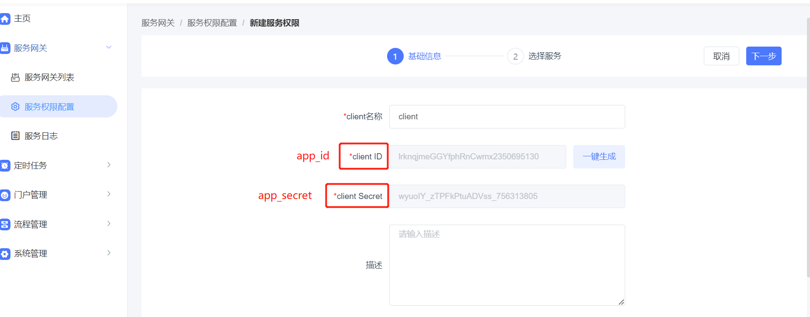
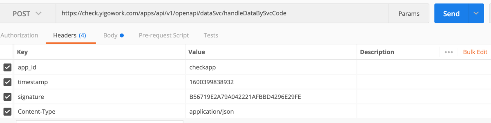
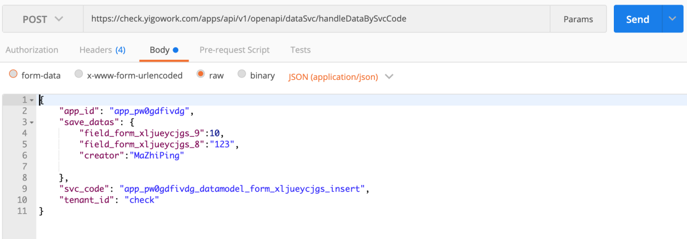

<a id="BNrkH"></a>


## 1.基于RequestBean方式的签名

接口调用方式:POST

统一签名方式

**通用参数**

RequestBean：

|  |  |  |
| --- | --- | --- |
| 参数名 | 说明 | 例 |
| biz\_params | 请求参数jsonString |  |
| sign | 安全签名（md5(secret + timestamp + biz\_params)）  （secret为百特搭发放） | 7E682AF54F208EBD5FC447512F37AB24 |
| app\_id | 应用ID（百特搭发放） | app\_a8n3ajrg8l |
| tenant\_id | 租户编号 | test |
| timestamp | 请求发起时的系统时间字符串 | 20200924095813 |

请求参数样例


```plain
{
        "app_id":"app_a8n3ajrg8l",
        "biz_params":"{\"page_index\":1,\"page_size\":10,\"sort_criteria\":{\"create_time\":\"DESC\"},\"query_criteria\":[{\"column_name\":\"book_name\",\"value\":[\"121\"],\"query_type\":4},{\"column_name\":\"creator\",\"value\":[\"MaZhiPing\"],\"query_type\":0}]}",
        "sign":"47db0adbd9de204bee81cc02da37d85a",
        "tenant_id":"test",
        "timestamp":"20200924095813"
  }
```


tenant\_id、app\_id、app\_secret的获取方式：

**a、saas租户：**

tenant\_id为租户id。

app\_id、app\_secret可登录百特搭平台-》管控台-》服务网关





**b、私有化租户：到base库，执行以下sql查询：**

select tenant\_id, app\_id, app\_secret from wfc\_api\_app where account\_system = 'app';

​

java签名生成：


```plain
  /**
     * 创建sign=md5(secret+timestamp+biz_params)
     * @param secret
     * @param timestamp
     * @param bizParams
     * @return
     */
    public static String getSign(String secret,String timestamp,String bizParams){
        String signBeforeStr=secret+timestamp+bizParams;
        try {
            byte[] btInput = signBeforeStr.getBytes("utf-8");
            MessageDigest mdInst = MessageDigest.getInstance("MD5");
            mdInst.update(btInput);
            byte[] md = mdInst.digest();
            StringBuilder sb = new StringBuilder();
            for (int i = 0; i < md.length; i++) {
                int val = ((int) md[i]) & 0xff;
                if (val < 16) {
                    sb.append("0");
                }
                sb.append(Integer.toHexString(val));
            }
            return sb.toString();
        } catch (Exception e) {
            log.warn("MD5Encoder异常：" + e.getMessage());
            return null;
        }
    }


    public static void main(String[] args)   {

        Long currTime=System.currentTimeMillis();
        SimpleDateFormat simpleDateFormat = new SimpleDateFormat("yyyyMMddHHmmss");

        Map<String,Object>   map = new HashMap<>();

        map.put("process_instance_id","3db54425-4fc3-4502-bd76-61617d4cd21f");
        map.put("tenant_id","test");
        String bizParams = JSON.toJSONString(map) ;

        RequestBean  requestBean = new RequestBean();


        String appId = "appId";
        String appSign = "appSign";
        String timestamp = simpleDateFormat.format(new Date(currTime));

        requestBean.setAppId(appId);
        requestBean.setTimestamp(timestamp);
        requestBean.setTenantId("test");
        requestBean.setBizParams(bizParams);
        requestBean.setSign(getSign(appSign,timestamp,bizParams));

        log.info("RequestBean  =" + JsonUtils.toJsonString(requestBean));
    }
```

<a id="TQlzN"></a>


## 2.基于header签名方式的接口签名

接口调用方式:POST GET

appid:{app\_id}

signature: MD5(body请求体字符串 + 时间戳 + secretKey秘钥)

timestamp:时间戳

tenant\_id: 租户ID

header中的参数

|  |  |  |
| --- | --- | --- |
| 参数名 | 说明 | 例 |
| appid(appid) | 应用id,兼容了去掉下划线 |  |
| signature | 签名 MD5(body请求体字符串 + 时间戳 + secretKey秘钥) |  |
| timestamp | 时间戳 |  |
| tenant\_id(tenantid) | 租户编号,兼容了去掉下划线 |  |

以postman调用服务通用接口为例








可以把一下内容导入到postman中参考


[附件: 服务调用.postman_collection.json](../_assets/zdxp541u0454obe9/服务调用.postman_collection-47e1217794.json)


备注：如果基于postman脚本生成signature，body中的json需要压缩，如果有空格会导致生产的

signature错误
