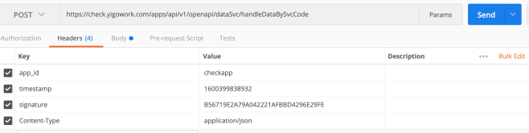
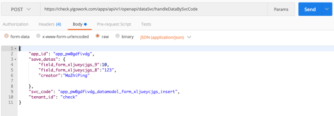
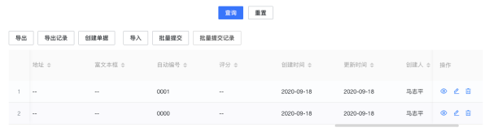
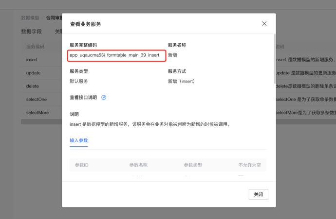
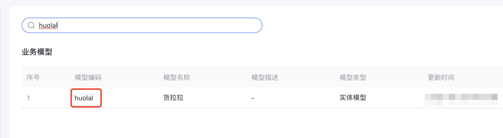

<a id="Zljqx"></a>


## 一、说明

**调用方式：http调用方式**

**加密规则**

header中

app\_id:{app\_id}

signature: MD5(body请求体字符串 + 时间戳 + secretKey秘钥)

timestamp:时间戳

tenant\_id: 租户ID

<a id="BLvWH"></a>


#










<a id="imHHo"></a>


## 二、数据服务接口

包含表单数据的单条添加，修改，查询，删除

<a id="NhNM4"></a>


### 1.接口地址

[https://{host}/apps/api/v1/openapi/dataSvc/handleDataBySvcCode](https://lixiangdemo.yigowork.com/apps/api/v1/openapi/dataSvc/handleDataBySvcCode)

请求方式:

post

<a id="qdUs7"></a>


### 2.接口参数

|  |  |  |  |
| --- | --- | --- | --- |
| 参数key | 参数描述 | 类型 | 是否必填 |
| app\_id | 应用ID | String | 必填 |
| query | 查多服务参数 | Object | 服务类型为查多时必填 |
| save\_datas | 服务类型为添加，修改，删除，查单时必传 | Object | 服务类型为添加，修改，删除，查单时必传 |
| save\_datas\_list | 服务类型为批量新增或者批量更新时必传 | Array | 服务类型为批量新增或者批量更新时必传 |
| svc\_code | 服务编码，从服务窗口复制 | String | 必填 |
| tenant\_id | 租户编号 | String | 必填 |

<a id="p65iw"></a>


### 3.示例





<a id="EmpfM"></a>


#### 示例一：服务类型为添加，修改，删除，查单


```plain
{
    "app_id":"app_uqaucma53i",
    "save_datas":{//添加、修改服务是调用，数据格式要对应上
           "模型字段编号":"值"，
           "uid":"值"//查单，修改或者删除服务时传递
    },
    "svc_code":"app_uqaucma53i_formtable_main_39_insert",
    "tenant_id":"test"
}
```

<a id="SYRFH"></a>


#### 示例二：服务类型为查多服务


```plain
{
    "app_id":"app_uqaucma53i",
    "query":{//查多服务是需要传递
        "page_index":1,
        "page_size":10,
        "query_criteria":[
            {
                "column_name":"模型字段编号",
                "query_type":0,//查询类型 0:eq,1:gt,2:lt,3:in,4:like,5:range
                "value":[ //查询匹配值，eq gt lt like,数组长度为1，其他为2

                ]
            }
        ],
        "sort_criteria":{
            "模型字段编号":"asc/desc"
        }
    },
    "svc_code":"app_uqaucma53i_formtable_main_39_selectMore",
    "tenant_id":"test"
}
```


query\_type的枚举值


```plain
EQ(0, "等于查询"),
GT(1, "大于查询"),
LT(2, "小于查询"),
IN(3, "包含查询"),
LIKE(4, "模糊查询"),
RANGE(5, "范围查询"),
GE(6, "大于等于"),
LE(7, "小于等于"),
/**
 * 包含任一
 */
CONTAINS_ONE(8, "包含任一"),
CONCAT_LIKE(9, "多字段拼接模糊查询"),
CONTAINS_IN_WITH_SUB_DEPT(10, "含子部门"),
NOT_EQ(11, "不等于"),
CONCAT_NOT_EQ(12, "拼接不等于"),
IS_NULL(13, "为空"),
IS_NOT_NULL(14, "不为空"),
/**
 * 如：查询树的根节点的时候需要通过 id = parent_id 的方式查询
 */
EQ_FIELD(15, "等于某个字段"),
/**
 * 如：查询树的根节点的时候需要通过 id = parent_id 的方式查询
 */
IS_NULL_OR_EQ_FIELD(16, "为空或等于某个字段"),
/**
 * 如：查询树的子节点的时候需要通过 parent_id = 'value' and id != parent_id 的方式查询
 */
NOT_EQ_FIELD(17, "不等于某个字段"),
```


完整传参规则请参考：<https://baiteda.yuque.com/books/share/036629a3-6a2f-4e3c-98a6-81ca11fb487f/oizhgr#MwJ1K>

<a id="Y9OoX"></a>


#### 示例三：服务类型为批量新增

注意：svc\_code的值是： 模型编码\_batch\_save


```plain
{
    "app_id":"app_uqaucma53i",
    "save_datas_list":[{
           "模型字段编号":"值"，
           "uid":"值"
    }],
    "svc_code":"app_uqaucma53i_formtable_main_39_batch_save",
    "tenant_id":"test"
}
```

<a id="T5fLE"></a>


#### 示例四：服务类型为批量更新

注意：svc\_code的值是： 模型编码\_batch\_modify


```plain
{
    "app_id":"app_uqaucma53i",
    "save_datas_list":[{
           "模型字段编号":"值"，
           "uid":"值"
    }],
    "svc_code":"app_uqaucma53i_formtable_main_39_batch_modify",
    "tenant_id":"test"
}
```

<a id="yPuCX"></a>


## 三、表单接口

<a id="dsM30"></a>


### 插入表单数据并发起流程接口

<a id="hgGRJ"></a>


#### 接口地址

https://{host}/apps/api/v1/openapi/process/submitProcess

<a id="BciXI"></a>


#### 请求方式:

post

<a id="ltqBu"></a>


#### 签名方式

基于header签名

<a id="kyo6V"></a>


#### 接口参数





业务模型

code：app\_rb0ipq5y7g\_huolal 模型code

appId：app\_rb0ipq5y7g 应用编号

process\_key: huolala\_shenqing\_process 流程key

​

|  |  |  |  |
| --- | --- | --- | --- |
| 参数 | 说明 | 类型 | 是否必填 |
| app\_id | 应用编号 | String | 必填 |
| current\_user\_id | 当前发起用户编号 | String | 必填 |
| data\_set | 表单主数据编号 | DataSet | 必填 |
| data\_set.data\_code | 表单主数据模型编号 | String | 必填 |
| data\_set.values | 表单主数据 | List<FiledValue> | 必填 |
| data\_set.filed\_value.code | 主模型字段编号 | String | 必填 |
| data\_set.filed\_value.value | 字段值，根据字段类型传递数据类型 | Object | 必填 |
| form\_key | 发起表单key | String | 必填 |
| process\_key | 绑定的流程定义key | String | 必填 |
| auto\_submit | 是否自动提交，fase流程发起后停在提交人节点，true流程发起后停到第一个审批节点 | boolean | 必填 |
| tenant\_id | 租户编号 | String | 必填 |
| subtable\_data\_set | 多个子表的数据，有子表的时候传递 | List<SubtableDataSet> | 非必填 |
| subtable\_data\_set.data\_code | 子表的字段的数据模型code | String | 必填 |
| subtable\_data\_set.values | 子表的多行数据集合 | List<SubtableRow> | 必填 |
| subtable\_row.row\_data | 子表每一行数据 | List<FiledValue> | 必填 |
| subtable\_row.code | 字段code | String | 必填  （若需要指定主键，需要传输uid字段,为空时系统自动生成,指定请确保唯一） |
| subtable\_row.value | 字段值，根据字段类型传递数据类型 | Object | 必填 |

<a id="dBsyP"></a>


#### 示例

启动流程请求参数：


```json

{
  "app_id":"app_rb0ipq5y7g",
  "current_user_id":"YangHeng",
  "data_set":{ //表单数据
    "data_code":"app_rb0ipq5y7g_huolal",//业务模型code
    "values":[
      {
        "code":"car_tye",//字段code
        "value":"轿车"
      },
      {
        "code":"car_name",
        "value":"12"
      },
      {
        "code":"zhonglaing",
        "value":123
      },
      {
        "code":"qudao",
        "value":"3525bdd777f24484b0a92bba622a3b1d"
      },
      {
        "code":"waiguan",
        "value":[

        ]
      },
      {
        "code":"data",    //时间类型传 时间戳字符串
        "value":"1617877626260"
      },
      {
        "code":"address",  //地址类型 是地址对象
        "value":{
          "province":"110000",
          "province_display":"北京",
          "city":"110100",
          "city_display":"北京市",
          "district":"110101",
          "district_display":"东城区"
        }
      },
      {
        "code":"shenqing_text",
        "value":"123"
      }
    ]
  },
  "form_key":"form_ooj0au86ry",//表单key
  "process_key":"huolala_shenqing_process",//流程定义key
  "auto_submit":"true", //是否自动提交   默认为true=自动提交到下一个节点， false=不自动提交，发起流程后停留在提交节点
  "tenant_id":"test",
  "subtable_data_set": [//所有子表数据，没有子表可不传
    {
      "data_code": "",//子表的业务模型code
      "values": [//子表数据
        {
          "row_data": [
            {
              "code": "",
              "value": ""
            }
          ],
          "uid": ""
        }
      ]
    }
  ]
}
```

<a id="N78jc"></a>


#### 返回值


```json
{
  "process_instance_id":"",//流程实例ID
  "process_status":"", //流程状态
  "data_id":""//数据ID
}
```

<a id="cHAYE"></a>


#### 异常1：


```json
{
    "state": "FAIL",
    "message": "app_id不能为空!",
    "code": "1201401",
    "timestamp": "2022-03-24 16:01:18",
    "data": null
}
```


错误原因

使用postman调用时 请删除 //注释

<a id="GWBSb"></a>


#### 异常2：


```json
{
    "state": "FAIL",
    "message": "sign不能为空!",
    "code": "1201403",
    "timestamp": "2022-03-24 15:54:49",
    "data": null
}
```


错误原因

未按照 步骤1.3执行

<a id="WFOms"></a>


### 修改表单数据并审批流程接口

<a id="KdKmU"></a>


#### 接口地址

[https://{host}/apps/api/v1/openapi/process/approveProcess](https://%7Bhost%7D/apps/api/v1/openapi/process/approveProcess)

<a id="TR3aN"></a>


#### 请求方式:

post

<a id="eEYFw"></a>


#### 签名方式

基于header签名

<a id="IpKAG"></a>


#### 接口参数

|  |  |  |  |
| --- | --- | --- | --- |
| **参数key****参数** | **参数描述** | **类型** | **是否必填** |
| app\_id | 应用ID | String | 必填 |
| current\_user\_id | 操作人工号 | String | 必填 |
| data\_set | 主表数据 | List | 必填 |
| data\_code | 业务模型 | codeString | 必填 |
| values | 表单数据 | Array | 非必填 |
| code | 字段code | String | 非必填 |
| value | 字段对应的值 | String | 非必填 |
| process\_definition\_key | 流程定义key | String | 必填 |
| form\_key | 表单key | String | 必填 |
| tenant\_id | 租户ID | String | 必填 |
| data\_id | 数据ID，提交时会返回 | String | 必填 |
| process\_instance\_id | 流程实例ID，提交时会返回 | String | 必填 |
| delete\_ids | 删除的子表id | String | 非必填，逗号分割（delete\_all\_old为false时生效） |
| delete\_all\_old | 是否删除全部子表数据 | boolean | 非必填，默认为false |
| subtable\_data\_set | 子表数据 | Array | 非必填 |
| subtable\_data\_set.data\_code | 子表的字段的数据模型code | String | 必填 |
| subtable\_data\_set.values | 子表的多行数据集合 | List<SubtableRow> | 必填 |
| subtable\_row.row\_data | 子表每一行数据 | List<FiledValue> | 必填 |
| subtable\_row.uid | 明细行主键，需要更新时传输 | String | 非必填 （若进行数据更新，需要传输uid字段） |
| subtable\_row.code | 字段code | String | 必填  （若需要指定主键，需要传输uid字段,为空时系统自动生成,指定请确保唯一） |
| subtable\_row.value | 字段值，根据字段类型传递数据类型 | Object | 必填 |

审批数据

|  |  |  |  |
| --- | --- | --- | --- |
| **run\_task** | **审批数据** | **Object** | **是否必填** |
| command\_id | 任务对应按钮id | String | 必填 |
| command\_type | 任务对应按钮类型 | String | 必填 |
| task\_comment | 处理意见 | String | 非必填 |
| agent\_id | 代理任务时必填，否则不会标记代理处理人， 委托人id A委托B处理，这里填A | String | 非必填 |
| transfer\_user\_id | 转办人id，转办时必填 | String | 非必填 |
| recover\_node\_id | 追回的目标节点id，追回时必填 | String | 非必填 |
| endorsement\_user\_id\_list | 加签人列表；如有多人，用“,”分隔,加签操作是必填 | String | 非必填 |
| rollback\_task\_id | 想要退回到的任务id ,退回指定任务时必填 | String | 非必填 |
| revoke\_task\_id | 新撤回按钮要撤回到的任务id | String | 非必填 |
| attachment\_id | 审批组件上传附件id，多个用逗号分隔 | String | 非必填 |

**command\_type和command\_id类型**

退回到提交页面(默认按钮)

|  |  |  |
| --- | --- | --- |
| 按钮ID | 按钮类型 | 按钮说明 |
| submit\_1 | submit | 提交 |
| revoke\_1 | revoke | 撤回 |
| notice\_1 | generalTaskNotice | 加签 |
| terminationProcess\_1 | terminationProcess | 作废 |
| urge\_1 | urge | 催办 |

待办审批页面(默认按钮)

|  |  |  |
| --- | --- | --- |
| 按钮ID | 按钮类型 | 按钮说明 |
| general | general | 同意 |
| rollBackTaskByExpression | rollBackTaskByExpression | 拒绝 |
| parallelEndorsement | parallelEndorsement | 加签 |
| transfer | transfer | 转办 |
| urge | urge | 催办 |
| revoke | revoke | 撤回 |
| rejectAndTerminate | rejectAndTerminate | 终止 |
| tempSave | tempSave | 暂存 |
| generalTaskNotice | generalTaskNotice | 知会 |
| voteAgree | voteAgree | 投票同意 |
| voteAgainst | voteAgainst | 投票反对 |

<a id="oYSU7"></a>


#### 流程审批请求参数：


```json
{
    "tenant_id":"test",
    "app_id":"app_7475m2r6hx",
    "form_key":"form_xgmled8zmq",
    "data_set":{
        "data_code":"app_7475m2r6hx_ccsq",
        "values":[
            {
                "code":"djbh",
                "value":"TEST202104230009"
            },
            {
                "code":"ccuser",
                "value":"6g7f15f3"
            },
            {
                "code":"cbzx",
                "value":"世纪中心111"
            },
            {
                "code":"txuser",
                "value":"6g7f15f3"
            },
            {
                "code":"dxk",
                "value":[
                    "0",
                    "2"
                ]
            },
            {
                "code":"ccrbm",
                "value":"58"
            }
        ]
    },
    "subtable_data_set":[
        {
            "data_code":"app_7475m2r6hx_ccsq_detail",
            "values":[
                {
                    "row_data":[
                        {
                            "code":"biz_key",
                            "value":"2222222"
                        },
                        {
                            "code":"employee_name",
                            "value":"6g7f15f3"
                        },
                        {
                            "code":"ccdd",
                            "value":"冰岛222"
                        },
                        {
                            "code":"ccsq_id",
                            "value":"186af3b3bce34a678e29c65b9faa7a8d"
                        }
                    ]
                },
                {
                    "row_data":[
                        {
                            "code":"biz_key",
                            "value":"333333"
                        },
                        {
                            "code":"employee_name",
                            "value":"6g7f15f3"
                        },
                        {
                            "code":"ccdd",
                            "value":"罗玛蒂克333"
                        },
                        {
                            "code":"ccsq_id",
                            "value":"186af3b3bce34a678e29c65b9faa7a8d"
                        }
                    ]
                }
            ],
            "delete_ids":null,
            "delete_all_old":true
        },
        {
            "data_code":"app_7475m2r6hx_ccsq_log",
            "values":[
                {
                    "row_data":[
                        {
                            "code":"biz_key",
                            "value":"4444444"
                        },
                        {
                            "code":"cc_time",
                            "value":"1619141243000"
                        },
                        {
                            "code":"cc_count",
                            "value":"444"
                        },
                        {
                            "code":"ccsq_id",
                            "value":"186af3b3bce34a678e29c65b9faa7a8d"
                        }
                    ]
                }
            ],
            "delete_ids":null,
            "delete_all_old":true
        }
    ],
    "process_key":"ccsq_process",
    "current_user_id":"6g969233",
    "unique_id":"186af3b3bce34a678e29c65b9faa7a8d",
    "file_list":[
        {
            "file_name":"百度一下555",
            "file_download_url":"www.baidu.com555",
            "file_view_url":"www.goole.com555",
            "file_source_system":"CC",
            "file_uid":"1010101010101555555"
        },
        {
            "file_name":"百度一下666",
            "file_download_url":"www.baidu.com666",
            "file_view_url":"www.goole.com666",
            "file_source_system":"CC",
            "file_uid":"1010101010101066666"
        }
    ],
    "data_code":"app_7475m2r6hx_ccsq",
    "data_id":"186af3b3bce34a678e29c65b9faa7a8d",
    "node_id":"UserTask_05r4ib5",
    "process_definition_key":"ccsq_process",
    "process_instance_id":"2a9b0bc9-f5fb-4198-bf49-ce6d3d19d270",
    "run_task":{
        "command_id":"general",
        "command_type":"general",
        "task_instance_id":"d849c668-a265-40fc-a2d4-8f31c0287fcc",
        "task_comment":null,
        "agent_id":null,
        "transfer_user_id":null,
        "recover_node_id":null,
        "endorsement_user_id_list":null,
        "rollback_task_id":null,
        "revoke_task_id":null
    }
}
```

<a id="izejP"></a>


### 提交非用户任务接口

<a id="otgeQ"></a>


#### 接口地址

[https://{host}/apps/api/v1/openapi/process/submitServiceTask](https://%7Bhost%7D/apps/api/v1/openapi/process/submitServiceTask)

<a id="omrRQ"></a>


#### 请求方式：

post

<a id="KDsZO"></a>


#### 签名方式

基于header签名

|  |  |  |  |
| --- | --- | --- | --- |
| **参数key** | **参数描述** | **类型** | **是否必填** |
| app\_id | 应用ID | String | 必填 |
| current\_user\_id | 操作人工号 | String | 必填 |
| data\_set | 主表数据 | Array | 必填 |
| data\_code | 业务模型code | String | 必填 |
| values | 表单数据 | Array | 必填 |
| code | 字段code | String | 必填 |
| value | 字段对应的值 | String | 非必填 |
| process\_definition\_key | 流程定义key | String | 必填 |
| process\_instance\_id | 流程实例编号 | String | 必填 |
| node\_id | 节点编号 | String | 必填 |
| form\_key | 表单key | String | 必填 |
| tenant\_id | 租户ID | String | 必填 |
| data\_id | 数据编号 | String | 必填 |
| subtable\_data\_set | 子表数据 | Array | 非必填 |
| run\_task | 审批数据 | Object | 必填 |
| command\_id | 任务对应按钮id | String | 必填 |
| command\_type | 任务对应按钮类型 | String | 必填 |
| transient\_variable | 其他在流程中定义的瞬时变量 | map对象{} | 非必填 |
| task\_comment | 处理意见 | String | 非必填 |
| agent\_id | 代理任务时必填，否则不会标记代理处理人， 委托人id A委托B处理，这里填A | String | 非必填 |
| transfer\_user\_id | 转办人id，转办时必填 | String | 非必填 |
| recover\_node\_id | 追回的目标节点id，追回时必填 | String | 非必填 |
| endorsement\_user\_id\_list | 加签人列表；如有多人，用“,”分隔,加签操作是必填 | String | 非必填 |
| rollback\_task\_id | 想要退回到的任务id ,退回指定任务时必填 | String | 非必填 |
| revoke\_task\_id | 新撤回按钮要撤回到的任务id | String | 非必填 |
| attachment\_id | 上传附件id，多个用逗号分隔 | String | 非必填 |

<a id="AXyjK"></a>


#### 示例


```json
{
    "data_id":"7a813d82d35c4f2c9c55dddde3b09795",
    "data_code":"app_666pa5p2nt_mobile",
    "app_id":"app_eouw1rryzy",
    "current_user_id":"YangHeng",
    "data_set":{
        "data_code":"app_666pa5p2nt_mobile",
        "values":[
            {
                "code":"price",
                "value":"500"
            },
            {
                "code":"uid",
                "value":"7a813d82d35c4f2c9c55dddde3b09795"
            },
            {
                "code":"intro",
                "value":"更新成功"
            }
        ]
    },
    "form_key":"form_flfyrl2rzd",
    "node_id":"ReceiveTask_0zzedtx",
    "process_instance_id":"42d352d1-a33f-4388-b39c-92927334a86f",
    "process_definition_key":"interance_process",
    "run_task":{
        "command_id":"receiveEnd",
        "command_type":"receiveEnd"
    },
    "subtable_data_set":[
        {
            "data_code":"app_666pa5p2nt_child_mobile",
            "values":[
                {
                    "row_data":[
                        {
                            "code":"zi_jieshao",
                            "value":"lllllllllll"
                        }
                    ],
                    "uid":"43477aeeb99d475389c3947d72a7dad4"
                }
            ]
        }
    ],
    "tenant_id":"test"
}
```

<a id="OSjP1"></a>


#### 返回值


```json
{
  "state": "SUCCESS",
  "message": "执行成功",
  "code": "000000",
  "timestamp": "2021-05-13 15:08:05",
  "data": {
    "business_key": null,
    "node_id": "ReceiveTask_0zzedtx",
    "node_name": {
      "zh": "接收任",
      "en": "接收任",
      "ja": ""
    },
    "process_definition_key": "interance_process",
    "process_location": "UserTask_0xs8y2v",
    "process_status": "RUNNING"
  }
}
```

<a id="hnTa3"></a>


### 插入表单数据并发起草稿

<a id="utohr"></a>


#### 接口地址

https://{host}/apps/api/v1/openapi/process/submitDraft

<a id="ExFul"></a>


#### 请求方式

post

<a id="jJJVS"></a>


#### 签名方式

基于header签名

<a id="HL8ho"></a>


#### 接口参数


业务模型

code：app\_rb0ipq5y7g\_huolal 模型code

appId：app\_rb0ipq5y7g 应用编号

process\_key: huolala\_shenqing\_process 流程key

​

|  |  |  |  |
| --- | --- | --- | --- |
| 参数 | 说明 | 类型 | 是否必填 |
| app\_id | 应用编号 | String | 必填 |
| current\_user\_id | 当前发起用户编号 | String | 必填 |
| data\_set | 表单主数据编号 | DataSet | 必填 |
| data\_set.data\_code | 表单主数据模型编号 | String | 必填 |
| data\_set.values | 表单主数据 | List<FiledValue> | 必填 |
| data\_set.filed\_value.code | 主模型字段编号 | String | 必填 |
| data\_set.filed\_value.value | 字段值，根据字段类型传递数据类型 | Object | 必填 |
| form\_key | 发起表单key | String | 必填 |
| process\_key | 绑定的流程定义key | String | 必填 |
| draft\_title | 草稿标题 | String | 必填 |
| auto\_submit | 是否自动提交 | boolean | 值为false |
| tenant\_id | 租户编号 | String | 必填 |
| subtable\_data\_set | 多个子表的数据，有子表的时候传递 | List<SubtableDataSet> | 非必填 |
| subtable\_data\_set.data\_code | 字段的数据模型code | String | 必填 |
| subtable\_data\_set.values | 子表行数据 | List<SubtableRow> | 必填 |
| subtable\_row.row\_data | 子表每一行数据 | List<FiledValue> | 必填 |
| filed\_value.code | 字段code | String | 必填 |
| filed\_value.value | 字段值，根据字段类型传递数据类型 | Object | 必填 |
| subtable\_row.uid | 每一行的主键，可以指定，为空时系统自动生成 | String | 非必填 |

<a id="umKXX"></a>


#### 示例

启动流程请求参数：


```json

{
  "app_id":"app_rb0ipq5y7g",
  "current_user_id":"YangHeng",
  "data_set":{ //表单数据
    "data_code":"app_rb0ipq5y7g_huolal",//业务模型code
    "values":[
      {
        "code":"car_tye",//字段code
        "value":"轿车"
      },
      {
        "code":"car_name",
        "value":"12"
      },
      {
        "code":"zhonglaing",
        "value":123
      },
      {
        "code":"qudao",
        "value":"3525bdd777f24484b0a92bba622a3b1d"
      },
      {
        "code":"waiguan",
        "value":[

        ]
      },
      {
        "code":"data",    //时间类型传 时间戳字符串
        "value":"1617877626260"
      },
      {
        "code":"address",  //地址类型 是地址对象
        "value":{
          "province":"110000",
          "province_display":"北京",
          "city":"110100",
          "city_display":"北京市",
          "district":"110101",
          "district_display":"东城区"
        }
      },
      {
        "code":"shenqing_text",
        "value":"123"
      }
    ]
  },
  "form_key":"form_ooj0au86ry",//表单key
  "process_key":"huolala_shenqing_process",//流程定义key
  "draft_title": "我在测试草稿",
  "auto_submit":"true", //是否自动提交   默认为true=自动提交到下一个节点， false=不自动提交，发起流程后停留在提交节点
  "tenant_id":"test",
  "subtable_data_set": [//所有子表数据，没有子表可不传
    {
      "data_code": "",//子表的业务模型code
      "values": [//子表数据
        {
          "row_data": [
            {
              "code": "",
              "value": ""
            }
          ],
          "uid": ""
        }
      ]
    }
  ]
}
```

<a id="SfqRw"></a>


#### 返回值


```json
{
  "process_instance_id":"",//流程实例ID
  "process_status":"", //流程状态
  "data_id":""//数据ID
}
```

<a id="w8kWn"></a>


#### 异常1


```json
{
    "state": "FAIL",
    "message": "app_id不能为空!",
    "code": "1201401",
    "timestamp": "2022-03-24 16:01:18",
    "data": null
}
```


错误原因

使用postman调用时 请删除 //注释

<a id="FtLfJ"></a>


#### 异常2


```json
{
    "state": "FAIL",
    "message": "sign不能为空!",
    "code": "1201403",
    "timestamp": "2022-03-24 15:54:49",
    "data": null
}
```


错误原因

未按照 步骤1.3执行

<a id="oJWbU"></a>


### 查询指定实例的待办列表

<a id="uN5Oi"></a>


#### 接口地址

https://{host}//apps/api/v1/openapi/process/listTodoTaskList

<a id="IzMZU"></a>


#### 请求方式:

post

<a id="mJH9S"></a>


#### 签名方式

基于header签名

<a id="HW5tz"></a>


#### 接口参数

|  |  |  |  |
| --- | --- | --- | --- |
| 参数 | 说明 | 类型 | 是否必填 |
| tenant\_id | 租户ID | String | 必填 |
| process\_instance\_id | 流程实例ID | String | 必填 |
| app\_id | 应用编号 | DataSet | 必填 |

<a id="QX1Kz"></a>


#### 示例


```json
{"tenant_id":"li","process_instance_id":"1149582f-8dd6-4c78-8dae-89fd41f16575","app_id":"app_7475m2r6hx"}
```

<a id="ODa4K"></a>


#### 返回值


```json
{
    "state":"SUCCESS",
    "message":"执行成功",
    "code":"000000",
    "timestamp":"2023-05-26 16:24:08",
    "data":[
        {
            "task_instance_id":"e16bb2a2-9f59-4367-b170-04d237c0d8c8",
            "node_id":"UserTask_0qod27c",
            "node_name":{
                "zh":"项目负责人",
                "en":"Project manager",
                "ja":"项目负责人"
            },
            "create_time":"2023-05-12 10:14:18",
            "assignee_list":[
                "SongHaoMing"
            ],
            "initiator_id":"SongHaoMing",
            "initiate_time":"2023-05-12 10:14:18",
            "business_key":"dab04f7dd3ee4f33a840e7caf7a9b36c",
            "subject_name":{
                "zh":"Auto立项申请流程主题_1000_ABCDEF_S_20230512000004",
                "en":"Auto project application主题_ABCDEF_S_20230512000004",
                "ja":null
            }
        }
    ]
}
```


​

​

​

<a id="BbCje"></a>


### 获取临时签名接口

<a id="uiQjw"></a>


#### 接口地址

https://{host}/apps/api/v1/public/signature/getSignatureParam

<a id="LvWvr"></a>


#### 请求方式:

post

<a id="gwu2c"></a>


#### 签名方式

基于sign签名

<a id="SeU6L"></a>


#### 接口参数

|  |  |  |  |
| --- | --- | --- | --- |
| 参数 | 说明 | 类型 | 是否必填 |
| temp\_access\_token | 用户token | String | 必填 |

<a id="aXL8h"></a>


#### 示例

启动流程请求参数：


```json
{
	"app_id":"app001",
	"sign":"sign001",
	"sign_type":"md5",
	"timestamp":"20200911112230",
	"tenant_id":"test",
	"biz_params":"{\"temp_access_token\":\"12312312\"}
}
```

<a id="l1kGS"></a>


#### 返回值


```json
{
    "state":"SUCCESS",
    "message":"执行成功",
    "code":"000000",
    "timestamp":"2023-05-26 16:24:08",
    "data":[
        {
            "tenant_id":"1231",
            "access_app_id":"签名校验 app_id",
            "access_app_secret":"",
            "expires_in":11111111
        }
    ]
}
```

<a id="aWzOq"></a>


### 保存草稿信息

<a id="qduoS"></a>


#### 接口地址

https://{host}/apps/api/v1/public/pageDraft/save

<a id="I44Ct"></a>


#### 请求方式:

post

<a id="Q1Mbh"></a>


#### 签名方式

基于sign签名

<a id="S7rBp"></a>


#### 接口参数

|  |  |  |  |
| --- | --- | --- | --- |
| 参数 | 说明 | 类型 | 是否必填 |
| tenant\_id | 租户ID | String | 必填 |
| user\_id | 用户ID | String | 必填 |
| draft\_id | 草稿ID | String | 非必填 |
| title | 草稿标题 | String | 必填 |
| page\_link | 跳转链接 | String | 必填 |

<a id="t4sks"></a>


#### 示例

启动流程请求参数：


```json
{
	"app_id":"app001",
	"sign":"sign001",
	"sign_type":"md5",
	"timestamp":"20200911112230",
	"tenant_id":"test",
	"biz_params":"{\"tenant_id\":\"12312312\",
  \"user_id\":\"12312312\",
  \"draft_id\":\"12312312\",
  \"title\":\"12312312\",
  \"page_link\":\"12312312\"}
}
```


返回值


```json
{
    "state":"SUCCESS",
    "message":"执行成功",
    "code":"000000",
    "timestamp":"2023-05-26 16:24:08",
    "data":"11111111111111"
}
```

<a id="Y6SwE"></a>


### 修改草稿信息

<a id="R1r2F"></a>


#### 接口地址

https://{host}/apps/api/v1/public/pageDraft/update

<a id="yMw3M"></a>


#### 请求方式:

post

<a id="xqZPM"></a>


#### 签名方式

基于sign签名

<a id="FA37K"></a>


#### 接口参数

|  |  |  |  |
| --- | --- | --- | --- |
| 参数 | 说明 | 类型 | 是否必填 |
| tenant\_id | 租户ID | String | 必填 |
| user\_id | 用户ID | String | 必填 |
| draft\_id | 草稿ID | String | 非必填 |
| title | 草稿标题 | String | 必填 |
| page\_link | 跳转链接 | String | 必填 |

<a id="DyjCB"></a>


#### 示例

启动流程请求参数：


```json
{
	"app_id":"app001",
	"sign":"sign001",
	"sign_type":"md5",
	"timestamp":"20200911112230",
	"tenant_id":"test",
	"biz_params":"{\"tenant_id\":\"12312312\",
  \"user_id\":\"12312312\",
  \"draft_id\":\"12312312\",
  \"title\":\"12312312\",
  \"page_link\":\"12312312\"}
}
```


返回值


```json
{
    "state":"SUCCESS",
    "message":"执行成功",
    "code":"000000",
    "timestamp":"2023-05-26 16:24:08",
    "data":"1111111111"
}
```

<a id="EOOlO"></a>


### 删除草稿

<a id="qBcmd"></a>


#### 接口地址

https://{host}/apps/api/v1/public/pageDraft/delete

<a id="thZNo"></a>


#### 请求方式:

post

<a id="zc7gr"></a>


#### 签名方式

基于sign签名

<a id="SFmbq"></a>


#### 接口参数

|  |  |  |  |
| --- | --- | --- | --- |
| 参数 | 说明 | 类型 | 是否必填 |
| tenant\_id | 租户ID | String | 必填 |
| user\_id | 修改人 | String | 必填 |
| delete\_id\_list | 删除列表 | List<String> | 必填 |

示例

启动流程请求参数：


```json
{
	"app_id":"app001",
	"sign":"sign001",
	"sign_type":"md5",
	"timestamp":"20200911112230",
	"tenant_id":"test",
	"biz_params":"{\"tenant_id\":\"12312312\",
  \"user_id\":\"12312312\",
  \"delete_id_list\":[\"12312312\"]}
}
```


返回值


```json
{
    "state":"SUCCESS",
    "message":"执行成功",
    "code":"000000",
    "timestamp":"2023-05-26 16:24:08",
    "data":true
}
```

<a id="ELkbX"></a>


### 获取模型字段的自动编号

4.3.0版本增加，4.3.0版本后可用

<a id="j4ys9"></a>


#### 接口地址

https://{host}//apps/api/v1/openapi/data/allocAutoNumber

<a id="cfeWJ"></a>


#### 请求方式:

post

<a id="URlB0"></a>


#### 签名方式

基于header签名

<a id="gOKh2"></a>


#### 接口参数

|  |  |  |  |
| --- | --- | --- | --- |
| 参数 | 说明 | 类型 | 是否必填 |
| data\_code | 模型编码 | String | 必填 |
| field\_code | 字段编码 | String | 必填 |

<a id="fObbo"></a>


#### 示例


```json
{"data_code":"sc_indentry","field_code":"bill_num"}
```

<a id="w4ew5"></a>


#### 返回值

|  |  |  |
| --- | --- | --- |
| 参数 | 说明 | 类型 |
| value | 自定编号的值 | String |
| prefix | 前缀 | String |


```json
{
    "state":"SUCCESS",
    "message":"执行成功",
    "code":"000000",
    "timestamp":"2023-05-26 16:24:08",
    "data":{
      "value":"SC20230803-0001",
      "prefix":"SC20230803"
    }
}
```


​

​

​

​

​

​

​

​

​

​

​

​

​

​

​

​

​

​

​

​

​

​

​

​

​

​
