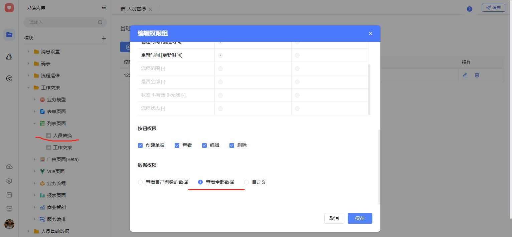
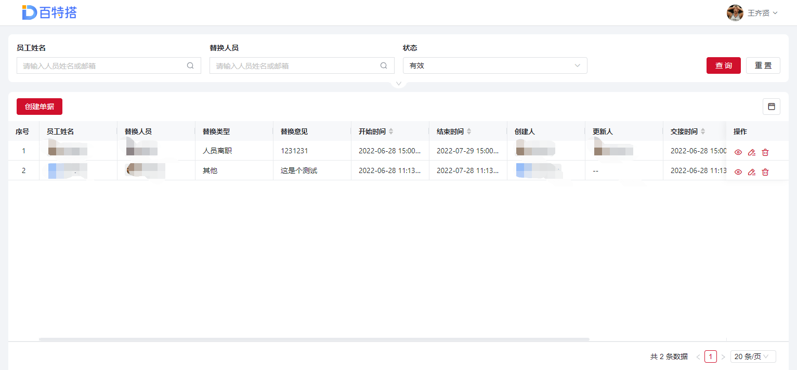
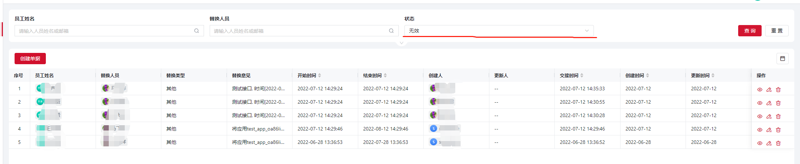

<a id="nMGmq"></a>


## 1.流程交接(待办任务、已办任务、未来的任务)

**接口地址：**${host}/ego\_api/api/v2/manager/flow/handover

**请求方式：**POST

**Body中biz\_params参数：**

|  |  |  |  |
| --- | --- | --- | --- |
| 参数 | 描述 | 类型 | 必填 |
| assignee | 原审批人 | String | 必填 |
| manager | 操作人,可以填调用方的简称，用来区分不同调用方 | String | 必填 |
| transfer\_id | 新审批人 | String | 必填 |
| task\_comment | 操作原因 | String | 必填 |
| type\_list | 类别，done-已办、todo-待办、future-未来的任务  all-以上3种 , add-增量添加流程key | List<String> | 必填 |
| app\_id | 应用ID，通过应用ID获取该应用下所有流程(包含未发布的流程)，对这些流程的后续版本也会产生影响。​ | String |  |
| rc\_ids | 应用下某些模块ID的集合，与app\_id组合使用，  代表指定ap下的某些模块 | List<String> |  |
| process\_key\_list | 流程key集合，与app\_id互斥 | List<String> | ​ |
| start\_time | 替换任务的开始时间戳(精确到秒) | long |  |
| end\_time | 替换任务的结束时间戳(精确到秒) | long |  |
| creator | 创建人(对应列表的创建人) | String |  |
| grade\_flag | 交接范围[是、否、黑名单] 是代表全部数据， 否代表白名单，黑名单代表黑名单 | String | 必填 |

**限制条件：**

1. 使用app\_id做条件时，同一个审批人只能交接一次， 即张三只能交接给李四，不能同时交接给王五，最后一条记录会覆盖前面的记录

2. 如果存在张三交接给李四 和李四交接给王五的2条交接记录，产生的效果是： 设计态原本给张三的任务会交给李四，设计态原本给李四的任务会交接给王五，不会自动递归把所有的任务都给王五

3. 如果不传入start\_time\end\_time，默认对未来任务的影响只有一个自然月时间，即1个自然月后还是原始审批人审批，需要及时更新设计态的流程图。start\_time\end\_time传入时，必须是合法的时间区间。

4. 同一个人在列表中只允许有一条有效的替换记录，如果重新调用接口，最后一次的调用会覆盖前一条记录，被覆盖的记录可以在失效列表查询。

5.修改已办数据时，会判断原审批人是否为流程发起人，如果是流程发起人，则同步修改流程发起人数据。

6.修改待办数据时，不会修改提交节点的审批人。

7. 增量添加流程时，参数type\_list只有一个值[add]：

如果不存在交接记录，无法增量添加，返回异常

{"code":"109999","message":"不存在[zhangsan]交接给[历史]的记录，无法增量添加流程"}

如果原交接记录为全部流程，也无法添加流程数据，抛出异常

{"code":"109999","message":"原数据为全部流程替换，无法新增某些流程"}

​

**参考示例：**


```json
{
	"app_id": "xxx",
	"sign": "xxxx",
	"biz_params": "{\"assignee\":\"zhangsan\",\"manager\":\"财务系统\",\"transfer_id\":\"lisi\",\"task_comment\":\"这是个测试\",\"app_id\":\"test_app_oa86lip2jw\",\"type\":\"all\"}",
	"timestamp": "20220623141753",
	"tenant_id": "test",
	"local": "zh-CN"
}
```


**返回参考示例：**

返回影响的数据行数


```json
{
  "state": "SUCCESS",
  "message": "执行成功",
  "code": "000000",
  "timestamp": "2022-06-15 11:37:15",
  "data": {
      "done": 50, /*修改已办的条数*/
      "todo": 10  /*修改待办的条数*/
  }
}
```


接口返回成功后，该条记录自动维护到系统应用-工作交接-人员替换列表中，如果看不到，请调整列表的数据权限











<a id="d30Cf"></a>


## 2.删除交接记录

**接口地址：**${host}/ego\_api/api/v2/manager/flow/delHandover

**请求方式：**POST

**Body中biz\_params参数：**

|  |  |  |  |
| --- | --- | --- | --- |
| 参数 | 描述 | 类型 | 必填 |
| assignee | 原审批人 | String | 必填 |
| manager | 操作人,可以填调用方的简称，用来区分不同调用方 | String | 必填 |
| task\_comment | 操作原因 | String | 必填 |

**参考示例：**


```json
{
	"app_id": "xxx",
	"sign": "xxxx",
	"biz_params": "{\"assignee\":\"zhangsan\",\"manager\":\"财务系统\",\"task_comment\":\"这是个测试\"}",
	"timestamp": "20220623141753",
	"tenant_id": "test",
	"local": "zh-CN"
}
```


**返回参考示例：**

返回影响的数据行数


```json
{
  "code": "000000",
  "message": "成功",
  "data": true
}
```


**说明：**

被删除的记录可以在人员替换-列表页 查询失效列表获取


​

<a id="kxebA"></a>


## 3.通过流程实例ID查询流程数据(对接外部待办平台场景)

**接口地址：**${host}/ego\_api/api/v2/process/ins/selectPlatformTaskList

**请求方式：**POST

**Body中biz\_params参数：**

|  |  |  |  |
| --- | --- | --- | --- |
| 参数 | 描述 | 类型 | 必填 |
| process\_instance\_id | 流程实例ID | String | 必填 |
| has\_mul\_lang | 是否返回多语字段,默认为false | boolean | 非必填 |
| has\_biz\_data | 是否返回业务模型字段，默认为true | boolean | 非必填 |

**参考示例：**


```json
{
	"app_id": "xxx",
	"sign": "xxxx",
	"biz_params": "{\"process_instance_id\":\"流程实例ID\"}",
	"timestamp": "20220623141753",
	"tenant_id": "test",
	"local": "zh-CN"
}
```


**​**

**出参：**

|  |  |  |  |
| --- | --- | --- | --- |
| 参数名称 | 参数说明 | 类型 | schema |
| code | 状态码 | string |  |
| data | 返回结果对象 | PlatformProcessVo | PlatformProcessVo |
| biz\_code | 业务模型code | string |  |
| biz\_name | 业务模型名称 | string |  |
| business\_key | 业务标识 | string |  |
| initiator | 流程发起人 | PlatformEmpVo | PlatformEmpVo |
| employee\_id | 百特搭平台工号 | string |  |
| employee\_name | 百特搭平台员工姓名 | MultiLang | MultiLang |
| en |  | string |  |
| ja |  | string |  |
| zh |  | string |  |
| head\_image | 人员头像 | string |  |
| process\_instance\_id | 流程实例ID | string |  |
| process\_key | 流程key | string |  |
| process\_name | 流程名称 | MultiLang | MultiLang |
| en |  | string |  |
| ja |  | string |  |
| zh |  | string |  |
| task\_list | 任务实例列表 | array | PlatformTaskVo |
| assignees | 审批人 | array | PlatformEmpVo |
| employee\_id | 百特搭平台工号 | string |  |
| employee\_name | 百特搭平台员工姓名 | MultiLang | MultiLang |
| en |  | string |  |
| ja |  | string |  |
| zh |  | string |  |
| head\_image | 人员头像 | string |  |
| command\_name | 审批按钮名称 | string |  |
| command\_type | 审批按钮类型 | string |  |
| create\_time | 任务创建时间 | string(date-time) |  |
| end\_time | 任务结束时间 | string(date-time) |  |
| finished | 是否完成 1-已办 0-待办 | integer(int32) |  |
| rm\_assignees | 要删除的竞签已办审批人 | List<String> |  |
| node\_id | 节点ID | string |  |
| node\_name | 节点名称 | MultiLang | MultiLang |
| en |  | string |  |
| ja |  | string |  |
| zh |  | string |  |
| open\_url | 链接 | string |  |
| subject | 待办标题 | MultiLang | MultiLang |
| en |  | string |  |
| ja |  | string |  |
| zh |  | string |  |
| task\_comment | 审批意见 | string |  |
| task\_id | 任务ID | string |  |
| task\_type | 任务类型: FIXSTARTEVENT-开始节点 ，FIXENDEVENT-结束节点，其他都是任务节点 | string |  |
| message | 返回结果描述 | string |  |

**​**

**​**

**​**

**​**

**返回参考示例：**


```json
{
  "code": "000000",
  "message": "成功",
  "data": {
    "biz_code": "test_moxingC",
    "biz_name": "模型C",
    "process_key": "test_moxingC",
    "process_name": {
      "zh": "模型C"
    },
    "process_instance_id": "c0958be3-3e30-4a63-8db9-befbe34dca73",
    "initiator": {
      "employee_id": "Wang**",
      "employee_name": {
        "zh": "王**"
      },
      "head_image": "https://s**ea-52e239fb94bg~?image_size=noop&cut_type=&quality=&format=png&sticker_format=.webp"
    },
    "task_list": [
      {
        "task_id": "da459b94-a63d-4c7d-a3cc-9be5cd3c1f90",
        "subject": {
          "zh": "开始",
          "en": ""
        },
        "assignees": [
          {
            "employee_id": "Wang**",
            "employee_name": {
              "zh": "王**"
            },
            "head_image": "https://s1-**-701a-4c58-9cea-52e239fb94bg~?image_size=noop&cut_type=&quality=&format=png&sticker_format=.webp"
          }
        ],
        "create_time": "2022-09-21 18:07:46",
        "end_time": "2022-09-21 18:07:46",
        "node_id": "StartEvent_1",
        "node_name": {
          "zh": "开始",
          "ja": ""
        },
        "command_type": "startEvent",
        "command_name": "流程开始",
        "task_comment": "",
        "task_type": "FIXSTARTEVENT",
        "finished": 1
      },
      {
        "task_id": "4ef130c6-6b4c-4882-877d-b844089bfb20",
        "subject": {
          "zh": "模型C",
          "en": ""
        },
        "assignees": [
          {
            "employee_id": "WangQiXian",
            "employee_name": {
              "zh": "王齐贤"
            },
            "head_image": "https://s1-imfile.feishucdn.com/static-resource/v1/ff932d32-701a-4c58-9cea-52e239fb94bg~?image_size=noop&cut_type=&quality=&format=png&sticker_format=.webp"
          }
        ],
        "create_time": "2022-09-21 18:07:47",
        "end_time": "2022-09-21 18:07:47",
        "node_id": "UserTask_1",
        "node_name": {
          "zh": "提交节点",
          "ja": ""
        },
        "command_type": "startandsubmit",
        "command_name": "提交",
        "task_comment": "",
        "open_url": "https://hotfix.baiteda.com/apps/api/v1/private/form/dispatcher/test_app_oa86lip2jw/hotfix_form_ow5jl04ic5?taskId=4ef130c6-6b4c-4882-877d-b844089bfb20&tenantId=hotfix",
        "task_type": "FIXFLOWTASK",
        "finished": 1
      },
      {
        "task_id": "bab1f38a-daee-4762-8cae-20a263117574",
        "subject": {
          "zh": "模型C",
          "en": ""
        },
        "assignees": [
          {
            "employee_id": "WangQiXian",
            "employee_name": {
              "zh": "王齐贤"
            },
            "head_image": "https://s1-imfile.feishucdn.com/static-resource/v1/ff932d32-701a-4c58-9cea-52e239fb94bg~?image_size=noop&cut_type=&quality=&format=png&sticker_format=.webp"
          }
        ],

      "rm_assignees": [
          {
            "employee_id": "WangQiXian",
            "employee_name": {
              "zh": "王齐贤"
            },
            "head_image": "https://s1-imfile.feishucdn.com/static-resource/v1/ff932d32-701a-4c58-9cea-52e239fb94bg~?image_size=noop&cut_type=&quality=&format=png&sticker_format=.webp"
          }
        ],

        "create_time": "2022-09-21 18:07:47",
        "node_id": "UserTask_03v23jh",
        "node_name": {
          "zh": "用户任务21",
          "ja": ""
        },
        "task_comment": "",
        "open_url": "https://hotfix.baiteda.com/apps/api/v1/private/form/dispatcher/test_app_oa86lip2jw/hotfix_form_ow5jl04ic5?taskId=bab1f38a-daee-4762-8cae-20a263117574&tenantId=hotfix",
        "task_type": "FIXFLOWTASK",
        "finished": 0
      }
    ],
    "business_key": "dab869f6fe604455a0666fcd763cef4d"
  }
}
```

<a id="PXEDB"></a>


## 4.查询指定周期的流程数据

**接口地址：**${host}/ego\_api/api/v2/process/ins/selectTaskList

**请求方式：**POST

**Body中biz\_params参数：**

|  |  |  |  |
| --- | --- | --- | --- |
| 参数 | 描述 | 类型 | 必填 |
| start\_time | 开始时间，必须是yyyy-MM-dd HH:mm:ss格式 | String | 必填 |
| end\_time | 结束时间，必须是yyyy-MM-dd HH:mm:ss格式 | String | 必填 |
| finished | 1-已办 0-待办 | String | 必填 |

**参考示例：**


```json
{"app_id":"bh","sign":"1ac4d3","biz_params":"{\"start_time\":\"2022-11-01 00:00:00\",\"end_time\":\"2022-11-15 00:00:00\",\"finished\":1}","timestamp":"20221117164055","tenant_id":"hotfix","local":"zh-CN"}
```


**返回参考示例：**


[附件: WorkFlowRequestDto.java](../../_assets/uxvnlo2u5mt8i7pb/WorkFlowRequestDto-7c62ce3496.java)


```json
{
    "code": "000000",
    "message": "成功",
    "data": [
        {
            "biz_code": "hotfix_testlst",
            "biz_name": "测试列表功能流程",
            "flow_code": "hotfix_testlst",
            "flow_name": "测试列表功能流程",
            "workflow_id": "902e5609-b9dd-4eb6-ba4d-a07e6761df2a",
            "form_no": "7601961b1c2e47e8a315fa731e7fa43f",
            "pc_url": "https://hotfix.baiteda.com/apps/api/v1/private/form/dispatcher/prddefeishu_app_3770nbcgle/hotfix_form_ijdu0rb7ii?taskId=6ce71503-bc69-4562-83cf-dcb56aa3e838&tenantId=hotfix",
            "mobile_url": "https://hotfix.baiteda.com/apps/api/v1/private/form/dispatcher/prddefeishu_app_3770nbcgle/hotfix_form_ijdu0rb7ii?taskId=6ce71503-bc69-4562-83cf-dcb56aa3e838&tenantId=hotfix",
            "audit_node": "用户任务1",
            "is_start": false,
            "audit_view": "啊史蒂夫a s ",
            "ptype": "YS",
            "pid": "6ce71503-bc69-4562-83cf-dcb56aa3e838",
            "ptitle": "xxxx",
            "pdate_time": "2022-10-23 19:07:51",
            "pcreator_id": "xxx",
            "pcreator_name": "xxx",
            "pto_user_id": "xxx",
            "pto_user_name": "xxx",
            "pend_date_time": "2022-11-02 16:33:57"
        }
    ]
}
```

<a id="Q0PZV"></a>


## 5.更新频控配置

**接口地址：**${host}/ego\_api/api/v2/permission/setReqRateConfig

**请求方式：**POST

**Body中biz\_params参数：**

|  |  |  |  |
| --- | --- | --- | --- |
| 参数 | 描述 | 类型 | 必填 |
| interface\_rate\_enable | 是否开启频控 true/fasle | boolean | 必填 |
| interface\_rate\_type | 频控限制策略：1-不限制 2-记录日志 3-限制 | Int | 必填 |
| rate\_interval | 全局接口默认限频周期 | Int | 必填 |
| interface\_rate | 全局接口默认限频次数 | Int | 必填 |

**参考示例：**


```json
开启
{
	"app_id": "xxx",
	"sign": "xxxx",
	"biz_params": "{\"interface_rate_enable\":true,\"interface_rate_type\":3,\"rate_interval\":10,\"interface_rate\":20}",
	"timestamp": "20220623141753",
	"tenant_id": "test",
	"local": "zh-CN"
}


关闭
{
	"app_id": "xxx",
	"sign": "xxxx",
	"biz_params": "{\"interface_rate_enable\":fasle,\"interface_rate_type\":3,\"rate_interval\":10,\"interface_rate\":20}",
	"timestamp": "20220623141753",
	"tenant_id": "test",
	"local": "zh-CN"
}
```


**返回参考示例：**


```json
{
    "code": "000000",
    "message": "成功",
    "data": true
}
```
