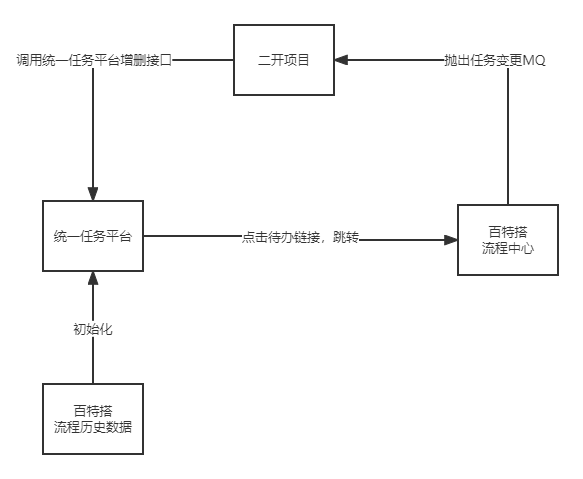

百特搭的流程中心提供通过二开项目方式将百特搭流程数据推送到外部待办任务中心的能力。可以将百特搭系统产生的任务，通过调用外部待办任务中心的标准接口将相关数据推送出去，实现统一任务中心的能力。

在外部待办任务中心，通过点击待办链接，跳回百特搭系统待办处理页，用户点击同意/拒绝/撤回等操作后，将相关数据实时推送到外部待办任务中心。

​

## 接入说明

### 对接方式：实时更新

二开项目监听百特搭平台抛出的任务变更MQ,解析相关数据，先调用删除接口，清理这个流程实例在统一任务中心的所有数据，然后调用新增接口，将该流程实例下所有待办任务重新推送到统一任务中心。

### 特殊说明

MQ格式说明：<https://baiteda.yuque.com/staff-shgita/nbg92z/iz7i1x>

撤回场景：在百特搭平台，撤回是将当前流程实例下所有的待办任务全部自动结束，产生撤回节点的新任务，推送到统一任务中心后，只有撤回节点的待办任务存在。

作废/终止场景：在百特搭平台，在提交节点允许用户进行作废操作，在其他任务节点，支持用户进行终止操作，2者都是将当前流程实例下所有的待办任务全部自动结束，流程实例也结束，推送到统一任务中心后，没有待办任务存在。
