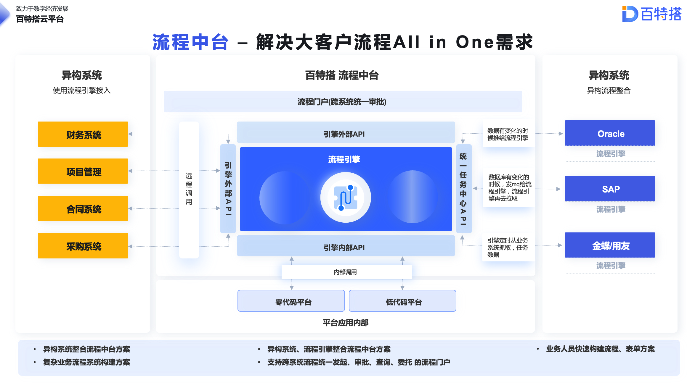
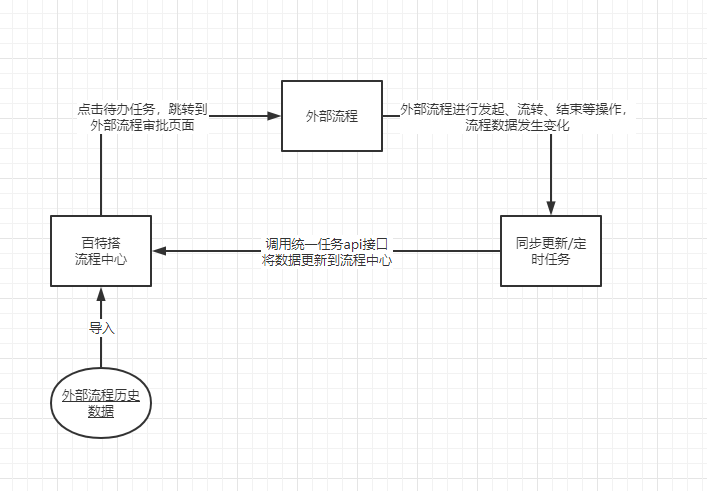
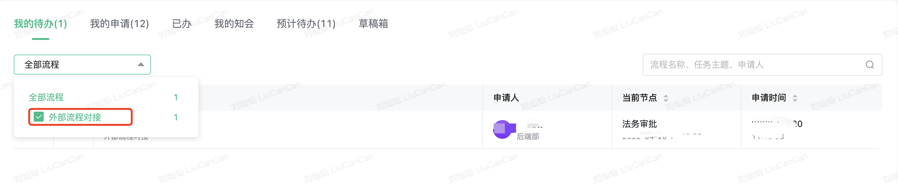

百特搭的流程中心提供对接外部流程引擎的能力。可以将外部系统产生的任务，通过调用百特搭的标准接口将相关数据推送到百特搭的流程中心，实现统一任务中心的能力。

外部流程的待办任务在百特搭平台的流程中心进行展示，点击该任务后跳转到原任务审批页面，进行审批。审批完成后，该任务在流程中心的已办任务列表中能看到。

​

## 1.场景概述

## 2.接入说明

### 2.1对接方式：

|  |  |  |
| --- | --- | --- |
| 对接方式 | 实时更新 | 定时任务接入 |
| 描述 | 外部流程的历史数据同步到百特搭流程平台后，外部流程的任务每次更新(发起、流转、结束)时，调用接口更新数据 | 在外部系统创建一个定时任务，每隔一段时间，抓取当前外部流程的数据(根据时间间隔，获取增量数据)后调用以下接口，将数据同步到流程中心 |
| 优点 | 数据实时更新，不存在定时任务下延迟更新的缺点 | 数据完整，实现比较简单 |
| 缺点 | 需要外部流程有监听相关事件的能力，极限场景下由于网络问题，可能存在脏数据，某个任务已经审批了，在流程中心还在待办中。 | 用户从流程中心点击任务到第三方系统进行审批后，该任务还存在用户的待办列表中，等下次定时任务执行后才会刷新 |

**综上**，推荐2种方式结合使用，在实时更新的基础上，每天凌晨进行一次批量更新；在流程中心展示的外部链接应加入特殊标识，从流程中心的待办列表点击外部任务跳转后，如果该任务已经审批结束，需要调用**更新任务实例接口**，更新数据

### 2.2同步流程定义

流程定义是指通过其他流程引擎创建的流程。

将外部系统的流程定义信息同步至流程中心时，只需要同步流程定义的名称和流程定义key即可。

可以使用**“添加或更新流程定义”**接口将流程定义推送至流程中心。

#### 2.2.1注意

如果只同步流程实例和任务实例的信息，不同步流程定义的信息，那么在流程中心，**我的申请、我的待办、已办**等列表中的流程分类的查询条件就无法展示。如下图：

### 2.3同步流程实例

当外部系统产生新的流程实例时，调用**“添加流程实例”**接口将流程实例信息推送至流程中心。

当外部系统的流程实例信息发生改变时，调用**“更新流程实例”**接口将变更的信息推送至流程中心。

#### 2.3.1注意

流程状态要映射为百特搭这边规定的值。

COMPLETE：已结束

RUNNING：审批中

TERMINATION：已终止

### 2.4同步任务实例

当外部系统产生新的任务实例时，调用**“添加任务实例”**接口将任务实例信息推送至流程中心。

当外部系统的任务实例发生改变时，调用**“更新任务实例”**接口将变更信息推送至流程中心。

#### 2.4.1注意

在更新任务实例时，审批按钮类型根据具体的业务场景要映射为百特搭这边规定的值。

审批按钮类型：

（FIXFLOWTASK类型，会在p\_WFC\_TASK\_STATUS\_DELAY\_TENANT中显示）

|  |  |  |  |
| --- | --- | --- | --- |
| 序号 | 按钮类型 | 名称 | 任务 |
| 1 | general | 同意 | FIXFLOWTASK |
| 2 | transfer | 转办 | FIXFLOWTASK |
| 3 | submit | 提交 | FIXFLOWTASK |
| 4 | endorsement | 加签 | FIXFLOWTASK |
| 5 | skipNode | 跳过 | FIXFLOWTASK |
| 6 | autoEnd | 自动结束 | FIXFLOWTASK |
| 7 | tempSave | 暂存 | FIXFLOWTASK |
| 8 | rejectAndTerminate | 拒绝并终止 | FIXFLOWTASK |
| 9 | rollBackTaskByExpression | 拒绝 | FIXFLOWTASK |
| 10 | revoke | 撤回 | FIXFLOWTASK |
| 11 | terminationProcess | 终止 | FIXFLOWTASK |
| 12 | voteAgainst | 反对 | FIXFLOWTASK |
| 13 | arbitrarilyProcess | 任意流转 | FIXFLOWTASK |
| 14 | endEvent | 流程结束 | FIXENDEVENT |
| 15 | manualSkipNode | 手动跳过 | FIXFLOWTASK |
| 16 | parallelEndorsement | 加签(串签加签) | FIXFLOWTASK |
| 17 | rollBackTaskPreviousStep | 退回-上一步 | FIXFLOWTASK |
| 18 | tempSave | 暂存 | FIXFLOWTASK |
| 19 | startEvent | 子流程结束 | FIXCALLACTIVITYTASK |
| 20 | endEvent | 开始 | FIXSTARTEVENT |
| 21 | restartProcess | 重启 | FIXFLOWTASK |

​

## 下级条目

- [统一任务中心API](001-统一任务中心API.md)
