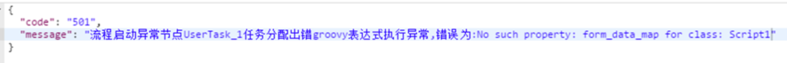
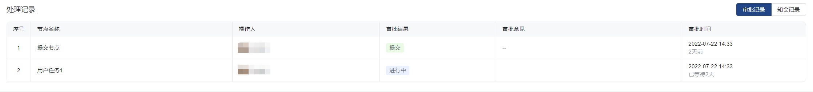

<a id="s62Ot"></a>


#

<a id="Ql43r"></a>


# 1.签名认证工具类：

[附件: SignUtil.java](../../_assets/lxgemu0ud64eq7s1/SignUtil-542364841a.java)


<a id="CGyVJ"></a>


# 2.任务查询

<a id="GHsSh"></a>


## 2.1查询待办列表

查询指定用户的待办任务列表

**接口地址：**${host}/ego\_api/api/v1/common/toDoTaskByPage

**请求方式：**POST

**Body中biz\_params参数：**

|  |  |  |  |
| --- | --- | --- | --- |
| 参数 | 描述 | 类型 | 是否必填 |
| page\_size | 页大小 | String | 必填 |
| page\_index | 当前页 | String | 必填 |
| assignee\_id | 待办人 | String | 必填 |
| subject | 主题关键词（实际查querymsg） | String | 非必填 |
| create\_time\_start | 时间范围查询-start；任务创建时间（待办到达日期） 2019-09-09 00:00:00 | String | 非必填 |
| create\_time\_end | 时间范围查询-end；任务创建时间（待办到达日期) 2019-09-09 00:00:00 | String | 非必填 |
| create\_time\_sort | 按照开始时间排序，正序asc，倒叙desc | String | 非必填 |
| type\_key\_list | 查询指定流程，多个以,分割 | String | 非必填 |

**参考示例：**


```json
{
	"app_id":"app001",
	"sign":"sign001",
	"sign_type":"md5",
	"timestamp":"20200911112230",
	"tenant_id":"test",
	"biz_params":"{\"page_index\":1,\"page_size\":10,\"assignee_id\":\"MaZhiPing\",\"create_time_start\":\"2020-08-06\",\"create_time_end\":\"2020-08-07\",\"subject\":\"测试\",\"type_key_list\":\"process_vx\"}"
}
```


**返回参考示例：**


```json
{
    "code": "000000",
    "message": "成功",
    "data": [
        {
            "taskinstance_id": "任务ID",
            "processinstance_id": "流程实例ID",
            "processdefinition_id": "流程定义版本",
            "node_id": "节点ID",
            "subject": { /*流程主题*/
                "zh": "微信测试",
                "en": "微信测试",
                "ja": "微信测试"
            },
            "assignee": "审批人",
            "create_time": "2020-08-06 10:42:09",
            "bizkey": "dgyxj001",
            "processdefinition_key": "process_vx",
            "formuri": "/apps/api/v1/private/form/dispatcher/app_8o0ev5s9qd/form_3wlkkxu9b1",
            "isdraft": "false",
            "formuriview": "/apps/api/v1/private/form/dispatcher/app_8o0ev5s9qd/form_3wlkkxu9b1",
            "tenant_id": "ego_demo",
            "submit_date": "2020-08-06 10:42:09",
            "submit_user_id": "MaZhiPing",
            "node_name": {
                "zh": "UserTask_18yml02",
                "en": "UserTask_18yml02",
                "ja": "UserTask_18yml02"
            },
            "open_url": "http://abc.com/apps/api/v1/private/form/dispatcher/app_8o0ev5s9qd/form_3wlkkxu9b1?taskId=abbe3212-beda-4efd-93ad-ecbbe7057989&tenantId=ego_demo&k=qdFzuveQ",
            "type_name": {
                "zh": "微信测试",
                "en": "微信测试",
                "ja": "微信测试"
            },
            "type_key": "process_vx",
            "submit_timestamp": 1596681729,
            "create_timestamp": 1596681729
        }
    ]
}
```

<a id="f64YG"></a>


## 2.2查询待办数量

获取人员的待办任务的数量

**接口地址：**${host}/ego\_api/api/v1/common/toDoTaskCount

**请求方式：**POST

**Body中biz\_params参数：**

|  |  |  |  |
| --- | --- | --- | --- |
| 参数key | 参数描述 | 类型 | 是否必填 |
| assignee\_id | 待办人 | String | 必填 |
| subject | 主题关键词（实际查querymsg） | String | 非必填 |
| create\_time\_start | 时间范围查询-start；任务创建时间（待办到达日期） 2019-09-09 00:00:00 | String | 非必填 |
| create\_time\_end | 时间范围查询-end；任务创建时间（待办到达日期) 2019-09-09 00:00:00 | String | 非必填 |
| type\_key\_list | 查询指定流程，多个以,分割 | String | 非必填 |

**参考示例：**


```json
{
	"app_id":"app001",
	"sign":"sign001",
	"sign_type":"md5",
	"timestamp":"20200911112230",
	"tenant_id":"test",
	"biz_params":"{\"assignee_id\":\"MaZhiPing\"}"
}
```


**返回参考示例：**


```json
{
    "code": "000000",
    "message": "成功",
    "data": 6
}
```

<a id="lZfB5"></a>


## 2.3查询已办列表

查询已办任务列表

**接口地址：**${host}/ego\_api/api/v1/common/doneTaskByPage

**请求方式：**POST

**Body中biz\_params参数：**

|  |  |  |  |
| --- | --- | --- | --- |
| 参数key | 参数描述 | 类型 | 是否必填 |
| page\_size | 页大小 | String | 必填 |
| page\_index | 当前页 | String | 必填 |
| assignee\_id | 待办人 | String | 必填 |
| subject | 主题关键词（实际查querymsg） | String | 非必填 |
| end\_time\_start | 时间范围查询-start；任务创建时间（待办到达日期） 2019-09-09 00:00:00 | String | 非必填 |
| end\_time\_end | 时间范围查询-end；任务创建时间（待办到达日期) 2019-09-09 00:00:00 | String | 非必填 |
| end\_time\_sort | 按照结束时间排序，正序asc，倒叙desc | String | 非必填 |
| type\_key\_list | 查询指定流程，多个以,分割 | String | 非必填 |

**参考示例：**


```json
{
	"app_id":"app001",
	"sign":"sign001",
	"sign_type":"md5",
	"timestamp":"20200911112230",
	"tenant_id":"test",
	"biz_params":"{\"page_index\":1,\"page_size\":10,\"assignee_id\":\"MaZhiPing\"}"
}
```


**返回参考示例：**


```json
{
    "code": "000000",
    "message": "成功",
    "data": [
        {
            "taskinstance_id": "ada975da-dd65-4858-8b18-be694e154a52",
            "processinstance_id": "2861cafe-2eb3-48f8-89a5-e244291205be",
            "processdefinition_id": "process_vx:1:2e3bf19e-186a-4045-9c1d-4c10b9aa5e2a",
            "node_id": "UserTask_1",
            "subject": {
                "zh": "微信测试",
                "en": "微信测试",
                "ja": "微信测试"
            },
            "assignee": "MaZhiPing",
            "create_time": "2020-08-06 13:53:14",
            "end_time": "2020-08-06 13:53:14",
            "bizkey": "dgyxj001",
            "command_type": "startandsubmit",
            "command_message": "提交",
            "processdefinition_key": "process_vx",
            "formuri": "/apps/api/v1/private/form/dispatcher/app_8o0ev5s9qd/form_3wlkkxu9b1",
            "isdraft": "false",
            "formuriview": "/apps/api/v1/private/form/dispatcher/app_8o0ev5s9qd/form_3wlkkxu9b1",
            "command_id": "startandsubmit_1",
            "tenant_id": "ego_demo",
            "submit_date": "2020-08-06 13:53:13",
            "submit_user_id": "MaZhiPing",
            "node_name": {
                "zh": "UserTask_1",
                "en": "UserTask_1",
                "ja": "UserTask_1"
            },
            "command_name": {
                "zh": "提交",
                "en": "提交",
                "ja": "提交"
            },
            "process_name": {},
            "open_url": "http://abc.com/apps/api/v1/private/form/dispatcher/app_8o0ev5s9qd/form_3wlkkxu9b1?taskId=ada975da-dd65-4858-8b18-be694e154a52&tenantId=ego_demo",
            "type_name": {
                "zh": "微信测试",
                "en": "微信测试",
                "ja": "微信测试"
            },
            "type_key": "process_vx",
            "submit_timestamp": 1596693193,
            "create_timestamp": 1596693194,
            "end_timestamp": 1596693194
        }
    ]
}
```

<a id="uN1Nh"></a>


## 2.4已办数量

**接口地址：**${host}/ego\_api/api/v1/common/doneTaskCount

**请求方式：**POST

**Body中biz\_params参数：**

|  |  |  |  |
| --- | --- | --- | --- |
| 参数 | 描述 | 类型 | 是否必填 |
| assignee\_id | 待办人 | String | 必填 |
| subject | 主题关键词（实际查querymsg） | String | 非必填 |
| end\_time\_start | 时间范围查询-start；任务创建时间（待办到达日期） 2019-09-09 00:00:00 | String | 非必填 |
| end\_time\_end | 时间范围查询-end；任务创建时间（待办到达日期) 2019-09-09 00:00:00 | String | 非必填 |
| end\_time\_sort | 按照结束时间排序，正序asc，倒叙desc | String | 非必填 |
| type\_key\_list | 查询指定流程，多个以,分割 | String | 非必填 |

**参考示例：**


```json
{
	"app_id":"app001",
	"sign":"sign001",
	"sign_type":"md5",
	"timestamp":"20200911112230",
	"tenant_id":"test",
	"biz_params":"{\"assignee_id\":\"MaZhiPing\"}"
}
```


**返回参考示例：**


```json
{
    "code": "000000",
    "message": "成功",
    "data": 6
}
```

<a id="TvhRc"></a>


## 2.5我的申请列表

查询指定人员发起流程的列表

**接口地址：**/ego\_api/api/v1/common/getMyApplication

**请求方式：**POST

**Body中biz\_params参数：**

|  |  |  |  |
| --- | --- | --- | --- |
| 参数key | 参数描述 | 类型 | 是否必填 |
| page\_size | 页大小 | String | 必填 |
| page\_index | 当前页 | String | 必填 |
| assignee\_id | 申请人 | String | 必填 |
| subject | 主题关键词（实际查querymsg） | String | 非必填 |
| create\_time\_start | 时间范围查询-start；任务创建时间（待办到达日期） 2019-09-09 00:00:00 | String | 非必填 |
| create\_time\_end | 时间范围查询-end；任务创建时间（待办到达日期) 2019-09-09 00:00:00 | String | 非必填 |
| type\_key\_list | 查询指定流程，多个以,分割 | String | 非必填 |
| status | 状态 默认全部（ 审批中approve 已结束 end） | String | 非必填 |
| create\_time\_sort | 按照到达时间排序（参数 asc:正序；desc:倒叙） | String | 非必填 |

**参考示例：**


```json
{
	"app_id":"app001",
	"sign":"sign001",
	"sign_type":"md5",
	"timestamp":"20200911112230",
	"tenant_id":"test",
	"biz_params":"{\"page_index\":1,\"page_size\":10,\"assignee_id\":\"YangJingJie\"}"
}
```


**返回参考示例：**


```json
{
    "code": "000000",
    "message": "成功",
    "data": [
        {
            "process_instance_id": "3523405e-f03a-4b8c-85c8-b1eedb9d5c4e",
            "node_id": "UserTask_100",
            "node_name": {
                "zh": "审批01",
                "en": "审批01",
                "ja": "审批01"
            },
            "status": "RUNNING",
            "biz_key": "DLRW20200907000044",
            "initiator": "YangJingJie",
            "process_definition_id": "agile_yzdlrwbd:19:acd0febc-f888-4c79-aeaa-4211b389dd4f",
            "process_definition_key": "agile_yzdlrwbd",
            "type_name": {
                "zh": "验证代理任务表单",
                "en": "我是英文",
                "ja": "验证代理任务表单"
            },
            "subject": {
                "zh": "DLRW20200907000044",
                "en": "DLRW20200907000044",
                "ja": "DLRW20200907000044"
            },
            "open_url": "https://test.yigowork.com/ego/api/v1/private/goForm/agile_yzdlrwbd?taskId=3ed5f271-1a71-49f3-b7b2-8d36a255c011&tenantId=test",
            "start_time": "2020-09-07 17:57:10",
            "end_time": null,
            "avg_time": "2352",
            "to_do_task_create_time": "2020-09-07 17:57:10",
            "task_assignee_list": [
                "XuJuan"
            ],
            "start_time_stamp": 1599472630,
            "end_time_stamp": null,
            "to_do_task_create_time_stamp": 1599472630
        }
    ]
}
```

<a id="vy4ES"></a>


## 2.6我的申请数量

查询指定人员发起流程的数量

**接口地址：**${host}/ego\_api/api/v1/common/getMyApplicationCount

**请求方式：**POST

**Body中biz\_params参数：**

|  |  |  |  |
| --- | --- | --- | --- |
| 参数 | 描述 | 类型 | 是否必填 |
| assignee\_id | 申请人 | String | 必填 |
| subject | 主题关键词（实际查querymsg） | String | 非必填 |
| create\_time\_start | 时间范围查询-start；申请时间 2019-09-09 00:00:00 | String | 非必填 |
| create\_time\_end | 时间范围查询-end；申请时间 2019-09-09 00:00:00 | String | 非必填 |
| type\_key\_list | 查询指定流程，多个以,分割 | String | 非必填 |
| status | 状态 默认全部（ 审批中approve 已结束 end） | String | 非必填 |
| create\_time\_sort | 按照到达时间排序（参数 asc:正序；desc:倒叙） | String | 非必填 |

**参考示例：**


```json
{
	"app_id":"app001",
	"sign":"sign001",
	"sign_type":"md5",
	"timestamp":"20200911112230",
	"tenant_id":"test",
	"biz_params":"{\"assignee_id\":\"YangJingJie\"}"
}
```


**返回参考示例：**


```json
{
    "code": "000000",
    "message": "成功",
    "data": 288
}
```

<a id="4Y1j8"></a>


## 2.7知会列表

查询指定人员的的知会列表

**接口地址：**${host}/ego\_api/api/v1/common/getNoticeListPageByUserId

**请求方式：**POST

**Body中biz\_params参数：**

|  |  |  |  |
| --- | --- | --- | --- |
| 参数key | 参数描述 | 类型 | 是否必填 |
| assignee\_id | 当前人 | String | 必填 |
| page\_size | 页大小 | String | 必填 |
| page\_index | 当前页 | String | 必填 |
| subject | 主题关键词（实际查querymsg） | String | 非必填 |
| create\_time\_start | 时间范围查询-start；创建时间 2019-09-09 00:00:00 | String | 非必填 |
| create\_time\_end | 时间范围查询-end；创建时间 2019-09-09 00:00:00 | String | 非必填 |
| type\_key\_list | 查询指定流程，多个以,分割 | String | 非必填 |
| create\_time\_sort | 按照开始时间排序，正序asc，倒叙desc | String | 非必填 |
| end\_time\_sort | 按照更新时间排序，正序asc，倒叙desc | String | 非必填 |
| is\_read | 未读已读标识 | String | 必填 |

**参考示例：**


```json
{
	"app_id":"app001",
	"sign":"sign001",
	"sign_type":"md5",
	"timestamp":"20200911112230",
	"tenant_id":"test",
	"biz_params":"{\"page_index\":1,\"page_size\":10,\"assignee_id\":\"YangJingJie\",\"is_read\":\"1\"}"
}
```


**返回参考示例：**


```json
{
    "code": "000000",
    "message": "成功",
    "data": [
        {
            "processinstance_id": "844b6dc8-8ff5-4410-8607-66eb8c887d57",
            "processdefinition_id": "agile_yzdlrwbd:19:acd0febc-f888-4c79-aeaa-4211b389dd4f",
            "node_id": "UserTask_5y1cmefhvaj7v",
            "subject": {
                "zh": "DLRW20200907000043",
                "en": "DLRW20200907000043",
                "ja": "DLRW20200907000043"
            },
            "create_time": "2020-09-07 17:53:32",
            "end_time": "2020-09-07 17:54:43",
            "bizkey": "DLRW20200907000043",
            "processdefinition_key": "agile_yzdlrwbd",
            "submit_user_id": "YangJingJie",
            "node_name": {
                "zh": "审批02",
                "en": "审批02",
                "ja": "审批02"
            },
            "command_name": {},
            "process_name": {},
            "open_url": "https://test.yigowork.com/ego/api/v1/private/goForm/agile_yzdlrwbd?noticeId=342e9963-51ba-457a-bd8b-47fd8ae7a539&tenantId=test",
            "type_name": {
                "zh": "验证代理任务表单",
                "en": "我是英文",
                "ja": "验证代理任务表单"
            },
            "create_timestamp": 1599472412,
            "end_timestamp": 1599472483
        }
    ]
}
```

<a id="9IfXq"></a>


## 2.8知会数量

查询指定人员的知会数量

**接口地址：**${host}/ego\_api/api/v1/common/getNoticeCountByUserId

**请求方式：**POST

**Body中biz\_params参数：**

|  |  |  |  |
| --- | --- | --- | --- |
| 参数key | 参数描述 | 类型 | 是否必填 |
| assignee\_id | 当前人 | String | 必填 |
| subject | 主题关键词（实际查querymsg） | String | 非必填 |
| create\_time\_start | 时间范围查询-start；创建时间 2019-09-09 00:00:00 | String | 非必填 |
| create\_time\_end | 时间范围查询-end；创建时间 2019-09-09 00:00:00 | String | 非必填 |
| type\_key\_list | 查询指定流程，多个以,分割 | String | 非必填 |
| create\_time\_sort | 按照开始时间排序，正序asc，倒叙desc | String | 非必填 |
| end\_time\_sort | 按照更新时间排序，正序asc，倒叙desc | String | 非必填 |
| is\_read | 未读已读标识 | String | 必填 |

**参考示例：**


```json
{
	"app_id":"app001",
	"sign":"sign001",
	"sign_type":"md5",
	"timestamp":"20200911112230",
	"tenant_id":"test",
	"biz_params":"{\"page_index\":1,\"page_size\":1,\"assignee_id\":\"YangJingJie\",\"is_read\":\"1\"}"
}
```


**返回参考示例：**


```json
{
    "code": "000000",
    "message": "成功",
    "data": 19
}
```

<a id="PAAIK"></a>


## 2.9查询委托待办列表

**接口地址：**${host}/ego\_api/api/v1/common/agentToDoTaskByPage

**请求方式：**POST

**Body中biz\_params参数：**

|  |  |  |  |
| --- | --- | --- | --- |
| 参数key | 参数描述 | 类型 | 是否必填 |
| page\_size | 页大小 | String | 必填 |
| page\_index | 当前页 | String | 必填 |
| assignee\_id | 人员id | String | 必填 |
| subject | 主题关键词（实际查querymsg） | String | 非必填 |
| create\_time\_start | 时间范围查询-start；任务创建时间（待办到达日期） 2019-09-09 00:00:00 | String | 非必填 |
| create\_time\_end | 时间范围查询-end；任务创建时间（待办到达日期) 2019-09-09 00:00:00 | String | 非必填 |
| create\_time\_sort | 按照开始时间排序，正序asc，倒叙desc | String | 非必填 |
| type\_key\_list | 查询指定流程，多个以,分割 | String | 非必填 |
| agent\_id | 委托人id，不传则查询所有委托代办 | String | 非必填 |

**参考示例：**


```json
{
	"app_id":"app001",
	"sign":"sign001",
	"sign_type":"md5",
	"timestamp":"20200911112230",
	"tenant_id":"test",
	"biz_params":"{\"page_index\":1,\"page_size\":10,\"assignee_id\":\"HeZengPeng\"}"
}
```


**返回参考示例：**


```json
{
    "code": "000000",
    "message": "成功",
    "data": [
        {
            "taskinstance_id": "5dafcc49-863f-419b-b1c4-b45ccfb8418c",
            "processinstance_id": "2861cafe-2eb3-48f8-89a5-e244291205be",
            "processdefinition_id": "process_vx:1:2e3bf19e-186a-4045-9c1d-4c10b9aa5e2a",
            "node_id": "UserTask_18yml02",
            "subject": {
                "zh": "微信测试",
                "en": "微信测试",
                "ja": "微信测试"
            },
            "assignee": "MaZhiPing",
            "create_time": "2020-08-06 13:53:14",
            "bizkey": "dgyxj001",
            "processdefinition_key": "process_vx",
            "formuri": "/apps/api/v1/private/form/dispatcher/app_8o0ev5s9qd/form_3wlkkxu9b1",
            "isdraft": "false",
            "formuriview": "/apps/api/v1/private/form/dispatcher/app_8o0ev5s9qd/form_3wlkkxu9b1",
            "tenant_id": "test",
            "submit_date": "2020-08-06 13:53:13",
            "submit_user_id": "MaZhiPing",
            "node_name": {
                "zh": "UserTask_18yml02",
                "en": "UserTask_18yml02",
                "ja": ""
            },
            "command_name": {
                "ja": ""
            },
            "process_name": {},
            "open_url": "http://ego.purvar.com/apps/api/v1/private/form/dispatcher/app_8o0ev5s9qd/form_3wlkkxu9b1?taskId=5dafcc49-863f-419b-b1c4-b45ccfb8418c&tenantId=test",
            "type_name": {},
            "submit_timestamp": 1596693193,
            "create_timestamp": 1596693194
        }
    ]
}
```

<a id="ogEQK"></a>


## 2.10查询委托代办数量

根据用户id查询委托给当前用户的任务数量以及委托人id

**接口地址：**${host}/ego\_api/api/v1/common/agentToDoTaskUser

**请求方式：**POST

**Body中biz\_params参数：**

|  |  |  |  |
| --- | --- | --- | --- |
| 参数key | 参数描述 | 类型 | 是否必填 |
| assignee\_id | 人员id | String | 必填 |
| subject | 主题关键词（实际查querymsg） | String | 非必填 |
| create\_time\_start | 时间范围查询-start；任务创建时间（待办到达日期） 2019-09-09 00:00:00 | String | 非必填 |
| create\_time\_end | 时间范围查询-end；任务创建时间（待办到达日期) 2019-09-09 00:00:00 | String | 非必填 |
| create\_time\_sort | 按照开始时间排序，正序asc，倒叙desc | String | 非必填 |
| type\_key\_list | 查询指定流程，多个以,分割 | String | 非必填 |
| agent\_id | 委托人id，不传则查询所有委托代办 | String | 非必填 |

**参考示例：**


```json
{
	"app_id":"app001",
	"sign":"sign001",
	"sign_type":"md5",
	"timestamp":"20200911112230",
	"tenant_id":"test",
	"biz_params":"{\"assignee_id\":\"HeZengPeng\"}"
}
```


**返回参考示例：**


```json
{
    "code": "000000",
    "message": "成功",
    "data": [
        {
            "consigner_id": "MaZhiPing",
            "count": 22
        },
        {
            "consigner_id": "FanShuai",
            "count": 0
        }
    ]
}
```

<a id="JZnsB"></a>


## 2.11查询代理未读知会列表

**接口地址：**${host}/ego\_api/api/v1/common/getAgentNoticeByUserId

**请求方式：**POST

**Body中biz\_params参数：**

|  |  |  |  |
| --- | --- | --- | --- |
| 参数key | 参数描述 | 类型 | 是否必填 |
| assignee\_id | 申请人 | String | 必填 |
| page\_size | 页大小 | String | 必填 |
| page\_index | 当前页 | String | 必填 |
| subject | 主题关键词（实际查querymsg） | String | 非必填 |
| create\_time\_start | 时间范围查询-start；任务创建时间（待办到达日期） 2019-09-09 00:00:00 | String | 非必填 |
| create\_time\_end | 时间范围查询-end；任务创建时间（待办到达日期) 2019-09-09 00:00:00 | String | 非必填 |
| create\_time\_sort | 按照开始时间排序，正序asc，倒叙desc | String | 非必填 |
| type\_key\_list | 查询指定流程，多个以,分割 | String | 非必填 |
| is\_read | 未读已读标识 | String | 非必填 |

**参考示例：**


```json
{
	"app_id":"app001",
	"sign":"sign001",
	"sign_type":"md5",
	"timestamp":"20200911112230",
	"tenant_id":"test",
	"biz_params":"{\"page_index\":1,\"page_size\":10,\"assignee_id\":\"HeZengPeng\",\"is_read\":\"0\"}"
}
```


**返回参考示例：**


```json
{
    "code": "000000",
    "message": "成功",
    "data": [
        {
            "processinstance_id": "2861cafe-2eb3-48f8-89a5-e244291205be",
            "processdefinition_id": "process_vx:1:2e3bf19e-186a-4045-9c1d-4c10b9aa5e2a",
            "node_id": "UserTask_18yml02",
            "subject": {
                "zh": "代理知会主题",
                "en": "代理知会主题"
            },
            "create_time": "2020-09-02 15:34:21",
            "end_time": "2020-09-02 15:34:39",
            "bizkey": "dgyxj001",
            "processdefinition_key": "process_vx",
            "submit_user_id": "MaZhiPing",
            "node_name": {
                "zh": "UserTask_18yml02",
                "en": "UserTask_18yml02",
                "ja": "UserTask_18yml02"
            },
            "command_name": {},
            "process_name": {},
            "open_url": "http://ego.purvar.com/apps/api/v1/private/form/dispatcher/app_8o0ev5s9qd/form_3wlkkxu9b1?noticeId=ce465bf9-13fc-487e-8c6c-6690758bc528&tenantId=ego_jd2",
            "type_name": {},
            "create_timestamp": 1599032061,
            "end_timestamp": 1599032079
        }
    ]
}
```

<a id="kB0xY"></a>


## 2.12查询代理未读知会数量

**接口地址：**${host}/ego\_api/api/v1/common/getAgentNoticeCountByUserId

**请求方式：**POST

**Body中biz\_params参数：**

|  |  |  |  |
| --- | --- | --- | --- |
| 参数key | 参数描述 | 类型 | 是否必填 |
| assignee\_id | 申请人 | String | 必填 |
| subject | 主题关键词（实际查querymsg） | String | 非必填 |
| create\_time\_start | 时间范围查询-start；创建时间 2019-09-09 00:00:00 | String | 非必填 |
| create\_time\_end | 时间范围查询-end；创建时间 2019-09-09 00:00:00 | String | 非必填 |
| type\_key\_list | 查询指定流程，多个以,分割 | String | 非必填 |

**参考示例：**


```json
{
    "app_id":"app001",
    "sign":"sign001",
    "sign_type":"md5",
    "timestamp":"20200911112230",
    "tenant_id":"test",
    "biz_params":"{\"assignee_id\":\"HeZengPeng\"}"
}
```


**返回参考示例：**


```json
{
    "code": "000000",
    "message": "成功",
    "data":10
}
```

<a id="YBbw0"></a>


# 3.通用接口

<a id="996F7"></a>


## 3.1启动并提交流程

发起并提交一条流程

**接口地址：**${host}/ego\_api/api/v1/common/startProcessAndSubmit

**请求方式：**POST

**Body中biz\_params参数：**

|  |  |  |  |
| --- | --- | --- | --- |
| 参数key | 参数描述 | 类型 | 是否必填 |
| initiator\_id | 提交人id | String | 必填 |
| process\_definition\_key | 流程定义key | String | 必填 |
| process\_definition\_id | 流程定义id，含版本号，可指定版本启动 | String | 非必填 |
| business\_key | 业务主键 | String | 必填 |
| transient\_variable | 瞬时变量对象集合（流程定义时要求有的值必须要填写） | map对象{} | 非必填 |
| notice\_user\_id\_list | 开始节点发知会的人id列表 | String | 非必填 |
| tenant\_id | 租户id | String | 非必填 |
| check\_initiator\_exist | 检查发起人是否在组织架构中，默认为false | Boolean | 非必填 |
| idempotent | 是否开启幂等校验，取值范围[true/false],默认为true。  幂等逻辑：同一个process\_definition\_key+business\_key只能发起一条流程实例 | Boolean | 非必填 |
| optional\_node\_assignee | 同意操作，自选下个节点以及审批人 --6.1版本添加 | map对象{} | 非必填 |

​

**参考示例：**


```json
{
	"app_id": "app001",
	"timestamp": "20200621103634",
	"sign": "sign001",
	"tenant_id":"test",
	"biz_params": "{\"initiator_id\":\"MaZhiPing\",\"process_definition_key\":\"process_vx\",\"business_key\":\"dgy001\",\"transient_variable\":{\"flow_info_map\":{},\"flow_form_map\":{\"form_3wlkkxu9b1\":\"/apps/api/v1/private/form/dispatcher/app_8o0ev5s9qd/form_3wlkkxu9b1\"},\"form_data_map\":{\"app_8o0ev5s9qd_Wx_U\":{\"uid\":\"b6b35996a14548a1a1a1ec5f87c8aab5\",\"update_time\":1593962569000,\"creator\":\"MaZhiPing\"}"
}
```


**返回参考示例：**


```json
{
    "code": "000000",
    "message": "成功",
    "data": {
        "process_instance_id": "7b5c5c75-7eba-488f-ba60-27ea68ba7015",
        "process_definition_id": "process_vx:2:34f06229-2ade-4a7c-b3bc-6af3a52bb261",
        "process_location": "UserTask_1brrh84",
        "process_status": "RUNNING"
    }
}
```

<a id="pNFIW"></a>


##

出参错误示例1: 参数格式不对

这种场景使用 <https://baiteda.yuque.com/staff-shgita/nbg92z/ydn4du?singleDoc#> 《表单API接口》的apps/api/v1/openapi/process/submitProcess接口





绑定业务模型的流程，transient\_variable入参格式：


```json
{
	"flow_app_map": {
		"app_id": "testfeishu_app_3kuseu51px",
		"data_code": "dailiuchengshenhe_rwfq9lie"
	},
	"flow_info_map": {},
	"flow_form_map": {
		"form_l0se3nn4sd": "/apps/api/v1/private/form/dispatcher/应用ID/表单form key"
	},
	"form_data_map": {
		"dailiuchengshenhe_rwfq9lie/绑定的业务模型code": {
			"xialxinkai": "表字段和对应的值"
		}
	},
	"sub_data_map": {},
	"sub_data_map_single": {}
}
```


不绑定业务模型的流程，transient\_variable入参格式：


```plain
{
  "key1":"参数1",
   "key2":"参数2",
   "key3":参数3
}
```

<a id="e2SlC"></a>


## ​

<a id="FJt4C"></a>


## 3.2获取审批按钮

**接口地址：**${host}/ego\_api/api/v1/common/getTaskBtn

**请求方式：**POST

**Body中biz\_params参数：**

|  |  |  |  |
| --- | --- | --- | --- |
| 参数 | 参数 | 类型 | 是否必填 |
| task\_instance\_id | 任务实例id | String | 必填 |
| user\_id | 用户id | String | 必填 |

**参考示例：**


```json
{
 "app_id":"app001",
 "sign":"sign001",
 "sign_type":"md5",
 "timestamp":"1111",
 "tenant_id":"test",
 "biz_params":"{\"task_instance_id\":\"c8c61c8b-262f-43f7-8ea5-b9f323091819\",\"user_id\":\"MaFeiXiang\"}"
}
```


**返回参考示例：**


```json
{
    "code": "000000",
    "message": "成功",
    "data": {
        "command_list": [
            {
                "command_id": "general",
                "command_type": "general",
                "command_name": {
                    "zh": "同意",
                    "en": "Approve",
                    "ja": "承認"
                },
                "custom": 0
            },
            {
                "command_id": "custom_pk7epo3e",
                "command_type": "rollBackTaskByExpression",
                "command_name": {
                    "zh": "自定义拒绝",
                    "en": "custom_pk7epo3e",
                    "ja": "custom_pk7epo3e"
                },
                "command_description": {
                    "zh": "自定义拒绝说明",
                    "en": "自定义拒绝说明",
                    "ja": "自定义拒绝说明"
                },
                "custom": 1
            },
            {
                "command_id": "rollBackTaskByExpression",
                "command_type": "rollBackTaskByExpression",
                "command_name": {
                    "zh": "拒绝",
                    "en": "Reject",
                    "ja": "却下"
                },
                "custom": 0
            },
            {
                "command_id": "endorsement",
                "command_type": "endorsement",
                "command_name": {
                    "zh": "加签",
                    "en": "Add Approver",
                    "ja": "追加"
                },
                "custom": 0
            },
            {
                "command_id": "transfer",
                "command_type": "transfer",
                "command_name": {
                    "zh": "转办",
                    "en": "Transfer",
                    "ja": "代理承認"
                },
                "custom": 0
            },
            {
                "command_id": "generalTaskNotice",
                "command_type": "generalTaskNotice",
                "command_name": {
                    "zh": "知会",
                    "en": "Notify",
                    "ja": "通知"
                },
                "custom": 0
            },
            {
                "command_id": "custom_9odb1eqe",
                "command_type": "general",
                "command_name": {
                    "zh": "zdy同意",
                    "en": "custom_9odb1eqe",
                    "ja": "custom_9odb1eqe"
                },
                "command_description": {
                    "zh": "自定义同意说明",
                    "en": "自定义同意说明",
                    "ja": "自定义同意说明"
                },
                "custom": 1
            },
            {
                "command_id": "custom_2hqadryt",
                "command_type": "endorsement",
                "command_name": {
                    "zh": "自定义加签",
                    "en": "custom_2hqadryt",
                    "ja": "custom_2hqadryt"
                },
                "command_description": {
                    "zh": "自定义加签说明",
                    "en": "自定义加签说明",
                    "ja": "自定义加签说明"
                },
                "custom": 1
            },
            {
                "command_id": "custom_wfsrqru0",
                "command_type": "transfer",
                "command_name": {
                    "zh": "自定义转办",
                    "en": "custom_wfsrqru0",
                    "ja": "custom_wfsrqru0"
                },
                "command_description": {
                    "zh": "自定义转办说明",
                    "en": "自定义转办说明",
                    "ja": "自定义转办说明"
                },
                "custom": 1
            },
            {
                "command_id": "custom_mg0qm078",
                "command_type": "generalTaskNotice",
                "command_name": {
                    "zh": "自定义知会",
                    "en": "custom_mg0qm078",
                    "ja": "custom_mg0qm078"
                },
                "command_description": {
                    "zh": "自定义知会说明",
                    "en": "自定义知会说明",
                    "ja": "自定义知会说明"
                },
                "custom": 1
            },
            {
                "command_id": "custom_avqac7mz",
                "command_type": "tempSave",
                "command_name": {
                    "zh": "自定义暂存",
                    "en": "custom_avqac7mz",
                    "ja": "custom_avqac7mz"
                },
                "command_description": {
                    "zh": "自定义暂存说明",
                    "en": "自定义暂存说明",
                    "ja": "自定义暂存说明"
                },
                "custom": 1
            },
            {
                "command_id": "custom_6pjrcfcs",
                "command_type": "rejectAndTerminate",
                "command_name": {
                    "zh": "自定义终止",
                    "en": "custom_6pjrcfcs",
                    "ja": "custom_6pjrcfcs"
                },
                "command_description": {
                    "zh": "自定义终止说明",
                    "en": "自定义终止说明",
                    "ja": "自定义终止说明"
                },
                "custom": 1
            }
        ],
        "node_id": "UserTask_1brrh84",
        "node_name": {
            "zh": "组长审批",
            "en": "组长审批英文",
            "ja": "组长审批日文"
        },
        "process_definition_id": "test_baimingdan_process:2:34f06229-2ade-4a7c-b3bc-6af3a52bb261",
        "process_definition_key": "test_baimingdan_process",
        "process_definition_name": {
            "zh": "白名单测试",
            "en": "test_baimingdan_process",
            "ja": "test_baimingdan_process"
        },
        "process_instance_id": "7b5c5c75-7eba-488f-ba60-27ea68ba7015"
    }
}
```

<a id="FD5PA"></a>


### 3.2.1提交节点 默认按钮类型

|  |  |  |
| --- | --- | --- |
| 按钮ID | 按钮类型 | 按钮说明 |
| submit\_1 | submit | 提交 |
| revoke\_1 | revoke | 撤回 |
| notice\_1 | generalTaskNotice | 加签 |
| terminationProcess\_1 | terminationProcess | 作废 |

<a id="XHrS1"></a>


### 3.2.2人工任务节点 默认按钮类型

|  |  |  |
| --- | --- | --- |
| 按钮ID | 按钮类型 | 按钮说明 |
| general | general | 同意/加签同意 |
| rollBackTaskByExpression | rollBackTaskByExpression | 拒绝 |
| parallelEndorsement | parallelEndorsement | 加签 |
| transfer | transfer | 转办 |
| revoke | revoke | 撤回 |
| rejectAndTerminate | rejectAndTerminate | 终止 |
| tempSave | tempSave | 暂存 |
| generalTaskNotice | generalTaskNotice | 知会 |
| voteAgree | voteAgree | 投票同意 |
| voteAgainst | voteAgainst | 投票反对 |

<a id="7UMw7"></a>


## 3.3通用执行(同意,终止,撤回,转办,拒绝(退回),暂存,加签)

**接口地址：**${host}/ego\_api/api/v1/common/runTaskProcess

**请求方式：**POST

**Body中biz\_params参数：**

|  |  |  |  |
| --- | --- | --- | --- |
| 参数key | 参数描述 | 类型 | 是否必填 |
| task\_instance\_id | 任务实例id | String | 必填 |
| command\_id | 任务对应按钮id  可根据下方“**获取按钮**”接口查询  command\_id | String | 必填 |
| command\_type | 任务对应按钮类型  可根据下方“**获取按钮**”接口查询  command\_type | String | 必填 |
| assignee\_id | 处理人id，代理任务时 assignee为当前用户也就是代理处理人 | String | 必填 |
| transient\_variable | 其他在流程中定义的瞬时变量 | map对象{} | 非必填 |
| task\_comment | 处理意见 | String | 非必填 |
| agent\_id | 代理任务时必填，否则不会标记代理处理人， 委托人id A委托B处理，这里填A | String | 非必填 |
| transfer\_user\_id | 转办人id，转办时必填 | String | 非必填 |
| endorsement\_user\_id\_list | 加签人列表；如有多人，用“,”分隔,加签操作时必填 | String | 非必填 |
| roll\_back\_node\_id | 想要退回到的节点id ,退回指定节点时必填 | String | 非必填 |
| optional\_node\_assignee | 同意操作，自选下个节点以及审批人 --6.1版本添加 | map对象{} | 非必填 |

**​**

**前置条件： 通过获取审批按钮接口 获取可操作按钮，填入参数中的command\_id、command\_type。**

**逻辑上可以用上个接口的默认按钮类型进行填充。**

​

**代理审批： 用户A委托给用户B审批，用户A在流程中心-我的待办能看到这些任务，用户B在流程中心-代理待办能看到这些任务。**

**如果是用户A审批，则assignee\_id填用户A,agent\_id为空；**

**如果是用户B审批，则assignee\_id填用户B,agent\_id填用户A**

<a id="BuTMK"></a>


### 3.3.1同意操作

|  |  |  |  |
| --- | --- | --- | --- |
| 参数key | 参数描述 | 类型 | 是否必填 |
| task\_instance\_id | 任务实例id | String | 必填 |
| command\_id | general或自定义同意按钮的id | String | 必填 |
| command\_type | general | String | 必填 |
| assignee\_id | assignee\_id是当前登录的审批人ID；  如果是审批代理任务，agent\_id填委托人ID；  审批个人任务时，值为空 | String | 必填 |
| agent\_id | String | 非必填 |
| transient\_variable | 瞬时变量 | map对象{} | 必填 |
| task\_comment | 处理意见 | String | 非必填 |
| optional\_node\_assignee | 同意操作，自选下个节点以及审批人 -- 6.1版本添加 | map对象{} | 非必填 |

**​**

**optional\_node\_assignee 参考示例**

**​**


```plain
  { ...其他参数
   "optional_node_assignee": {
      "UserTask_1ee37sf": [
        "ma_kw", "ma_zhiping"
      ],
       "UserTask_34dd23d": [
        "qiyu", "zhangsan"
      ]
    }
  }
```


**​**

**​**

**参考示例：**


```json
{
 "app_id": "app001",
 "timestamp": "20200621103634",
 "sign": "sign001",
 "tenant_id":"test",
 "biz_params": "{\"task_instance_id\":\"c8c61c8b-262f-43f7-8ea5-b9f323091819\",\"command_id\":\"general\",\"command_type\":\"general\",\"assignee_id\":\"MaFeiXiang\",\"agent_id\":\"\",\"transient_variable\":{\"flow_info_map\":{},\"flow_form_map\":{\"form_dghn389uv2\":\"/apps/api/v1/private/form/dispatcher/app_mh86d5wq3g/form_dghn389uv2\"},\"form_data_map\":{\"app_mh86d5wq3g_Yunxing\":{\"creator\":\"edad3361e2b15ae5c75bbab2c5b9a78c\",\"create_time\":1597142317000,\"process_location\":\"\",\"app_version\":\"1597126354589\",\"Amoxing_id\":\"\",\"tupian\":\"\",\"uid\":\"674aa5bc00e242db99696976bf9650b8\",\"update_time\":1597142317000,\"process_instance_id\":\"\",\"process_status\":\"\",\"name\":\"\",\"prrocess_key\":\"\",\"id\":76}},\"sub_data_map\":{},\"sub_data_map_single\":{}},\"transfer_user_id\":\"12098\",\"endorsement_user_id_list\":\"12098\"}"
}
```


**返回参考示例：**


```json
{
    "code": "000000",
    "message": "成功",
    "data": {
        "business_key": "674aa5bc00e242db99696976bf9650b8",
        "node_id": "UserTask_1brrh84",//审批任务操作的节点
        "node_name": {
            "zh": "组长审批",
            "en": "组长审批",
            "ja": ""
        },
        "process_definition_key": "test_baimingdan_process",
        "process_location": "UserTask_01xl3pz",//审批后流程所在位置
        "process_status": "RUNNING"
    }
}
```

<a id="jD0aS"></a>


### 3.3.2拒绝(退回)操作

|  |  |  |  |
| --- | --- | --- | --- |
| 参数key | 参数描述 | 类型 | 是否必填 |
| task\_instance\_id | 任务实例id | String | 必填 |
| command\_id | rollBackTaskByExpression或自定义拒绝按钮的id | String | 必填 |
| command\_type | rollBackTaskByExpression | String | 必填 |
| assignee\_id | assignee\_id是当前登录的审批人ID；  如果是审批代理任务，agent\_id填委托人ID；  审批个人任务时，值为空 | String | 必填 |
| agent\_id | String | 非必填 |
| transient\_variable | 瞬时变量 | map对象{} | 必填 |
| task\_comment | 处理意见 | String | 必填 |
| roll\_back\_node\_id | 想要退回到的节点id ,退回指定节点时必填 | String | 非必填 |

**参考示例：**


```json
{
 "app_id": "app001",
 "timestamp": "20200621103634",
 "sign": "sign001",
 "tenant_id":"test",
 "biz_params": "{\"task_instance_id\":\"c8c61c8b-262f-43f7-8ea5-b9f323091819\",\"command_id\":\"rollBackTaskByExpression\",\"command_type\":\"rollBackTaskByExpression\",\"assignee_id\":\"MaFeiXiang\",\"agent_id\":\"\",\"transient_variable\":{\"flow_info_map\":{},\"flow_form_map\":{\"form_dghn389uv2\":\"/apps/api/v1/private/form/dispatcher/app_mh86d5wq3g/form_dghn389uv2\"},\"form_data_map\":{\"app_mh86d5wq3g_Yunxing\":{\"creator\":\"edad3361e2b15ae5c75bbab2c5b9a78c\",\"create_time\":1597142317000,\"process_location\":\"\",\"app_version\":\"1597126354589\",\"Amoxing_id\":\"\",\"tupian\":\"\",\"uid\":\"674aa5bc00e242db99696976bf9650b8\",\"update_time\":1597142317000,\"process_instance_id\":\"\",\"process_status\":\"\",\"name\":\"\",\"prrocess_key\":\"\",\"id\":76}},\"sub_data_map\":{},\"sub_data_map_single\":{}}}"
}
```


**返回参考示例：**


```json
{
    "code": "000000",
    "message": "成功",
    "data": {
        "business_key": "674aa5bc00e242db99696976bf9650b8",
        "node_id": "UserTask_1brrh84",//审批任务操作的节点
        "node_name": {
            "zh": "组长审批",
            "en": "组长审批",
            "ja": ""
        },
        "process_definition_key": "test_baimingdan_process",
        "process_location": "UserTask_01xl3pz",//审批后流程所在位置
        "process_status": "RUNNING"
    }
}
```

<a id="f55AH"></a>


### 3.3.3撤回操作

|  |  |  |  |
| --- | --- | --- | --- |
| 参数key | 参数描述 | 类型 | 是否必填 |
| task\_instance\_id | 已办的任务实例id | String | 必填 |
| command\_id | revoke或自定义同意按钮的id | String | 必填 |
| command\_type | revoke | String | 必填 |
| assignee\_id | assignee\_id是当前登录的审批人ID | String | 必填 |
| transient\_variable | 瞬时变量 | map对象{} | 必填 |
| revoke\_task\_id | 撤回任务ID | String | 必填 |
| task\_comment | 处理意见 | String | 必填 |


```json
{
 "app_id": "app001",
 "timestamp": "20200621103634",
 "sign": "sign001",
 "tenant_id":"test",
 "biz_params": "{\"task_instance_id\":\"c8c61c8b-262f-43f7-8ea5-b9f323091819\",\"command_id\":\"revoke\",\"command_type\":\"revoke\",\"assignee_id\":\"MaFeiXiang\",\"transient_variable\":{\"flow_info_map\":{},\"flow_form_map\":{\"form_dghn389uv2\":\"/apps/api/v1/private/form/dispatcher/app_mh86d5wq3g/form_dghn389uv2\"},\"form_data_map\":{\"app_mh86d5wq3g_Yunxing\":{\"creator\":\"edad3361e2b15ae5c75bbab2c5b9a78c\",\"create_time\":1597142317000,\"process_location\":\"\",\"app_version\":\"1597126354589\",\"Amoxing_id\":\"\",\"tupian\":\"\",\"uid\":\"674aa5bc00e242db99696976bf9650b8\",\"update_time\":1597142317000,\"process_instance_id\":\"\",\"process_status\":\"\",\"name\":\"\",\"prrocess_key\":\"\",\"id\":76}},\"sub_data_map\":{},\"sub_data_map_single\":{}}}"
}
```


**返回参考示例：**


```json
{
    "code": "000000",
    "message": "成功",
    "data": {
        "business_key": "674aa5bc00e242db99696976bf9650b8",
        "node_id": "UserTask_1brrh84",//审批任务操作的节点
        "node_name": {
            "zh": "组长审批",
            "en": "组长审批",
            "ja": ""
        },
        "process_definition_key": "test_baimingdan_process",
        "process_location": "UserTask_01xl3pz",//审批后流程所在位置
        "process_status": "RUNNING"
    }
}
```

<a id="Px9e4"></a>


### 3.3.4转办操作

|  |  |  |  |
| --- | --- | --- | --- |
| 参数key | 参数描述 | 类型 | 是否必填 |
| task\_instance\_id | 已办的任务实例id | String | 必填 |
| command\_id | transfer或自定义同意按钮的id | String | 必填 |
| command\_type | transfer | String | 必填 |
| assignee\_id | assignee\_id是当前登录的审批人ID | String | 必填 |
| transient\_variable | 瞬时变量 | map对象{} | 必填 |
| task\_comment | 处理意见 | String | 必填 |
| transfer\_user\_id | 转办人id，转办时必填 | String | 必填 |


```json
{
 "app_id": "app001",
 "timestamp": "20200621103634",
 "sign": "sign001",
 "tenant_id":"test",
 "biz_params": "{\"task_instance_id\":\"c8c61c8b-262f-43f7-8ea5-b9f323091819\",\"command_id\":\"transfer\",\"command_type\":\"transfer\",\"assignee_id\":\"MaFeiXiang\",\"transient_variable\":{\"flow_info_map\":{},\"flow_form_map\":{\"form_dghn389uv2\":\"/apps/api/v1/private/form/dispatcher/app_mh86d5wq3g/form_dghn389uv2\"},\"form_data_map\":{\"app_mh86d5wq3g_Yunxing\":{\"creator\":\"edad3361e2b15ae5c75bbab2c5b9a78c\",\"create_time\":1597142317000,\"process_location\":\"\",\"app_version\":\"1597126354589\",\"Amoxing_id\":\"\",\"tupian\":\"\",\"uid\":\"674aa5bc00e242db99696976bf9650b8\",\"update_time\":1597142317000,\"process_instance_id\":\"\",\"process_status\":\"\",\"name\":\"\",\"prrocess_key\":\"\",\"id\":76}},\"sub_data_map\":{},\"sub_data_map_single\":{}}}"
}
```


**返回参考示例：**


```json
{
    "code": "000000",
    "message": "成功",
    "data": {
        "business_key": "674aa5bc00e242db99696976bf9650b8",
        "node_id": "UserTask_1brrh84",//审批任务操作的节点
        "node_name": {
            "zh": "组长审批",
            "en": "组长审批",
            "ja": ""
        },
        "process_definition_key": "test_baimingdan_process",
        "process_location": "UserTask_01xl3pz",//审批后流程所在位置
        "process_status": "RUNNING"
    }
}
```

<a id="yc9qq"></a>


### 3.3.5加签操作

|  |  |  |  |
| --- | --- | --- | --- |
| 参数key | 参数描述 | 类型 | 是否必填 |
| task\_instance\_id | 已办的任务实例id | String | 必填 |
| command\_id | transfer或自定义同意按钮的id | String | 必填 |
| command\_type | transfer | String | 必填 |
| assignee\_id | assignee\_id是当前登录的审批人ID | String | 必填 |
| transient\_variable | 瞬时变量 | map对象{} | 必填 |
| task\_comment | 处理意见 | String | 必填 |
| endorsement\_user\_id\_list | 加签人列表；如有多人，用“,”分隔,加签操作时必填 | String | 必填 |


```json
{
 "app_id": "app001",
 "timestamp": "20200621103634",
 "sign": "sign001",
 "tenant_id":"test",
 "biz_params": "{\"task_instance_id\":\"c8c61c8b-262f-43f7-8ea5-b9f323091819\",\"command_id\":\"parallelEndorsement\",\"command_type\":\"parallelEndorsement\",\"assignee_id\":\"MaFeiXiang\",\"transient_variable\":{\"flow_info_map\":{},\"flow_form_map\":{\"form_dghn389uv2\":\"/apps/api/v1/private/form/dispatcher/app_mh86d5wq3g/form_dghn389uv2\"},\"form_data_map\":{\"app_mh86d5wq3g_Yunxing\":{\"creator\":\"edad3361e2b15ae5c75bbab2c5b9a78c\",\"create_time\":1597142317000,\"process_location\":\"\",\"app_version\":\"1597126354589\",\"Amoxing_id\":\"\",\"tupian\":\"\",\"uid\":\"674aa5bc00e242db99696976bf9650b8\",\"update_time\":1597142317000,\"process_instance_id\":\"\",\"process_status\":\"\",\"name\":\"\",\"prrocess_key\":\"\",\"id\":76}},\"sub_data_map\":{},\"sub_data_map_single\":{}}}"
}
```


**返回参考示例：**


```json
{
    "code": "000000",
    "message": "成功",
    "data": {
        "business_key": "674aa5bc00e242db99696976bf9650b8",
        "node_id": "UserTask_1brrh84",//审批任务操作的节点
        "node_name": {
            "zh": "组长审批",
            "en": "组长审批",
            "ja": ""
        },
        "process_definition_key": "test_baimingdan_process",
        "process_location": "UserTask_01xl3pz",//审批后流程所在位置
        "process_status": "RUNNING"
    }
}
```

<a id="z86xt"></a>


## 3.4流程催办

签名接口实现催办逻辑：

1. 调用获取审批按钮接口，判断是否配置了催办按钮

2.调用催办人员接口，获取可催办的审批人

3.调发起催办接口，发送催办消息

​

​

<a id="tB5eE"></a>


### 3.4.1 流程催办人员列表

**接口地址**：${host}/ego\_api/api/v1/urgent/getUrgentTodoInfo

**请求方式**：POST

前置条件：**首先调用获取审批按钮接口，判断该任务支持催办，在拼接参数进行催办。**

Body中biz\_params参数：

|  |  |  |  |
| --- | --- | --- | --- |
| 参数key | 参数描述 | 类型 | 是否必填 |
| task\_instance\_id | 任务实例id | String | 必填 |
| current\_id | 发起催办的人的id | String | 必填 |

**参考示例：**


```json
{
  "app_id": "vux8oaq4",
  "sign": "822309a8ba783c286d034e95457d05c7",
  "biz_params": "{\"task_instance_id\":\"3ed3d75b-77c7-4f4f-b25e-29103c630f72\",\"current_id\":\"111157d9\"}",
  "timestamp": "20220620135527",
  "tenant_id": "feishu",
  "local": "zh-CN"
}
```


**​**

**​**

**返回参考示例：**


```json
{
  "code": "000000",
  "message": "成功",
  "data": true
}
```

<a id="FS5xC"></a>


### 3.4.1 发送催办消息

**接口地址**：${host}/ego\_api/api/v1/urgent/createChat

**请求方式**：POST

Body中biz\_params参数：

|  |  |  |  |
| --- | --- | --- | --- |
| 参数key | 参数描述 | 类型 | 是否必填 |
| task\_instance\_id | 任务实例id | String | 必填 |
| receive\_ids | 被催办人 | List<String> | 必填 |
| urgent\_message | 催办时的留言 | String | 必填 |
| current\_id | 发起催办的人的id | String | 必填 |
| chat\_subject | 催办标题 | String | 必填 |

**参考示例：**


```json
{
  "app_id": "vux8oaq4",
  "sign": "822309a8ba783c286d034e95457d05c7",
  "biz_params": "{\"receive_ids\":[\"WangQiXian\"],\"urgent_message\":\"测试接口催办\",\"task_instance_id\":\"3ed3d75b-77c7-4f4f-b25e-29103c630f72\",\"current_id\":\"111157d9\",\"chat_subject\":\"催办\"}",
  "timestamp": "20220620135527",
  "tenant_id": "feishu",
  "local": "zh-CN"
}
```


**使用条件：首先调用获取审批按钮接口，判断该任务支持催办，在拼接参数进行催办。**

**​**

**返回参考示例：**


```json
{
  "code": "000000",
  "message": "成功",
  "data": true
}
```

<a id="hHUyH"></a>


## 3.5获取可撤回任务

在一条流程实例中，有的人会有多条已办任务分布在不同的节点上，此接口用于判断这个人的哪些已办任务（节点）有撤回的权限。

**接口地址：**${host}/ego\_api/api/v1/common/getRevokeScreeningTask

**请求方式：**POST

**Body中biz\_params参数：**

|  |  |  |  |
| --- | --- | --- | --- |
| 参数key | 参数描述 | 类型 | 是否必填 |
| user\_id | 用户id | String | 必填 |
| task\_instance\_id | 用户在当前流程实例下的任意一条已办任务的id | String | 必填 |

**参考示例：**


```json
{
	"app_id":"app001",
	"sign":"sign001",
	"timestamp":"20200911112230",
    "tenant_id":"test",
	"biz_params":"{\"user_id\":\"LiuCanCan\",\"task_instance_id\":\"c11b8a25-4df0-475a-9e89-396510b441b9\"}"
}
```


**返回参考示例：**


```json
{
    "code": "000000",
    "message": "成功",
    "data": {
        "task_instance_id": "674aa5bc00e242db99696976bf9650b8",
        "node_id": "UserTask_1brrh84",//审批任务操作的节点
        "node_name": {
            "zh": "组长审批",
            "en": "组长审批",
            "ja": ""
        },
        "node_flag": ""
    }
}
```

<a id="TlQPF"></a>


## 3.6驱动等待节点

**接口地址：**${host}/ego\_api/api/v1/common/runReceiveTask

**请求方式：**POST

**Body中biz\_params参数：**

|  |  |  |  |
| --- | --- | --- | --- |
| 参数key | 参数描述 | 类型 | 是否必填 |
| process\_instance\_id | 流程实例id | String | 必填 |
| node\_id | 节点id，当有多个等待节点需要驱动时，需要传递node\_id | String | 非必填 |
| transient\_variable | 流程运行所需要的瞬时变量 | Map<String,Object> | 非必填 |

**参考示例：**


```json
{
	"app_id":"app001",
	"sign":"sign001",
	"timestamp":"20200621103634",
  "tenant_id":"test",
	"biz_params":"{\"node_id\":\"15620\",\"process_instance_id\":\"c11b8a25-4df0-475a-9e89-396510b441b9\",\"transient_variable\":{\"flow_info_map\":{},\"flow_form_map\":{\"form_dghn389uv2\":\"/apps/api/v1/private/form/dispatcher/app_mh86d5wq3g/form_dghn389uv2\"},\"form_data_map\":{\"app_mh86d5wq3g_Yunxing\":{\"creator\":\"edad3361e2b15ae5c75bbab2c5b9a78c\",\"create_time\":1597142317000,\"process_location\":\"\",\"app_version\":\"1597126354589\",\"Amoxing_id\":\"\",\"tupian\":\"\",\"uid\":\"674aa5bc00e242db99696976bf9650b8\",\"update_time\":1597142317000,\"process_instance_id\":\"\",\"process_status\":\"\",\"name\":\"\",\"prrocess_key\":\"\",\"id\":76}},\"sub_data_map\":{},\"sub_data_map_single\":{}}}"
}
```


**返回参考示例：**


```json
{
    "code": "000000",
    "message": "成功",
    "data": {
        "business_key": "674aa5bc00e242db99696976bf9650b8",
        "node_id": "UserTask_1brrh84",//审批任务操作的节点
        "node_name": {
            "zh": "组长审批",
            "en": "组长审批",
            "ja": ""
        },
        "process_definition_key": "test_baimingdan_process",
        "process_location": "UserTask_01xl3pz",//审批后流程所在位置
        "process_status": "RUNNING"
    }
}
```

<a id="ec71H"></a>


## 3.7获取审批记录

**接口地址：**${host}/ego\_api/api/v1/common/getTaskProcess

**请求方式：**POST

**Body中biz\_params参数：**

|  |  |  |  |
| --- | --- | --- | --- |
| 参数 | 描述 | 类型 | 是否必填 |
| process\_instance\_id | 流程实例id | String | 必填 |
| time\_sort | asc为正序,desc为倒序 | String | 必填 |

倒序时注意先展示todo\_list数据，再显示done\_list数据

**参考示例：**


```json
{
  "app_id":"app001",
  "sign":"sign001",
  "sign_type":"md5",
  "timestamp":"20200621103634",
  "tenant_id":"test",
  "biz_params":"{\"process_instance_id\":\"7b5c5c75-7eba-488f-ba60-27ea68ba7015\"}"
}
```


**返回参考示例：**


```json
{
    "code": "000000",
    "message": "成功",
    "data": {
        "done_list": [ /*已办记录 */
            {
                "agent": {},
                "task_instance_id": "5635fdb3-c62e-47a2-9813-5bcd0ac4813e",/*任务ID */
                "assignee_list": [/*任务审批人 */
                    {
                        "name_zh": "马飞祥",
                        "head_image": "https://eefs.jdcloud.com/res/download/9YlDRkgnrnOTv80gT0t2q4cuH.jpg?appKey=9e92d795a36edea0",
                        "org_name_mult_lang": {
                            "zh": "测试组",
                            "en": "测试组",
                            "ja": "测试组"
                        },
                        "src": "IM",
                        "org_id": "8qGGYfYS",
                        "name": {
                            "zh": "马飞祥",
                            "en": "马飞祥",
                            "ja": "马飞祥"
                        },
                        "active": 1,
                        "employee_number": "edad3361e2b15ae5c75bbab2c5b9a78c",
                        "id": "edad3361e2b15ae5c75bbab2c5b9a78c",
                        "org_name": "测试组",
                        "name_en": "马飞祥"
                    }
                ],
                "command_message": "提交",/*按钮说明 */
                "command_type": "startandsubmit",/*按钮类型 */
                "command_name": {/*按钮名称 */
                    "zh": "提交",
                    "en": "Submitted",
                    "ja": "提出"
                },
                "subject": {},
                "create_time": "2020-09-08 11:06:27",/*任务创建时间 */
                "end_time": "2020-09-08 11:06:27",/*任务审批时间 */
                "draft": false,
                "node_id": "UserTask_1",/*节点ID */
                "node_name": {/*节点名称 */
                    "zh": "提交节点",
                    "en": "Submission Step",
                    "ja": "提出段階"
                },
                "task_comment":"外部接口审批意见",
                "approve_flag": "1",
                "since_time": {
                    "zh": "9分钟前",
                    "en": "9 minutes ago",
                    "ja": "9分前"
                },
                "parent_task_instance_id": "5635fdb3-c62e-47a2-9813-5bcd0ac4813e",
                "command_extend_user": [],
                "is_submit": "0",
                "create_stamp": 1599534387329,
                "end_stamp": 1599534387350,
                "task_type": "FIXFLOWTASK",
                "holder_list": []
            }
        ],
        "todo_list": [/*待办记录*/
            {
                "agent": {},
                "task_instance_id": "c8c61c8b-262f-43f7-8ea5-b9f323091819",/*任务ID*/
                "assignee_list": [/*待办审批人*/
                    {
                        "name_zh": "",
                        "head_image": "",
                        "org_name_mult_lang": {
                            "zh": "",
                            "en": "",
                            "ja": ""
                        },
                        "org_id": "",
                        "name": {
                            "zh": "",
                            "en": "",
                            "ja": ""
                        },
                        "active": 1,
                        "employee_number": "MaFeiXiang",
                        "id": "MaFeiXiang",
                        "org_name": "",
                        "email": "",
                        "name_en": ""
                    }
                ],
                "command_name": {},
                "subject": {},
                "create_time": "2020-09-08 11:06:27",
                "draft": false,
                "node_id": "UserTask_1brrh84",
                "node_name": {/*节点名称*/
                    "zh": "组长审批",
                    "en": "组长审批英文",
                    "ja": "组长审批日文"
                },
                "approve_flag": "3",
                "since_time": {
                    "zh": "已等待9分钟",
                    "en": "Waited for 9 minutes",
                    "ja": "すでに9分待機しています"
                },
                "parent_task_instance_id": "c8c61c8b-262f-43f7-8ea5-b9f323091819",
                "command_extend_user": [],
                "is_submit": "0",
                "create_stamp": 1599534387393,
                "task_type": "FIXFLOWTASK",
                "holder_list": []
            }
        ]
    }
}
```

<a id="xgyhE"></a>


##

approve\_flag:标记处理记录中的审批结果颜色，用来区分已办待办： 1: 已办显示浅绿，2：终止标红，3：待办显示灰色

<a id="Gv4lh"></a>


##




<a id="LkS6f"></a>


##

<a id="EBUKU"></a>


##

<a id="Rpo9h"></a>


##

<a id="7zP4n"></a>


##

<a id="XhGGn"></a>


## 3.8根据任务id或流程实例id获取流程实例信息

**接口地址：**${host}/ego\_api/api/v1/common/getProcessInstance

**请求方式：**POST

**Body中biz\_params参数：**

|  |  |  |  |
| --- | --- | --- | --- |
| 参数 | 描述 | 类型 | 是否必填 |
| process\_instance\_id | 流程实例id | String | 二选一必填 |
| task\_instance\_id | 任务实例id | String | 二选一必填 |

**参考示例：**


```json
{
 "app_id":"app001",
 "sign":"sign001",
 "sign_type":"md5",
 "timestamp":"20200911112230",
 "tenant_id":"test",
 "biz_params":"{\"task_instance_id\":\"\",\"process_instance_id\":\"c2e344ab-5989-4384-b663-4b80b047e7af\"}"
}
```


**返回参考示例：**


```json
{
    "code": "000000",
    "message": "成功",
    "data": {
        //业务标识值
        "business_key": "674aa5bc00e242db99696976bf9650b8",
        //流程发起时间
        "process_start_time": "2020-09-08 11:06:27",
         //流程key
        "process_definition_key": "test_baimingdan_process",
         //流程实例ID
        "process_instance_id": "7b5c5c75-7eba-488f-ba60-27ea68ba7015",
         //流程定义版本 用于区分不同版本流程
        "process_definition_id": "test_baimingdan_process:2:34f06229-2ade-4a7c-b3bc-6af3a52bb261",
      //RUNNING：运行中，COMPLETE：结束，TERMINATION：终止
        "process_status": "RUNNING/COMPLETE/TERMINATION",
        //流程主题  该值等于流程图 全局设置 高级设置中的流程主题，默认值为流程名称
        "process_subject": {
            "zh": "白名单测试",
            "en": "白名单测试"
        },
        //当前流程所在节点，结束或终止时值为空
        "process_location": "UserTask_01xl3pz",
        //流程名称，该值等于流程图 全局设置 基础设置中的流程名称
        "process_definition_name": {
            "zh": "白名单测试",
            "en": "test_baimingdan_process",
            "ja": ""
        },
        //发起人
        "initiator_id": "edad3361e2b15ae5c75bbab2c5b9a78c",
         //流程信息更新时间
        "process_update_time": "2020-09-08 11:27:51"
    }
}
```

<a id="tWmzD"></a>


## 3.9根据任务id获取任务信息

**接口地址：**${host}/ego\_api/api/v1/common/getTaskInstance

**请求方式：**POST

**Body中biz\_params参数：**

|  |  |  |  |
| --- | --- | --- | --- |
| 参数 | 描述 | 类型 | 是否必填 |
| task\_instance\_id | 任务实例id | String | 必填 |

**参考示例：**


```json
{
 "app_id":"app001",
 "sign":"sign001",
 "sign_type":"md5",
 "timestamp":"20200911112230",
 "tenant_id":"test",
 "biz_params":"{\"task_instance_id\":\"c2e344ab-5989-4384-b663-4b80b047e7af\"}"
}
```


**返回参考示例：**


```json
{
    "code": "000000",
    "message": "成功",
    "data": {
        "finished": 1, #1-已办  0-待办
        "task_instance_id": "c2e344ab-5989-4384-b663-4b80b047e7af",
        "process_instance_id": "7b5c5c75-7eba-488f-ba60-27ea68ba7015",
        "assignee_list": [
            {
                "name_zh": "杨静杰",
                "head_image": "https://eefs.jdcloud.com/res/download/deIYGLx1UgTSVt1l1519hGdL4.jpg?appKey=9e92d795a36edea0",
                "org_name_mult_lang": {
                    "zh": "测试组",
                    "en": "测试组",
                    "ja": "测试组"
                },
                "src": "IM",
                "org_id": "8qGGYfYS",
                "name": {
                    "zh": "杨静杰",
                    "en": "yangzi",
                    "ja": "杨静杰"
                },
                "active": 1,
                "employee_number": "d9b236abcc1a9e099d68201b12b962d3",
                "id": "d9b236abcc1a9e099d68201b12b962d3",
                "org_name": "测试组",
                "email": "yangjingjie@163.com",
                "name_en": "yangzi"
            }
        ],
        "command_name": {},
        "subject": {
            "zh": "白名单测试",
            "en": "白名单测试"
        },
        "create_time": "2020-09-08 11:27:51",
        "draft": false,
        "node_id": "UserTask_01xl3pz",
        "node_name": {
            "zh": "经理审批",
            "en": "jingli",
            "ja": "日文经理审批"
        },
        "since_time": {},
        "is_submit": "0",
        "create_stamp": 1599535671025,
        "holder_list": []
    }
}
```

<a id="GOF6Q"></a>


## 3.10根据任务实例id查询流程实例id和当前任务所在节点和表单地址

**接口地址：**${host}/ego\_api/api/v1/common/getTaskInfo

**请求方式：**POST

**Body中biz\_params参数：**

|  |  |  |  |
| --- | --- | --- | --- |
| 参数 | 描述 | 类型 | 是否必填 |
| task\_instance\_id | 任务实例id | String | 必填 |

**参考示例：**


```json
{
 "app_id":"app001",
 "sign":"sign001",
 "sign_type":"md5",
 "timestamp":"20200911112230",
 "tenant_id":"test",
 "biz_params":"{\"task_instance_id\":\"c2e344ab-5989-4384-b663-4b80b047e7af\"}"
}
```


**返回参考示例：**


```json
{
    "code": "000000",
    "message": "成功",
    "data": {
        "process_instance_id": "7b5c5c75-7eba-488f-ba60-27ea68ba7015",
        "node_id": "UserTask_01xl3pz",
        "form_url": "view"
    }
}
```

<a id="lvdNM"></a>


## 3.11获取流程图SVG

**接口地址：**${host}/ego\_api/api/v1/common/getProcessSvg

**请求方式：**POST

**Body中biz\_params参数：**

|  |  |  |  |
| --- | --- | --- | --- |
| 参数 | 描述 | 类型 | 是否必填 |
| process\_instance\_id | 流程实例id | String | 必填 |

**参考示例：**


```json
{
 "app_id":"app001",
 "sign":"sign001",
 "sign_type":"md5",
 "timestamp":"20200911112230",
 "tenant_id":"test",
 "biz_params":"{\"process_instance_id\":\"c8c61c8b-262f-43f7-8ea5-b9f323091819\"}"
}
```


**返回参考示例：**


```json
{
    "code": "000000",
    "message": "成功",
    "data": {
        "svg_xml": "<?xml version=\"1.0\" encoding=\"UTF-8\"?>\n<svg xmlns=\"http://www.w3.org/2000/svg\" xmlns:xlink=\"http://www.w3.org/1999/xlink\" xmlns:svg=\"http://www.w3.org/2000/svg\" id=\"sid-1A88C971-D017-4C8C-B7B0-C053E39DA6A4\" width=\"796.0\" height=\"265.0\" minwidth=\"62.0\" minhight=\"100.0\">\n\t<defs/>\n\t<g stroke=\"black\" font-family=\"Verdana, sans-serif\" font-size-adjust=\"none\" font-style=\"normal\" ....(内容太长省略)</svg>"
    }
}
```

<a id="RuQyy"></a>


## 3.12发送知会

**接口地址：**${host}/ego\_api/api/v1/common/sendRepeatNotice

**请求方式：**POST

**Body中biz\_params参数：**

|  |  |  |  |
| --- | --- | --- | --- |
| 参数 | 描述 | 类型 | 是否必填 |
| user\_id\_array | 字符串，多个用户用,区分 | String | 必填 |
| process\_instance\_id | 流程实例id和任务实例id二选一 | String | 二选一，必填 |
| task\_instance\_id | 任务实例id和流程实例id二选一 | String | 二选一，必填 |
| send\_user\_id | 知会发起用户id | String | 必填 |
| subject | 中文主题，查询知会时会覆盖流程实例的主题 | String | 非必填 |
| subject\_en | 英文主题 | String | 非必填 |

**参考示例：**


```json
{
 "app_id":"app001",
 "sign":"sign001",
 "sign_type":"md5",
 "timestamp":"20200911112230",
 "tenant_id":"test",
 "biz_params":"{\"user_id_array\":\"YangJingJie\",\"process_instance_id\":\"7b5c5c75-7eba-488f-ba60-27ea68ba7015\",\"send_user_id\":\"XuJuan\"}"
}
```


**返回参考示例：**


```json
{
    "code": "000000",
    "message": "成功",
    "data": 1
}
```

<a id="TpXDU"></a>


## 3.13知会设置已读

**接口地址：**${host}/ego\_api/api/v1/common/setTaskNoticeRead

**请求方式：**POST

**Body中biz\_params参数：**

|  |  |  |  |
| --- | --- | --- | --- |
| 参数 | 描述 | 类型 | 是否必填 |
| notice\_id | 知会id | String | 必填 |
| agent | 代理人id | String | 非必填 |

**参考示例：**


```json
{
 "app_id":"app001",
 "sign":"sign001",
 "sign_type":"md5",
 "timestamp":"20200911112230",
 "tenant_id":"test",
 "biz_params":"{\"notice_id\":\"b868d3a4-e596-4067-9351-7f99dcc4df6a\",\"agent\":\"\"}"
}
```


**返回参考示例：**


```json
{
    "code": "000000",
    "message": "成功",
    "data": {
        "is_success": "true"
    }
}
```

<a id="oQ8kv"></a>


## 3.14获取知会详情

**接口地址：**${host}/ego\_api/api/v1/common/getNoticeById

**请求方式：**POST

**Body中biz\_params参数：**

|  |  |  |  |
| --- | --- | --- | --- |
| 参数 | 描述 | 类型 | 是否必填 |
| notice\_id | 知会id | String | 必填 |

**参考示例：**


```json
{
 "app_id":"app001",
 "sign":"sign001",
 "sign_type":"md5",
 "timestamp":"20200911112230",
 "tenant_id":"test",
 "biz_params":"{\"notice_id\":\"b868d3a4-e596-4067-9351-7f99dcc4df6a\"}"
}
```


**返回参考示例：**


```json
{
    "code": "000000",
    "message": "成功",
    "data": {
        "processinstance_id": "7b5c5c75-7eba-488f-ba60-27ea68ba7015",
        "defkey": "test_baimingdan_process",
        "bizkey": "674aa5bc00e242db99696976bf9650b8",
        "user_id": "Yangxxx",
        "send_user_id": "Xuxxxx",
        "agent": "",
        "isread": "0",
        "subject_en": "白名单测试",
        "subject": "白名单测试",
        "taskinstance_id": ""
    }
}
```

<a id="hwJ3i"></a>


## 3.15通过流程实例id获取知会列表

**接口地址：**${host}/ego\_api/api/v1/common/getReadInfo

**请求方式：**POST

**Body中biz\_params参数：**

|  |  |  |  |
| --- | --- | --- | --- |
| 参数 | 描述 | 类型 | 是否必填 |
| process\_instance\_id | 流程实例id | String | 必填 |

**参考示例：**


```json
{
 "app_id":"app001",
 "sign":"sign001",
 "sign_type":"md5",
 "timestamp":"20200911112230",
 "tenant_id":"test",
 "biz_params":"{\"process_instance_id\":\"b868d3a4-e596-4067-9351-7f99dcc4df6a\"}"
}
```


**返回参考示例：**


```json
{
    "code": "000000",
    "message": "成功",
    "data": {
       "read_list":[
      	"id":"",
         "userId":"

       ],
        "un_read_list":[]
    }
}
```

<a id="VIyYv"></a>


## 3.16流程终止接口

**接口地址：**${host}/ego\_api/api/v1/common/terminateRunProcess

**请求方式：**POST

**Body中biz\_params参数：**

|  |  |  |  |
| --- | --- | --- | --- |
| 参数 | 描述 | 类型 | 必填 |
| processinstance\_id | 流程实例ID | String | 必填 |
| task\_comment | 处理意见 | String | 非必填 |

**参考示例：**


```json
{
  "app_id":"app001",
  "sign":"sign001",
  "sign_type":"md5",
  "timestamp":"20200911112230",
  "tenant_id":"test",
  "biz_params":"{\"processinstance_id\":\"edad3361e2b15ae5c75bbab2c5b9a78c\"}"
}
```


**返回参考示例：**


```json
{
    "code": "000000",
    "message": "成功",
    "data": true
}
```

<a id="diRKG"></a>


# 4.其他接口

<a id="wB5uP"></a>


## 4.1获取分享链接URL(短链判断)

**接口地址：**${host}/ego\_api/api/v1/common/selectShare

**请求方式：**POST

**Body中biz\_params参数：**

|  |  |  |  |
| --- | --- | --- | --- |
| 参数 | 描述 | 类型 | 必填 |
| task\_instance\_id | 任务实例id | String | 3选1 |
| process\_instance\_id | 流程实例id | String | 3选1 |
| notice\_id | 知会id | String | 3选1 |
| user\_id | 当前用户id | String | 必填 |
| tenant\_id | 租户id | String | 是 |

**参考示例：**


```json
{
 "app_id":"app001",
 "sign":"sign001",
 "sign_type":"md5",
 "timestamp":"20200911112230",
 "tenant_id":"test",
 "biz_params":"{\"process_instance_id\":\"a3c46fd9-cbf5-47ba-a3d3-bfebbf4151a9\",\"task_instance_id\":\"a3c46fd9-cbf5-47ba-a3d3-bfebbf4151a9\",\"notice_instance_id\":\"a3c46fd9-cbf5-47ba-a3d3-bfebbf4151a9\",\"user_id\":\"XuJuan\",\"tenant_id\":\"租户ID\"}"
}
```


**返回参考示例：**


```json
{
    "code": "000000",
    "message": "成功",
    "data": {
        "url": "https://xxx/ego/api/v1/private/goForm/agile_yyy?taskId=ced3c023-4945-4aec-a347-0e19aff3f71d",
        "agent": "",
        "biz_key": "YYYY20200908000319",
        "node_id": "UserTask_ep8fqytx49txx",
        "process_definition_key": "agile_yyy",
        "process_definition_id": "agile_yyy:21:ea109b77-c490-4da7-9f3c-c37005053fba",
        "process_instance_id": "a3c46fd9-cbf5-47ba-a3d3-bfebbf4151a9",
        "task_instance_id": "ced3c023-4945-4aec-a347-0e19aff3f71d",

        "type": "DONE",
        "notice_id": "",

    }
}
```


**属性说明：**

|  |  |  |
| --- | --- | --- |
| 参数 | 参数描述 | 类型 |
| url | 权限链接 | String |
| biz\_key | 业务主键 | String |
| node\_id | 节点ID | String |
| process\_definition\_key | 流程定义KEY | String |
| process\_instance\_id | 流程实例ID | String |
| process\_definition\_id | 流程定义ID |  |
| task\_instance\_id | 任务实例ID（当type=FORCAST时返回当前流程最后一个已办的taskId） | String |
| type | 权限类型：待办:TODO，已办DONE，知会:NOTICE，预览：FOR\_CAST，无权限：NONE | String |
| agent | 如果传入用户为代理人 则返回对应委托人ID | String |
| notice\_id | 如果返回为知会链接  该字段有值  知会ID | String |

<a id="EOEKa"></a>


## 4.2获取Auth

**接口地址：**${host}/ego\_api/api/v1/common/getAuth

**请求方式：**POST

**Body中biz\_params参数：**

|  |  |  |  |
| --- | --- | --- | --- |
| 参数 | 描述 | 类型 | 必填 |
| user\_id | 当前用户ID | String | 必填 |

**参考示例：**


```json
{
  "app_id":"app001",
  "sign":"sign001",
  "sign_type":"md5",
  "timestamp":"20200911112230",
  "tenant_id":"test",
  "biz_params":"{\"user_id\":\"edad3361e2b15ae5c75bbab2c5b9a78c\"}"
}
```


**返回参考示例：**


```json
{
    "code": "000000",
    "message": "成功",
    "data": {
        "user_id": "edad3361e2b15ae5c75bbab2c5b9a78c",
        "name": {"zh": "马XX", "en": "马XX", "ja": "马XX" },
        "org_id": "8qGGYfYS",
        "org_name_mult_lang": { "zh": "测试组", "en": "测试组", "ja": "测试组"},
        "active": 1,
        "head_image": "https://xxxx/res/download/9YlDRkgnrnOTv80gT0t2q4cuH.jpg?appKey=9e92d795a36edea0",
        "src": "IM",
        "id": "edad3361e2b15ae5c75bbab2c5b9a78c",
        "auth": "771e7d11b4754916b5a4c86df47b4059",
        "environment": "pri",
        "tenant": "租户ID",
        "msg_relation_type": "JD",
        "leader_eid": "aad8cf0b542afb5580a8a313e702a7ac",
        "open_id": "3bbe2f120a7c5f78e3bcc2bfc796f950"
    }
}
```

<a id="onzDZ"></a>


## 4.3获取流程预览

**接口地址：**${host}/ego\_api/api/v1/common/getFlowVirtualInfoForecast

**请求方式：**POST

**Body中biz\_params参数：**

|  |  |  |  |
| --- | --- | --- | --- |
| 参数 | 描述 | 类型 | 必填 |
| process\_instance\_id | 流程实例id | String | 必填 |

**参考示例：**


```json
{
  "app_id":"app001",
  "sign":"sign001",
  "sign_type":"md5",
  "timestamp":"20200911112230",
  "tenant_id":"test",
  "biz_params":"{\"process_instance_id\":\"edad3361e2b15ae5c75bbab2c5b9a78c\"}"
}
```


**返回参考示例：**


```json
{
  "code": "000000",
  "message": "成功",
  "data": {
    "success": true,
    "msg": "",
    "done": [
      {
        "node_name": {
          "zh": "提交节点",
          "en": "Submission Step",
          "ja": "提出段階"
        },
        "description": {
          "zh": "批量审批测试MaFeiXiang",
          "en": "批量审批测试MaFeiXiang",
          "ja": "批量审批测试MaFeiXiang"
        },
        "command_name": {
          "zh": "提交",
          "en": "Submit",
          "ja": "再提出"
        },
        "node_id": "UserTask_1",
        "assignee": {
          "user_id": "MaXX",
          "name": {
            "zh": "马XX",
            "en": "马XX",
            "ja": "马XX"
          },
          "org_id": "91",
          "org_name_mult_lang": {
            "zh": "测试部",
            "en": "测试部",
            "ja": "测试部"
          },
          "email": "maXXX@xx.com",
          "active": 1,
          "head_image": "",
          "src": "",
          "id": "MaXX",
          "employee_number": "MaXX",
          "org_name": "测试部",
          "name_zh": "马XX",
          "name_en": "马XX",
          "user_name": "马XX",
          "en_name": "马XX",
          "msg_relation_type": "WX",
          "leader_eid": "JiFeng",
          "open_id": "",
          "gender": 1,
          "employee_card": "000045",
          "phone": "",
          "sequence": "经理",
          "employee_name": "马XX",
          "employee_en_name": "马XX",
          "external_user": false
        },
        "command_id": "startandsubmit_1",
        "create_time": "2022-06-27 18:04:15",
        "end_time": "2022-06-27 18:04:15",
        "result": "完成",
        "task_identity_users": [
          {
            "user_id": "MaXX",
            "name": {
              "zh": "马XX",
              "en": "马XX",
              "ja": "马XX"
            },
            "org_id": "91",
            "org_name_mult_lang": {
              "zh": "测试部",
              "en": "测试部",
              "ja": "测试部"
            },
            "email": "maXX@域名.com",
            "active": 1,
            "head_image": "",
            "src": "",
            "id": "MaXX",
            "employee_number": "MaXX",
            "org_name": "测试部",
            "name_zh": "马XX",
            "name_en": "马XX",
            "user_name": "马XX",
            "en_name": "马XX",
            "msg_relation_type": "WX",
            "leader_eid": "JiFeng",
            "open_id": "",
            "gender": 1,
            "employee_card": "000045",
            "phone": "",
            "sequence": "经理",
            "employee_name": "马XX",
            "employee_en_name": "马XX",
            "external_user": false
          }
        ],
        "take_time": 0,
        "task_type": "FIXFLOWTASK",
        "command_type": "startandsubmit",
        "token_id": "a47b2316-f08e-4ab4-bef4-5574771543c0"
      },
      {
        "node_name": {
          "zh": "用户任务1",
          "en": "用户任务1",
          "ja": "用户任务1"
        },
        "description": {
          "zh": "+++--",
          "en": "+++--",
          "ja": "+++--"
        },
        "command_name": {
          "zh": "同意",
          "en": "Approve",
          "ja": "承認"
        },
        "node_id": "UserTask_1k0f26h",
        "assignee": {
          "user_id": "MaXX",
          "name": {
            "zh": "马XX",
            "en": "马XX",
            "ja": "马XX"
          },
          "org_id": "91",
          "org_name_mult_lang": {
            "zh": "测试部",
            "en": "测试部",
            "ja": "测试部"
          },
          "email": "maXX@域名.com",
          "active": 1,
          "head_image": "",
          "src": "",
          "id": "MaXX",
          "employee_number": "MaXX",
          "org_name": "测试部",
          "name_zh": "马XX",
          "name_en": "马XX",
          "user_name": "马XX",
          "en_name": "马XX",
          "msg_relation_type": "WX",
          "leader_eid": "JiFeng",
          "open_id": "",
          "gender": 1,
          "employee_card": "000045",
          "phone": "",
          "sequence": "经理",
          "employee_name": "马XX",
          "employee_en_name": "马XX",
          "external_user": false
        },
        "command_id": "general",
        "create_time": "2022-06-27 18:04:16",
        "end_time": "2022-06-27 18:06:50",
        "result": "完成",
        "task_identity_users": [
          {
            "user_id": "MaXX",
            "name": {
              "zh": "马XX",
              "en": "马XX",
              "ja": "马XX"
            },
            "org_id": "91",
            "org_name_mult_lang": {
              "zh": "测试部",
              "en": "测试部",
              "ja": "测试部"
            },
            "email": "maXX@域名.com",
            "active": 1,
            "head_image": "",
            "src": "",
            "id": "MaXX",
            "employee_number": "MaXX",
            "org_name": "测试部",
            "name_zh": "马XX",
            "name_en": "马XX",
            "user_name": "马XX",
            "en_name": "马XX",
            "msg_relation_type": "WX",
            "leader_eid": "JiFeng",
            "open_id": "",
            "gender": 1,
            "employee_card": "000045",
            "phone": "",
            "sequence": "经理",
            "employee_name": "马XX",
            "employee_en_name": "马XX",
            "external_user": false
          }
        ],
        "take_time": 154,
        "task_type": "FIXFLOWTASK",
        "command_type": "general",
        "approval_link_type": "serial",
        "token_id": "a47b2316-f08e-4ab4-bef4-5574771543c0"
      }
    ],
    "todo": [
      {
        "node_name": {
          "zh": "用户任务1",
          "en": "用户任务1",
          "ja": "用户任务1"
        },
        "description": {
          "zh": "+++--",
          "en": "+++--",
          "ja": "+++--"
        },
        "command_name": {
          "zh": "同意",
          "en": "Approve",
          "ja": "承認"
        },
        "node_id": "UserTask_1k0f26h",
        "assignee": {
          "user_id": "WangXX",
          "name": {
            "zh": "王XX",
            "en": "王XX",
            "ja": "王XX"
          },
          "org_id": "61",
          "org_name_mult_lang": {
            "zh": "平台应用部",
            "en": "平台应用部",
            "ja": "平台应用部"
          },
          "email": "wangXX@域名.com",
          "active": 1,
          "head_image": "http://wework.qpic.cn/bizmail/n53dGCNVhrIHXQvwUtdY01nXYDPKJBtVEFia8vuYFiacibaxMVEBlmnRQ/0",
          "src": "http://wework.qpic.cn/bizmail/n53dGCNVhrIHXQvwUtdY01nXYDPKJBtVEFia8vuYFiacibaxMVEBlmnRQ/0",
          "id": "WangXX",
          "employee_number": "WangXX",
          "org_name": "平台应用部",
          "name_zh": "王XX",
          "name_en": "王XX",
          "user_name": "王XX",
          "en_name": "王XX",
          "msg_relation_type": "WX",
          "leader_eid": "LiuXX",
          "open_id": "",
          "gender": 1,
          "telephone": "010-123123",
          "phone": "",
          "sequence": "服务端研发",
          "employee_name": "王XX",
          "employee_en_name": "王XX",
          "external_user": false
        },
        "command_id": "general",
        "create_time": "2022-06-27 18:06:50",
        "end_time": "2022-06-27 18:06:52",
        "result": "完成",
        "task_identity_users": [
          {
            "user_id": "WangXX",
            "name": {
              "zh": "王XX",
              "en": "王XX",
              "ja": "王XX"
            },
            "org_id": "61",
            "org_name_mult_lang": {
              "zh": "平台应用部",
              "en": "平台应用部",
              "ja": "平台应用部"
            },
            "email": "wangXX@域名.com",
            "active": 1,
            "head_image": "http://wework.qpic.cn/bizmail/n53dGCNVhrIHXQvwUtdY01nXYDPKJBtVEFia8vuYFiacibaxMVEBlmnRQ/0",
            "src": "http://wework.qpic.cn/bizmail/n53dGCNVhrIHXQvwUtdY01nXYDPKJBtVEFia8vuYFiacibaxMVEBlmnRQ/0",
            "id": "WangXX",
            "employee_number": "WangXX",
            "org_name": "平台应用部",
            "name_zh": "王XX",
            "name_en": "王XX",
            "user_name": "王XX",
            "en_name": "王XX",
            "msg_relation_type": "WX",
            "leader_eid": "LiuXX",
            "open_id": "",
            "gender": 1,
            "telephone": "010-123123",
            "phone": "",
            "sequence": "服务端研发",
            "employee_name": "王XX",
            "employee_en_name": "王XX",
            "external_user": false
          }
        ],
        "take_time": 1,
        "task_type": "FIXFLOWTASK",
        "command_type": "general",
        "approval_link_type": "serial",
        "token_id": "a47b2316-f08e-4ab4-bef4-5574771543c0"
      }
    ],
    "forecast": [
      {
        "node_name": {
          "zh": "用户任务1",
          "en": "用户任务1",
          "ja": "用户任务1"
        },
        "description": {
          "zh": "+++--",
          "en": "+++--",
          "ja": "+++--"
        },
        "command_name": {
          "zh": "同意",
          "en": "Approve",
          "ja": "承認"
        },
        "node_id": "UserTask_1k0f26h",
        "assignee": {
          "user_id": "YangXX",
          "name": {
            "zh": "杨XX",
            "en": "杨XX",
            "ja": "杨XX"
          },
          "org_id": "101",
          "org_name_mult_lang": {
            "zh": "平台架构部",
            "en": "平台架构部",
            "ja": "平台架构部"
          },
          "email": "yangheng@域名.com",
          "active": 1,
          "head_image": "http://wework.qpic.cn/wwhead/nMl9ssowtibVGyrmvBiaibzDtjEZ6hawcjX9Q5qlr8eB1Bz3ktoTmj264P06XPsx7uiaPyVtZtY1lno/0",
          "src": "http://wework.qpic.cn/wwhead/nMl9ssowtibVGyrmvBiaibzDtjEZ6hawcjX9Q5qlr8eB1Bz3ktoTmj264P06XPsx7uiaPyVtZtY1lno/0",
          "id": "YangXX",
          "employee_number": "YangXX",
          "org_name": "平台架构部",
          "name_zh": "杨XX",
          "name_en": "杨XX",
          "user_name": "杨XX",
          "en_name": "杨XX",
          "msg_relation_type": "WX",
          "leader_eid": "JiFeng",
          "open_id": "",
          "gender": 1,
          "phone": "",
          "sequence": "服务端研发",
          "employee_name": "杨XX",
          "employee_en_name": "杨XX",
          "external_user": false
        },
        "command_id": "general",
        "create_time": "2022-06-27 18:06:52",
        "end_time": "2022-06-27 18:06:52",
        "result": "完成",
        "task_identity_users": [
          {
            "user_id": "YangXX",
            "name": {
              "zh": "杨XX",
              "en": "杨XX",
              "ja": "杨XX"
            },
            "org_id": "101",
            "org_name_mult_lang": {
              "zh": "平台架构部",
              "en": "平台架构部",
              "ja": "平台架构部"
            },
            "email": "yangheng@域名.com",
            "active": 1,
            "head_image": "http://wework.qpic.cn/wwhead/nMl9ssowtibVGyrmvBiaibzDtjEZ6hawcjX9Q5qlr8eB1Bz3ktoTmj264P06XPsx7uiaPyVtZtY1lno/0",
            "src": "http://wework.qpic.cn/wwhead/nMl9ssowtibVGyrmvBiaibzDtjEZ6hawcjX9Q5qlr8eB1Bz3ktoTmj264P06XPsx7uiaPyVtZtY1lno/0",
            "id": "YangXX",
            "employee_number": "YangXX",
            "org_name": "平台架构部",
            "name_zh": "杨XX",
            "name_en": "杨XX",
            "user_name": "杨XX",
            "en_name": "杨XX",
            "msg_relation_type": "WX",
            "leader_eid": "JiFeng",
            "open_id": "",
            "gender": 1,
            "phone": "",
            "sequence": "服务端研发",
            "employee_name": "杨XX",
            "employee_en_name": "杨XX",
            "external_user": false
          }
        ],
        "take_time": 0,
        "task_type": "FIXFLOWTASK",
        "command_type": "general",
        "approval_link_type": "serial",
        "token_id": "a47b2316-f08e-4ab4-bef4-5574771543c0"
      },
      {
        "node_name": {
          "zh": "用户任务2",
          "en": "用户任务2",
          "ja": "用户任务2"
        },
        "description": {
          "zh": "批量审批测试MaFeiXiang",
          "en": "批量审批测试MaFeiXiang",
          "ja": "批量审批测试MaFeiXiang"
        },
        "command_name": {
          "zh": "同意",
          "en": "Approve",
          "ja": "承認"
        },
        "node_id": "UserTask_0504s48",
        "assignee": {
          "user_id": "LiuXX",
          "name": {
            "zh": "刘XX",
            "en": "刘XX",
            "ja": "刘XX"
          },
          "org_id": "61",
          "org_name_mult_lang": {
            "zh": "平台应用部",
            "en": "平台应用部",
            "ja": "平台应用部"
          },
          "email": "liucancan@域名.com",
          "active": 1,
          "head_image": "http://wework.qpic.cn/bizmail/siaRiasrKr5RxjX00xMS5q8OMjgbnsv0I0A1WymuhaibZzAMYN693ywqQ/0",
          "src": "http://wework.qpic.cn/bizmail/siaRiasrKr5RxjX00xMS5q8OMjgbnsv0I0A1WymuhaibZzAMYN693ywqQ/0",
          "id": "LiuXX",
          "employee_number": "LiuXX",
          "org_name": "平台应用部",
          "name_zh": "刘XX",
          "name_en": "刘XX",
          "user_name": "刘XX",
          "en_name": "刘XX",
          "msg_relation_type": "WX",
          "leader_eid": "JiFeng",
          "open_id": "",
          "gender": 1,
          "phone": "",
          "sequence": "总监",
          "employee_name": "刘XX",
          "employee_en_name": "刘XX",
          "external_user": false
        },
        "command_id": "general",
        "create_time": "2022-06-27 18:06:52",
        "end_time": "2022-06-27 18:06:52",
        "result": "完成",
        "task_identity_users": [
          {
            "user_id": "LiuXX",
            "name": {
              "zh": "刘XX",
              "en": "刘XX",
              "ja": "刘XX"
            },
            "org_id": "61",
            "org_name_mult_lang": {
              "zh": "平台应用部",
              "en": "平台应用部",
              "ja": "平台应用部"
            },
            "email": "liucancan@域名.com",
            "active": 1,
            "head_image": "http://wework.qpic.cn/bizmail/siaRiasrKr5RxjX00xMS5q8OMjgbnsv0I0A1WymuhaibZzAMYN693ywqQ/0",
            "src": "http://wework.qpic.cn/bizmail/siaRiasrKr5RxjX00xMS5q8OMjgbnsv0I0A1WymuhaibZzAMYN693ywqQ/0",
            "id": "LiuXX",
            "employee_number": "LiuXX",
            "org_name": "平台应用部",
            "name_zh": "刘XX",
            "name_en": "刘XX",
            "user_name": "刘XX",
            "en_name": "刘XX",
            "msg_relation_type": "WX",
            "leader_eid": "JiFeng",
            "open_id": "",
            "gender": 1,
            "phone": "",
            "sequence": "总监",
            "employee_name": "刘XX",
            "employee_en_name": "刘XX",
            "external_user": false
          }
        ],
        "take_time": 0,
        "task_type": "FIXFLOWTASK",
        "command_type": "general",
        "approval_link_type": "serial",
        "token_id": "a47b2316-f08e-4ab4-bef4-5574771543c0"
      },
      {
        "node_name": {
          "zh": "用户任务2",
          "en": "用户任务2",
          "ja": "用户任务2"
        },
        "description": {
          "zh": "批量审批测试MaFeiXiang",
          "en": "批量审批测试MaFeiXiang",
          "ja": "批量审批测试MaFeiXiang"
        },
        "command_name": {
          "zh": "同意",
          "en": "Approve",
          "ja": "承認"
        },
        "node_id": "UserTask_0504s48",
        "assignee": {
          "user_id": "SuXX",
          "name": {
            "zh": "苏XX",
            "en": "苏XX",
            "ja": "苏XX"
          },
          "org_id": "91",
          "org_name_mult_lang": {
            "zh": "测试部",
            "en": "测试部",
            "ja": "测试部"
          },
          "email": "suXX@域名.com",
          "active": 1,
          "head_image": "http://wework.qpic.cn/bizmail/5MicbcvDmINtCeG1TpOc2BMRsl4iaaHcxibWVAeVRRaQIbgsZjvZj1icNQ/0",
          "src": "http://wework.qpic.cn/bizmail/5MicbcvDmINtCeG1TpOc2BMRsl4iaaHcxibWVAeVRRaQIbgsZjvZj1icNQ/0",
          "id": "SuXX",
          "employee_number": "SuXX",
          "org_name": "测试部",
          "name_zh": "苏XX",
          "name_en": "苏XX",
          "user_name": "苏XX",
          "en_name": "苏XX",
          "msg_relation_type": "WX",
          "leader_eid": "MaXX",
          "open_id": "",
          "gender": 1,
          "phone": "",
          "sequence": "测试工程师",
          "employee_name": "苏XX",
          "employee_en_name": "苏XX",
          "external_user": false
        },
        "command_id": "general",
        "create_time": "2022-06-27 18:06:52",
        "end_time": "2022-06-27 18:06:52",
        "result": "完成",
        "task_identity_users": [
          {
            "user_id": "SuXX",
            "name": {
              "zh": "苏XX",
              "en": "苏XX",
              "ja": "苏XX"
            },
            "org_id": "91",
            "org_name_mult_lang": {
              "zh": "测试部",
              "en": "测试部",
              "ja": "测试部"
            },
            "email": "suXX@域名.com",
            "active": 1,
            "head_image": "http://wework.qpic.cn/bizmail/5MicbcvDmINtCeG1TpOc2BMRsl4iaaHcxibWVAeVRRaQIbgsZjvZj1icNQ/0",
            "src": "http://wework.qpic.cn/bizmail/5MicbcvDmINtCeG1TpOc2BMRsl4iaaHcxibWVAeVRRaQIbgsZjvZj1icNQ/0",
            "id": "SuXX",
            "employee_number": "SuXX",
            "org_name": "测试部",
            "name_zh": "苏XX",
            "name_en": "苏XX",
            "user_name": "苏XX",
            "en_name": "苏XX",
            "msg_relation_type": "WX",
            "leader_eid": "MaXX",
            "open_id": "",
            "gender": 1,
            "phone": "",
            "sequence": "测试工程师",
            "employee_name": "苏XX",
            "employee_en_name": "苏XX",
            "external_user": false
          }
        ],
        "take_time": 0,
        "task_type": "FIXFLOWTASK",
        "command_type": "general",
        "approval_link_type": "serial",
        "token_id": "a47b2316-f08e-4ab4-bef4-5574771543c0"
      },
      {
        "node_name": {
          "zh": "用户任务2",
          "en": "用户任务2",
          "ja": "用户任务2"
        },
        "description": {
          "zh": "批量审批测试MaFeiXiang",
          "en": "批量审批测试MaFeiXiang",
          "ja": "批量审批测试MaFeiXiang"
        },
        "command_name": {
          "zh": "同意",
          "en": "Approve",
          "ja": "承認"
        },
        "node_id": "UserTask_0504s48",
        "assignee": {
          "user_id": "WangXX",
          "name": {
            "zh": "王XX",
            "en": "王XX",
            "ja": "王XX"
          },
          "org_id": "61",
          "org_name_mult_lang": {
            "zh": "平台应用部",
            "en": "平台应用部",
            "ja": "平台应用部"
          },
          "email": "wangXX@域名.com",
          "active": 1,
          "head_image": "http://wework.qpic.cn/bizmail/n53dGCNVhrIHXQvwUtdY01nXYDPKJBtVEFia8vuYFiacibaxMVEBlmnRQ/0",
          "src": "http://wework.qpic.cn/bizmail/n53dGCNVhrIHXQvwUtdY01nXYDPKJBtVEFia8vuYFiacibaxMVEBlmnRQ/0",
          "id": "WangXX",
          "employee_number": "WangXX",
          "org_name": "平台应用部",
          "name_zh": "王XX",
          "name_en": "王XX",
          "user_name": "王XX",
          "en_name": "王XX",
          "msg_relation_type": "WX",
          "leader_eid": "LiuXX",
          "open_id": "",
          "gender": 1,
          "telephone": "010-123123",
          "phone": "",
          "sequence": "服务端研发",
          "employee_name": "王XX",
          "employee_en_name": "王XX",
          "external_user": false
        },
        "command_id": "general",
        "create_time": "2022-06-27 18:06:52",
        "end_time": "2022-06-27 18:06:52",
        "result": "完成",
        "task_identity_users": [
          {
            "user_id": "WangXX",
            "name": {
              "zh": "王XX",
              "en": "王XX",
              "ja": "王XX"
            },
            "org_id": "61",
            "org_name_mult_lang": {
              "zh": "平台应用部",
              "en": "平台应用部",
              "ja": "平台应用部"
            },
            "email": "wangXX@域名.com",
            "active": 1,
            "head_image": "http://wework.qpic.cn/bizmail/n53dGCNVhrIHXQvwUtdY01nXYDPKJBtVEFia8vuYFiacibaxMVEBlmnRQ/0",
            "src": "http://wework.qpic.cn/bizmail/n53dGCNVhrIHXQvwUtdY01nXYDPKJBtVEFia8vuYFiacibaxMVEBlmnRQ/0",
            "id": "WangXX",
            "employee_number": "WangXX",
            "org_name": "平台应用部",
            "name_zh": "王XX",
            "name_en": "王XX",
            "user_name": "王XX",
            "en_name": "王XX",
            "msg_relation_type": "WX",
            "leader_eid": "LiuXX",
            "open_id": "",
            "gender": 1,
            "telephone": "010-123123",
            "phone": "",
            "sequence": "服务端研发",
            "employee_name": "王XX",
            "employee_en_name": "王XX",
            "external_user": false
          }
        ],
        "take_time": 0,
        "task_type": "FIXFLOWTASK",
        "command_type": "general",
        "approval_link_type": "serial",
        "token_id": "a47b2316-f08e-4ab4-bef4-5574771543c0"
      },
      {
        "node_name": {
          "zh": "结束",
          "en": "End",
          "ja": "終了"
        },
        "description": {
          "zh": "结束"
        },
        "command_name": {
          "zh": "流程结束",
          "en": "Process End",
          "ja": "プロセスが終了"
        },
        "node_id": "endEvent",
        "assignee": {
          "name": {},
          "org_name_mult_lang": {}
        },
        "command_id": "endEvent",
        "create_time": "2022-06-27 18:06:52",
        "end_time": "2022-06-27 18:06:52",
        "result": "完成",
        "task_identity_users": [],
        "take_time": 0,
        "task_type": "FIXENDEVENT",
        "command_type": "endEvent",
        "token_id": "a47b2316-f08e-4ab4-bef4-5574771543c0"
      }
    ]
  }
}
```

<a id="zahrp"></a>


# 5.备注

<a id="fcr85"></a>


## 5.1流程瞬时变量transient\_variable说明

​

如果是绑定业务模型的流程

单表流程：


```json
{
	"flow_app_map": {
		"app_id": "业务模型所在应用ID",
		"data_code": "业务模型code"
	},
	"flow_info_map": {},
	"form_data_map": {
		"业务模型code": {
			"字段编码": "对应的值"
      ...
		}
	},
	"sub_data_map_single": {},
	"flow_form_map": {
		"表单code": "表单完整路径"
	}
}
```


以实体业务模型[demo示例]为例，业务模型定义如下：

|  |  |  |  |
| --- | --- | --- | --- |
| 序号 | 编码 | 名称 | 数据类型 |
| 1 | field\_k0hB5lObcB | 单行文本 | 短文本 |
| 2 | field\_ttwiYfshPm | 单行文本 | 短文本 |
| 3 | jine | 金额 | 数值 |
| 4 | adaqe | 数组 | 数组 |
| 5 | shijian | 时间 | 日期 |
| 6 | renyuan | 人员 | 人员 |
| 7 | fujianceshi | 附件 | 附件 |
| 8 | tupianfujian | 图片 | 图片 |
| 系统默认添加的字段 | | | |
| 9 | uid | 唯一标识符 | 短文本 |
| 10 | create\_time | 创建时间 | 日期 |
| 11 | update\_time | 更新时间 | 日期 |
| 12 | creator | 创建人 | 人员 |
| 13 | process\_instance\_id | 流程实例id | 短文本 |
| 14 | process\_key | 流程key | 短文本 |
| 15 | process\_location | 流程节点id | 短文本 |
| 16 | process\_status | 流程状态 | 短文本 |

对应的流程入参为：


```json
{
	"flow_app_map": {
		"app_id": "test_app_oa86lip2jw",
		"data_code": "test_app_oa86lip2jw_test_form_hec7uzr45a"
	},
	"flow_info_map": {},
	"form_data_map": {
		"test_app_oa86lip2jw_test_form_hec7uzr45a": {
			"creator": "WangQiXian",
			"renyuan": "",
			"fujianceshi": "",
			"create_time": 1648093079000,
			"app_version": " ",
			"process_location": "UserTask_1",
			"tupianfujian": "",
			"field_k0hB5lObcB": "1231",
			"jine": "",
			"field_ttwiYfshPm": "23123",
			"uid": "f4f2a796311a4384ab4aee81d8449af4",
			"update_time": 1648093079000,
			"process_instance_id": "b83b3298-6c1b-4c48-b612-4662eda4e71c",
			"process_status": "RUNNING",
			"adaqe": [],
			"process_key": "test_zero_gifiws6yoj",
			"id": 76,
			"shijian": ""
		}
	},
	"sub_data_map_single": {},
	"flow_form_map": {
		"test_form_hec7uzr45a": "/apps/api/v1/private/form/dispatcher/test_app_oa86lip2jw/test_form_hec7uzr45a"
	}
}
```


字段的数据类型不同，入参格式不同，规则如下：

|  |  |  |
| --- | --- | --- |
| 字段类型 | 说明 | 示例 |
| 短文本、人员、附件 | 字符串 | "说明" |
| 数值 | 数值类型，支持int、long、double | 11 | 11.2 |
| 数组 | 字符串集合类型 | ["元素1","元素2"] |
