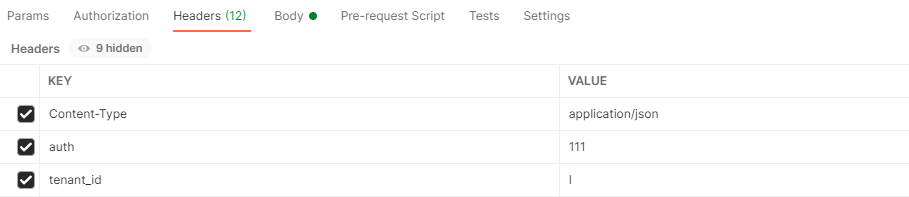
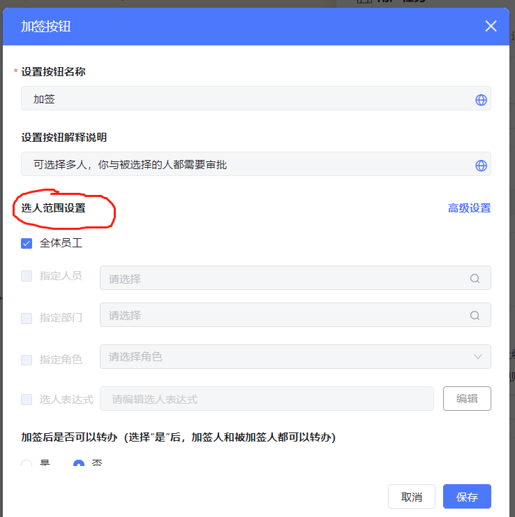

**所有组件的接口都是通过auth机制进行鉴权的。需要在header中设置auth的值和tenant\_id的值****。**

**如何获取auth请查看**

<https://baiteda.yuque.com/docs/share/fde92045-ab87-47e6-ac83-6a1f741cdc05?#> 《签名接口v1版》

**其他接口->获取AUTH****的说明。**

**header设置如下：**





<a id="M3362"></a>


## 1.获取评论列表（包含回复列表 pc端调用）

接口地址：${host}/ego\_api/client/v1/common/selectCommentList

**请求方式：**POST

**Body参数：**

|  |  |  |  |
| --- | --- | --- | --- |
| 参数 | 描述 | 类型 | 是否必填 |
| process\_instance\_id | 流程实例id | String | 二选一，必填 |

**参考示例：**


```json
{
 "process_instance_id":"a3c46fd9-cbf5-47ba-a3d3-bfebbf4151a9"
}
```


**返回参考示例：**


```json
{
    "code": "000000",
    "message": "成功",
    "data": {
        "can_create": true,
        "preview": false,
        "rows": [
            {
        "comment_id": "866a4f2ea1f04ff6b3405fa80eb41e65",
        "content": "测试消息",
        "del_status": 0,
        "create_time": "2020-09-08 15:56:20",
        "reply": [
          {
            "reply_id": "d63dcf9660514765a5d354846beb7e8c",
            "parent_id": "",
            "content": "回复一下",
            "del_status": 0,
            "create_time": "2020-09-08 16:03:59",
            "recipient_user_info": {
              "user_id": "LiTao",
              "name": {
                "zh": "李涛",
                "en": "李涛",
                "ja": "李涛"
              },
              "org_id": "2",
              "org_name_mult_lang": {
                "zh": "产品组",
                "en": "产品组",
                "ja": "产品组"
              },
              "email": "",
              "active": 1,
              "head_image": "http://wework.qpic.cn/bizmail/tTlmvHWT3SjFKh6gDqdvnyTPSNpVvJQddShick1D5QMLNDTEFSWaHkw/0",
              "src": "IM",
              "org_name": "产品组"
            },
            "reply_user_info": {
              "user_id": "WangHao",
              "name": {
                "zh": "王浩",
                "en": "王浩",
                "ja": "王浩"
              },
              "org_id": "4",
              "org_name_mult_lang": {
                "zh": "后端组",
                "en": "后端组",
                "ja": "后端组"
              },
              "email": "wholve@qq.com",
              "active": 1,
              "head_image": "http://wework.qpic.cn/bizmail/dWmyDVV1s6oaT8FpZ2xePHQ4XfCfvemyxyk0SV76bp0xAhOhOvIUFw/0",
              "src": "IM",
              "org_name": "后端组"
            },
            "can_delete": false,
            "can_reply": true,
            "reply_comment_files": [],
            "create_stamp": 1599552239000
          }
        ],
        "comment_user_info": {
          "user_id": "LiTao",
          "name": {
            "zh": "李涛",
            "en": "李涛",
            "ja": "李涛"
          },
          "org_id": "2",
          "org_name_mult_lang": {
            "zh": "产品组",
            "en": "产品组",
            "ja": "产品组"
          },
          "email": "",
          "active": 1,
          "head_image": "http://wework.qpic.cn/bizmail/tTlmvHWT3SjFKh6gDqdvnyTPSNpVvJQddShick1D5QMLNDTEFSWaHkw/0",
          "src": "IM",
          "org_name": "产品组"
        },
        "can_delete": false,
        "can_reply": true,
        "comment_files": [],
        "create_stamp": 1599551780000
      }
        ]
    }
}
```

<a id="iYfvg"></a>


## 2.添加评论

**接口地址：**${host}/ego\_api/client/v1/common/saveComment

**请求方式：**POST

**Body参数：**

|  |  |  |  |
| --- | --- | --- | --- |
| 参数 | 描述 | 类型 | 是否必填 |
| task\_instance\_id | 任务实例id | String | 二选一，必填 |
| process\_instance\_id | 流程实例id | String | 二选一，必填 |
| content | 评论内容 | String | 必填 |

**参考示例：**


```json
{
    "process_instance_id":"a3c46fd9-cbf5-47ba-a3d3-bfebbf4151a9",
    "comment_user_id":"YangJingJie",
    "content":"穿越火线16"
}
```


**返回参考示例：**


```json
{
    "code": "000000",
    "message": "成功",
    "data": {
        "comment_id": "6d66968995b94bee8ce4db561e4a06da",
        "can_reply": true,
        "can_delete": true,
        "comment_files": []
    }
}
```

<a id="6tyvL"></a>


## 3.添加回复

**接口地址：**${host}/ego\_api/client/v1/common/saveReply

**请求方式：**POST

**Body参数：**

|  |  |  |  |
| --- | --- | --- | --- |
| 参数 | 描述 | 类型 | 是否必填 |
| comment\_id | 评论id | String | 必填 |
| recipient\_user\_id | 被回复人id | String | 必填 |
| content | 评论内容 | String | 必填 |
| parent\_id | 回复父节点id | String | 非必填 |

**参考示例：**


```json
{
  "comment_id":"460400b5829e43aaa20b702d869c2cdc",
  "recipient_user_id":"XuJuan",
  "content":"cccccccccc",
  "parent_id":""
}
```


**返回参考示例：**


```json
{
    "code": "000000",
    "message": "成功",
    "data": {
        "reply_id": "ed19d58b02d6469dbea2cb43760eba31",
        "can_reply": true,
        "can_delete": true,
        "comment_files": []
    }
}
```

<a id="7gELp"></a>


## 4.删除回复

**接口地址：**${host}/ego\_api/client/v1/common/deleteReply

**请求方式：**POST

**Body参数：**

|  |  |  |  |
| --- | --- | --- | --- |
| 参数 | 参数描述 | 类型 | 是否必填 |
| reply\_id | 回复 | String | 必填 |

**参考示例：**


```json
{
 "reply_id":"22b477d116514ddaa55b3de6d28ddc3c"
}
```


**返回参考示例：**


```json
{
    "code": "000000",
    "message": "成功"
}
```

<a id="79OOq"></a>


## 5.删除评论

**接口地址：**${host}/ego\_api/client/v1/common/deleteComment

**请求方式：**POST

**Body参数：**

|  |  |  |  |
| --- | --- | --- | --- |
| 参数 | 描述 | 类型 | 是否必填 |
| comment\_id | 评论id | String | 必填 |

**参考示例：**


```json
{
 "comment_id":"460400b5829e43aaa20b702d869c2cdc"
}
```


**返回参考示例：**


```json
{
    "code": "000000",
    "message": "成功"
}
```

<a id="PWvh6"></a>


## 6.通过用户id、名称中英文、邮箱查询用户信息

**接口地址：**${host}/ego\_api/client/v1/common/getUserByQueryKey

**请求方式：**POST

**Body参数：**

|  |  |  |  |
| --- | --- | --- | --- |
| 参数key | 参数描述 | 类型 | 是否必填 |
| query\_key | 查询关键字 | String | 必填 |
| task\_id | 任务id | String | 非必填 |
| command\_id | 按钮id非必填与task\_id成对存在 | String | 非必填 |
| user\_id | 当前登录人id，非必填，用于排除当前用户 | String | 非必填 |

**​**

**​**

task\_id|command\_id|user\_id：这3个字段在进行 加签、转办、知会操作时使用，配合流程图按钮设置使用。





**参考示例：**


```json
{
  "command_id": "HandleCommand_6",
  "query_key": "杨",
  "task_id": "d888bdf3-c25b-4b96-9090-a0e2a4a00850"
}
```


**返回参考示例：**


```json
{
    "code": "000000",
    "message": "成功",
    "data": [
        {
            "user_id": "YangHeng",
            "name": {
                "zh": "杨恒",
                "en": "杨恒",
                "ja": "杨恒"
            },
            "org_id": "4",
            "org_name_mult_lang": {
                "zh": "后端组",
                "en": "后端组",
                "ja": "后端组"
            },
            "email": "",
            "active": 1,
            "head_image": "https://wework.qpic.cn/wwhead/nMl9ssowtibVGyrmvBiaibzDtjEZ6hawcjX9Q5qlr8eB1Bz3ktoTmj264P06XPsx7uiaPyVtZtY1lno/0",
            "src": "IM",
            "id": "YangHeng",
            "employee_number": "null",
            "org_name": "后端组",
            "name_zh": "杨恒",
            "name_en": "杨恒",
            "user_name": "杨恒",
            "en_name": "杨恒",
            "org_name_en": "后端组",
            "msg_relation_type": "WX",
            "leader_eid": "MaZhiPing",
            "open_id": "oCiZ5v7rDuMek9htq4ugvrd85yUk"
        },
        {
            "user_id": "YangJingJie",
            "name": {
                "zh": "杨静杰",
                "en": "杨静杰",
                "ja": "杨静杰"
            },
            "org_id": "5",
            "org_name_mult_lang": {
                "zh": "测试组",
                "en": "测试组",
                "ja": "测试组"
            },
            "email": "yangjingjie@163.com",
            "active": 1,
            "head_image": "http://wework.qpic.cn/bizmail/uRzEUChbMSiazygOGfJQG8XukHDoFB6Ol6FryDYeBWSukPpySM3r08Q/0",
            "src": "IM",
            "id": "YangJingJie",
            "employee_number": "null",
            "org_name": "测试组",
            "name_zh": "杨静杰",
            "name_en": "杨静杰",
            "user_name": "杨静杰",
            "en_name": "杨静杰",
            "org_name_en": "测试组",
            "msg_relation_type": "WX",
            "leader_eid": "MaFeiXiang",
            "open_id": "oCiZ5v8K9bBzRlKwBOG24BlatM5w"
        }
    ]
}
```

<a id="pRW32"></a>


## 7.获取当前任务的按钮接口

**接口地址：**${host}/ego\_api/client/v1/common/getTaskBtn

**请求方式：**POST

**Body参数：**

|  |  |  |  |
| --- | --- | --- | --- |
| 参数 | 描述 | 类型 | 是否必填 |
| task\_instance\_id | 任务实例id | String | 必填 |

**参考示例：**


```json
{
 "task_instance_id":"d888bdf3-c25b-4b96-9090-a0e2a4a00850"
}
```


**返回参考示例：**


```json
{
    "code": "000000",
    "msg": "成功",
    "data": {
        "command_list": [
            {
                "command_id": "HandleCommand_1",
                "command_type": "general",
                "command_name": {
                    "zh": "同意",
                    "en": "Approve",
                    "ja": "同意"
                },
                "custom": 0
            },
            {
                "command_id": "HandleCommand_2",
                "command_type": "rollBackTaskByExpression",
                "command_name": {
                    "zh": "拒绝",
                    "en": "Reject",
                    "ja": "却下"
                },
                "custom": 0
            },
            {
                "command_id": "HandleCommand_12",
                "command_type": "parallelEndorsement",
                "command_name": {
                    "zh": "加签",
                    "en": "Add Approver",
                    "ja": "承認者追加"
                },
                "custom": 0
            },
            {
                "command_id": "HandleCommand_6",
                "command_type": "generalTaskNotice",
                "command_name": {
                    "zh": "知会",
                    "en": "Notify",
                    "ja": "通知"
                },
                "custom": 0
            },
            {
                "command_id": "HandleCommand_10",
                "command_type": "rejectAndTerminate",
                "command_name": {
                    "zh": "终止",
                    "en": "Terminate",
                    "ja": "終了"
                },
                "custom": 0
            },
            {
                "command_id": "HandleCommand_16",
                "command_type": "urge",
                "command_name": {
                    "zh": "催办",
                    "en": "Urge",
                    "ja": "処理催促"
                },
                "custom": 0
            }
        ],
        "node_id": "UserTask_ep8fqytx49txx",
        "node_name": {
            "zh": "审批01",
            "en": "Approval",
            "ja": "审批01"
        },
        "process_definition_id": "agile_yyy:20:d284182c-a015-4753-820b-814ab231713a",
        "process_definition_key": "agile_yyy",
        "process_definition_name": {
            "zh": "yyy测试推送消息",
            "en": "english_form",
            "ja": "我是日语"
        },
        "process_instance_id": "a9f6bda4-ac72-4ddc-a3ec-ad06dfd028bf"
    }
}
```

<a id="e1K64"></a>


## 8.获取审批记录

**接口地址：**${host}/ego\_api/client/v1/common/getTaskProcess

**请求方式：**POST

**Body参数：**

|  |  |  |  |
| --- | --- | --- | --- |
| 参数 | 描述 | 类型 | 是否必填 |
| process\_instance\_id | 流程实例id | String | 必填 |
| time\_sort | 不填或非asc为倒序，asc为正序 | String | 非必填 |

**参考示例：**


```json
{
  "process_instance_id":"a9f6bda4-ac72-4ddc-a3ec-ad06dfd028bf",
  "time_sort":"asc"
}
```


**返回参考示例：**


```json
{
    "code": "000000",
    "message": "成功",
    "data": {
        "done_list": [
            {
                "agent": {},
                "task_instance_id": "020dfa67-6acf-4421-a72c-8fc66d9111fd",
                "assignee_list": [
                    {
                        "name_zh": "许娟",
                        "head_image": "https://wework.qpic.cn/bizmail/hL6IpFB96mVZric7N2lvibpfNmgniaSCgw8fqoBkXILJdPgh5pQSRUfibA/0",
                        "org_name_mult_lang": {
                            "zh": "后端组",
                            "en": "后端组",
                            "ja": "后端组"
                        },
                        "src": "IM",
                        "org_id": "4",
                        "name": {
                            "zh": "许娟",
                            "en": "许娟",
                            "ja": "许娟"
                        },
                        "active": 1,
                        "employee_number": "XuJuan",
                        "id": "XuJuan",
                        "org_name": "后端组",
                        "email": "",
                        "name_en": "许娟"
                    }
                ],
                "command_message": "提交",
                "command_type": "startandsubmit",
                "command_name": {
                    "zh": "提交",
                    "en": "Submitted",
                    "ja": "提出"
                },
                "subject": {},
                "create_time": "2020-09-07 14:13:49",
                "end_time": "2020-09-07 14:13:49",
                "draft": false,
                "node_id": "StartNode",
                "node_name": {
                    "zh": "提交",
                    "en": "Submit",
                    "ja": "提出"
                },
                "approve_flag": "1",
                "since_time": {
                    "zh": "1天前",
                    "en": "1 days ago",
                    "ja": "1日前"
                },
                "parent_task_instance_id": "020dfa67-6acf-4421-a72c-8fc66d9111fd",
                "command_extend_user": [],
                "is_submit": "0",
                "create_stamp": 1599459229349,
                "end_stamp": 1599459229373,
                "task_type": "FIXFLOWTASK",
                "holder_list": []
            },
            {
                "agent": {},
                "task_instance_id": "5dc41663-9561-4b4a-a87e-fc4135f58570",
                "assignee_list": [
                    {
                        "name_zh": "许娟",
                        "head_image": "https://wework.qpic.cn/bizmail/hL6IpFB96mVZric7N2lvibpfNmgniaSCgw8fqoBkXILJdPgh5pQSRUfibA/0",
                        "org_name_mult_lang": {
                            "zh": "后端组",
                            "en": "后端组",
                            "ja": "后端组"
                        },
                        "src": "IM",
                        "org_id": "4",
                        "name": {
                            "zh": "许娟",
                            "en": "许娟",
                            "ja": "许娟"
                        },
                        "active": 1,
                        "employee_number": "XuJuan",
                        "id": "XuJuan",
                        "org_name": "后端组",
                        "email": "",
                        "name_en": "许娟"
                    }
                ],
                "command_message": "加签",
                "command_type": "parallelEndorsement",
                "command_name": {
                    "zh": "加签",
                    "en": "Approver Added",
                    "ja": "追加"
                },
                "subject": {},
                "create_time": "2020-09-07 14:13:49",
                "end_time": "2020-09-07 17:52:21",
                "draft": false,
                "node_id": "UserTask_ep8fqytx49txx",
                "node_name": {
                    "zh": "审批01",
                    "en": "Approval",
                    "ja": "审批01"
                },
                "approve_flag": "1",
                "since_time": {
                    "zh": "23小时前",
                    "en": "23 hours ago",
                    "ja": "23時間前"
                },
                "parent_task_instance_id": "5dc41663-9561-4b4a-a87e-fc4135f58570",
                "command_extend_user": [
                    {
                        "name_zh": "杨静杰",
                        "head_image": "http://wework.qpic.cn/bizmail/uRzEUChbMSiazygOGfJQG8XukHDoFB6Ol6FryDYeBWSukPpySM3r08Q/0",
                        "org_name_mult_lang": {
                            "zh": "测试组",
                            "en": "测试组",
                            "ja": "测试组"
                        },
                        "src": "IM",
                        "org_id": "5",
                        "name": {
                            "zh": "杨静杰",
                            "en": "杨静杰",
                            "ja": "杨静杰"
                        },
                        "active": 1,
                        "employee_number": "YangJingJie",
                        "id": "YangJingJie",
                        "org_name": "测试组",
                        "email": "yangjingjie@163.com",
                        "name_en": "杨静杰"
                    }
                ],
                "is_submit": "0",
                "create_stamp": 1599459229413,
                "end_stamp": 1599472341292,
                "task_type": "FIXFLOWTASK",
                "holder_list": []
            }
        ],
        "todo_list": [
            {
                "agent": {},
                "task_instance_id": "624c298f-4d11-4293-95e4-82eb67d0bc75",
                "assignee_list": [
                    {
                        "name_zh": "杨静杰",
                        "head_image": "http://wework.qpic.cn/bizmail/uRzEUChbMSiazygOGfJQG8XukHDoFB6Ol6FryDYeBWSukPpySM3r08Q/0",
                        "org_name_mult_lang": {
                            "zh": "测试组",
                            "en": "测试组",
                            "ja": "测试组"
                        },
                        "src": "IM",
                        "org_id": "5",
                        "name": {
                            "zh": "杨静杰",
                            "en": "杨静杰",
                            "ja": "杨静杰"
                        },
                        "active": 1,
                        "employee_number": "YangJingJie",
                        "id": "YangJingJie",
                        "org_name": "测试组",
                        "email": "yangjingjie@163.com",
                        "name_en": "杨静杰"
                    }
                ],
                "command_name": {},
                "subject": {},
                "create_time": "2020-09-07 17:52:21",
                "draft": false,
                "node_id": "UserTask_ep8fqytx49txx",
                "node_name": {
                    "zh": "审批01-加签",
                    "en": "Approval-Countersign",
                    "ja": "审批01-承認者追加"
                },
                "approve_flag": "3",
                "since_time": {
                    "zh": "已等待23小时",
                    "en": "Waited for 23 hours",
                    "ja": "すでに23時間待機しています"
                },
                "parent_task_instance_id": "5dc41663-9561-4b4a-a87e-fc4135f58570",
                "command_extend_user": [],
                "is_submit": "0",
                "create_stamp": 1599472341300,
                "task_type": "FIXFLOWTASK",
                "holder_list": []
            },
            {
                "agent": {},
                "task_instance_id": "d888bdf3-c25b-4b96-9090-a0e2a4a00850",
                "assignee_list": [
                    {
                        "name_zh": "许娟",
                        "head_image": "https://wework.qpic.cn/bizmail/hL6IpFB96mVZric7N2lvibpfNmgniaSCgw8fqoBkXILJdPgh5pQSRUfibA/0",
                        "org_name_mult_lang": {
                            "zh": "后端组",
                            "en": "后端组",
                            "ja": "后端组"
                        },
                        "src": "IM",
                        "org_id": "4",
                        "name": {
                            "zh": "许娟",
                            "en": "许娟",
                            "ja": "许娟"
                        },
                        "active": 1,
                        "employee_number": "XuJuan",
                        "id": "XuJuan",
                        "org_name": "后端组",
                        "email": "",
                        "name_en": "许娟"
                    }
                ],
                "command_name": {},
                "subject": {},
                "create_time": "2020-09-07 17:52:21",
                "draft": false,
                "node_id": "UserTask_ep8fqytx49txx",
                "node_name": {
                    "zh": "审批01-加签",
                    "en": "Approval-Countersign",
                    "ja": "审批01-承認者追加"
                },
                "approve_flag": "3",
                "since_time": {
                    "zh": "已等待23小时",
                    "en": "Waited for 23 hours",
                    "ja": "すでに23時間待機しています"
                },
                "parent_task_instance_id": "5dc41663-9561-4b4a-a87e-fc4135f58570",
                "command_extend_user": [],
                "is_submit": "0",
                "create_stamp": 1599472341300,
                "task_type": "FIXFLOWTASK",
                "holder_list": []
            }
        ]
    }
}
```

<a id="oa3Rh"></a>


## 9.获取流程图SVG

**接口地址：**${host}/ego\_api/client/v1/common/getProcessSvg

**请求方式：**POST

**Body参数：**

|  |  |  |  |
| --- | --- | --- | --- |
| 参数 | 描述 | 类型 | 是否必填 |
| task\_instance\_id | 任务id | String | 二选一，必填 |
| process\_instance\_id | 流程实例id | String | 二选一，必填 |

**参考示例：**


```json
{
  "process_instance_id":"",
  "task_instance_id":"d888bdf3-c25b-4b96-9090-a0e2a4a00850"
}
```


**返回参考示例：**


```json
{
    "code": "000000",
    "message": "成功",
    "data": {
        "svg_xml": "<?xml version=\"1.0\" encoding=\"UTF-8\"?>\n<svg xmlns=\"http://www.w3.org/2000/svg\" xmlns:xlink=\"http://www.w3.org/1999/xlink\" xmlns:svg=\"http://www.w3.org/2000/svg\" id=\"sid-1A88C971-D017-4C8C-B7B0-C053E39DA6A4\" width=\"330.0\" height=\"265.0\" minwidth=\"62.0\" minhight=\"100.0\">\n\t<defs/>\n\t<g stroke=\"black\" font-family=\"Verdana, sans-serif\" font-size-adjust=\"none\" font-style=\"normal\" font-variant=\"normal\" font-weight=\"normal\" line-heigth=\"normal\" font-size=\"12\">\n\t\t<g class=\"stencils\">\n\t\t\t<g class=\"me\"/>\n\t\t\t<g class=\"children\">\n\t\t\t\t<g id=\"StartEvent_1\">\n\t\t<g class=\"stencils\" transform=\"translate(62.0, 152.0)\">\n\t\t\t<g class=\"me\">\n\t\t\t\t<g pointer-events=\"fill\" title=\"开始\" id=\"sid-StartEvent_1\">\n\t\t\t\t\t<defs id=\"sid-StartEvent_1-def\">\n\t\t\t\t\t\t<radialGradient id=\"sid-StartEvent_1-defbackground\" cx=\"10%\" cy=\"10%\" r=\"100%\" fx=\"10%\" fy=\"10%\">\n\t\t\t\t\t\t\t<stop offset=\"0%\" stop-color=\"#ffffff\" stop-opacity=\"1\" id=\"sid-StartEvent_1-defstop\"/>\n\t\t\t\t\t\t\t<stop id=\"sid-StartEvent_1-deffill_el\" offset=\"100%\" stop-color=\"#ffffff\" stop-opacity=\"1\"/>\n\t\t\t\t\t\t</radialGradient>\n\t\t\t\t\t</defs>\n\t\t\t\t\t<circle id=\"sid-StartEvent_1bg_frame\" cx=\"15\" cy=\"15\" r=\"18\" stroke=\"black\" fill=\"url(#sid-StartEvent_1-defbackground) white\" stroke-width=\"1\"/>\n\t\t\t\t\t<text xmlns:oryx=\"http://www.b3mn.org/oryx\" font-size=\"12\" id=\"sid-StartEvent_1text_name\" x=\"15\" y=\"36\" oryx:align=\"top center\" stroke=\"black\" stroke-width=\"0pt\" letter-spacing=\"-0.01px\" oryx:fontSize=\"11\" text-anchor=\"middle\">\n\t\t\t\t\t\t<tspan dy=\"11\" x=\"15\" y=\"36\" id=\"ext-gen349\">开始</tspan>\n\t\t\t\t\t</text>\n\t\t\t\t</g>\n\t\t\t</g>\n\t\t\t<g class=\"children\" style=\"overflow:hidden\"/>\n\t\t\t<g class=\"edge\"/>\n\t\t</g>\n\t\t<g class=\"controls\">\n\t\t\t<g class=\"dockers\"/>\n\t\t\t<g class=\"magnets\" transform=\"translate(62.0, 152.0)\">\n\t\t\t\t<g pointer-events=\"all\" display=\"none\" transform=\"translate(7, 7)\">\n\t\t\t\t\t<circle cx=\"8\" cy=\"8\" r=\"4\" stroke=\"none\" fill=\"red\" fill-opacity=\"0.3\"/>\n\t\t\t\t</g>\n\t\t\t</g>\n\t\t</g>\n\t</g><g id=\"StartNode\">\n\t<g class=\"stencils\" transform=\"translate(198.0, 143.0)\">\n\t\t<g class=\"me\">\n\t\t\t<g xmlns:oryx=\"http://www.b3mn.org/oryx\" pointer-events=\"fill\" oryx:minimumSize=\"50 40\" title=\"提交\" id=\"sid-StartNode\">\n\t\t\t\t<defs id=\"sid-StartNode_sid-StartNode_17\">\n\t\t\t\t\t<radialGradient id=\"sid-StartNodebackground\" cx=\"10%\" cy=\"10%\" r=\"100%\" fx=\"10%\" fy=\"10%\">\n\t\t\t\t\t\t<stop offset=\"0%\" stop-color=\"#ffffff\" stop-opacity=\"1\" id=\"sid-StartNode_sid-StartNode_18\"/>\n\t\t\t\t\t\t<stop id=\"sid-StartNodefill_el\" offset=\"100%\" stop-color=\"#ffffcc\" stop-opacity=\"1\"/>\n\t\t\t\t\t</radialGradient>\n\t\t\t\t</defs>\n\t\t\t\t<rect id=\"sid-StartNodetext_frame\" oryx:anchors=\"bottom top right left\" x=\"1\" y=\"1\" width=\"100.0\" height=\"50.0\" rx=\"10\" ry=\"10\" stroke=\"none\" stroke-width=\"0\" fill=\"none\"/>\n\t\t\t\t<rect id=\"sid-StartNodecallActivity\" oryx:resize=\"vertical horizontal\" oryx:anchors=\"bottom top right left\" x=\"0\" y=\"0\" width=\"100\" height=\"80\" rx=\"10\" ry=\"10\" stroke=\"black\" stroke-width=\"4\" fill=\"none\" display=\"none\"/>\n\t\t\t\t<rect id=\"sid-StartNodebg_frame\" oryx:resize=\"vertical horizontal\" x=\"0\" y=\"0\" width=\"100.0\" height=\"50.0\" rx=\"10\" ry=\"10\" stroke=\"black\" stroke-width=\"1.5\" fill=\"url(#sid-StartNodebackground) #ffffcc\"/>\n\t\t\t\t<text font-size=\"12\" id=\"sid-StartNodetext_name\" x=\"50.0\" y=\"25.0\" oryx:align=\"middle center\" oryx:fittoelem=\"text_frame\" stroke=\"black\" stroke-width=\"0pt\" letter-spacing=\"-0.01px\" oryx:fontSize=\"12\" text-anchor=\"middle\">\n\t\t\t\t\t<tspan x=\"50.0\" y=\"25.0\" dy=\"5\">提交</tspan>\n\t\t\t\t</text>\n\t\t\t\t<g id=\"sid-StartNodebusinessRuleTask\" transform=\"scale(0.7,0.7) translate(8,8)\" display=\"none\">\n\t\t\t\t\t<rect oryx:anchors=\"top left\" id=\"sid-StartNodetop\" x=\"0\" y=\"0\" width=\"22\" height=\"4\" style=\"opacity:1;fill:#B3B1B3;fill-opacity:1;stroke:#000000\"/>\n\t\t\t\t\t<rect oryx:anchors=\"top left\" id=\"sid-StartNoderect\" x=\"0\" y=\"4\" style=\"opacity:1;fill:none;stroke:#000000\" width=\"22\" height=\"12\"/>\n\t\t\t\t\t<path oryx:anchors=\"top left\" id=\"sid-StartNoderow\" style=\"opacity:1;fill:none;stroke:#000000\" d=\"M 0 10 L 22 10\"/>\n\t\t\t\t\t<path oryx:anchors=\"top left\" id=\"sid-StartNodecol\" style=\"opacity:1; fill:none; stroke:#000000\" d=\"M 7 4 L 7 16\"/>\n\t\t\t\t</g>\n\t\t\t\t<g id=\"sid-StartNodescriptTask\" transform=\"scale(0.7,0.7) translate(8,8)\" display=\"none\">\n\t\t\t\t\t<path oryx:anchors=\"top left\" id=\"sid-StartNodepaper\" style=\"opacity:1;fill:none;stroke:#000000\" d=\"M6.402,0.5h14.5c0,0-5.833,2.833-5.833,5.583s4.417,6,4.417,9.167    s-4.167,5.083-4.167,5.083H0.235c0,0,5-2.667,5-5s-4.583-6.75-4.583-9.25S6.402,0.5,6.402,0.5z\"/>\n\t\t\t\t\t<path oryx:anchors=\"top left\" id=\"sid-StartNodeline1\" style=\"opacity:1;fill:none;stroke:#000000;stroke-width:1.5\" d=\"M 3.5 4.5 L 13.5 4.5\"/>\n\t\t\t\t\t<path oryx:anchors=\"top left\" id=\"sid-StartNodeline2\" style=\"opacity:1;fill:none;stroke:#000000;stroke-width:1.5\" d=\"M 3.8 8.5 L 13.8 8.5\"/>\n\t\t\t\t\t<path oryx:anchors=\"top left\" id=\"sid-StartNodeline3\" style=\"opacity:1;fill:none;stroke:#000000;stroke-width:1.5\" d=\"M 6.3 12.5 L 16.3 12.5\"/>\n\t\t\t\t\t<path oryx:anchors=\"top left\" id=\"sid-StartNodeline4\" style=\"opacity:1;fill:none;stroke:#000000;stroke-width:1.5\" d=\"M 6.5 16.5 L 16.5 16.5\"/>\n\t\t\t\t</g>\n\t\t\t\t<g id=\"sid-StartNodeuserTask\" transform=\"scale(0.7,0.7) translate(8,8)\" display=\"\">\n\t\t\t\t\t<path oryx:anchors=\"top left\" style=\"opacity:1;fill:#F4F6F7;stroke:#000000\" d=\"M0.585,24.167h24.083v-7.833c0,0-2.333-3.917-7.083-5.167h-9.25    c-4.417,1.333-7.833,5.75-7.833,5.75L0.585,24.167z\" id=\"sid-StartNode_sid-StartNode_19\"/>\n\t\t\t\t\t<path oryx:anchors=\"top left\" style=\"opacity:1;fill:none;stroke:#000000\" d=\"M 6 20 L 6 24\" id=\"sid-StartNode_sid-StartNode_20\"/>\n\t\t\t\t\t<path oryx:anchors=\"top left\" style=\"opacity:1;fill:none;stroke:#000000\" d=\"M 20 20 L 20 24\" id=\"sid-StartNode_sid-StartNode_21\"/>\n\t\t\t\t\t<circle oryx:anchors=\"top left\" fill=\"#000000\" stroke=\"#000000\" cx=\"13.002\" cy=\"5.916\" r=\"5.417\" id=\"sid-StartNode_sid-StartNode_22\"/>\n\t\t\t\t\t<path oryx:anchors=\"top left\" style=\"opacity:1;fill:#F0EFF0;stroke:#000000\" d=\"M8.043,7.083c0,0,2.814-2.426,5.376-1.807s4.624-0.693,4.624-0.693    c0.25,1.688,0.042,3.75-1.458,5.584c0,0,1.083,0.75,1.083,1.5s0.125,1.875-1,3s-5.5,1.25-6.75,0S8.668,12.834,8.668,12    s0.583-1.25,1.25-1.917C8.835,9.5,7.419,7.708,8.043,7.083z\" id=\"sid-StartNode_sid-StartNode_23\"/>\n\t\t\t\t</g>\n\t\t\t\t<g id=\"sid-StartNodeserviceTask\" transform=\"scale(0.7,0.7) translate(8,8)\" display=\"none\">\n\t\t\t\t\t<polygon oryx:anchors=\"top left\" id=\"sid-StartNodeteethForeground\" style=\"opacity:1;fill:#ffffff;stroke:#000000\" points=\"15.392,5.064 17.954,2.502 20.347,4.895 17.786,7.455     18.729,9.732 22.353,9.732 22.353,13.115 18.731,13.115 17.788,15.392 20.351,17.955 17.958,20.347 15.397,17.786 13.12,18.729     13.12,22.353 9.737,22.353 9.737,18.731 7.46,17.788 4.897,20.35 2.506,17.958 5.066,15.397 4.124,13.12 0.5,13.12 0.5,9.737     4.121,9.737 5.065,7.461 2.503,4.898 4.895,2.506 7.455,5.066 9.732,4.125 9.732,0.5 13.116,0.5 13.116,4.121 \"/>\n\t\t\t\t\t<circle oryx:anchors=\"top left\" id=\"sid-StartNoderingForeground\" style=\"opacity:1;fill:none;stroke:#000000\" cx=\"11.427\" cy=\"11.426\" r=\"3.714\"/>\n\t\t\t\t\t<polygon oryx:anchors=\"top left\" id=\"sid-StartNodeteethBackground\" style=\"opacity:1;fill:#ffffff;stroke:#000000\" points=\"21.392,11.064 23.954,8.502 26.347,10.895 23.786,13.455     24.729,15.732 28.353,15.732 28.353,19.115 24.731,19.115 23.788,21.392 26.351,23.955 23.958,26.347 21.397,23.786 19.12,24.729     19.12,28.353 15.737,28.353 15.737,24.731 13.46,23.788 10.897,26.35 8.506,23.958 11.066,21.397 10.124,19.12 6.5,19.12     6.5,15.737 10.121,15.737 11.065,13.461 8.503,10.898 10.895,8.506 13.455,11.066 15.732,10.125 15.732,6.5 19.116,6.5     19.116,10.121 \"/>\n\t\t\t\t\t<circle oryx:anchors=\"top left\" id=\"sid-StartNoderingBackground\" style=\"opacity:1;fill:none;stroke:#000000\" cx=\"17.427\" cy=\"17.426\" r=\"3.714\"/>\n\t\t\t\t</g>\n\t\t\t\t<g id=\"sid-StartNodemanualTask\" transform=\"scale(0.7,0.7) translate(8,8)\" display=\"none\">\n\t\t\t\t\t<path oryx:anchors=\"top left\" id=\"sid-StartNodehand\" stroke=\"#000000\" stroke-width=\"1\" style=\"opacity:1;fill:none;fill-opacity:1;\" d=\"M0.5,3.751l4.083-3.25c0,0,11.166,0.083,12.083,0.083s-2.417,2.917-1.5,2.917     s11.667,0,12.584,0c1.166,1.708-0.168,3.167-0.834,3.667s0.875,1.917-1,4.417c-0.75,0.25,0.75,1.875-1.333,3.333     c-1.167,0.583,0.583,1.542-1.25,2.833c-1.167,0-20.833,0.083-20.833,0.083l-2-1.333V3.751z\"/>\n\t\t\t\t\t<path oryx:anchors=\"top left\" id=\"sid-StartNodefinger\" style=\"opacity:1;fill:none; stroke-width:2\" stroke=\"#000000\" d=\"M 13.5 7 L 27 7\"/>\n\t\t\t\t\t<path oryx:anchors=\"top left\" id=\"sid-StartNodefinger1\" style=\"opacity:1;fill:none; stroke-width:2\" stroke=\"#000000\" d=\"M 13.5 11 L 26 11\"/>\n\t\t\t\t\t<path oryx:anchors=\"top left\" id=\"sid-StartNodefinger2\" style=\"opacity:1;fill:none; stroke-width:1.5\" stroke=\"#000000\" d=\"M 14 14.5 L 25 14.5\"/>\n\t\t\t\t\t<path oryx:anchors=\"top left\" id=\"sid-StartNodethumb\" style=\"opacity:1;fill:none; stroke-width:1.5\" stroke=\"#000000\" d=\"M 8.2 3.1 L 15 3.1\"/>\n\t\t\t\t</g>\n\t\t\t\t<g id=\"sid-StartNodesendTask\" display=\"none\">\n\t\t\t\t\t<path id=\"sid-StartNodesendTaskpath\" oryx:anchors=\"left top\" stroke=\"#000000\" fill=\"black\" stroke-width=\"1\" d=\"M8,11 L8,21 L24,21 L24,11 L16,17z\"/>\n\t\t\t\t\t<path id=\"sid-StartNodesendTaskpath2\" oryx:anchors=\"left top\" stroke=\"#000000\" fill=\"black\" stroke-width=\"1\" d=\"M7,10 L16,17 L25 10z\"/>\n\t\t\t\t</g>\n\t\t\t\t<g id=\"sid-StartNodereceiveTask\" display=\"none\">\n\t\t\t\t\t<path id=\"sid-StartNodereceiveTaskpath\" oryx:anchors=\"left top\" stroke=\"#000000\" fill=\"none\" stroke-width=\"1\" d=\"M8,11 L8,21 L24,21 L24,11z M8,11 L16,17 L24,11\"/>\n\t\t\t\t\t<circle id=\"sid-StartNodeinstantiate\" cx=\"16\" cy=\"16\" r=\"13\" stroke=\"#000000\" fill=\"none\" stroke-width=\"1\" display=\"none\"/>\n\t\t\t\t</g>\n\t\t\t\t<g id=\"sid-StartNodeloopSetting\" transform=\"translate(2.0, -30.0)\">\n\t\t\t\t\t<g id=\"sid-StartNodenone\" display=\"inherit\"/>\n\t\t\t\t\t<g id=\"sid-StartNodeloop\" display=\"none\">\n\t\t\t\t\t\t<path oryx:anchors=\"bottom\" style=\"opacity:1;fill:none;fill-opacity:1;stroke:#000000;stroke-width:1.5;stroke-linecap:round;stroke-linejoin:round;stroke-miterlimit:2.0999999;stroke-dasharray:none;stroke-opacity:1\" id=\"sid-19A331FB-295F-46D2-BCF5-9C602FAB42D6path2396\" d=\"M 47.608384,75.188343 L 47.608384,78.188343 L 44.608384,78.188343 M 47.608384,78.188343 A 4.875,4.875 0 1 1 51.639336,78.189378\"/>\n\t\t\t\t\t</g>\n\t\t\t\t\t<g id=\"sid-StartNodeparallel\" display=\"none\">\n\t\t\t\t\t\t<path oryx:anchors=\"bottom\" fill=\"none\" stroke=\"black\" d=\"M46 70 v8 M50 70 v8 M54 70 v8\" stroke-width=\"2\" id=\"sid-19A331FB-295F-46D2-BCF5-9C602FAB42D6_sid-19A331FB-295F-46D2-BCF5-9C602FAB42D6_27\"/>\n\t\t\t\t\t</g>\n\t\t\t\t\t<g id=\"sid-StartNodesequential\" display=\"none\">\n\t\t\t\t\t\t<path oryx:anchors=\"bottom\" fill=\"none\" stroke=\"#000000\" stroke-width=\"2\" d=\"M46,76h10M46,72h10 M46,68h10\" id=\"sid-19A331FB-295F-46D2-BCF5-9C602FAB42D6_sid-19A331FB-295F-46D2-BCF5-9C602FAB42D6_28\"/>\t\t\t\t\n\t\t\t\t\t</g>\n\t\t\t\t</g>\n\t\t\t</g>\n\t\t</g>\n\t\t<g class=\"children\" style=\"overflow:hidden\"/>\n\t\t<g class=\"edge\"/>\n\t</g>\n</g>\n\t\t\t</g>\n\t\t\t<g class=\"edge\">\n\t\t\t\t<g id=\"SequenceFlow_1\">\n\t\t<defs>\n\t\t\t<marker id=\"SequenceFlow_1start\" refX=\"1\" refY=\"5\" markerUnits=\"userSpaceOnUse\" markerWidth=\"17\" markerHeight=\"11\" orient=\"auto\">\n\t\t\t\t<path id=\"SequenceFlow_1condition\" d=\"M 0 5 L 8 0 L 16 5 L 8 10 L 0 5\" fill=\"white\" stroke=\"black\" stroke-width=\"1\" display=\"none\"/>\n\t\t\t\t<path id=\"SequenceFlow_1default\" d=\"M 5 0 L 11 10\" fill=\"white\" stroke=\"black\" stroke-width=\"1\" display=\"none\"/>\n\t\t\t</marker>\n\t\t\t<marker id=\"SequenceFlow_1end\" refX=\"11\" refY=\"6\" markerUnits=\"userSpaceOnUse\" markerWidth=\"15\" markerHeight=\"12\" orient=\"auto\">\n\t\t\t\t<path d=\"M 0 3 L 10 6 L 0 9z\" fill=\"black\" stroke=\"black\" stroke-linejoin=\"round\" stroke-width=\"1\" id=\"SequenceFlow_1beend\"/>\n\t\t\t</marker>\n\t\t</defs>\n\t\t<g class=\"stencils\">\n\t\t\t<g class=\"me\">\n\t\t\t\t<g pointer-events=\"painted\">\n\t\t\t\t\t<path d=\"M96.0 168.0L198.0 168.0\" stroke=\"black\" fill=\"none\" stroke-width=\"1\" stroke-linecap=\"round\" stroke-linejoin=\"round\" marker-start=\"url(#SequenceFlow_1start)\" marker-end=\"url(#SequenceFlow_1end)\" id=\"SequenceFlow_1_1\"/>\n\t\t\t\t\t<path d=\"M96.0 168.0L198.0 168.0\" stroke=\"black\" fill=\"none\" stroke-width=\"10\" stroke-linecap=\"round\" stroke-linejoin=\"round\" marker-start=\"url(#SequenceFlow_1start)\" marker-end=\"url(#SequenceFlow_1end)\" id=\"undefined\" visibility=\"hidden\" stroke-dasharray=\"null\" title=\"\"/>\n\t\t\t\t</g>\n\t\t\t\t<text xmlns:oryx=\"http://www.b3mn.org/oryx\" id=\"SequenceFlow_1name\" x=\"149.0\" y=\"150.0\" oryx:align=\"middle center\" oryx:edgePosition=\"startTop\" stroke-width=\"0pt\" letter-spacing=\"-0.01px\" oryx:fontSize=\"12\" text-anchor=\"start\">\n\t\t\t\t\t<tspan dy=\"11\" x=\"149.0\" y=\"150.0\" id=\"ext-gen343\"></tspan>\n\t\t\t\t</text>\n\t\t\t</g>\n\t\t\t<g class=\"children\" style=\"overflow:hidden\"/>\n\t\t\t<g class=\"edge\"/>\n\t\t</g>\n\t\t<g class=\"controls\">\n\t\t\t<g class=\"dockers\">\n\t\t\t\t<g visibility=\"hidden\">\n\t\t\t\t\t<g pointer-events=\"all\" transform=\"translate(142.1796875, 141)\">\n\t\t\t\t\t\t<circle cx=\"8\" cy=\"8\" r=\"8\" stroke=\"none\" fill=\"none\"/>\n\t\t\t\t\t\t<circle cx=\"8\" cy=\"8\" r=\"3\" stroke=\"black\" fill=\"#00FF00\" stroke-width=\"1\"/>\n\t\t\t\t\t</g>\n\t\t\t\t\t<g pointer-events=\"none\" visibility=\"hidden\" transform=\"translate(135, 149)\">\n\t\t\t\t\t\t<circle cx=\"0\" cy=\"0\" r=\"3\" fill=\"red\" fill-opacity=\"0.4\"/>\n\t\t\t\t\t</g>\n\t\t\t\t</g>\n\t\t\t\t<g visibility=\"hidden\">\n\t\t\t\t\t<g pointer-events=\"all\" transform=\"translate(276.4296875, 218)\">\n\t\t\t\t\t\t<circle cx=\"8\" cy=\"8\" r=\"8\" stroke=\"none\" fill=\"none\"/>\n\t\t\t\t\t\t<circle cx=\"8\" cy=\"8\" r=\"3\" stroke=\"black\" fill=\"#00FF00\" stroke-width=\"1\"/>\n\t\t\t\t\t</g>\n\t\t\t\t\t<g pointer-events=\"none\" visibility=\"hidden\" transform=\"translate(335, 226)\">\n\t\t\t\t\t\t<circle cx=\"0\" cy=\"0\" r=\"3\" fill=\"red\" fill-opacity=\"0.4\"/>\n\t\t\t\t\t</g>\n\t\t\t\t</g>\n\t\t\t\t<g visibility=\"hidden\">\n\t\t\t\t\t<g pointer-events=\"all\" transform=\"translate(209.5, 141)\">\n\t\t\t\t\t\t<circle cx=\"8\" cy=\"8\" r=\"8\" stroke=\"none\" fill=\"none\"/>\n\t\t\t\t\t\t<circle cx=\"8\" cy=\"8\" r=\"3\" stroke=\"black\" fill=\"red\" stroke-width=\"1\"/>\n\t\t\t\t\t</g>\n\t\t\t\t\t<g pointer-events=\"none\" visibility=\"hidden\" transform=\"translate(217.5, 149)\">\n\t\t\t\t\t\t<circle cx=\"0\" cy=\"0\" r=\"3\" fill=\"red\" fill-opacity=\"0.4\"/>\n\t\t\t\t\t</g>\n\t\t\t\t</g>\n\t\t\t\t<g visibility=\"hidden\">\n\t\t\t\t\t<g pointer-events=\"all\" transform=\"translate(209.5, 218)\">\n\t\t\t\t\t\t<circle cx=\"8\" cy=\"8\" r=\"8\" stroke=\"none\" fill=\"none\"/>\n\t\t\t\t\t\t<circle cx=\"8\" cy=\"8\" r=\"3\" stroke=\"black\" fill=\"red\" stroke-width=\"1\"/>\n\t\t\t\t\t</g>\n\t\t\t\t\t<g pointer-events=\"none\" visibility=\"hidden\" transform=\"translate(217.5, 226)\">\n\t\t\t\t\t\t<circle cx=\"0\" cy=\"0\" r=\"3\" fill=\"red\" fill-opacity=\"0.4\"/>\n\t\t\t\t\t</g>\n\t\t\t\t</g>\n\t\t\t</g>\n\t\t\t<g class=\"magnets\"/>\n\t\t</g>\n\t</g>\n\t\t\t</g>\n\t\t</g>\n\t\t<g class=\"svgcontainer\">\n\t\t\t<g display=\"none\" transform=\"translate(281, 182)\">\n\t\t\t\t<rect x=\"0\" y=\"0\" stroke-width=\"1\" stroke=\"#777777\" fill=\"none\" stroke-dasharray=\"2,2\" pointer-events=\"none\" width=\"108\" height=\"88\"/>\n\t\t\t</g>\n\t\t\t<g/>\n\t\t</g>\n\t</g>\n</svg>"
    }
}
```

<a id="sSwmb"></a>


## 10.发送知会

**接口地址：**${host}/ego\_api/client/v1/common/sendRepeatNotice

**请求方式：**POST

**Body参数：**

|  |  |  |  |
| --- | --- | --- | --- |
| 参数 | 描述 | 类型 | 是否必填 |
| user\_id\_array | 要知会用户的id数组 | String | 必填 |
| process\_instance\_id | 流程实例id | String | 二选一，必填 |
| task\_instance\_id | 任务实例id | String | 二选一，必填 |
| subject | 中文主题，查询知会时会覆盖流程实例的主题 | String | 非必填 |
| subject\_en | 英文主题 | String | 非必填 |
| subject\_ja | 日文主题 | String | 非必填 |

**参考示例：**


```json
{
	"user_id_array":"YangJingJie,ZhangRui",
  "task_instance_id":"d888bdf3-c25b-4b96-9090-a0e2a4a00850",
  "send_user_id":"XuJuan"
}
```


**返回参考示例：**


```json
{
    "code": "000000",
    "message": "成功",
    "data": {
        "num": "2"
    }
}
```

<a id="qmv5X"></a>


## 11.判断用户是否为流程干系人接口

**接口地址：**${host}/ego\_api/client/v1/permission/hasPermission

**请求方式：**POST

**Body参数：**

|  |  |  |  |
| --- | --- | --- | --- |
| 参数 | 描述 | 类型 | 是否必填 |
| process\_instance\_id | 流程实例id | String | 必填 |

**参考示例：**


```json
{
  "process_instance_id":"810bd2a0-cf1c-4c34-80af-e31ae40ffc6a"
}
```


**返回参考示例：**


```json
{
    "code": "000000",
    "message": "成功",
    "data": {
        "hasPermission": false
    }
}
```

<a id="6nKz3"></a>


## 12.获取流程知会信息（已读未读）

**接口地址：**${host}/ego\_api/client/v1/common/getReadInfo

**请求方式：**POST

**Body参数：**

|  |  |  |  |
| --- | --- | --- | --- |
| 参数 | 参数描述 | 类型 | 是否必填 |
| process\_instance\_id | 流程实例id | String | 是 |

**参考示例：**


```json
{
 "process_instance_id": "a9f6bda4-ac72-4ddc-a3ec-ad06dfd028bf"
}
```


**返回参考示例：**


```json
{
    "code": "000000",
    "message": "成功",
    "data": {
        "read_list": [],
        "un_read_list": [
            {
                "user_id": "YangJingJie",
                "name": {
                    "zh": "杨静杰",
                    "en": "杨静杰",
                    "ja": "杨静杰"
                },
                "org_id": "5",
                "org_name_mult_lang": {
                    "zh": "测试组",
                    "en": "测试组",
                    "ja": "测试组"
                },
                "email": "yangjingjie@163.com",
                "active": 1,
                "head_image": "http://wework.qpic.cn/bizmail/uRzEUChbMSiazygOGfJQG8XukHDoFB6Ol6FryDYeBWSukPpySM3r08Q/0",
                "src": "IM",
                "org_name": "测试组",
                "type": "notice",
                "is_read": "unread",
                "time": "2020-09-08 17:37:05"
            },
            {
                "user_id": "ZhangRui",
                "name": {
                    "zh": "张瑞",
                    "en": "张瑞",
                    "ja": "张瑞"
                },
                "org_id": "3",
                "org_name_mult_lang": {
                    "zh": "前端组",
                    "en": "前端组",
                    "ja": "前端组"
                },
                "email": "",
                "active": 1,
                "head_image": "https://wework.qpic.cn/bizmail/vBgD5MbaHLoBCv2X2l0d4LECk4JKibHMHOiaIqRzZJcsIsYkliaiazUA8w/0",
                "src": "IM",
                "org_name": "前端组",
                "type": "notice",
                "is_read": "unread",
                "time": "2020-09-08 17:37:05"
            }
        ]
    }
}
```

<a id="uGNa1"></a>


## 13.获取可撤回节点

**接口地址：**${host}/ego\_api/client/v1/common/getRevokeScreeningTask

**请求方式：**POST

**Body参数：**

|  |  |  |  |
| --- | --- | --- | --- |
| 参数 | 描述 | 类型 | 是否必填 |
| task\_instance\_id | 任务实例id | String | 必填 |

**参考示例：**


```json
{
  "task_instance_id":"655e1e70-2f9b-4e04-b360-296d26c5e829"
}
```


**返回参考示例：**


```json
{
	"code": "000000",
	"message": "成功",
	"data": {
		"revoke_task_list": [
			{
				"task_instance_id": "701a477b-1881-45dc-b713-c8dba8c554f6",
				"node_id": "UserTask_1",
				"node_name": {
					"zh": "提交节点",
					"en": "Submission Step",
					"ja": "提出段階"
				},
				"node_flag": "0"
			}
		]
	}
}
```

<a id="xCsqw"></a>


## 14.流程提醒保存更新

**接口地址：**${host}/ego\_api/client/v1/common/saveOrUpdateRemind

**请求方式：**POST

**Body参数：**

|  |  |  |  |
| --- | --- | --- | --- |
| 参数 | 描述 | 类型 | 是否必填 |
| process\_instance\_id | 流程实例ID | String | 是 |
| status | 是否开启提醒 0：否，1：是 | Integer | 是 |
| order\_no | 业务订单号 | String |  |

**参考示例：**


```json
{
  "process_instance_id":"50eafc31-9c6a-40c4-ad6e-e16044061ab2",
  "status":1
}
```


**返回参考示例：**


```json
{
    "code": "000000",
    "message": "成功",
    "data": {
        "id": 70,
        "process_instance_id": "50eafc31-9c6a-40c4-ad6e-e16044061ab2",
        "user_id": "edad3361e2b15ae5c75bbab2c5b9a78c",
        "status": 1,
        "create_time": "2020-09-08 18:29:08",
        "update_time": "2020-09-08 18:29:08",
        "order_no": ""
    }
}
```

<a id="SkcDH"></a>


## 15.流程提醒查询

**接口地址：**${host}/ego\_api/client/v1/common/queryRemind

**请求方式：**POST

**Body参数：**

|  |  |  |  |
| --- | --- | --- | --- |
| 参数 | 描述 | 类型 | 是否必填 |
| process\_instance\_id | 流程实例id | String | 是 |

- **参考示例：**


```json
{
  "process_instance_id":"810bd2a0-cf1c-4c34-80af-e31ae40ffc6a"
}
```


**返回参考示例：**


```json
{
    "code": "000000",
    "message": "成功",
    "data": {
        "id": 70,
        "process_instance_id": "50eafc31-9c6a-40c4-ad6e-e16044061ab2",
        "user_id": "edad3361e2b15ae5c75bbab2c5b9a78c",
        "status": 1,
        "create_time": "2020-09-08 18:29:08",
        "update_time": "2020-09-08 18:29:08",
        "order_no": ""
    }
}
```

<a id="6VFoI"></a>


## 16.接口根据流程实例id获取群信息

**接口地址：**${host}/ego\_api/client/v1/chat/getChatInfo

**请求方式：**POST

**Body参数：**

|  |  |  |  |
| --- | --- | --- | --- |
| 参数 | 描述 | 类型 | 是否必填 |
| process\_instance\_id | 流程实例id | String | 必填 |

**参考示例：**


```json
{
   "process_instance_id":"96d72b8a-8db7-4a30-8be0-c6af85028d35"
}
```


**返回参考示例：**


```json
{
    "code": "000000",
    "message": "成功",
    "data": {
        "status": "1",
        "message": "流程已创建群",
        "open_chat_id": "wrpzkhCQAADrtjlidAAj9lmSjKHxotnA",
        "chat_name": "微信建群测试 讨论群"
    }
}
```

<a id="IGFgt"></a>


## 17.获取群主题

**接口地址：**${host}/ego\_api/client/v1/chat/getChatName

**请求方式：**POST

**Body参数：**

|  |  |  |  |
| --- | --- | --- | --- |
| 参数 | 描述 | 类型 | 是否必填 |
| process\_instance\_id | 流程实例id | String | 必填 |
| biz\_num | 单据号 | String | 非必填 |

**参考示例：**


```json
{
 		"process_instance_id":"99dad299-2c1d-49d2-9930-42b7f5942627",
    "biz_num":"HHPP20200908000003"
}
```


**返回参考示例：**


```json
{
    "code": "000000",
    "message": "成功",
    "data": {
        "chat_name": {
            "zh": "jj创建的表单HHPP20200908000003讨论群",
            "en": "jj创建的表单 HHPP20200908000003 Group Chat",
            "ja": "jj创建的表单 HHPP20200908000003 ディスカッショングループ"
        },
        "chat_description": {
            "zh": "单据类型:jj创建的表单单据主题:jj创建的表单HHPP20200908000003讨论群申请人(部门):许娟(后端组)",
            "en": "Application Type:jj创建的表单Application Subject:jj创建的表单 HHPP20200908000003 Group ChatApplication(Department):许娟(后端组)",
            "ja": "証憑書類タイプ:jj创建的表单タスクのタイトル:jj创建的表单 HHPP20200908000003 ディスカッショングループ申請者(部署):许娟(后端组)"
        }
    }
}
```

<a id="fUWon"></a>


## 18.根据流程实例id获取权限用户及状态

**接口地址：**${host}/ego\_api/client/v1/chat/getChatPremission

**请求方式：**POST

**Body参数：**

|  |  |  |  |
| --- | --- | --- | --- |
| 参数 | 描述 | 类型 | 是否必填 |
| process\_instance\_id | 流程实例id | String | 必填 |

**参考示例：**


```json
{
 "process_instance_id":"a3c46fd9-cbf5-47ba-a3d3-bfebbf4151a9"
}
```


**返回参考示例：**


```json
{
    "code": "000000",
    "message": "成功",
    "data": [
        {
            "task_type": [
                "DONE"
            ],
            "user_id": "LiTao",
            "user_name": {
                "zh": "李涛",
                "en": "李涛",
                "ja": "李涛"
            },
            "org_id": "2",
            "org_name": "产品组",
            "org_name_mult_lang": {
                "zh": "产品组",
                "en": "产品组",
                "ja": "产品组"
            },
            "email": "",
            "head_image": "http://wework.qpic.cn/bizmail/tTlmvHWT3SjFKh6gDqdvnyTPSNpVvJQddShick1D5QMLNDTEFSWaHkw/0",
            "node_id": [
                "UserTask_ep8fqytx49txx"
            ],
            "node_name": [
                {
                    "zh": "审批01",
                    "en": "Approval",
                    "ja": "审批01"
                }
            ],
            "active": 1
        },
        {
            "task_type": [
                "FORCAST"
            ],
            "user_id": "LiuBingBing",
            "user_name": {
                "zh": "刘冰冰",
                "en": "刘冰冰",
                "ja": "刘冰冰"
            },
            "org_id": "2",
            "org_name": "产品组",
            "org_name_mult_lang": {
                "zh": "产品组",
                "en": "产品组",
                "ja": "产品组"
            },
            "email": "",
            "head_image": "https://wework.qpic.cn/bizmail/vHrBeFAu7C4TnKongLf1Sr92mLI0KAfeHuGshb96Il3yeHyR3Cg7jA/0",
            "node_id": [
                "UserTask_lnxpniswkdm3h"
            ],
            "node_name": [
                {
                    "zh": "审批03",
                    "en": "Approval",
                    "ja": "审批03"
                }
            ],
            "active": 1
        },
        {
            "task_type": [
                "NOTICE"
            ],
            "user_id": "MaFeiXiang",
            "user_name": {
                "zh": "马飞祥",
                "en": "马飞祥",
                "ja": "马飞祥"
            },
            "org_id": "5",
            "org_name": "测试组",
            "org_name_mult_lang": {
                "zh": "测试组",
                "en": "测试组",
                "ja": "测试组"
            },
            "email": "",
            "head_image": "http://wework.qpic.cn/bizmail/nwaibowk0icDfVvzqqlibeGCY0S65lH1V4CzfbibE4wVx4tDmOcOFNlEiag/0",
            "node_id": [
                "UserTask_ep8fqytx49txx"
            ],
            "node_name": [
                {
                    "zh": "审批01",
                    "en": "Approval",
                    "ja": "审批01"
                }
            ],
            "active": 1
        },
        {
            "task_type": [
                "AGENT_NOTICE"
            ],
            "user_id": "WangChao",
            "user_name": {
                "zh": "王超",
                "en": "王超",
                "ja": "王超"
            },
            "org_id": "5",
            "org_name": "测试组",
            "org_name_mult_lang": {
                "zh": "测试组",
                "en": "测试组",
                "ja": "测试组"
            },
            "email": "",
            "head_image": "http://wework.qpic.cn/bizmail/A7ibcjXaAmDG2WBveDFiboTN4ASVtRU7z6TI5vOF65raLGAEYgtbE5Kw/0",
            "remark": "agent",
            "node_id": [
                "UserTask_ep8fqytx49txx"
            ],
            "node_name": [
                {
                    "zh": "审批01",
                    "en": "Approval",
                    "ja": "审批01"
                }
            ],
            "active": 1
        },
        {
            "task_type": [
                "TODO"
            ],
            "user_id": "WangHao",
            "user_name": {
                "zh": "王浩",
                "en": "王浩",
                "ja": "王浩"
            },
            "org_id": "4",
            "org_name": "后端组",
            "org_name_mult_lang": {
                "zh": "后端组",
                "en": "后端组",
                "ja": "后端组"
            },
            "email": "wholve@qq.com",
            "head_image": "http://wework.qpic.cn/bizmail/dWmyDVV1s6oaT8FpZ2xePHQ4XfCfvemyxyk0SV76bp0xAhOhOvIUFw/0",
            "node_id": [
                "UserTask_4amcx12glr3tt"
            ],
            "node_name": [
                {
                    "zh": "审批02",
                    "en": "Approval",
                    "ja": "审批02"
                }
            ],
            "active": 1
        },
        {
            "task_type": [
                "DONE"
            ],
            "user_id": "XuJuan",
            "user_name": {
                "zh": "许娟",
                "en": "许娟",
                "ja": "许娟"
            },
            "org_id": "4",
            "org_name": "后端组",
            "org_name_mult_lang": {
                "zh": "后端组",
                "en": "后端组",
                "ja": "后端组"
            },
            "email": "",
            "head_image": "https://wework.qpic.cn/bizmail/hL6IpFB96mVZric7N2lvibpfNmgniaSCgw8fqoBkXILJdPgh5pQSRUfibA/0",
            "node_id": [
                "UserTask_ep8fqytx49txx"
            ],
            "node_name": [
                {
                    "zh": "审批01",
                    "en": "Approval",
                    "ja": "审批01"
                }
            ],
            "active": 1
        },
        {
            "task_type": [
                "DONE"
            ],
            "user_id": "YangJingJie",
            "user_name": {
                "zh": "杨静杰",
                "en": "杨静杰",
                "ja": "杨静杰"
            },
            "org_id": "5",
            "org_name": "测试组",
            "org_name_mult_lang": {
                "zh": "测试组",
                "en": "测试组",
                "ja": "测试组"
            },
            "email": "yangjingjie@163.com",
            "head_image": "http://wework.qpic.cn/bizmail/uRzEUChbMSiazygOGfJQG8XukHDoFB6Ol6FryDYeBWSukPpySM3r08Q/0",
            "node_id": [
                "StartNode"
            ],
            "node_name": [
                {
                    "zh": "提交",
                    "en": "Submit",
                    "ja": "提出"
                }
            ],
            "active": 1
        }
    ]
}
```

<a id="MbCcl"></a>


## 19.建群

**接口地址：**${host}/ego\_api/client/v1/chat/createChat

**请求方式：**POST

**Body参数：**

|  |  |  |  |
| --- | --- | --- | --- |
| 参数 | 描述 | 类型 | 是否必填 |
| process\_instance\_id | 流程实例id | String | 必填 |
| chat\_name | 群中文名 | String | 必填 |
| chat\_description | 群描述(中文) | String，按照固定格式传入数据 | 必填 |
| chat\_description\_en | 群描述（英文） | String，按照固定格式传入数据 |  |
| user\_id\_list | 创建群时选择的群成员userId集合 | String | 必填 |

**参考示例：**


```json
{
	"chat_description": "Auto立项申请流程<br/>Auto立项申请流程讨论群<br/>申请人(部门)",
	"chat_description_en": "Auto project application<br/>Auto project application Group Chat<br/>申请人(部门)",
	"chat_name": "Auto立项申请流程讨论群",
	"process_instance_id": "5d735870-c383-4674-af5c-225b0c55b455",
	"user_id_list": [
		"人员账号1",
		"人员账号2"
	]
}
```


**返回参考示例：**


```json
{
    "code": "000000",
    "message": "成功",
    "data": {
        "open_chat_id": "wrpzkhCQAAK94xKMH3pd7PIqfFr6OUUA",
        "process_instance_id": "844b6dc8-8ff5-4410-8607-66eb8c887d57",
        "create_time": "2020-09-09 10:35:33",
        "chat_name": "验证代理任务表单DLRW20200907000043讨论群",
        "message": "已成功建群，无需重复建群"
    }
}
或
{
    "code": "000000",
    "msg": "成功",
    "data": {
        "open_chat_id": "wrpzkhCQAADrtjlidAAj9lmSjKHxotnA",
        "process_instance_id": "a3c46fd9-cbf5-47ba-a3d3-bfebbf4151a9",
        "create_time": "2020-09-09 10:41:25",
        "chat_name": "微信建群测试 讨论群",
        "message": "建群成功",
        "url": "wxwork://message"
    }
}
```

<a id="wIxDs"></a>


## 20.拉人以及主动加入群权限判断以及唤醒IM群聊

**接口地址：**${host}/ego\_api/client/v1/chat/addChat

**请求方式：**POST

**Body参数：**

|  |  |  |  |
| --- | --- | --- | --- |
| 参数 | 描述 | 类型 | 是否必填 |
| open\_chat\_id | 群id | String | 必填 |
| user\_id\_list | 加群人id集合 | String数组 | 必填 |

**参考示例：**


```json
{
    "open_chat_id":"wrpzkhCQAADrtjlidAAj9lmSjKHxotnA",
    "user_id_list":["XuJuan"]
}
```


**返回参考示例：**


```json
{
    "code": "000000",
    "message": "成功",
    "data": {
        "open_chat_id": "wrpzkhCQAADrtjlidAAj9lmSjKHxotnA",
        "process_instance_id": "a3c46fd9-cbf5-47ba-a3d3-bfebbf4151a9",
        "create_time": "2020-09-09 10:41:25",
        "chat_name": "微信建群测试 讨论群",
        "message": "加群成功",
        "cache_user_bean": {
            "user_id": "XuJuan",
            "name": {
                "zh": "许娟",
                "en": "许娟",
                "ja": "许娟"
            },
            "org_id": "4",
            "org_name_mult_lang": {
                "zh": "后端组",
                "en": "后端组",
                "ja": "后端组"
            },
            "email": "",
            "active": 1,
            "head_image": "https://wework.qpic.cn/bizmail/hL6IpFB96mVZric7N2lvibpfNmgniaSCgw8fqoBkXILJdPgh5pQSRUfibA/0",
            "src": "IM",
            "id": "XuJuan",
            "employee_number": "null",
            "org_name": "后端组",
            "name_zh": "许娟",
            "name_en": "许娟",
            "user_name": "许娟",
            "en_name": "许娟",
            "org_name_en": "后端组",
            "msg_relation_type": "WX",
            "leader_eid": "MaZhiPing",
            "open_id": "oCiZ5vyndrVspIB1mBku5DUjIJGU"
        },
        "url": "wxwork://message"
    }
}
```

<a id="rIRNL"></a>


## 21.评论回复附件上传

**接口地址：**${host}/ego\_api/client/v1/common/upload?processinstanceId=aa916450-6b14-4d00-8cdc-4ad0d5119c4d

**请求方式：**POST

**Url参数：**

|  |  |  |  |
| --- | --- | --- | --- |
| 参数 | 描述 | 类型 | 是否必填 |
| processinstanceId | 流程实例id | String | 必填 |

**Body参数：**

|  |  |  |  |
| --- | --- | --- | --- |
| 参数 | 描述 | 类型 | 是否必填 |
| file | 上传附件集合 | String | 必填 |

**参考示例：**


```json
POST  body form-data  file
```


**返回参考示例：**


```json
{
    "code": "000000",
    "message": "成功",
    "data": [
        {
            "comment_file_id": "ca4187d8-50d8-4886-8e51-7d28e01dda38",
            "comment_file_name": "一键建群sql.txt",
            "comment_file_path": "/home/admin/upload/一键建群sql.txt",
            "file_size": "1238"
        },
        {
            "comment_file_id": "2633dfa7-87e0-4446-a948-2aed6ea57fc1",
            "comment_file_name": "Lark20190620-164845.jpeg",
            "comment_file_path": "/home/admin/upload/Lark20190620-164845.jpeg",
            "file_size": "176901"
        }
    ]
}
```

<a id="UPFbS"></a>


## 22.附件下载前置接口 获取downloadToken

**接口地址：**${host}/ego\_api/client/v1/common/getToken?processinstanceId=5f214dea-5b66-40df-b0db-fd19568c4030&commentFileId=367a5a4f3d1b4c02a0b82cd3a90ecf8e

**请求方式：**GET

**URL参数：**

|  |  |  |  |
| --- | --- | --- | --- |
| 参数 | 参数 | 类型 | 是否必填 |
| commentFileId | 附件id | String | 必填 |
| processinstanceId | 流程实例id | String | 必填 |

出参：


```json
{"code":"000000","message":"成功","data":"e563df49bee6449f91ab071fc3878695"}
```


data的值就是下载接口中downloadToken的值

<a id="0QF4c"></a>


## 23.附件下载

**接口地址：**${host}/ego\_api/v1/common/downloadFile?commentFileId=23&processinstanceId

=r&downloadToken=r

**请求方式：**GET

**URL参数：**

|  |  |  |  |
| --- | --- | --- | --- |
| 参数 | 参数 | 类型 | 是否必填 |
| commentFileId | 附件id | String | 必填 |
| processinstanceId | 流程实例id | String | 必填 |
| downloadToken | 文件下载所需的token值（5分钟有效） | String | 必填 |

<a id="G6juC"></a>


## 24.根据附件id删除附件

**接口地址：**${host}/ego\_api/client/v1/common/deleteFile

**请求方式：**POST

**Body参数:**

|  |  |  |  |
| --- | --- | --- | --- |
| 参数 | 描述 | 类型 | 是否必填 |
| comment\_file\_id | 附件id | String | 必填 |
| process\_instance\_id | 流程实例id | String | 必填 |

**参考示例：**


```json
{
	"comment_file_id":"",
  "process_instance_id":""
}
```


**返回参考示例：**


```json
{
	"code":"000000",
  "message":"成功",
  "data":true
}
```

<a id="IWReV"></a>


## 25.附件上传(审批框)

**接口地址：**${host}/ego\_api/client/v1/taskfile/upload?taskInstanceId=xxxxx

**请求方式：**POST

**URL参数：**

|  |  |  |  |
| --- | --- | --- | --- |
| 参数 | 描述 | 类型 | 是否必填 |
| file | 上传附件集合 | File | 必填 |
| taskInstanceId | 任务实例id | String | 必填 |

**返回参考示例：**


```json
{
    "code": "000000",
    "message": "成功",
    "data": [
        {
            "comment_file_id": "ca4187d8-50d8-4886-8e51-7d28e01dda38",
            "comment_file_name": "一键建群sql.txt",
            "comment_file_path": "/home/admin/upload/一键建群sql.txt",
            "file_size": "1238"
        },
        {
            "comment_file_id": "2633dfa7-87e0-4446-a948-2aed6ea57fc1",
            "comment_file_name": "Lark20190620-164845.jpeg",
            "comment_file_path": "/home/admin/upload/Lark20190620-164845.jpeg",
            "file_size": "176901"
        }
    ]
}
```

<a id="hhEC7"></a>


## 26.获取流程预览

**接口地址：**${host}/ego\_api/client/v1/common/getFlowVirtualInfoForecast

**请求方式：**POST

**Body参数：**

|  |  |  |  |
| --- | --- | --- | --- |
| 参数 | 描述 | 类型 | 是否必填 |
| process\_instance\_id | 流程实例id | String | 必填 |

**参考示例：**


```json
{
    "process_instance_id":"000000",
}
```


**返回参考示例：**


```json
{
    "code":"000000",
    "message":"",
    "message":"",
    "data":{
        "success": true,
        "msg": "",
        "done": [
            {
                "node_name": {
                    "zh": "提交节点",
                    "en": "提交节点",
                    "ja": "提交节点"
                },
                "description": {
                    "zh": "xiaoma----如来神掌",
                    "en": "xiaoma----如来神掌",
                    "ja": "xiaoma----如来神掌"
                },
                "command_name": {
                    "zh": "提交",
                    "en": "startandsubmit_1",
                    "ja": "startandsubmit_1"
                },
                "node_id": "UserTask_1",
                "assignee": {
                    "user_id": "MaFX",
                    "name": {
                        "zh": "马**",
                        "en": "马**",
                        "ja": "马**"
                    },
                    "org_id": "17",
                    "org_name_mult_lang": {
                        "zh": "测试组",
                        "ja": "测试组"
                    },
                    "email": "MaFX@byteluck.com",
                    "active": 1,
                    "head_image": "https://123",
                    "src": "https://123",
                    "id": "MaFX",
                    "employee_number": "MaFX",
                    "org_name": "测试组",
                    "name_zh": "马**",
                    "name_en": "马**",
                    "user_name": "马**",
                    "en_name": "马**",
                    "msg_relation_type": "WX",
                    "leader_eid": "CebSheng",
                    "open_id": "oCiZ5v4c9HiMfnUCOOUbf5VFxB6U"
                },
                "command_id": "startandsubmit_1",
                "create_time": "2020-11-07 15:20:44",
                "end_time": "2020-11-07 15:20:44",
                "result": "完成",
                "task_identity_users": [
                    {
                        "user_id": "MaFX",
                        "name": {
                            "zh": "马**",
                            "en": "马**",
                            "ja": "马**"
                        },
                        "org_id": "17",
                        "org_name_mult_lang": {
                            "zh": "测试组",
                            "ja": "测试组"
                        },
                        "email": "MaFX@byteluck.com",
                        "active": 1,
                        "head_image": "https://123",
                        "src": "https://123",
                        "id": "MaFX",
                        "employee_number": "MaFX",
                        "org_name": "测试组",
                        "name_zh": "马**",
                        "name_en": "马**",
                        "user_name": "马**",
                        "en_name": "马**",
                        "msg_relation_type": "WX",
                        "leader_eid": "CebSheng",
                        "open_id": "oCiZ5v4c9HiMfnUCOOUbf5VFxB6U"
                    }
                ],
                "take_time": 0,
                "command_type": "startandsubmit"
            },
            {
                "node_name": {
                    "zh": "用户任务1",
                    "en": "用户任务1",
                    "ja": "用户任务1"
                },
                "description": {
                    "zh": "xiaoma----如来神掌",
                    "en": "xiaoma----如来神掌",
                    "ja": "xiaoma----如来神掌"
                },
                "command_name": {
                    "zh": "同意",
                    "en": "voteAgree",
                    "ja": "voteAgree"
                },
                "node_id": "UserTask_1y04m93",
                "assignee": {
                    "user_id": "BanX",
                    "name": {
                        "zh": "班**",
                        "en": "班**",
                        "ja": "班**"
                    },
                    "org_id": "16",
                    "org_name_mult_lang": {
                        "zh": "研发组",
                        "ja": "研发组"
                    },
                    "email": "BanX@byteluck.com",
                    "active": 1,
                    "head_image": "https://123",
                    "src": "https://123",
                    "id": "BanX",
                    "employee_number": "BanX",
                    "org_name": "研发组",
                    "name_zh": "班**",
                    "name_en": "班**",
                    "user_name": "班**",
                    "en_name": "班**",
                    "msg_relation_type": "WX",
                    "leader_eid": "MaZhiPing",
                    "open_id": "oCiZ5vyHALw5nQ42lLWCjIy-8NBc"
                },
                "agent": {
                    "user_id": "MaFX",
                    "name": {
                        "zh": "马**",
                        "en": "马**",
                        "ja": "马**"
                    },
                    "org_id": "17",
                    "org_name_mult_lang": {
                        "zh": "测试组",
                        "ja": "测试组"
                    },
                    "email": "MaFX@byteluck.com",
                    "active": 1,
                    "head_image": "https://123",
                    "src": "https://123",
                    "id": "MaFX",
                    "employee_number": "MaFX",
                    "org_name": "测试组",
                    "name_zh": "马**",
                    "name_en": "马**",
                    "user_name": "马**",
                    "en_name": "马**",
                    "msg_relation_type": "WX",
                    "leader_eid": "CebSheng",
                    "open_id": "oCiZ5v4c9HiMfnUCOOUbf5VFxB6U"
                },
                "command_id": "voteAgree",
                "create_time": "2020-11-07 15:20:44",
                "end_time": "2020-11-07 15:21:08",
                "result": "完成",
                "task_identity_users": [
                    {
                        "user_id": "BanX",
                        "name": {
                            "zh": "班**",
                            "en": "班**",
                            "ja": "班**"
                        },
                        "org_id": "16",
                        "org_name_mult_lang": {
                            "zh": "研发组",
                            "ja": "研发组"
                        },
                        "email": "BanX@byteluck.com",
                        "active": 1,
                        "head_image": "https://123",
                        "src": "https://123",
                        "id": "BanX",
                        "employee_number": "BanX",
                        "org_name": "研发组",
                        "name_zh": "班**",
                        "name_en": "班**",
                        "user_name": "班**",
                        "en_name": "班**",
                        "msg_relation_type": "WX",
                        "leader_eid": "MaZhiPing",
                        "open_id": "oCiZ5vyHALw5nQ42lLWCjIy-8NBc"
                    }
                ],
                "take_time": 23,
                "command_type": "voteAgree",
                "approval_link_type": "vote"
            },
            {
                "node_name": {
                    "zh": "用户任务1",
                    "en": "用户任务1",
                    "ja": "用户任务1"
                },
                "description": {
                    "zh": "xiaoma----如来神掌",
                    "en": "xiaoma----如来神掌",
                    "ja": "xiaoma----如来神掌"
                },
                "command_name": {
                    "zh": "同意",
                    "en": "voteAgree",
                    "ja": "voteAgree"
                },
                "node_id": "UserTask_1y04m93",
                "assignee": {
                    "user_id": "WangX",
                    "name": {
                        "zh": "王**",
                        "en": "王**",
                        "ja": "王**"
                    },
                    "org_id": "17",
                    "org_name_mult_lang": {
                        "zh": "测试组",
                        "ja": "测试组"
                    },
                    "email": "WangX@byteluck.com",
                    "active": 1,
                    "head_image": "https://123",
                    "src": "https://123",
                    "id": "WangX",
                    "employee_number": "WangX",
                    "org_name": "测试组",
                    "name_zh": "王**",
                    "name_en": "王**",
                    "user_name": "王**",
                    "en_name": "王**",
                    "msg_relation_type": "WX",
                    "leader_eid": "CebSheng",
                    "open_id": "oCiZ5vyvpMY4QXL4Ep0lDEaIGRIY"
                },
                "command_id": "voteAgree",
                "create_time": "2020-11-07 15:20:44",
                "end_time": "2020-11-07 15:21:37",
                "result": "完成",
                "task_identity_users": [
                    {
                        "user_id": "WangX",
                        "name": {
                            "zh": "王**",
                            "en": "王**",
                            "ja": "王**"
                        },
                        "org_id": "17",
                        "org_name_mult_lang": {
                            "zh": "测试组",
                            "ja": "测试组"
                        },
                        "email": "WangX@byteluck.com",
                        "active": 1,
                        "head_image": "https://123",
                        "src": "https://123",
                        "id": "WangX",
                        "employee_number": "WangX",
                        "org_name": "测试组",
                        "name_zh": "王**",
                        "name_en": "王**",
                        "user_name": "王**",
                        "en_name": "王**",
                        "msg_relation_type": "WX",
                        "leader_eid": "CebSheng",
                        "open_id": "oCiZ5vyvpMY4QXL4Ep0lDEaIGRIY"
                    }
                ],
                "take_time": 53,
                "command_type": "voteAgree",
                "approval_link_type": "vote"
            },
            {
                "node_name": {
                    "zh": "用户任务2",
                    "en": "用户任务2",
                    "ja": "用户任务2"
                },
                "description": {
                    "zh": "xiaoma----如来神掌",
                    "en": "xiaoma----如来神掌",
                    "ja": "xiaoma----如来神掌"
                },
                "command_name": {
                    "zh": "同意",
                    "en": "general",
                    "ja": "general"
                },
                "node_id": "UserTask_1icz6nu",
                "assignee": {
                    "user_id": "MaFX",
                    "name": {
                        "zh": "马**",
                        "en": "马**",
                        "ja": "马**"
                    },
                    "org_id": "17",
                    "org_name_mult_lang": {
                        "zh": "测试组",
                        "ja": "测试组"
                    },
                    "email": "MaFX@byteluck.com",
                    "active": 1,
                    "head_image": "https://123",
                    "src": "https://123",
                    "id": "MaFX",
                    "employee_number": "MaFX",
                    "org_name": "测试组",
                    "name_zh": "马**",
                    "name_en": "马**",
                    "user_name": "马**",
                    "en_name": "马**",
                    "msg_relation_type": "WX",
                    "leader_eid": "CebSheng",
                    "open_id": "oCiZ5v4c9HiMfnUCOOUbf5VFxB6U"
                },
                "command_id": "general",
                "create_time": "2020-11-07 15:21:37",
                "end_time": "2020-11-07 15:22:30",
                "result": "完成",
                "task_identity_users": [
                    {
                        "user_id": "MaFX",
                        "name": {
                            "zh": "马**",
                            "en": "马**",
                            "ja": "马**"
                        },
                        "org_id": "17",
                        "org_name_mult_lang": {
                            "zh": "测试组",
                            "ja": "测试组"
                        },
                        "email": "MaFX@byteluck.com",
                        "active": 1,
                        "head_image": "https://123",
                        "src": "https://123",
                        "id": "MaFX",
                        "employee_number": "MaFX",
                        "org_name": "测试组",
                        "name_zh": "马**",
                        "name_en": "马**",
                        "user_name": "马**",
                        "en_name": "马**",
                        "msg_relation_type": "WX",
                        "leader_eid": "CebSheng",
                        "open_id": "oCiZ5v4c9HiMfnUCOOUbf5VFxB6U"
                    }
                ],
                "take_time": 52,
                "command_type": "general"
            },
            {
                "node_name": {
                    "zh": "用户任务2",
                    "en": "用户任务2",
                    "ja": "用户任务2"
                },
                "description": {
                    "zh": "xiaoma----如来神掌",
                    "en": "xiaoma----如来神掌",
                    "ja": "xiaoma----如来神掌"
                },
                "command_name": {
                    "zh": "同意",
                    "en": "general",
                    "ja": "general"
                },
                "node_id": "UserTask_1icz6nu",
                "assignee": {
                    "user_id": "WangX",
                    "name": {
                        "zh": "王**",
                        "en": "王**",
                        "ja": "王**"
                    },
                    "org_id": "17",
                    "org_name_mult_lang": {
                        "zh": "测试组",
                        "ja": "测试组"
                    },
                    "email": "WangX@byteluck.com",
                    "active": 1,
                    "head_image": "https://123",
                    "src": "https://123",
                    "id": "WangX",
                    "employee_number": "WangX",
                    "org_name": "测试组",
                    "name_zh": "王**",
                    "name_en": "王**",
                    "user_name": "王**",
                    "en_name": "王**",
                    "msg_relation_type": "WX",
                    "leader_eid": "CebSheng",
                    "open_id": "oCiZ5vyvpMY4QXL4Ep0lDEaIGRIY"
                },
                "command_id": "general",
                "create_time": "2020-11-07 15:21:37",
                "end_time": "2020-11-07 15:25:29",
                "result": "完成",
                "task_identity_users": [
                    {
                        "user_id": "WangX",
                        "name": {
                            "zh": "王**",
                            "en": "王**",
                            "ja": "王**"
                        },
                        "org_id": "17",
                        "org_name_mult_lang": {
                            "zh": "测试组",
                            "ja": "测试组"
                        },
                        "email": "WangX@byteluck.com",
                        "active": 1,
                        "head_image": "https://123",
                        "src": "https://123",
                        "id": "WangX",
                        "employee_number": "WangX",
                        "org_name": "测试组",
                        "name_zh": "王**",
                        "name_en": "王**",
                        "user_name": "王**",
                        "en_name": "王**",
                        "msg_relation_type": "WX",
                        "leader_eid": "CebSheng",
                        "open_id": "oCiZ5vyvpMY4QXL4Ep0lDEaIGRIY"
                    }
                ],
                "take_time": 231,
                "command_type": "general"
            },
            {
                "node_name": {
                    "zh": "用户任务4",
                    "en": "用户任务4",
                    "ja": "用户任务4"
                },
                "description": {
                    "zh": "xiaoma----如来神掌",
                    "en": "xiaoma----如来神掌",
                    "ja": "xiaoma----如来神掌"
                },
                "command_name": {
                    "zh": "拒绝",
                    "en": "rollBackTaskByExpression",
                    "ja": "rollBackTaskByExpression"
                },
                "node_id": "UserTask_0v0gyy6",
                "assignee": {
                    "user_id": "MaFX",
                    "name": {
                        "zh": "马**",
                        "en": "马**",
                        "ja": "马**"
                    },
                    "org_id": "17",
                    "org_name_mult_lang": {
                        "zh": "测试组",
                        "ja": "测试组"
                    },
                    "email": "MaFX@byteluck.com",
                    "active": 1,
                    "head_image": "https://123",
                    "src": "https://123",
                    "id": "MaFX",
                    "employee_number": "MaFX",
                    "org_name": "测试组",
                    "name_zh": "马**",
                    "name_en": "马**",
                    "user_name": "马**",
                    "en_name": "马**",
                    "msg_relation_type": "WX",
                    "leader_eid": "CebSheng",
                    "open_id": "oCiZ5v4c9HiMfnUCOOUbf5VFxB6U"
                },
                "command_id": "rollBackTaskByExpression",
                "create_time": "2020-11-07 15:25:29",
                "end_time": "2020-11-07 15:25:42",
                "result": "完成",
                "task_identity_users": [
                    {
                        "user_id": "MaFX",
                        "name": {
                            "zh": "马**",
                            "en": "马**",
                            "ja": "马**"
                        },
                        "org_id": "17",
                        "org_name_mult_lang": {
                            "zh": "测试组",
                            "ja": "测试组"
                        },
                        "email": "MaFX@byteluck.com",
                        "active": 1,
                        "head_image": "https://123",
                        "src": "https://123",
                        "id": "MaFX",
                        "employee_number": "MaFX",
                        "org_name": "测试组",
                        "name_zh": "马**",
                        "name_en": "马**",
                        "user_name": "马**",
                        "en_name": "马**",
                        "msg_relation_type": "WX",
                        "leader_eid": "CebSheng",
                        "open_id": "oCiZ5v4c9HiMfnUCOOUbf5VFxB6U"
                    }
                ],
                "take_time": 13,
                "command_type": "rollBackTaskByExpression"
            }
        ],
        "todo": [
            {
                "node_name": {
                    "zh": "用户任务2",
                    "en": "用户任务2",
                    "ja": "用户任务2"
                },
                "description": {
                    "zh": "xiaoma----如来神掌",
                    "en": "xiaoma----如来神掌",
                    "ja": "xiaoma----如来神掌"
                },
                "command_name": {
                    "zh": "同意",
                    "en": "general",
                    "ja": "general"
                },
                "node_id": "UserTask_1icz6nu",
                "assignee": {
                    "user_id": "MaFX",
                    "name": {
                        "zh": "马**",
                        "en": "马**",
                        "ja": "马**"
                    },
                    "org_id": "17",
                    "org_name_mult_lang": {
                        "zh": "测试组",
                        "ja": "测试组"
                    },
                    "email": "MaFX@byteluck.com",
                    "active": 1,
                    "head_image": "https://123",
                    "src": "https://123",
                    "id": "MaFX",
                    "employee_number": "MaFX",
                    "org_name": "测试组",
                    "name_zh": "马**",
                    "name_en": "马**",
                    "user_name": "马**",
                    "en_name": "马**",
                    "msg_relation_type": "WX",
                    "leader_eid": "CebSheng",
                    "open_id": "oCiZ5v4c9HiMfnUCOOUbf5VFxB6U"
                },
                "command_id": "general",
                "create_time": "2020-11-07 15:25:43",
                "end_time": "2020-11-07 15:25:44",
                "result": "完成",
                "task_identity_users": [
                    {
                        "user_id": "MaFX",
                        "name": {
                            "zh": "马**",
                            "en": "马**",
                            "ja": "马**"
                        },
                        "org_id": "17",
                        "org_name_mult_lang": {
                            "zh": "测试组",
                            "ja": "测试组"
                        },
                        "email": "MaFX@byteluck.com",
                        "active": 1,
                        "head_image": "https://123",
                        "src": "https://123",
                        "id": "MaFX",
                        "employee_number": "MaFX",
                        "org_name": "测试组",
                        "name_zh": "马**",
                        "name_en": "马**",
                        "user_name": "马**",
                        "en_name": "马**",
                        "msg_relation_type": "WX",
                        "leader_eid": "CebSheng",
                        "open_id": "oCiZ5v4c9HiMfnUCOOUbf5VFxB6U"
                    }
                ],
                "take_time": 1,
                "command_type": "general"
            },
            {
                "node_name": {
                    "zh": "用户任务2",
                    "en": "用户任务2",
                    "ja": "用户任务2"
                },
                "description": {
                    "zh": "xiaoma----如来神掌",
                    "en": "xiaoma----如来神掌",
                    "ja": "xiaoma----如来神掌"
                },
                "command_name": {
                    "zh": "同意",
                    "en": "general",
                    "ja": "general"
                },
                "node_id": "UserTask_1icz6nu",
                "assignee": {
                    "user_id": "WangX",
                    "name": {
                        "zh": "王**",
                        "en": "王**",
                        "ja": "王**"
                    },
                    "org_id": "17",
                    "org_name_mult_lang": {
                        "zh": "测试组",
                        "ja": "测试组"
                    },
                    "email": "WangX@byteluck.com",
                    "active": 1,
                    "head_image": "https://123",
                    "src": "https://123",
                    "id": "WangX",
                    "employee_number": "WangX",
                    "org_name": "测试组",
                    "name_zh": "王**",
                    "name_en": "王**",
                    "user_name": "王**",
                    "en_name": "王**",
                    "msg_relation_type": "WX",
                    "leader_eid": "CebSheng",
                    "open_id": "oCiZ5vyvpMY4QXL4Ep0lDEaIGRIY"
                },
                "command_id": "general",
                "create_time": "2020-11-07 15:25:43",
                "end_time": "2020-11-07 15:25:44",
                "result": "完成",
                "task_identity_users": [
                    {
                        "user_id": "WangX",
                        "name": {
                            "zh": "王**",
                            "en": "王**",
                            "ja": "王**"
                        },
                        "org_id": "17",
                        "org_name_mult_lang": {
                            "zh": "测试组",
                            "ja": "测试组"
                        },
                        "email": "WangX@byteluck.com",
                        "active": 1,
                        "head_image": "https://123",
                        "src": "https://123",
                        "id": "WangX",
                        "employee_number": "WangX",
                        "org_name": "测试组",
                        "name_zh": "王**",
                        "name_en": "王**",
                        "user_name": "王**",
                        "en_name": "王**",
                        "msg_relation_type": "WX",
                        "leader_eid": "CebSheng",
                        "open_id": "oCiZ5vyvpMY4QXL4Ep0lDEaIGRIY"
                    }
                ],
                "take_time": 1,
                "command_type": "general"
            }
        ],
        "forecast": [
            {
                "node_name": {
                    "zh": "用户任务4",
                    "en": "用户任务4",
                    "ja": "用户任务4"
                },
                "description": {
                    "zh": "xiaoma----如来神掌",
                    "en": "xiaoma----如来神掌",
                    "ja": "xiaoma----如来神掌"
                },
                "command_name": {
                    "zh": "同意",
                    "en": "general",
                    "ja": "general"
                },
                "node_id": "UserTask_0v0gyy6",
                "assignee": {
                    "user_id": "MaFX",
                    "name": {
                        "zh": "马**",
                        "en": "马**",
                        "ja": "马**"
                    },
                    "org_id": "17",
                    "org_name_mult_lang": {
                        "zh": "测试组",
                        "ja": "测试组"
                    },
                    "email": "MaFX@byteluck.com",
                    "active": 1,
                    "head_image": "https://123",
                    "src": "https://123",
                    "id": "MaFX",
                    "employee_number": "MaFX",
                    "org_name": "测试组",
                    "name_zh": "马**",
                    "name_en": "马**",
                    "user_name": "马**",
                    "en_name": "马**",
                    "msg_relation_type": "WX",
                    "leader_eid": "CebSheng",
                    "open_id": "oCiZ5v4c9HiMfnUCOOUbf5VFxB6U"
                },
                "command_id": "general",
                "create_time": "2020-11-07 15:25:44",
                "end_time": "2020-11-07 15:25:44",
                "result": "完成",
                "task_identity_users": [
                    {
                        "user_id": "MaFX",
                        "name": {
                            "zh": "马**",
                            "en": "马**",
                            "ja": "马**"
                        },
                        "org_id": "17",
                        "org_name_mult_lang": {
                            "zh": "测试组",
                            "ja": "测试组"
                        },
                        "email": "MaFX@byteluck.com",
                        "active": 1,
                        "head_image": "https://123",
                        "src": "https://123",
                        "id": "MaFX",
                        "employee_number": "MaFX",
                        "org_name": "测试组",
                        "name_zh": "马**",
                        "name_en": "马**",
                        "user_name": "马**",
                        "en_name": "马**",
                        "msg_relation_type": "WX",
                        "leader_eid": "CebSheng",
                        "open_id": "oCiZ5v4c9HiMfnUCOOUbf5VFxB6U"
                    }
                ],
                "take_time": 0,
                "command_type": "general"
            },
            {
                "node_name": {
                    "zh": "用户任务4",
                    "en": "用户任务4",
                    "ja": "用户任务4"
                },
                "description": {
                    "zh": "xiaoma----如来神掌",
                    "en": "xiaoma----如来神掌",
                    "ja": "xiaoma----如来神掌"
                },
                "command_name": {
                    "zh": "同意",
                    "en": "general",
                    "ja": "general"
                },
                "node_id": "UserTask_0v0gyy6",
                "assignee": {
                    "user_id": "WangX",
                    "name": {
                        "zh": "王**",
                        "en": "王**",
                        "ja": "王**"
                    },
                    "org_id": "17",
                    "org_name_mult_lang": {
                        "zh": "测试组",
                        "ja": "测试组"
                    },
                    "email": "WangX@byteluck.com",
                    "active": 1,
                    "head_image": "https://123",
                    "src": "https://123",
                    "id": "WangX",
                    "employee_number": "WangX",
                    "org_name": "测试组",
                    "name_zh": "王**",
                    "name_en": "王**",
                    "user_name": "王**",
                    "en_name": "王**",
                    "msg_relation_type": "WX",
                    "leader_eid": "CebSheng",
                    "open_id": "oCiZ5vyvpMY4QXL4Ep0lDEaIGRIY"
                },
                "command_id": "general",
                "create_time": "2020-11-07 15:25:44",
                "end_time": "2020-11-07 15:25:44",
                "result": "完成",
                "task_identity_users": [
                    {
                        "user_id": "WangX",
                        "name": {
                            "zh": "王**",
                            "en": "王**",
                            "ja": "王**"
                        },
                        "org_id": "17",
                        "org_name_mult_lang": {
                            "zh": "测试组",
                            "ja": "测试组"
                        },
                        "email": "WangX@byteluck.com",
                        "active": 1,
                        "head_image": "https://123",
                        "src": "https://123",
                        "id": "WangX",
                        "employee_number": "WangX",
                        "org_name": "测试组",
                        "name_zh": "王**",
                        "name_en": "王**",
                        "user_name": "王**",
                        "en_name": "王**",
                        "msg_relation_type": "WX",
                        "leader_eid": "CebSheng",
                        "open_id": "oCiZ5vyvpMY4QXL4Ep0lDEaIGRIY"
                    }
                ],
                "take_time": 0,
                "command_type": "general"
            },
            {
                "node_name": {
                    "zh": "结束",
                    "en": "结束",
                    "ja": "结束"
                },
                "description": {
                    "zh": "结束"
                },
                "command_name": {
                    "zh": "流程结束",
                    "en": "Process End",
                    "ja": "プロセスが終了"
                },
                "node_id": "EndEvent_1i92iwn",
                "assignee": {
                    "name": {},
                    "org_name_mult_lang": {}
                },
                "command_id": "endEvent",
                "create_time": "2020-11-07 15:25:44",
                "end_time": "2020-11-07 15:25:44",
                "result": "完成",
                "task_identity_users": [
                    {
                        "name": {},
                        "org_name_mult_lang": {}
                    }
                ],
                "take_time": 0,
                "command_type": "endEvent"
            }
        ]
    }
}
```

<a id="Mp3S8"></a>


## 27.审批附件下载

**接口地址：**

${host}/ego\_api/client/v1/taskfile/downloadFile&fileId=e&processinstanceId=r&downloadToken=r

**请求方式：GET**

**URL参数:**

|  |  |  |  |
| --- | --- | --- | --- |
| 参数 | 描述 | 类型 | 是否必填 |
| fileId | 附件id | String | 必填 |
| processinstanceId | 流程实例id | String | 必填 |
| downloadToken | 文件下载所需的token值（5分钟有效） | String | 必填 |

<a id="jkYcr"></a>


##
