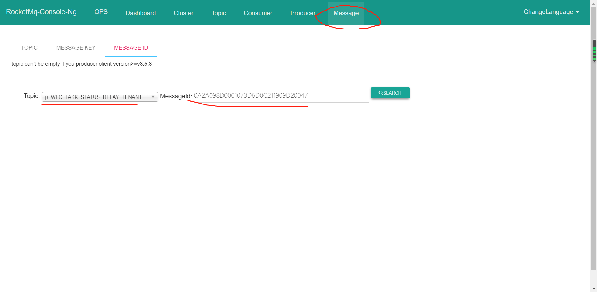
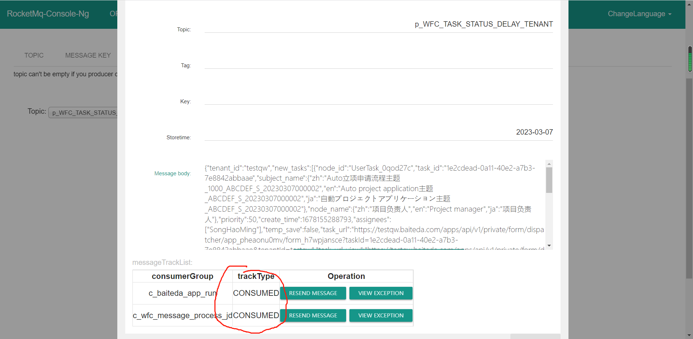

​

## 1.通过rid拿到完整上下文

### 1.1流程发起找rid

搜索关键字： /ego\_api/sp/v1/flow/start 业务bizkey(或容易区分的表单参数)

搜索结果

{

"sys\_name": "baiteda-bpm-api",

"time": "2022-07-11 11:30:55.882",

"ip": "10.42.3.231",

"tid": "TID:161b5039f7c145f88ee53e0bf11abeb9.5297.16575102544520001",

"level": "INFO",

"pid": "1",

"td": "http-nio-8603-exec-3",

"cml": "c.b.b.b.i.CloudSpInterceptor.preHandle-35",

**"rid": "3b10f008-067f-4214-abd6-e64e94cc7dea",**

"msg": "租户访问接口地址：/ego\_api/sp/v1/flow/start，发送参数：{\"initiator\_id\":\"YangHeng\",\"process\_definition\_key\":\"test\_moxingC\",\"process\_definition\_id\":\"test\_moxingC:1:72abca99-d779-4999-9e85-51cdcdf0c648\",\"parent\_process\_instance\_id\":\"6fce58c6-e9ae-4fed-8e64-3fddd9b4cbe3\",\"parent\_process\_instance\_token\_id\":\"7c2cec01-afda-4809-b6cb-651b0f48d007\",\"parent\_process\_task\_id\":\"7bf14484-2f0e-4b47-9972-553e908a0e7f\",\"business\_key\":\"8b4df3f2b8b444038919fe5ce20f8983\",\"task\_comment\":null,\"transient\_variable\":{\"flow\_app\_map\":{\"app\_id\":\"test\_app\_oa86lip2jw\",\"data\_code\":\"test\_app\_oa86lip2jw\_moxomgC\"},\"flow\_info\_map\":{},\"flow\_form\_map\":{\"test\_form\_im0fjsx7ry\":\"/apps/api/v1/private/form/dispatcher/test\_app\_oa86lip2jw/test\_form\_im0fjsx7ry\"},\"form\_data\_map\":{\"test\_app\_oa86lip2jw\_moxomgC\":{\"duanwenben\":\"1\",\"uid\":\"8b4df3f2b8b444038919fe5ce20f8983\",\"creator\":\"YangHeng\",\"update\_time\":1657510255000,\"app\_version\":\" \",\"create\_time\":1657510255000,\"name\":\"1\",\"ssdasddaSDASD\":\"1\"}},\"sub\_data\_map\":{},\"sub\_data\_map\_single\":{}},\"notice\_user\_id\_list\":null,\"tenant\_id\":\"test\"}",

"st": ""

}

然后通过rid搜索获取完整调用链日志

### 1.2人工任务流转找rid

搜索关键字： /ego\_api/sp/v1/flow/run 任务ID(或容易区分的表单参数)

搜索结果

{

"sys\_name": "baiteda-bpm-api",

"time": "2022-07-11 10:14:04.695",

"ip": "10.42.3.231",

"tid": "TID:2bafbfa97c21434ca07329dc30372876.165.16575056440619503",

"level": "INFO",

"pid": "1",

"td": "http-nio-8603-exec-3",

"cml": "c.b.b.b.i.CloudSpInterceptor.preHandle-35",

**"rid": "63c0f29c-14e3-4420-b657-32989fb1785b",**

"msg": "租户访问接口地址：/ego\_api/sp/v1/flow/run，发送参数：{\"task\_instance\_id\":\"dd5a0fb4-fd7f-49b8-b662-d62f32fd859b\",\"command\_id\":\"general\",\"command\_type\":\"general\",\"assignee\_id\":\"SongHaoMing\",\"task\_comment\":\"审批意见2022-07-11 10:14:04:039\",\"agent\_id\":null,\"transfer\_user\_id\":\"\",\"recover\_node\_id\":null,\"endorsement\_user\_id\_list\":\"\",\"rollback\_task\_id\":\"dd5a0fb4-fd7f-49b8-b662-d62f32fd859b\",\"roll\_back\_node\_id\":\"\",\"transient\_variable\":{\"flow\_app\_map\":{\"app\_id\":\"app\_pheaonu0mv\",\"data\_code\":\"app\_pheaonu0mv\_form\_78zaduwpel\"},\"flow\_info\_map\":{},\"form\_data\_map\":{\"app\_pheaonu0mv\_form\_78zaduwpel\":{\"field\_afs1mb02m5jh6nw\":\"{\\\"country\\\":null,\\\"country\_display\\\":null,\\\"province\\\":\\\"650000\\\",\\\"province\_display\\\":\\\"新疆维吾尔自治区\\\",\\\"city\\\":\\\"654000\\\",\\\"city\_display\\\":\\\"伊犁哈萨克自治州\\\",\\\"district\\\":\\\"654022\\\",\\\"district\_display\\\":\\\"察布查尔锡伯自治县\\\",\\\"full\_location\\\":\\\"新疆维吾尔自治区伊犁哈萨克自治州察布查尔锡伯自治县\\\"}\",\"field\_u75wa01m6rk62pi\":\"48bf004c29abd16e82179248f0aee231\",\"app\_version\":\" \",\"field\_d9pkkpmwffvi7hy\":[],\"field\_wi514h5fdnjgbn8\_min\":null,\"newpersonnel\":\"SongHaoMing\",\"field\_e2eyvp1jk1kgcv2\":\"91\",\"field\_d8jinxpvqnwb9kx\":\"1\",\"uid\":\"${dateId}\",\"update\_time\":1657505644153,\"field\_q0j4xvcx5k8ujch\_currency\":\"CNY\",\"field\_rv6ialbz161kahw\":\"52473a3eb4835b7efe0be17e3251f2a6\",\"process\_key\":\"testdingding\_AutoTestProcess0531\",\"field\_q0j4xvcx5k8ujch\_amount\":1000,\"field\_anz4sfpuo8m57m2\":1657505591425,\"id\":10907,\"field\_wi514h5fdnjgbn8\_max\":null,\"field\_nrw71rz1l57ngfn\":\"1\",\"creator\":\"SongHaoMing\",\"field\_uboz0ar1cqj77nl\":\"SongHaoMing,ZhangZiWei,MaFeiXiang\",\"process\_location\":\"UserTask\_0qod27c\",\"create\_time\":1657505636000,\"field\_fdsjkfu75wa01m6\":\"0a5fbb162d14404a9111b7520cb6d438\",\"field\_if03n4zgc2sd426\":3,\"field\_fg3zxawh3co8wgt\":\"\",\"field\_qsy29bl19068t2f\":[\"36bb6ad5f91d4198b73eb66a938b2e2a\",\"a2216e190b3342259b580ae8c90d77dc\"],\"vue\_zidingyi\":\"\",\"field\_cukxea0jby5lkty\_unit\":\"自定义单位\",\"process\_status\":\"RUNNING\",\"process\_instance\_id\":\"af826883-b1ec-47a7-8581-2efc72a7d9c7\",\"field\_cukxea0jby5lkty\_result\":100,\"field\_tjnn1h4ew0u6urk\":\"2022-07-11 10:13:11:425\",\"formTree\":[\"362c2e8c9d7c4affb9ce7ac8adba6c7c\",\"70f9442d07b646c4beffaa56b86bd305\",\"3f1d6f36bd7944dabaa51656c1fd1ccc\"],\"field\_sj68a7dlhqhlzjj\":\"\",\"field\_ek21lnsv5c22upg\":\"ABCDEF\_S\_20220711000001\"}},\"sub\_data\_map\_single\":{\"test\_app\_pheaonu0mv\_test\_form\_llmxeeykar\_12\":{},\"test\_app\_pheaonu0mv\_test\_form\_llmxeeykar\":{\"field\_or0mfXrkot\":[\"2022-07-11 10:13:11:425\"],\"app\_version\":[\" \"],\"field\_GVSJBfGgOV\":[[\"36706d063213401eabc67ac6bf2a8069\",\"362c2e8c9d7c4affb9ce7ac8adba6c7c\",\"b468be722384485897a5690a9360c708\"]],\"field\_abbBKVrzYN\":[\"\"],\"field\_BYJF48N4M4\":[\"2\"],\"bumenfuzeren\":[null],\"field\_xio7eAaSna\_amount\":[100],\"field\_yBmrbUuV3L\_max\":[null],\"shouyiduixiangleixing\":[null],\"field\_ls8MSSgRT3\":[null],\"uid\":[\"263cf9222b5147cbb7320f404b663aba\"],\"update\_time\":[1657505637000],\"field\_auto\_num\":[\"Resource\_20220711023542\"],\"form\_auto\_num\":[\"20220711023453\"],\"form\_78zaduwpel\_id\":[\"7ecdd687f2394c29be046a6a4a4b1915\"],\"field\_xio7eAaSna\_currency\":[\"CNY\"],\"process\_key\":[\"\"],\"shenpibumen\":[null],\"id\":[23585],\"shouyixiangmu\":[null],\"field\_X19E10qjm2\":[\"\"],\"field\_UpJ8bRSKpL\":[\"\"],\"field\_tree\":[null],\"creator\":[\"SongHaoMing\"],\"field\_SDZJFadRzm\_result\":[null],\"create\_time\":[1657505637000],\"process\_location\":[\"\"],\"field\_KElnDvhTKq\":[\"SongHaoMing\"],\"field\_SDZJFadRzm\_unit\":[null],\"field\_XmsCg8IAHq\":[\"\"],\"field\_WhxO6oK539\":[null],\"field\_Bsd8FJpuZ9\":[\"91\"],\"field\_Poe7VWer4J\":[\"0\"],\"chengbenzhongxinbianma\":[null],\"chengbenzhongxin\":[null],\"process\_status\":[\"COMPLETE\"],\"process\_instance\_id\":[\"\"],\"field\_KElnDvhTKq\_new\":[null],\"field\_b5kFzOshCM\":[[\"36706d063213401eabc67ac6bf2a8069\",\"362c2e8c9d7c4affb9ce7ac8adba6c7c\"]],\"field\_Q5M65zIREB\":[1648224000000],\"shouyibumen\":[null],\"field\_yBmrbUuV3L\_min\":[null],\"field\_RZyUWQWr6G\":[\"\"]},\"app\_pheaonu0mv\_form\_78zaduwpel\_p3k2rc1y2djrr3w\":{\"field\_dpqfu3i1cj07zk6\":[[\"0a5fbb162d14404a9111b7520cb6d438\",\"b468be722384485897a5690a9360c708\"]],\"app\_version\":[\" \"],\"field\_o156k63dxn6ni14\":[\"\"],\"field\_n5lrx67dbon2x09\":[\"\"],\"field\_g5e55yss1faihiu\":[\"子表\_单行文本子表\_单行文本2022-07-11 10:13:11:425\"],\"mingxi\_vue\_zidingyi\":[null],\"uid\":[\"036cd129bea54a218cf999d034c0f1ef\"],\"field\_hpinf5wau4n2tmd\_max\":[null],\"update\_time\":[1657505636000],\"form\_auto\_num\":[\"DETAIL\_Child\_Table\_20220711024482\"],\"form\_78zaduwpel\_id\":[\"7ecdd687f2394c29be046a6a4a4b1915\"],\"field\_auto\_num\":[\"20220711023997\"],\"process\_key\":[\"\"],\"id\":[23297],\"field\_e3fqfpv4g8z9gf7\":[\"\"],\"field\_kmlgk1hw7b9vk7i\":[[\"362c2e8c9d7c4affb9ce7ac8adba6c7c\",\"36bb6ad5f91d4198b73eb66a938b2e2a\"]],\"creator\":[\"SongHaoMing\"],\"field\_hpinf5wau4n2tmd\_min\":[null],\"field\_personnel\":[null],\"create\_time\":[1657505636000],\"process\_location\":[\"\"],\"field\_qt3nz8gy0kt2lft\_currency\":[\"CNY\"],\"field\_qq10wyqyl1bcezc\":[\"\"],\"field\_sbwz2c3ewf5jff8\":[\"0\"],\"field\_xqqkb7kwkfxqmck\":[\"\"],\"field\_hcwl903a5332e8q\":[\"SongHaoMing\"],\"field\_av7atlx8quuipwo\":[\"\"],\"process\_instance\_id\":[\"\"],\"process\_status\":[\"COMPLETE\"],\"field\_qt3nz8gy0kt2lft\_amount\":[100],\"field\_wipvv51ok34rli8\":[1648137600000],\"field\_ulz9nri2kcnh6el\":[0],\"field\_lewrlyfckavbk92\":[\"2\"]}},\"flow\_form\_map\":{\"test\_form\_d41n1fhq1p\":\"/apps/api/v1/private/form/dispatcher/app\_pheaonu0mv/test\_form\_d41n1fhq1p\",\"form\_78zaduwpel\":\"/apps/api/v1/private/form/dispatcher/app\_pheaonu0mv/form\_78zaduwpel\",\"test\_form\_2fy298a31l\":\"/apps/api/v1/private/form/dispatcher/app\_pheaonu0mv/test\_form\_2fy298a31l\"},\"sub\_data\_map\":{\"test\_app\_pheaonu0mv\_test\_form\_llmxeeykar\_12\":[],\"test\_app\_pheaonu0mv\_test\_form\_llmxeeykar\":[{\"field\_or0mfXrkot\":\"2022-07-11 10:13:11:425\",\"app\_version\":\" \",\"field\_GVSJBfGgOV\":[\"36706d063213401eabc67ac6bf2a8069\",\"362c2e8c9d7c4affb9ce7ac8adba6c7c\",\"b468be722384485897a5690a9360c708\"],\"field\_abbBKVrzYN\":\"\",\"field\_BYJF48N4M4\":\"2\",\"bumenfuzeren\":null,\"field\_xio7eAaSna\_amount\":100,\"field\_yBmrbUuV3L\_max\":null,\"shouyiduixiangleixing\":null,\"field\_ls8MSSgRT3\":null,\"uid\":\"263cf9222b5147cbb7320f404b663aba\",\"update\_time\":1657505637000,\"field\_auto\_num\":\"Resource\_20220711023542\",\"form\_auto\_num\":\"20220711023453\",\"form\_78zaduwpel\_id\":\"7ecdd687f2394c29be046a6a4a4b1915\",\"field\_xio7eAaSna\_currency\":\"CNY\",\"process\_key\":\"\",\"shenpibumen\":null,\"id\":23585,\"shouyixiangmu\":null,\"field\_X19E10qjm2\":\"\",\"field\_UpJ8bRSKpL\":\"\",\"field\_tree\":null,\"creator\":\"SongHaoMing\",\"field\_SDZJFadRzm\_result\":null,\"create\_time\":1657505637000,\"process\_location\":\"\",\"field\_KElnDvhTKq\":\"SongHaoMing\",\"field\_SDZJFadRzm\_unit\":null,\"field\_XmsCg8IAHq\":\"\",\"field\_WhxO6oK539\":null,\"field\_Bsd8FJpuZ9\":\"91\",\"field\_Poe7VWer4J\":\"0\",\"chengbenzhongxinbianma\":null,\"chengbenzhongxin\":null,\"process\_status\":\"COMPLETE\",\"process\_instance\_id\":\"\",\"field\_KElnDvhTKq\_new\":null,\"field\_b5kFzOshCM\":[\"36706d063213401eabc67ac6bf2a8069\",\"362c2e8c9d7c4affb9ce7ac8adba6c7c\"],\"field\_Q5M65zIREB\":1648224000000,\"shouyibumen\":null,\"field\_yBmrbUuV3L\_min\":null,\"field\_RZyUWQWr6G\":\"\"}],\"app\_pheaonu0mv\_form\_78zaduwpel\_p3k2rc1y2djrr3w\":[{\"field\_dpqfu3i1cj07zk6\":[\"0a5fbb162d14404a9111b7520cb6d438\",\"b468be722384485897a5690a9360c708\"],\"app\_version\":\" \",\"field\_o156k63dxn6ni14\":\"\",\"field\_n5lrx67dbon2x09\":\"\",\"field\_g5e55yss1faihiu\":\"子表\_单行文本子表\_单行文本2022-07-11 10:13:11:425\",\"mingxi\_vue\_zidingyi\":null,\"uid\":\"036cd129bea54a218cf999d034c0f1ef\",\"field\_hpinf5wau4n2tmd\_max\":null,\"update\_time\":1657505636000,\"form\_auto\_num\":\"DETAIL\_Child\_Table\_20220711024482\",\"form\_78zaduwpel\_id\":\"7ecdd687f2394c29be046a6a4a4b1915\",\"field\_auto\_num\":\"20220711023997\",\"process\_key\":\"\",\"id\":23297,\"field\_e3fqfpv4g8z9gf7\":\"\",\"field\_kmlgk1hw7b9vk7i\":[\"362c2e8c9d7c4affb9ce7ac8adba6c7c\",\"36bb6ad5f91d4198b73eb66a938b2e2a\"],\"creator\":\"SongHaoMing\",\"field\_hpinf5wau4n2tmd\_min\":null,\"field\_personnel\":null,\"create\_time\":1657505636000,\"process\_location\":\"\",\"field\_qt3nz8gy0kt2lft\_currency\":\"CNY\",\"field\_qq10wyqyl1bcezc\":\"\",\"field\_sbwz2c3ewf5jff8\":\"0\",\"field\_xqqkb7kwkfxqmck\":\"\",\"field\_hcwl903a5332e8q\":\"SongHaoMing\",\"field\_av7atlx8quuipwo\":\"\",\"process\_instance\_id\":\"\",\"process\_status\":\"COMPLETE\",\"field\_qt3nz8gy0kt2lft\_amount\":100,\"field\_wipvv51ok34rli8\":1648137600000,\"field\_ulz9nri2kcnh6el\":0,\"field\_lewrlyfckavbk92\":\"2\"}]}},\"processinstance\_id\":null,\"revoke\_task\_id\":\"\",\"attachment\_id\":\"\",\"tenant\_id\":\"test\",\"biz\_info\":null}",

"st": ""

}

### 1.3接收任务流转找rid

搜索关键字： /ego\_api/sp/v1/flow/runReceiveTask 任务ID(或容易区分的表单参数)

搜索结果

{

"sys\_name": "baiteda-bpm-api",

"time": "2022-07-11 10:14:04.695",

"ip": "10.42.3.231",

"tid": "TID:2bafbfa97c21434ca07329dc30372876.165.16575056440619503",

"level": "INFO",

"pid": "1",

"td": "http-nio-8603-exec-3",

"cml": "c.b.b.b.i.CloudSpInterceptor.preHandle-35",

**"rid": "63c0f29c-14e3-4420-b657-32989fb1785b",**

"msg": "租户访问接口地址：/ego\_api/sp/v1/flow/runReceiveTask，发送参数：..."

}

## 2.查询消息是否发送正常

根据rid 加 "发送任务状态变更RMQ延时5s消息" 判断消息是否发送成功

​

[2023-03-07 10:14:49.043][][baiteda-bpm-center][INFO][NettyClientPublicExecutor\_6][c.b.b.b.r.RocketMqProducer.onSuccess$original$N8z2h8Za-173][5f9803c6-bdae-4292-b3c1-a32c7138fce6]:发送任务状态变更RMQ延时5s消息成功，消息为：{"tenant\_id":"testqw","new\_tasks":[{"node\_id":"UserTask\_0qod27c","task\_id":"1e2cdead-0a11-40e2-a7b3-7e8842abbaae","subject\_name":{"zh":"Auto立项申请流程主题\_1000\_ABCDEF\_S\_20230307000002","en":"Auto project application主题\_ABCDEF\_S\_20230307000002","ja":"自動プロジェクトアプリケーション主题\_ABCDEF\_S\_20230307000002"},"node\_name":{"zh":"项目负责人","en":"Project manager","ja":"项目负责人"},"priority":50,"create\_time":1678155288793,"assignees":["SongHaoMing"],"temp\_save":false,"task\_url":"https://testqw.baiteda.com/apps/api/v1/private/form/dispatcher/app\_pheaonu0mv/form\_h7wpjansce?taskId=1e2cdead-0a11-40e2-a7b3-7e8842abbaae&tenantId=testqw","task\_url\_view":"https://testqw.baiteda.com/apps/api/v1/private/form/dispatcher/app\_pheaonu0mv/form\_h7wpjansce?taskId=1e2cdead-0a11-40e2-a7b3-7e8842abbaae&tenantId=testqw"}],"status\_tasks":[{"task\_id":"8ebae772-6ee2-4005-acd0-e0efaa1fedc4","assignee\_id":"externalbd60ffab290b4c0fa13cf84afa12f38c","create\_time":1678155288502,"end\_time":1678155288507,"node\_name":{"zh":"提交节点","en":"Submit node","ja":"提出段階"},"node\_id":"UserTask\_1","command\_type":"startandsubmit","command\_id":"startandsubmit\_1"}],"status\_process":{"process\_instance\_id":"bbdf64c3-f86a-47da-bac2-1b7c795e6eb9","process\_def\_key":"testdingding\_AutoTestProcess0531","process\_def\_id":"testdingding\_AutoTestProcess0531:8:e39f8a4e-ee6c-4287-a1ff-f78690a3f291","business\_key":"4a7d5e1eb15d4d46a61a24b3cb3eb579","process\_status":"RUNNING","initiator\_id":"externalbd60ffab290b4c0fa13cf84afa12f38c","initiate\_time":1678155288331,"process\_name":{"zh":"Auto立项申请流程","en":"Auto project application","ja":"自動プロジェクトアプリケーション"},"def\_key\_host":"https://testqw.baiteda.com","command\_type":"startandsubmit","event\_type":"TASK\_COMPLETED"},"current\_task":{"task\_id":"8ebae772-6ee2-4005-acd0-e0efaa1fedc4","assignee\_id":"externalbd60ffab290b4c0fa13cf84afa12f38c","create\_time":1678155288502,"end\_time":1678155288507,"node\_name":{"zh":"提交节点","en":"Submit node","ja":"提出段階"},"node\_id":"UserTask\_1","command\_type":"startandsubmit","command\_id":"startandsubmit\_1"}}SendResult [sendStatus=SEND\_OK, **msgId=0A2A098D0001073D6D0C211909D20047**, offsetMsgId=0A2A0AD700002A9F00000000BE5B6F94, messageQueue=MessageQueue [topic=p\_WFC\_TASK\_STATUS\_DELAY\_TENANT, brokerName=broker-a, queueId=1], queueOffset=136624]

​

## 3.检查消息是否被消费

打开rocketmq-console管理页面

​

这种就是正常消费了 如果显示 NOT\_ONLINE 就检查 配置文件里的mq地址

​

​

## 4.检查程序代码

在api项目搜索 "监听预览mq消息内容为" 加流程实例ID 获取rid ，通过rid 导致所有相关日志，给开发人员排查相关问题。

​

​
