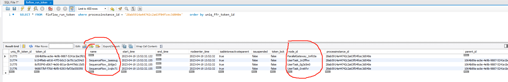

<a id="c2MCd"></a>


## 1.流程问题基本排查思路

1. 通过以下3种方式，获取流程入参
2. 表达式计算缺少参数、调用服务入参不对通常都是流程入参问题
3. 如果只有某个流程图有问题，其他流程正常，通常是流程设计态配置流程图有问题，检查对应的配置
4. 如果排查不出，将该条调用链的日志汇总到文件，联系我们的运营人员解决

流程发起搜索关键字： /ego\_api/sp/v1/flow/start 业务bizkey(或容易区分的表单参数)

流程审批搜索关键字： /ego\_api/sp/v1/flow/run 任务ID(或容易区分的表单参数)

流程干预搜索关键字: 在审批意见里加入特定内容，然后进行搜索

​


```json
  {
	"sys_name": "baiteda-bpm-api",
	"time": "2022-07-11 11:30:55.882",
	"ip": "10.42.3.231",
	"tid": "TID:161b5039f7c145f88ee53e0bf11abeb9.5297.16575102544520001",
	"level": "INFO",
	"pid": "1",
	"td": "http-nio-8603-exec-3",
	"cml": "c.b.b.b.i.CloudSpInterceptor.preHandle-35",
	"rid": "3b10f008-067f-4214-abd6-e64e94cc7dea",
	"msg": "....."
  }
```


然后通过rid 搜索完整上下文

<a id="Rz1H1"></a>


## 2.异常分类

<a id="wim1n"></a>


### 2.1groovy表达式执行异常,错误为:No such property: aaa for class: Script6

主要是流程入参中缺少这个变量对应的值，遇到此问题时，需要首先排查表单上是否加了字段权限，导致流转时入参缺少

如果提示 流程变量\_aaaa ，则是变量的没有给默认值导致

<a id="DN217"></a>


### 2.2流程无法审批结束

多数发生在带有并行网关的流程图上

首先要查询 base库 SELECT \* FROM fixflow\_run\_token where processinstance\_id = '流程实例ID' order by uniq\_ffr\_token\_id





主要看node\_id对应的节点在流程图上的流向

​

​

​

​

​

​

​

​

​

​

<a id="XKM5V"></a>


##
