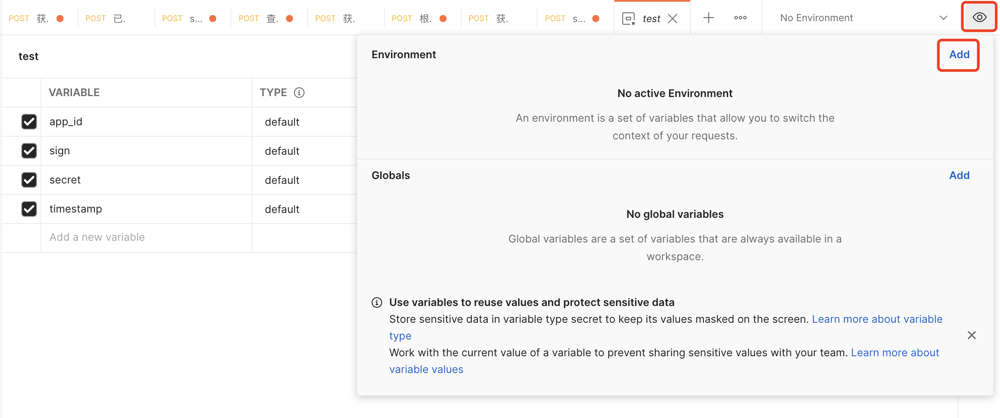
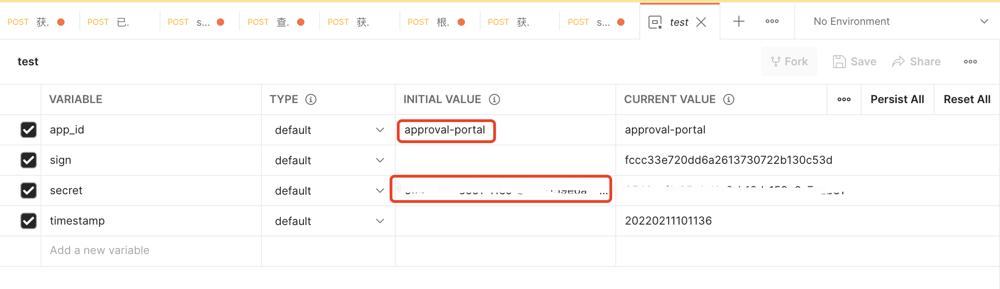
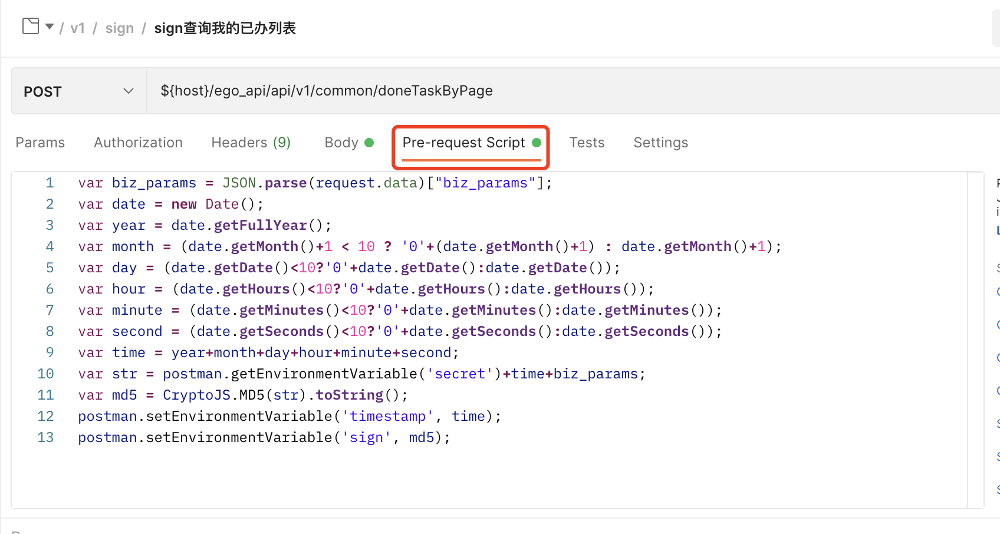
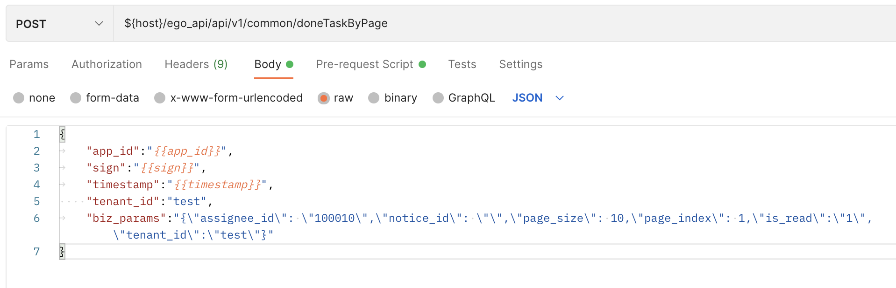

百特搭的流程引擎提供了丰富的OpenAPI接口，方便您实现与三方系统的集成，实现更高自定义的功能。

流程中心提供了两种类型的API接口，一种是基于AppId和Secret自定义签名的认证鉴权方法。一种是authToken的鉴权方法。

<a id="kzCoP"></a>


### 1.签名鉴权

通过管理员发放的AppId和Secret进行签名计算，生成签名sign的值。AppId需要显示传递，Secret是密钥需要用户自己保存。

参数签名规则：


```json
{

    "app_id":"app001",  //为指定用户发放的appId
    "sign":"sign001",  //签名计算后的sign=md5(secret+timestamp+biz_params)
    "sign_type":"md5",  //固定
    "timestamp":"20201010120505", //yyyyMMddHHmmss格式
    "tenant_id":"test",  //租户id
    "biz_params":"{\"user_id\":\"YangJingJie\"}"//json参数字符串
}
```

<a id="sVuPW"></a>


#### 1.1postman动态构造签名

- 添加环境变量





- 给变量赋值





- 在pre-requestScript中加入如下脚本接口





```json
var biz_params = JSON.parse(request.data)["biz_params"];
var date = new Date();
var year = date.getFullYear();
var month = (date.getMonth()+1 < 10 ? '0'+(date.getMonth()+1) : date.getMonth()+1);
var day = (date.getDate()<10?'0'+date.getDate():date.getDate());
var hour = (date.getHours()<10?'0'+date.getHours():date.getHours());
var minute = (date.getMinutes()<10?'0'+date.getMinutes():date.getMinutes());
var second = (date.getSeconds()<10?'0'+date.getSeconds():date.getSeconds());
var time = year+month+day+hour+minute+second;
var str = postman.getEnvironmentVariable('secret')+time+biz_params;
var md5 = CryptoJS.MD5(str).toString();
postman.setEnvironmentVariable('timestamp', time);
postman.setEnvironmentVariable('sign', md5);
```


- 在postman中使用自定义的环境变量





<a id="eqQI4"></a>


### 2.Auth鉴权

Auth鉴权是用于流程组件接口的一种鉴权方式，在组件调用接口的时候将auth放入header中。

- header中的格式为：


```json
auth:authToken
```


auth的值是通过签名接口getAuth方法获取的，详细请查看：[签名接口v1版](https://baiteda.yuque.com/staff-shgita/nbg92z/tu8mtg)中“**4.2获取Auth**”接口说明。

## 下级条目

- [开发测试联调接口](001-开发测试联调接口.md)
- [桂教通流程数据推送到外部待办任务中心](002-桂教通流程数据推送到外部待办任务中心.md)
- [统一任务接入](003-统一任务接入/README.md)
- [签名接口v1版](004-签名接口v1版.md)
- [签名接口v2版](005-签名接口v2版.md)
- [审批组件接口v1版](006-审批组件接口v1版.md)
- [审批组件接口v2版](007-审批组件接口v2版.md)
- [常见问题](008-常见问题/README.md)
