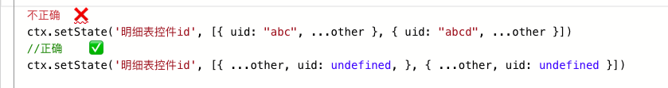
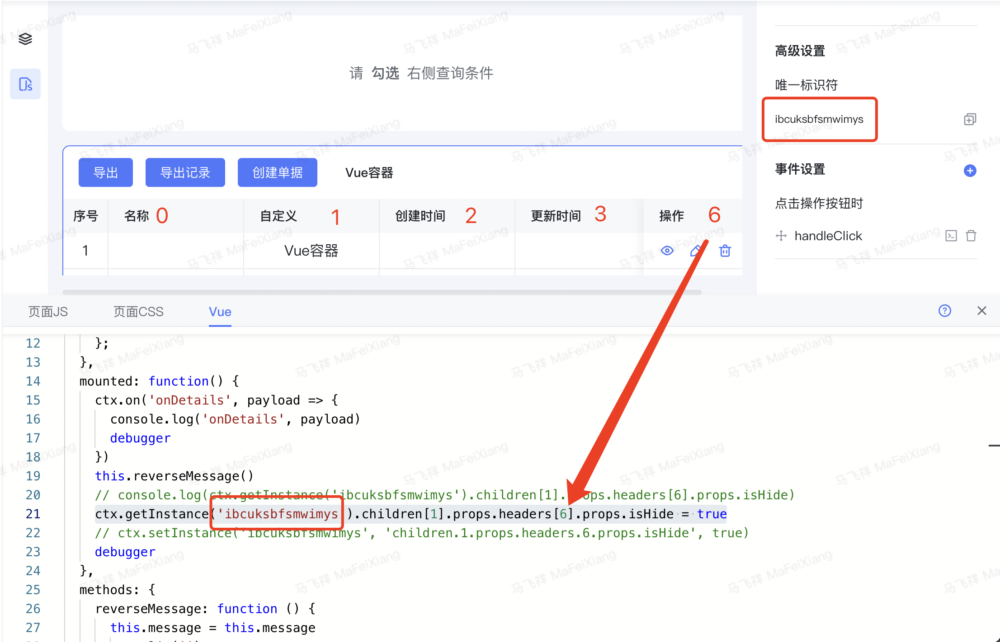
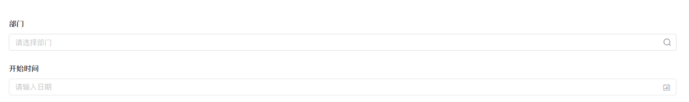
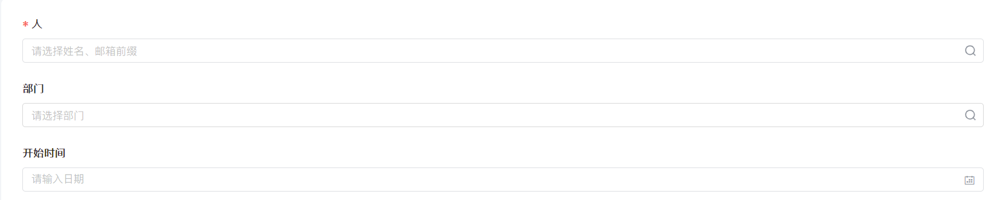
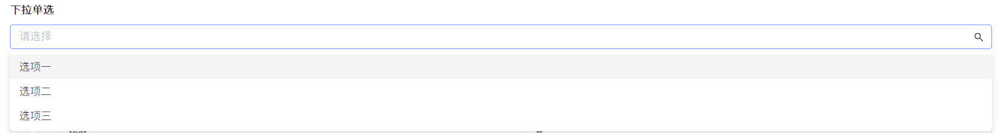
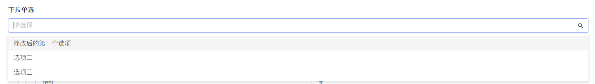
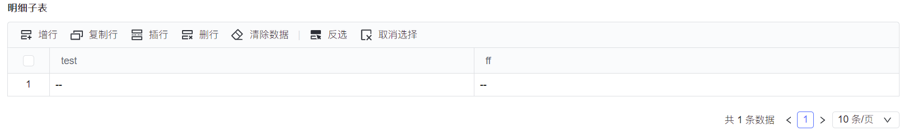
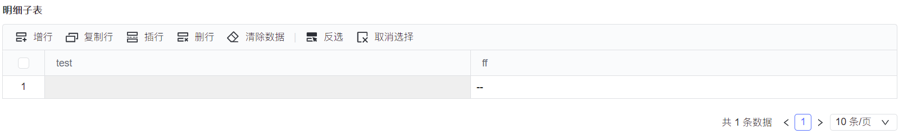

<a id="WjanY"></a>


## 1. window: 全局

<a id="Srq1W"></a>


### 1.1 listview:reload-list 刷新列表页数据


```typescript
//不传参数，会根据当前条件刷新
ctx.emit('listview:reload-list', {})


//可选参数示例
ctx.emit('listview:reload-list', {
  value: {
    paginationInfo: {
      current:0,
      pageSize: 5,
    },
    ordersInfo: [{
      column_name: 'uid'
      desc: true
    }],
    queryInfo: [{
      key: "f2",
      key_type: "varchar",
      type: "LIKE",
      value: ["asdfasf"]
    }]
  },
  options: {
    clearSelectedRows: true
  }
})
```

<a id="khKhX"></a>


#### 1.1.1 参数：

- value

- paginationInfo：分页条件
- ordersInfo：排序条件
- queryInfo：查询条件 [查询类型枚举](https://baiteda.yuque.com/staff-shgita/nbg92z/sruuxxqgq71679rg#TncFR)

- options：

- clearSelectedRows。是否清除当前列表选中的行

<a id="pnNY7"></a>


### ~~1.2 updateList 刷新列表数据~~

⚠️ 在4.0.0 因为多标签页的功能上线，页面上存在多个列表。所以需要更换为 API：[listview:reload-list](https://baiteda.yuque.com/staff-shgita/nbg92z/kwlg9re8muw4x2sw#Srq1W)


```typescript
//简单调用示例
window.updateList()


// 参数调用示例
window.updateList({
  paginationInfo: {
    current:0, // 当前页
    pageSize: 5,// 每页条数
  },
  ordersInfo: [{
    column_name: 'uid'
    desc: true
  }],
  queryInfo: [{
    key: "f2",
    key_type: "varchar",
    type: "LIKE",
    value: ["asdfasf"]
  }]
})
```


updateList中的参数说明


```typescript
type UpdateListParams = {
  paginationInfo?: {
    current?: number// 当前页
    pageSize?: number// 每页条数
  }
  ordersInfo?: {
    column_name: string
    desc: boolean
  }[]
  queryInfo?: {
    key: string
    value: Array
    type: QUERY_TYPE
    key_type: string
  }[]
  filtersInfo?: {
    [key: string]: any
  }[]
}

enum QUERY_TYPE {
  'EQ','GT','LT','IN','LIKE','RANGE','GE','LE',
  'CONTAINS_ONE','CONCAT_LIKE','CONTAINS_IN_WITH_SUB_DEPT',
  'NOT_EQ','CONCAT_NOT_EQ','IS_NULL','IS_NOT_NULL',
  'EQ_FIELD','IS_NULL_OR_EQ_FIELD','NOT_EQ_FIELD'
}
```

<a id="lou7D"></a>


### 1.3 multipleTabs 内标签页

⚠️ 在4.3.0 因为多标签页的功能上线，提供出来的一组api

⚠️ api所用到的pathUrl需满足以下条件（[pathUrl拼接规则](https://baiteda.yuque.com/staff-shgita/nbg92z/vc9ull)）

1.通过菜单导航形式打开的页面。

2.通过列表内标签形式打开的创建、编辑、查看页面。

​

<a id="OUPSf"></a>


#### 1.3.1 createMultipleTab 创建内标签页


```typescript
//调用示例
// 列表自定义操作列打开某个页面
window.multipleTabs.createMultipleTab(
  '查看页面',
 'yl_form_hy6e8x618q',
  '/process/yl_app_ccfwm0fwdz/yl_al6biwqd1m/yl_form_hy6e8x618q/333939ef09964afda96bc2fd4bb269b0?type=view',
  'view'
)

// 参数说明
window.multipleTabs.createMultipleTab(
  title: string, // 内标签页的名称
  formId: string, // 表单的ID
  pathUrl: string, //  要跳转的页面路径
  type: string  // view: 查看页面、edit：编辑页面、create：新建页面
)
```

<a id="dgVNd"></a>


#### 1.3.2 layoutChangeTab 切换内标签页


```typescript
//调用示例
// 跳转到某个查看页面
window.multipleTabs.layoutChangeTab('/process/yl_app_ccfwm0fwdz/yl_al6biwqd1m/yl_form_hy6e8x618q/333939ef09964afda96bc2fd4bb269b0?type=view')

// 参数说明
window.multipleTabs.layoutChangeTab(
 	pathUrl: string, // 要跳转的页面路径
	query: any // 要跳转的页面的参数 （可选参数）
)
```

<a id="GEOtz"></a>


#### 1.3.3 closePage 关闭当前的内标签页


```typescript

hasTip: 是否显示二次确认弹窗

window.multipleTabs.closePage({ hasTip: true })
```

<a id="ICX1D"></a>


#### 1.3.4 isInternally 当前页面是否在内标签页里


```typescript


//返回 true：在内标签页里， false： 不在内标签页中
window.multipleTabs.isInternally()
```

<a id="P4wd1"></a>


#### 1.3.5 reload 刷新当前标签页( 4.5.0版本提供 )


```typescript

// hasTip: 是否显示二次确认弹窗
const params = {
	hasTip:false, // true false 默认值为 false
  refreshTo:2  // 1 刷新当前应用标签页 2 刷新当前内标签页 默认值为 2
}
window.multipleTabs.reload(params)
```

<a id="v5kV4"></a>


## 2. ctx：页面上下文

**概念****👇**

唯一标识符： 在设计器中，每一个控件都会有自己的唯一标识符，用来标志/获取/设置这个控件的属性和值

state: 代表数据，是由控件id组成的 key : value 的数据结构，明细子表是一个数组中包裹着多个 key : value 组成的对象

instance： 代表实例，每一个控件都有自己对应的实例，同样的唯一标识符，如果是在表单中，实例就是唯一的，在明细子表中，实例就是多个，每一行行都有自己的实例

**注意事项****👇**

- 所有的数据和操作都是基于控件的唯一标识符的
- 对于可以绑定多个数据源的控件，例如日期区间，金额，计算公式，在设置值的时候，需要设置一个对象
- 以下设置数据的方法中，options参数为额外携带的，因为修改数据都会触发控件的值发生改变事件，开发人员可以通过在设置时携带一些参数，用于在事件内取到一些额外的参数

​

<a id="m9rHM"></a>


### 2.1 rawStore 临时存储 （4.0.0版本提供）

在页面的js和vue之间进行数据传递，可以通过该属性存取


```typescript
console.log(ctx.rawStore)
/**
{
	"DELETE_IDS": [],
 	"UPDATE_IDS": []
}
*/
ctx.rawStore['attr1'] = 'value1'

let attr1 = ctx.rawStore['attr1']
```

<a id="lD8lW"></a>


### 2.2 parent 明细子表以表单方式打开获取父页面


```typescript
> console.log(ctx.parent.getState('父页面控件ID'))
// 可以在子页面获取父页面的数据
```


​

<a id="aUrCE"></a>


### 2.3 externalParams 页面上下文数据


```typescript
externalParams {
  // 页面的uId，在非创建页面可以拿到
  uId?: string
  // render state，表单渲染用到的数据，一般为render接口的返回值
  data: {
    data_model: {	//主表模型
      data_code: "test_model_3l38o8wx",
    	data_field_list: [{field_name: '测试模型', desc: null, field_code: 'id', field_type: 'bigint', length: 18, …}],
    },
    sub_data_model_list: [{	//子表模型
      data_code: "test_sub_model_o0ww8bn1",
      data_field_list: [{field_name: 'SF1', desc: null, field_code: 'SF1', field_type: 'reference-field', length: 0, …}]
    }],
  },
  url: {},
  dataCode: string,	//表单页面可以拿到
  appId: string,
  formKey: string,
}
```

<a id="MCjvA"></a>


#### 2.3.1 field\_type 模型字段类型


```javascript
{ code: 'varchar', name: '短文本', defaultLength: 50 },
{ code: 'text', name: '长文本', defaultLength: 'no_length' },
{ code: 'decimal', name: '数值', defaultLength: 20 },
{ code: 'bigint', name: '整数', defaultLength: 20 },
{ code: 'array', name: '数组', defaultLength: 330 },
{ code: 'people', name: '人员', defaultLength: 64 },
{ code: 'department', name: '部门', defaultLength: 500 },
{ code: 'timestamp', name: '日期', defaultLength: 'no_length' },
{ code: 'auto_number', name: '自动编号', defaultLength: 50 },
{ code: 'image', name: '图片', defaultLength: 330 },
{ code: 'file', name: '附件', defaultLength: 330 },
{ code: 'location', name: '地址', defaultLength: 300 },
{ code: 'relation-field', name: '关联字段', defaultLength: 32 },
{ code: 'reference-field', name: '引用字段', defaultLength: 'no_length' },
{ code: 'calc', name: '计算公式', defaultLength: 330 },
{ code: 'json', name: 'JSON', defaultLength: 'no_length' },
{ code: 'relation', name: '子表关联', defaultLength: 50 },
{ code: 'model', name: '模型', defaultLength: 0 },
{ code: 'model_set', name: '模型集合', defaultLength: 0 },
{ code: 'encrypted_field', name: '加密文本', defaultLength: 1000 },
{ code: 'boolean', name: '逻辑', defaultLength: 5 },
```

<a id="TLxBt"></a>


#### 2.3.2 获取uid

可以参考如下方式


```typescript
console.log(ctx.externalParams.uId)
console.log(ctx.externalParams.data)
console.log(ctx.externalParams.url)


console.log(ctx.externalParams)
{
  data: {
   app_id: 'app_dt9cfvho64',
   form_key: 'form_90djtj62ss',
   rel_form_keys: Array(0),
   data_code: 'dqwdqwdwefwe_wrjii03t',
   name: '',
     …}
  uId: "9ade268fe8ce4c5cabed2496e8bdc502",
  url: {
    appId: 'app_dt9cfvho64',
    taskId: 'be7f2e82-57bb'
  }
}
```

<a id="htWPv"></a>


#### 2.3.3 获取url上的参数（表单、列表）


```typescript
//列表：/apps/desktop/sapp/yigoteam_app_at3qnm838h/yigoteam_36753rkclv/box/list/yigoteam_form_dylr41yllr?menuId=04133424887059367
console.log(ctx.externalParams)

{
  data: {
     …
  },
  url: {
    appId: "yigoteam_app_at3qnm838h",
		formId: "yigoteam_form_dylr41yllr",
		menuId: "04133424887059367",
		sappId: "yigoteam_36753rkclv"
  }
}


//表单： /apps/desktop/sapp/yigoteam_app_at3qnm838h/sappId/yigoteam_form_sem2zqpucv/be8decd7e9424263b49fb3b8d1a3e07e?type=edit&additional_query={}&header=none
console.log(ctx.externalParams)

{
  data: {
     …
  },
	uId: "be8decd7e9424263b49fb3b8d1a3e07e",
  {
      "appId": "yigoteam_app_at3qnm838h",
      "sappId": "sappId",
      "formId": "yigoteam_form_sem2zqpucv",
      "uId": "be8decd7e9424263b49fb3b8d1a3e07e",
      "type": "edit",
      "additional_query": "{}",
      "header": "none"
  }
}
```

<a id="gCwT8"></a>


#### 2.3.4 获取明细表以表单打开方式的父级数据(parent)


```typescript
console.log(ctx.externalParams)
{
  data: {
     …
  },
  parent: {
    "uid": "new:uid_72384580421665481131179",
    "rowIndex": 0,
    "instanceId": "wIRxUfGOIn"
	},
  uId: '...',
  url: {
     …
  }
}
```

<a id="rJj7W"></a>


### 2.4 getState （表单）获取数据API👇


```javascript
getState(controlId?: string, rowIndex?: number)
```


**示例**


```javascript
ctx.getState('控件唯一标识符') //组件的唯一标识符
ctx.getState('8ju86f673mtp7iq')
// "input的值"    //根据组件类型不同返回的值不同

ctx.getState('控件唯一标识符', 0) //明细表中第一行的指定组件的值
ctx.getState('8ju86f673mtp7iq', 0)
// "组件值"

ctx.getState('明细子表唯一标识符')
// [{ /*行对象*/ },{ /*行对象*/ },{ /*行对象*/ }]
```

<a id="HCiQv"></a>


### 2.5 getState （列表 4.5.0 新增 ）获取选中行API👇


```javascript
getState(gridTableId?: string) // gridTableId 表格唯一标识符 4.5.0 版本 列表配置提供
```


⚠️**注意**: 早期版本提供 checked 事件 建议全部更换掉，推荐使用 getState去获取。

**示例**


```tsx
ctx.getState('表格唯一标识符') //表格唯一标识符
// 值为对象格式 包含 👇
type SelectStateType =  {
	 selectedRowKeys: string[] //以唯一标识符存储
	 selectedRows: Data[]
   selectedAllRowDatas: Data[] // 选中行数据 注意： 主子表关联关系 选中一张，会返回多条。
   pk: String	//只读，不是响应式
   pkPageData: string[]	//只读，不是响应式
}
```

<a id="GRNtW"></a>


### 2.6 setState （表单）设置数据API👇

注意：给组件设置值时，尽量保证与组件的数据类型fieldType相同，如果设置一个非法的值，可能会引起警告，并设置不成功！


```javascript
setState(controlId: string, value: unknown, rowIndex?: number, options?: any)
```


⚠️**注意**（2.3.6后）： 对于明细表的setState 或者 getState 禁止 ❌（传入/修改） uid 值，会影响数据流向。





**示例**


```javascript
 //给表单上的组件赋值
ctx.setState('控件的唯一标识符', /* 需要设置的值 */)
ctx.setState('8ju86f673mtp7iq', '新的值')
ctx.setState('8ju86f673mtp7iq', ['id1', 'id2']) //赋值给多选、下拉多选
//给表单上的数组对象类型的控件清空值
ctx.setState('控件的唯一标识符',null | 数组[] | 对象{})
// 给金额组件赋值
ctx.setState('8ju86f673mtp7iq', { amount: 100, currency: 'CNY' })
// 只需要改金额，不更改币种
// 方法一
ctx.getState('8ju86f673mtp7iq').amount = 100
// 方法二
const state = ctx.getState('8ju86f673mtp7iq')
state.amount = 100
ctx.setState('8ju86f673mtp7iq', state)

// 给明细表内的组件赋值
ctx.setState('控件的唯一标识符', /* 需要设置的值 */， /* 行下标 */)
ctx.setState('8ju86f673mtp7iq', '新的值', 0) //给明细表中的第一行的8ju86f673mtp7iq组件赋值

// 给明细表批量赋值
ctx.setState('明细子表的唯一标识符', /* 需要设置的值，数组对象类型 */)
// 给明细表批量赋值，覆盖当前表数据
ctx.setState('8ju86f673mtp7iq', [{ tj7triaeoo83cc0: 1 }, { tj7triaeoo83cc0: 2 }])

// 给明细表添加一个空行,
// 需要注意，emptyRow不能被重复使用，只能使用一次，需要添加第二行就再执行一次getEmptyState
const emptyRow = ctx.getEmptyState('明细子表的唯一标识符')
ctx.getState('明细子表的唯一标识符').push(emptyRow)

// 给明细表添加一条有数据的行
ctx.getState('明细子表的唯一标识符').push(/* 需要设置一整行的值，对象类型 */)
ctx.getState('8ju86f673mtp7iq').push({ tj7triaeoo83cc0: 3 })

// 给明细表删除一条数据
ctx.getState('8ju86f673mtp7iq').splice(0, 1) // 删除明细表第一条数据

// 除了push以外，还可以使用JavaScript中数组的splice，shift，unshift,pop这些API，对明细子表进行增加一行，删除一行等操作
```

<a id="LnY6J"></a>


### 2.7 setState （ 列表 4.5.0 新增 ）设置列表选中值API👇

注意：给选项设置值时，尽量保证与数据格式保持一致。否则会不生效


```tsx
setState(gridTableid: string, select: SelectStateType)
// 可以只设置 selectedRowKeys
// 值为对象格式 包含 👇
type SelectStateType =  {
  selectedRowKeys: string[] //以唯一标识符存储
  selectedRows?: Data[]			 //选中行数据
  selectedAllRowDatas?: Data[] // 选中行数据 注意： 主子表关联关系 选中一张，会返回多条。
}
// 设置选中值
ctx.setState(gridTableid,{
	selectedRowKeys: ['数据主键']
})
// 清空列表选中值
ctx.setState(gridTableid,{})
ctx.setState(gridTableid,{
  selectedRowKeys:[],
  selectedRows:[],
  selectedAllRowDatas: [] // 选中行数据 注意： 主子表关联关系 选中一张，会返回多条。
})

//批量设置明细表数据，并且不触发明细表数据填充的相关事件
// 明细表数据对象数组[] = ctx.buildFields('数据源的code', { fieldCode: '值', fieldCode2: '值2' })
ctx.setState('明细表唯一标识符', '明细表数据对象数组', undefined, {//显示日报明细
    disableMultistageFillingPluginChange: true,
    disableMultistageFillingPluginListChange: true,
  })
```

<a id="ceI84"></a>


### 2.8 setStates 批量设置数据API👇


```typescript
type StateType = {
  [controlId: string]: unknown
}
type StatesType = {
  [dataViewId: string]: StateType
}
/**
   * 向Store设置一组值，并触发事件（触发事件是根据组件在页面中的顺序逐个触发）
   */
setStates(states: StatesType | StateType, rowIndex?: number, options?: any)
```

<a id="C1TLM"></a>


#### 2.8.1 options 可选项


```typescript
{
  disableMultistageFillingPluginChange: true,
  disableMultistageFillingPluginListChange: true,
}
```


**示例**


```javascript
ctx.setStates({ '控件的唯一标识符': '新的值', '控件的唯一标识符': 1234 })

// 设置表单组件
ctx.setStates({ '8ju86f673mtp7iq': '新的值', '0tj7triaeoo83cc': 1234})

// 批量设置明细子表
ctx.setStates({ '明细子表控件的唯一标识符': [{ /* 行数据 */ }, { /* 行数据 */ }] })

// 设置明细子表一行的数据
ctx.setStates({ /* 行数据 */ }, /* 行下标 */)

// 不触发明细表数据填充
ctx.setStates(
  { /* 行数据 */ },
  undefined,
  {
    disableMultistageFillingPluginChange: true,
    disableMultistageFillingPluginListChange: true,
  }
)
```

<a id="PEnDW"></a>


### 2.9 getField 通过数据项绑定字段来获取数据的方法👇

注意事项

- dataCode为模型编码，fieldCode为绑定数据项的字段编码
- 必须指定dataCode，否则无法找到对应需要修改的控件
- **想要拿到整个明细表或者整个表单的数据，可以只传入dataCode（2021/09/09上线）**
- **希望通过dataCode和fieldCode直接修改明细表的数据，可以借助getField + buildFields API来实现，具体参考buildFields示例（2021/09/09上线）**


```javascript
/**
   * 通过dataCode和fieldCode来获取控件的值
   * @param dataCode 模型编码 - 如果是主表的话就是主表的模型编码，明细子表的话就是子表的模型编码
   * @param fieldCode 字段编码 - 控件绑定的数据项的编码
   * @param rowIndex 行下标 - 如果是明细子表中的控件需要提供
   * */
  getField(dataCode: string, fieldCode?: string, rowIndex?: number): unknown
```


示例


```javascript
ctx.getField('数据源的code', '数据字段的编码')

ctx.getField('dataCode', 'fieldCode')
//  "组件值"

// 获取明细表/主表的全部数据
ctx.getField('dataCode')

//  获取明细表某一行某一个控件的值
ctx.getField('数据源的code', '数据字段的编码',  /* 行下标 */)
//  "组件值"
```

<a id="qDEWJ"></a>


### 2.10 getData 通过模型编码来获取数据的方法👇

注意事项

- dataCode为模型编码
- 必须指定dataCode，否则无法找到对应的控件
- **获取主表或者明细子表的数据**
- **返回值为以fieldCode为key组成的对象**


```javascript
/**
   * 通过dataCode来获取控件的值
   * @param dataCode 模型编码 - 如果是主表的话就是主表的模型编码，明细子表的话就是子表的模型编码
   * 返回值为以fieldCode为key组成的对象
   * */
  getData(dataCode: string): unknown
```


示例


```javascript

// 获取明细表/主表的全部数据
let fieldCodeData = ctx.getData('dataCode')
console.log(fieldCodeData)

dataCode为主表时fieldCodeData的返回值：{fieldCode1:值, fieldCode2:值, fieldCode3:值 }

dataCode为明细子表时fieldCodeData的返回值：[
	{fieldCode1:值, fieldCode2:值, fieldCode3:值 },
	{fieldCode1:值, fieldCode2:值, fieldCode3:值 },
	{fieldCode1:值, fieldCode2:值, fieldCode3:值 },
]
```

<a id="nC4MV"></a>


### 2.11 buildFields 通过数据项绑定字段来获取数据的方法👇

注意事项

- dataCode为模型编码，fieldCode为绑定数据项的字段编码
- 必须指定dataCode，否则无法找到对应需要修改的控件


```typescript
type StateType = {
  [controlId: string]: unknown
}
type FieldSetType = {
  [fieldCode: string]: unknown
}

/**
   * 通过dataCode来将state转化为标准的state结构
   * @param dataCode 需要转换的目标模型code
   * @param state 值对象，以fieldCode为key组成的对象
   * */
  buildFields(dataCode: string, state: FieldSetType): StateType | undefined
```


示例


```javascript
const result = ctx.buildFields('数据源的code', { fieldCode: '值', fieldCode2: '值2' })
console.log(result)
// { Sqw123qwe1: '值', dEWd123das: '值2' }

// 通过buildFields结合setStates修改主表数据
ctx.setStates(ctx.buildFields('dataCode', { fieldCode: '值', fieldCode2: '值2' }))

// 通过buildFields结合getField修改明细表数据
ctx.getField('明细表的dataCode').push(ctx.buildFields('明细表的dataCode', { fieldCode: '值', fieldCode2: '值2' }))

// 覆盖明细表数据
const data= ctx.getField('明细表的dataCode')
data.splice(0, data.length)
data.push(ctx.buildFields('明细表的dataCode', { fieldCode: '值', fieldCode2: '值2' }))
```

<a id="bfZCz"></a>


### 2.12 setField 通过数据项绑定字段来设置数据的方法👇

注意事项

- dataCode为模型编码，fieldCode为绑定数据项的字段编码, 对应的值为需要设置的值
- 必须指定dataCode，否则无法找到对应需要修改的控件


```javascript
/**
   * 通过dataCode和fieldCode来设置控件的值
   * @param dataCode 模型编码 - 如果是主表的话就是主表的模型编码，明细子表的话就是子表的模型编码
   * @param fieldCode 字段编码 - 控件绑定的数据项的编码
   * @param value 修改的值
   * @param rowIndex 行下标 - 如果是明细子表中的控件需要提供
   * @param options 触发事件携带的参数
   * */
  setField(
    dataCode: string,
    fieldCode: string,
    value: unknown,
    rowIndex?: number,
    options?: EventPayload['options']
  ): void
```


示例


```javascript
ctx.setField('数据源的code', '数据字段的编码',  /* 需要设置的值 */)

// 通过数据项给金额字段赋值
ctx.setField('dataCode', 'amount', 100)

ctx.setField('数据源的code', '数据字段的编码',  /* 需要设置的值 */, /* 行下标 */)

// 给明细子表中第一行赋值
ctx.setField('dataCode', 'amount', 100, 0)
```

<a id="UB8JZ"></a>


### 2.13 setFields 通过数据项绑定字段来设置数据的方法👇

注意事项

- 可以通过数据字段来进行赋值，fieldCode为绑定数据项的code，对应的值为需要设置的值
- 必须指定dataCode，否则无法找到对应需要修改的控件


```javascript
type FieldSetType = {
  [fieldCode: string]: unknown
}

/**
 * 通过dataCode和 state来给一组控件赋值，并触发事件携带options
 * @param dataCode 需要赋值的目标模型
 * @param state 赋值对象，以fieldCode为key组成的对象
 * @param rowIndex 行下标，给明细子表赋值时指定赋值某行
 * @param options 触发事件携带的参数
 * */
setFields(
  dataCode: string,
  state: FieldSetType,
  rowIndex?: number,
  options?: any
)
```


示例


```javascript
ctx.setFields('数据源的code'， /* 需要设置的值 */)

// 通过数据项给金额和人员字段赋值
ctx.setFields('dataCode', { amount: 100, person: ['Haochenguang'] })

// 给明细子表中第一行赋值
ctx.setFields('dataCode', { amount: 100, person: ['Haochenguang'] }, 0)
```

<a id="QOu4P"></a>


### 2.14 getInstance 获取组件实例👇

注意事项

- 明细表内的控件实例会分为两种情况，一种的headers内的，一种是children内的，如果需要对整列的控件进行操作，需要分别处理headers和children中的instance


```javascript
getInstance(controlId: string, rowIndex?: number)
```


示例


```javascript
// 获取表单的控件实例
ctx.getInstance('控件的唯一标识符')
// 如果是明细子表内的控件，默认取到的是第一个
ctx.getInstance('明细子表控件唯一标识符')

// 获取明细表中指定第几行的控件实例
ctx.getInstance('明细子表控件唯一标识符'， /* 行下标 */)


// 如果需要获取到明细表headers的模板控件
ctx.getInstance('明细子表控件唯一标识符'，-1)
```


​

❗️以下操作不推荐使用❗️可能会导致控件联动或事件失效，尽可能使用setInstance实现组件属性修改

修改组件属性，增加选项


```typescript
ctx.getInstance('lk6avSFQMZ').props.options.push({
  id: "afasdfzxcv",
  label: "选项1",
  value: "选项1"
})
```


​

隐藏列表某列，如操作列





```typescript
ctx.getInstance('ibcuksbfsmwimys').children[1].props.headers[6].props.isHide = true
```


​

<a id="jAMa9"></a>


### 2.15 getInstances 获取组件实例组成的数组👇

主要针对明细子表内的控件实例，会获取到多个，如果是表单内的控件，只会获取到一个

注意事项

- 当获取明细表内的控件instance时，getInstances方法默认拿到的是children中的所有控件实例，如果需要拿到headers中的控件，请参考第二个参数
- 当 getInstances 的第二个参数为 true 时，返回值数组的第一项永远是 headers 中的控件instance


```javascript
getInstances(controlId: string, header?: boolean)
```


```javascript
ctx.getInstances('控件的唯一标识符') // 获取到一个控件实例组成的数组

ctx.getInstances('明细子表控件唯一标识符') // 获取到明细表当前行数量相等的实例组成的数组


// 需要获取到明细表当前行的实例数组加表头的模板实例
const result = ctx.getInstances('明细子表控件唯一标识符', true)
// result [Input, Input, Input] 第一个是表头内的，其它分别为 第 index 行，对应的，它在children中的下标为 index - 1
```

<a id="aAglW"></a>


### 2.16 setInstance 改变组件属性👇


```javascript
/**
* instance参数可以是一个控件实例，也可以是控件的唯一标识符
* props参数代表需要修改的属性标识key
* value参数代表需要修改的值
* rowIndex参数是代表修改控件是明细子表中的某一行的控件，rowIndex只在instance参数是字符串的时候生效
*/
setInstance(
  instance: Instance | string,
  props: string,
  value: unknown,
  rowIndex?: number
)
```


示例

- 操作控件显示隐藏

isHide=true





isHide=false




​


```javascript
// 修改控件的显示隐藏，true为隐藏，false为显示
ctx.setInstance('控件唯一标识符', 'isHide', true)

ctx.setInstance('控件唯一标识符', 'isHide', false)
```


- 操作控件是否必填

required=true


required=false


```javascript
// 修改控件的是否必填， true为必填，false为非必填
ctx.setInstance('控件唯一标识符', 'required', true)

ctx.setInstance('控件唯一标识符', 'required', false)
```


- 操作控件的显示状态(编辑和只读)

defaultState=default


defaultState=readonly


```javascript
// 修改控件的显示状态(编辑和只读)， default为编辑，readonly为只读
ctx.setInstance('控件唯一标识符', 'defaultState', 'default')

ctx.setInstance('控件唯一标识符', 'defaultState', 'readonly')
```


- 修改控件的自定义数据项显示值和存储值


```javascript
// 修改第一个选项的显示值
ctx.setInstance('控件唯一标识符', 'options.0.label', '新的值')
// 修改第一个选项的存储值
ctx.setInstance('控件唯一标识符', 'options.0.value', '新的值')


// 修改第二个选项的显示值
ctx.setInstance('控件唯一标识符', 'options.1.label', '新的值2')
// 也可以是这样的
ctx.setInstance('控件唯一标识符', 'options[1].label', '新的值2')
```


修改第一个显示值，修改前





修改第一个显示值，修改后





​

修改下拉框中备选项

完全覆盖，注意下拉框需要使用“自定义”


```javascript
const result = {
  rows: [{id: 'A',name: '选项A'},{id: 'B',name: '选项B'},{id: 'C',name: '选项C'}]
}

ctx.setInstance('ubBNJUCpO4', 'options', result.rows.map(item => {
  return {
    label:item.name,
    value:item.id
  }
}))
```


​

- 修改明细表中第一行的控件属性，如显示隐藏


```javascript
// 修改第一行的控件隐藏
ctx.setInstance('控件唯一标识符', 'isHide', true, 0)
// 修改第一行的控件显示
ctx.setInstance('控件唯一标识符', 'isHide', false, 0)
```


修改明细子表第一行控件为隐藏，修改前





修改明细子表第一行控件为隐藏，修改后





- 修改明细表中列的控件属性，如显示隐藏，必填非必填


```javascript
// 修改控件这一列隐藏
ctx.setInstance('控件唯一标识符', 'isHide', true, -1)
// 修改控件这一列显示
ctx.setInstance('控件唯一标识符', 'isHide', false, -1)

// 注意，使用上述方式只会更改headers内的属性，
// 影响的范围为：表头的显示情况，新增一行的属性，并不会影响已存在children中的控件
// 所以如果需要的话，需要再手动更改children中的控件，例如：

// 修改控件这一列必填
ctx.setInstance('控件唯一标识符', 'required', true, -1)
ctx.getInstances('控件唯一标识符').forEach((instance) => {
    ctx.setInstance(instance, 'required', true)
})

// 或者直接使用getInstances遍历设置
// 例如：
ctx.getInstances('控件唯一标识符', true).forEach((instance) => {
    ctx.setInstance(instance, 'required', true)
})
```

<a id="jf98j"></a>


### 2.17 assertInstance 判断控件类型


```typescript
 /**
   * 判断控件的类型，返回当前控件的正确类型
   * */
  assertInstance<T extends ControlsKeys>(
    instance: ControlRuntimeInstance<ControlsKeys> | RuntimeControl,
    types: T | T[]
  ): instance is ControlRuntimeInstance<T>
```

<a id="aWZGi"></a>


### 2.18 getInstanceRowIndex 获取控件是否在明细表内，以及在明细表内的下标


```typescript
 /**
   * 获取控件在明细子表中的行下标，
   * 如果控件在表头内，则返回-1
   * 如果控件在表内，则返回行下标
   * 如果控件不在明细表内，则返回undefined
   * */
 getInstanceRowIndex(
    instance: ControlRuntimeInstance<ControlsKeys> | RuntimeControl
  ): number | undefined
```

<a id="CUTGi"></a>


### 2.19 getInstanceParentControl 获取控件父级链中的指定控件类型的控件


```typescript
 /**
   * 获取控件父级链中的指定类型控件，如获取某个表单控件父级中的明细表，tab，等等
   * */
 getInstanceParentControl<T extends ControlsKeys>(
    instance: ControlRuntimeInstance<ControlsKeys> | RuntimeControl,
    controlType: T
  ): ControlRuntimeInstance<T> | undefined
```

<a id="BLG9z"></a>


### 2.20 inList 控件是否在明细表中


```typescript
inList(controlId: string): string
```


快速判断该控件id是否在明细表中，并返回所属明细表的control id

<a id="eJM0b"></a>


## 3. utils：工具集

<a id="SBU65"></a>


### 3.1 getDevice 获取当前设备信息


```javascript
utils.getDevice()
// "desktop" / "mobile"
```

<a id="K5PT3"></a>


### 3.2 getTenant 获取当前租户信息


```javascript
utils.getTenant()
 {
    "logo_url": "/portal/images/logo_url.png",
    "blue_logo_url": "/portal/images/blue_logo_url.png",
    "tenant_name": "上线验证",
    "tab_name": "YIGO-企业应用搭建平台",
    "tab_en_name": "YIGO",
    "tab_ja_name": "YIGO",
    "icon_url": "/portal/ego.ico",
    "tenant_id": "check",
    "domain": "[{\"type\":\"prd\",\"domain\":\"https://check.baiteda.com/\",\"name\":\"生产环境\",\"status\":true},{\"type\":\"test\",\"domain\":\"https://check-test.baiteda.com/\",\"name\":\"测试环境\",\"status\":true}]",
    "env_sign": false,
    "watermark": true,
    "secrecy": false,
    "env_type": "prd",
    "login_types": "0,2",
    "msg_relation_type": 2,
    "user_source_type": 0,
    "mail_type": 1,
    "portal_theme": 2,
    "navigation_bg": "#224585",
    "language_list": [
        {
            "name": "中文",
            "value": "zh-CN",
            "place_holder": "请输入",
            "has_show": true
        },
        {
            "name": "English",
            "value": "en-US",
            "place_holder": "Please Input",
            "has_show": true
        },
        {
            "name": "日本語",
            "value": "ja-JP",
            "place_holder": "を入力してください",
            "has_show": true
        }
    ],
    "cookie_language_enum": "zh-CN",
    "value": "YIGO-企业应用搭建平台"
}
```

<a id="t5vY8"></a>


### 3.3 getUserInfo 获取当前登录用户信息


```javascript
utils.getUserInfo()
{
    "employee_name": "戚雨",
    "employee_en_name": "戚雨",
    "employee_id": "QiYu",
    "email": "qiyu@byteluck.com",
    "avatar_url": "https://wework.qpic.cn/bizmail/VEEjIUuN4JFLJJGa1Xx1oueyiaTbicWNtibIeaAbxibib3P0OwINGHHSpuQ/0",
    "department_id": "30",
    "department_name": "前端部",
    "tenant_id": "check",
    "external_user": false,
    "is_show_chat_group": false,
    "cookie_language_enum": "zh-CN",
    "avatar_big": "https://wework.qpic.cn/bizmail/VEEjIUuN4JFLJJGa1Xx1oueyiaTbicWNtibIeaAbxibib3P0OwINGHHSpuQ/0",
    "avatar_small": "https://wework.qpic.cn/bizmail/VEEjIUuN4JFLJJGa1Xx1oueyiaTbicWNtibIeaAbxibib3P0OwINGHHSpuQ/0",
    "task_redirect_url_bo": {
        "pc_todo_task": "/portal/#/Tasks/TodoTask",
        "pc_done_task": "/portal/#/Tasks/DoneTask",
        "pc_my_approval": "/portal/#/Apply/Approval",
        "mobile_my_task": "/ego/mobile/myTask",
        "mobile_my_approval": "/ego/mobile/myApproval"
    },
    "msg_relation_type": "WX",
    "manage_dept_ids": null,
    "manage_dept_name": null,
    "manage_dept_en_name": null,
    "belong_dept_ids": "19,30",
    "belong_dept_id_list": [
        "19",
        "30"
    ],
    "belong_dept_name": null,
    "belong_dept_en_name": null,
    "sequence": "前端架构师",
    "employee_card": null,
    "telephone": null,
    "gender": 1
}
```

<a id="YnO2M"></a>


### 3.4 getHttp Http请求

具体api可以参考 <http://www.axios-js.com/zh-cn/docs/#axios-request-config>


```javascript
> utils.getHttp().post(url: string, data?: any)
> utils.getHttp().get(url: string, param?: any)
> utils.getHttp().request({
    method: Method
    url: string
    params: any
    payload: any
    headers?: any
})


//默认使用utils.getHttp()，请求时的basePath为：/apps/api/
//如果要更换更换BasePath，可以通过getHttp的参数进行初始化更换
const http = utils.getHttp('/其他的basePath')
http.post(...)
```

<a id="O4tJm"></a>


### 3.5 toast 支持双端提示信息


```typescript
interface ToastOptions {
        // desktop PC端支持，移动端没有样式可选
	type?: 'info' | 'success' | 'error' | 'warning'
        // 全部支持，弹窗关闭时触发的回调
	onClose?: () => void
        // modal模式下支持，延时几秒关闭
	duration?: number
  show?: 'modal' | 'message'
  //show新增：4.5.2版本，强制 pc、移动端以相同的模式提示信息；不指定则 pc 端是 modal 移动端是 message
}

utils.toast(message: string, type?: 'info' | 'success' | 'error' | 'warning', show?: 'modal' | 'message'): void
utils.toast(message: string, options?: ToastOptions): void

//demo
utils.toast("提示内容","success")
utils.toast("提示内容","error", 'modal')
utils.toast('提示文案', "info", 'message')
utils.toast('提示文案', {type:"warning", duration:5000, show: 'message'})
```

<a id="uzLsZ"></a>


### 3.6 confirm 支持双端确认对话框 (4.0.0版本提供)

参数1：标题

参数2: 提示内容

返回：Promise(boolean)


```typescript
const result = await utils.confirm('警告：', '变更业务线将清空其他已填字段，是否继续?')

if (result === true) {
  //点击确定后的处理逻辑
} else {
  //点击取消后的处理逻辑
}
```

<a id="roR3W"></a>


### 3.7 querySvc 调用平台服务

[查询类型枚举](https://baiteda.yuque.com/staff-shgita/nbg92z/sruuxxqgq71679rg#TncFR)


```javascript
utils.querySvc(params)

参数示例一：服务类型为添加，修改，删除，查单
{
    "app_id":"app_uqaucma53i",
    "save_datas":{//添加、修改服务是调用，数据格式要对应上
           "模型字段编号":"值",
           "uid":"值"//查单，修改或者删除服务时传递
    },
  // svc_code为服务编码
    "svc_code":"app_uqaucma53i_formtable_main_39_insert"
}


参数示例二：查多数据
{
    "app_id":"app_uqaucma53i",
     "save_datas": {  //如果sql 服务的selectMore并且添加了自定义参数，则需要传递此参数
             "process_status": "COMPLETE"
        },
    "query":{//查多服务是需要传递
        "page_index":1,
        "page_size":999,
        "query_criteria":[
            {
                "column_name":"模型字段编号",
                "query_type":0,//查询类型 0:eq,1:gt,2:lt,3:in,4:like,5:range,11:not eq.
                "value":[ //查询匹配值，eq gt lt like,数组长度为1，其他为2

                ]
            }
        ],
        "sort_criteria":{
            "模型字段编号":"asc/desc"
        }
    },
    "svc_code":"app_uqaucma53i_formtable_main_39_selectMore"
}
```


```javascript
{
    "state": "SUCCESS",
    "message": "执行成功",
    "code": "000000",
    "timestamp": "2024-10-12 14:19:05",
    "data": {
        "is_success": true,
        "value": [
            {
                "end_date": 1725638400000,
                "app_version": " ",
                "remark": "这是一个项目这是一个项目这是一个项目这是一个项目这是一个项目这是一个项目这是一个项目这是一个项目这是一个项目这是一个项目这是一个项目这是一个项目这是一个项目这是一个项目这是一个项目这是一个项目这是一个项目这是一个项目这是一个项目这是一个项目这是一个项目这是一个项目这是一个项目这是一个项目这是一个项目这是一个项目这是一个项目这是一个项目这是一个项目",
                "project_name": "测试",
                "sys_deleted": 0,
                "join_user": "zhouke",
                "uid": "2a94f31ad0094b90a208c85f9c3774bc",
                "update_time": 1724938041000,
                "sj": null,
                "process_key": "",
                "id": 1,
                "start_date": 1724860800000,
                "creator": "sysadmin",
                "project_categroy": "测试",
                "create_time": 1724923359000,
                "process_location": "",
                "project_code": "PROJ-202408290001",
                "dept": "24612e6g74926476",
                "sys_update_user": "sysadmin",
                "sub_workflow_users": "zhouke",
                "process_instance_id": "",
                "process_status": "COMPLETE",
                "progress": 80,
                "files": "",
                "sys_audit_user": "sysadmin",
                "pm": "sys_admin",
                "sys_audit_time": 1724938042000,
                "status": "急进行中",
                "rq": null
            },
            {
                "end_date": "",
                "app_version": " ",
                "remark": "",
                "project_name": "项目1",
                "sys_deleted": 0,
                "join_user": "",
                "uid": "5ceafce14cd64a818ba4daeed40a42bd",
                "update_time": 1725035874000,
                "sj": null,
                "process_key": "",
                "id": 2,
                "start_date": 1722441600000,
                "creator": "sysadmin",
                "project_categroy": "f88ff8338b6d4f0bb7134db316be27f9",
                "create_time": 1725035874000,
                "process_location": "",
                "project_code": "PROJ-202408310101",
                "dept": "",
                "sys_update_user": "sysadmin",
                "sub_workflow_users": "",
                "process_instance_id": "",
                "process_status": "RUNNING",
                "progress": "",
                "files": "",
                "sys_audit_user": "",
                "pm": "sys_security",
                "status": "",
                "sys_audit_time": null,
                "rq": null
            },
        ],
        "display_value": [],
        "total": 2
    }
}
```


```javascript
const ctx = exports.ctx
const utils = exports.utils

export async function jiaoyanchongfu (payload) {
      var res = await utils.querySvc({
        "app_id": "app_vxtpmw49kc",
        "svc_code": "classificationSelectOne",
        "save_datas": {
             "assets_classification": ctx.getState('b295go5rfhudd9p')
        }
    });
    console.log(res);
    if(res.data){
       return  true ;
    }else{
      utils.toast('资产分类不允许重复','warning');
      return false;
    }
}

/* res返回数据样例：
{
  "state": "SUCCESS",
    "message": "执行成功",
    "code": "000000",
    "timestamp": "2023-07-05 19:22:50",
    "data": {
        //根据第三方接口返回
       "state": "SUCCESS",
       "message": "执行成功",
       "code": "000000",
       "timestamp": 1688556170372,
       "data": true
  }
}*/
```


​

<a id="U96ix"></a>


### 3.8 getCacheDisplay 获取控件值的详细信息


```typescript
// 不传value，会使用instance的值
getCacheDisplay(instance)
// 传value，会使用传入的value
getCacheDisplay(instance, value?: string | string[])

// 当部门选择时，查询选中的名称
export async function selDept (payload) {
  const display = await utils.getCacheDisplay(payload.instance,payload.value);
  console.log(display)
}
```

<a id="voz6C"></a>


### ~~3.8 getDisplay~~（推荐使用getCacheDisplay，注意返回数据格式不同）-获取控件显示值

会调用接口

**使用getDisplay需要注意不同的控件会返回不同的数据格式，请开发者自行处理**

**​**


```typescript
// 不传value，会使用instance的值
getDisplay(instance)
// 传value，会使用传入的value
getDisplay(instance, value?: string | string[])
```


```javascript
const ctx = exports.ctx
const utils = exports.utils

export async function onBtnClick (payload) {
  let imageDisplay = await utils.getDisplay(ctx.getInstance('rbn3zn6n9gsh06u'))
  console.log('图片的display', imageDisplay)

  let fileDisplay = await utils.getDisplay(ctx.getInstance('fh7mzzyu074imo5'))
  console.log('附件的display', fileDisplay)

  let employeeDisplay = await utils.getDisplay(ctx.getInstance('xufxyvih58dm113'))
  console.log('人员的display', employeeDisplay)

  let varcharDisplay = await utils.getDisplay(ctx.getInstance('BrzFiPoSP6'))
  console.log('短文本的display', varcharDisplay)

  let multipleDisplay = await utils.getDisplay(ctx.getInstance('jsYQmMkZ46'))
  console.log('下拉多选的display', multipleDisplay)


  // 获取指定的值（仅适用于自定义显示值场景下）
  let valueDisplay = await utils.getDisplay(ctx.getInstance('xufxyvih58dm113'), ctx.getState('xufxyvih58dm113'))
}
```

<a id="rRBM3"></a>


### 3.9 getPageStatus 获取页面当前状态

返回值为以下几种：

1. submit 流程提交页面：指的是绑定流程的表单，没有流程实例的场景。也就是第一次流程发起。
2. approval 流程审批页面：有流程实例的表单，哪怕是退回到发起节点，仍然是流程审批页面。
3. draft 流程草稿页面
4. temporary 非流程草稿页面（3.4.0新增）
5. new 新增页面
6. edit 修改页面
7. view 浏览页面
8. print 打印页面
9. preview 预览页面（设计态预览情况）


```javascript
const ctx = exports.ctx
const utils = exports.utils

export function onload() {
  const status = utils.getPageStatus()
  if (status === 'submit' || status === 'new') {
     // todo
  }

  if (status === 'approval' || status === 'edit') {
    // todo
  }
}
```

<a id="ARXjO"></a>


### 3.10 getProcessParam 获取流程相关参数

可以获取到流程相关参数，如：当前流程节点（node\_id）

​


```javascript
const ctx = exports.ctx
const utils = exports.utils

export function onload() {
  const status = utils.getPageStatus()
  if (status === 'submit' || status === 'approval') {
    console.log(utils.getProcessParam())
  }
}

/* 输出结构示例:
{
    "agent": "",
    "biz_key": "25332143",	//表单数据主键
    "node_id": "UserTask_1tj64b8",	//当前流程节点
    "form_key": "form_j4vqu16fev",	//表单id
    "form_version": "1651847507643",
    "app_version": "1651847507643",
    "process_definition_key": "waibujiiekou_ftay14xt",	//流程定义
    "process_definition_id": "waibujiiekou_ftay14xt:1:a4e7e494-9101-41f1-8cd3-58b96fefad5c",
    "process_instance_id": "f9ea48bf-5d0d-4550-ac4c-821474fbf06b",	//流程实例id
    "task_instance_id": "93cd0b7c-e25b-4dda-b0f3-34f4dd49f461",	//任务实例id
    "is_same_form": null,
    "type": "TODO",	//任务类型：TODO:待办/DONE:已办
    "permission_type": "GENERAL",
    "notice_id": "",
    "local": null,
    "start_author": "sysadmin",
    "start_time": "2022-05-24 09:24:22",
    "assign_list": [	//审批人id
        "MaFeiXiang"
    ],
    "process_version": 1,
    "task_subject": {
        "zh": null,
        "en": null,
        "ja": null
    }
}
*/
```

<a id="Wt59t"></a>


### 3.11 getPageData 获取主表原始数据


```javascript
const ctx = exports.ctx
const utils = exports.utils

export function onload() {
  utils.getPageData()
}

/* 输出结构示例:
{
    "dataCode": "form_main",
    "dataSet": {
        "form_main": {
            "uid": "061ac954b2884934bed18e55af82aceb",
            "update_time": 1688523404000,
            "id": 111,
            "creator": [
                "hebin2"
            ],
            "create_time": 1688523165000,
            "process_location": "UserTask_0xdwl68",
            "product_type": "C002",
            "district_code": "110102",
            "process_instance_id": "0ecf7e30-2cc7-48ae-af61-07a2b725d3c4",
            "process_status": "RUNNING"
        }
    },
    "dataDisplay": {
        "form_main": {
            "uid": "061ac954b2884934bed18e55af82aceb",
            "update_time": 1688523404000,
            "id": 111,
            "creator": [
                {
                    "employee_name": "何彬",
                    "employee_en_name": "何彬",
                    "employee_id": "hebin",
                    "email": "hebin",
                    "avatar_url": "",
                    "department_id": "DP271",
                    "department_name": "系统运维组",
                    "department_en_name": null,
                    "leader_eid": "",
                    "terminated": null,
                    "checked": null,
                    "tenant_id": "scm",
                    "external_user": false,
                    "avatar_big": null,
                    "avatar_small": null,
                    "msg_relation_type": "LARK",
                    "phone": "133xxxxxxxx",
                    "manage_dept_ids": null,
                    "manage_dept_name": null,
                    "manage_dept_en_name": null,
                    "belong_dept_ids": "DP271",
                    "belong_dept_name": null,
                    "belong_dept_en_name": null,
                    "belong_dept_id_list": [
                        "DP271"
                    ],
                    "employee_card": "",
                    "telephone": "",
                    "sort": 206,
                    "gender": 1,
                    "sequence": "信息化管理",
                    "status_type": "1"
                }
            ],
            "create_time": 1688523165000,
            "process_location": "UserTask_0xdwl68",
            "product_type": "C002",
            "district_code": "西城区",
            "process_instance_id": "0ecf7e30-2cc7-48ae-af61-07a2b725d3c4",
            "process_status": "RUNNING"
        }
    }
}*/
```

<a id="wai9V"></a>


### 3.12 getRouter


```javascript
const ctx = exports.ctx
const utils = exports.utils

//https://next.router.vuejs.org/zh/api/#push

export function onButtonClick() {
  const router = utils.getRouter()
  router.push('/notFound/404')
  router.replace('/notFound/404')
  router.back()
  router.forward()
  const href = router.resolve({ name: 'users', params: { username: 'posva' }, hash: '#bio' })
}
```

<a id="ZCkGV"></a>


### 3.13 setGlobalLoading 添加全局loading (4.5.0新增)


```typescript
// isloading = true 开启
// isloading = false 关闭
// background 默认颜色为 rgba(0, 0, 0, 0.3)
setGlobalLoading(isloading = true, background = 'rgba(0, 0, 0, 0.3)')
const ctx = exports.ctx
const utils = exports.utils

//https://next.router.vuejs.org/zh/api/#push

export function onButtonClick() {
  utils.setGlobalLoading(true) // loading 开启
  utils.setGlobalLoading(false)// loading 关闭
}
```

<a id="AB7lS"></a>


### 3.13 getEnvVariables 获取环境变量 - getSysVariables 获取系统变量 (5.0.0新增)


```typescript
const ctx = exports.ctx
const utils = exports.utils
export async function onload() {
  await utils.getEnvVariables({
    app_id: '应用ID' || ctx.externalParams.appId, //应用ID
    env_keys: ['a','b'], //环境变量对应key 如为空 或者 [] 查询所有
  }) as { a:'1234567', b:4567890 }

  await utils.getSysVariables({
    sys_keys:['user_name','department_id']
  }) as { user_name:'姓名' , department_id:'666'  }
	//对应系统变量枚举值：解释
  const sysVariablesKeys = {
    current_user_id: '当前登录用户的编号',
    department_id: `当前登录用户的行政主部门编号`,
    user_name: '当前登录用户的姓名',
    email: '当前登录用户的邮箱',
    phone: '当前登录用户的手机',
    current_dept_id: `当前登录用户所选择组织ID/部门编号`,
    current_user_have_org_perm: '当前登录用户所拥有的组织权限',
    belong_dept_all: `当前登录用户所在全部部门/组织`,
  }
}
```

<a id="zEvaZ"></a>


### 3.15 batchSetDisplayCache 批量更新 主表/明细表 display


```typescript
const ctx = exports.ctx
const utils = exports.utils
//该场景用于 setState 明细表数据后 存在大量数据的情况避免 先显示存储值 后显示-显示值的场景。
//避免调接口查显示值
export async function batchSetDisplayCache() {
  // 用于存储 部门/图片/人员/附件 复杂对象
  const dic_map = {
        people: {
          '人员存储值1':{ }, //人员对象
          '人员存储值2':{ }, //人员对象
           ...... //人员对象
        },
        department: {
           '部门存储值':{ }, //部门对象
            ...... //部门对象
        },
        file: {
           '附件存储值':{ }, //附件对象
            ...... //附件对象
        },
        image: {
           '图片存储值':{ }, //人员对象
            ...... //图片对象
        }
  }
  //subtableCode 明细表code mainCode 主表code
  // 下层对象为 dataCode : { "存储值": "显示值" } 用于 单选/多选（数据源）
  const display_map = {
    [subtableCode | mainCode]:{
      measure_unit_id: {
          4: "公斤"
      },
      is_free: {},
      auxiliary_measure_unit_id: {},
      test_batch_num: {},
      material_id: {
          1509415059607007232: "1006010109"
      },
      warehouse_id: {
          "715b866da7646a37c0be547f9c208214": "测试显示值"
      }
    }
  }
  await utils.batchSetDisplayCache({
			dic_map: dic_map,
			display_map: { [key]: display_map  },
		})
}
```

<a id="VZAgt"></a>


###

<a id="Q0F3e"></a>


### 3.16 getBasePath 获取应用相对路径根


```typescript
const path_root = utils.getBasePath()
console.log('无二级路径:', path_root)
console.log('带有二级路径:', path_root)
// 无二级路径: ''
// 带有二级路径: '/lowcode/tools'
```

<a id="Mumij"></a>


## 4. 注意事项

- 值变化事件内 非必要 ，禁止 return false ，return false 会阻断该事件后续执行 填充、查询显示值、可视化事件等动作。
- 利用数据源控件填充时 尽量避免异步二开事件动作再去填充，会导致控件过滤失效。
