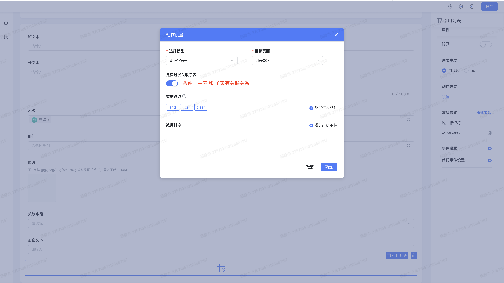
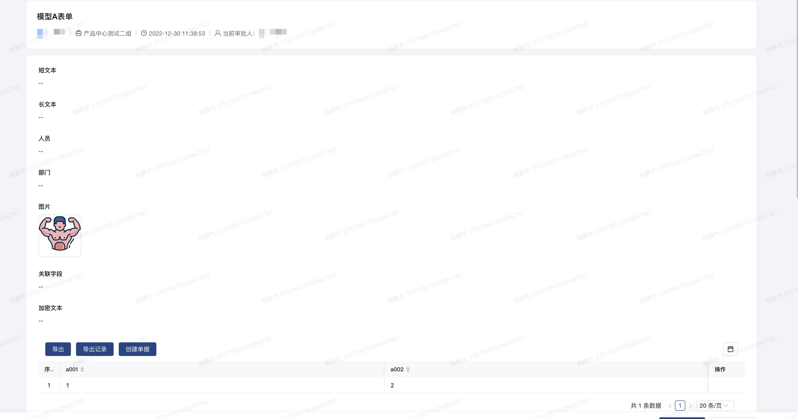
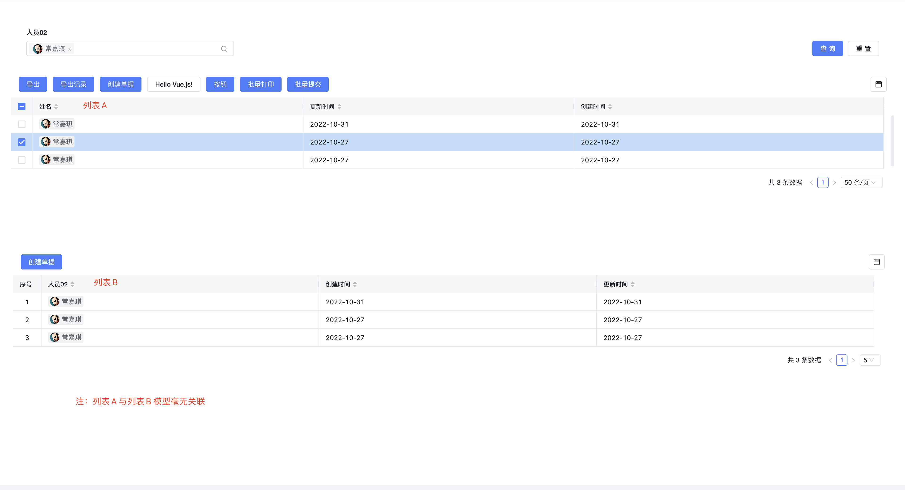

<a id="f4kNB"></a>


### 1.byteluck-list 引用列表

组件说明： 自定义内置高级控件,用于单页面拥有多个列表的场景以及列表与列表之前联动。 表单/自由页面

**示例** :列表A 控制 列表B 数据过滤

**注：创建表单时，表单无uid 则对应的引用列表会展示全量数据，故编辑新增时再去展示引用列表。**





<a id="JrRVq"></a>


### 2.场景

<a id="nWnzY"></a>


#### 2.1大数据量情况

创建单据 查看单据





<a id="IzBFR"></a>


##### A表触发B表 联动数据





<a id="ZkPGa"></a>


### 3.示例


```javascript
//1.设置列表 行点击/行选中事件 （引用列表内行点击事件依赖于列表的 行点击/行选中事件 ）
export function rowSelectClick(payload) {
  console.log('测试行列表点击事件🚀🚀🚀🚀🚀🚀🚀',payload)
}
//设置列表复选框
//存在查询区
ctx.getInstance('列表控件ID').children[0].props.isShowSelection = true
//不存在查询区
ctx.getInstance('列表控件ID').children[1].props.isShowSelection = true
export function checked_list_item(payload) {
  console.log('测试行列表选中事件🚀🚀🚀🚀🚀🚀🚀', payload)
}

//2.自由页面内
const ctx = exports.ctx;
const utils = exports.utils;
const http = utils.getHttp()
const isMobile = utils.getDevice() === 'mobile'
export async function row_clicks(payload) {
/* 🚀 引用列表: 可展示多个列表的控件，用于处理两个不相干列表之间的交互，实现一页面存放多个列表并交互的需求。
   🌰 A B C D 列表 A控制B B控制C C控制D 配置过滤条件，展现需要的数据。
*/
/* 🚀 *
   🚀 ctx.children 会存储当前页面上所有存放的列表context
   🚀 payload结构
   🚀 - instance byteluck-list instance
   🚀 - value
   🚀  - instance list-view instance
   🚀  - option: { "type": "batchSubmit" | "batchPrint" | "checked" } batchSubmit 批量提交选中时  * batchPrint 批量打印选中时 * checked 二开打开选择框时
   🚀  - value:{
   🚀       "rowKeys": [], 列表选择当前行唯一标识
   🚀       "rows": []     列表选择当前行的数据 { dataCode:value }
   🚀   }}
   🚀 ctx.getInstance(列表ID).children[1].props.isShowSelection = true  打开列表checkbox
   🚀
      ==================== 🌰 ====================
*/
  const { instance, options, value: { rows,rowKeys } } = payload.value
  const employee_id = rows.map(item => item.user02[0].employee_id).slice(-1)
// 🚀 传参疑问可参考：https://baiteda.yuque.com/staff-shgita/nbg92z/csh4gh#roR3W  Window全局 updateList传参形式
  const params = {
    paginationInfo: {
      current: 1,
      pageSize: 5,
    },
    //queryInfo 过滤列表B中 user02字段的值
    queryInfo: [{
      key: "user02",
      key_type: "people",
      type: "LIKE",
      value: employee_id
    }],
    // filtersInfo: [
    //   {
    //     "type": "condition",
    //     "id": "sntbN5D3OQPz6Fr",
    //     "rule_id": "1667978077085",
    //     "symbol": "op_equal",
    //     "checked": false,
    //     "describe": "ruleLine",
    //     "left_variable_bo": {
    //       "type": "people",
    //       "value": "user02"
    //     },
    //     "right_variable_bo": {
    //       "type": "custom",
    //       "value": employee_id,
    //       "display_bos": []
    //     }
    //   }
    // ]
  }
// 🚀 PlyEQMcRda 为引用列表A 的control id
  if (payload.instance.id === "WUAyUQlVSv" && options.type === "checked") {
    if (!rowKeys.length) {
      params.paginationInfo.pageSize = 20
      params.filtersInfo = []
    }
// 🚀 IvA28JAcdJ 为被控制引用列表B 的control id listview:reload-list 更新列表
    await ctx.children['B8UBKv187B'].emit('listview:reload-list', {
      value: params,
      options: {
        clearSelectedRows: true
      }
    })
  }
}
```
