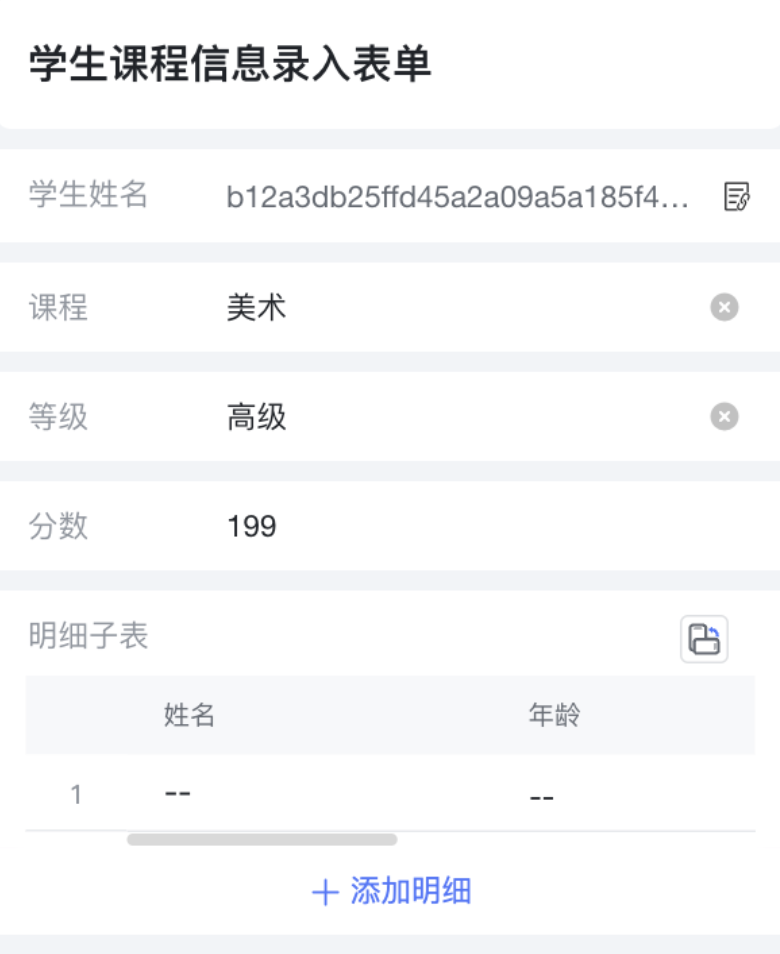
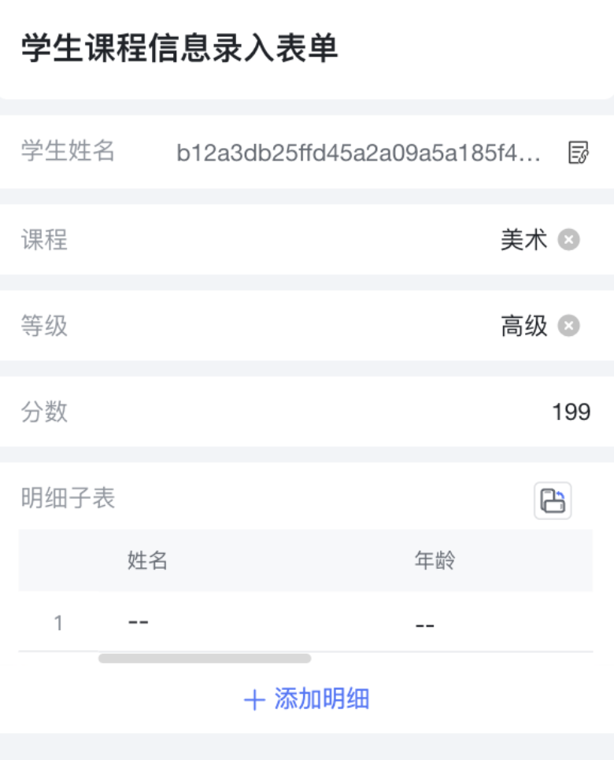

<a id="MD84I"></a>


# 1.主题色

<a id="NZBha"></a>


## 1.1主题色示例

<a id="jkLG9"></a>


### 1.1.1主题色

--bl-brand-c

--bl-brand-hover

--bl-brand-active

--bl-brand-disable

--bl-brand-label

​

<a id="tVEkr"></a>


### 1.1.2功能色

--bl-success-c

--bl-warning-c

--bl-danger-c

--bl-success-light-c

--bl-warning-light-c

--bl-danger-light-c

--bl-disable-c

​

​

<a id="tYpmK"></a>


### 1.1.3辅助色

--bl-font-n900-c

--bl-font-n800-c

--bl-font-n600-c

--bl-font-n500-c

--bl-font-n400-c

--bl-font-n300-c

--bl-font-n250-c

--bl-font-n150-c

​

<a id="n5pZg"></a>


## 1.2CSS 变量（PC端 / 移动端）


```css
:root {
  --bl-brand-c: #4c78fc;
  --bl-brand-hover: #658bfc;
  --bl-brand-active: #4770ea;
  --bl-brand-disable: #bbccfe;
  --bl-brand-label: rgba(76, 120, 252, .1);

  --bl-success-c: #5abb3c;
  --bl-warning-c: #ff9801;
  --bl-danger-c: #ff6459;
  --bl-success-light-c: #e9fae5;
  --bl-warning-light-c: #fff6e5;
  --bl-danger-light-c: #fff0ef;
  --bl-disable-c: #f5f6f7;

  --bl-font-n900-c: #1f2329;
  --bl-font-n800-c: #2b2f36;
  --bl-font-n600-c: #646a73;
  --bl-font-n500-c: #8f959e;
  --bl-font-n400-c: #bbbfc4;
  --bl-font-n300-c: #dee0e3;
  --bl-font-n250-c: #e8eaed;
  --bl-font-n150-c: #f2f4f7;
}
```

<a id="stacQ"></a>


# 2.移动端控件内容对齐方式

移动端需满足左对齐/右对齐两种方式, 需通过变量进行控制:

<a id="ge7Qz"></a>


## 2.1左对齐


```css
body {
  --bl-control-align-method: left;
  --bl-control-align-flex: flex-start;
}
```





<a id="tzyrw"></a>


## 2.2右对齐


```css
body {
  --bl-control-align-method: right;
  --bl-control-align-flex: flex-end;
}
```





<a id="YNpTq"></a>


# 3.紧凑布局/舒适布局（4.4.0以上）

以下变量可以控制表单字体大小


```css
//表单分组标题文字尺寸
--layout-rok-title-font-size: 16px;

//按钮文字尺寸
--layout-button-font-size: 13px;

//列表单元格标题文字尺寸
--layout-table-cell-font-size: 13px;

//表单控件标题文字尺寸
--layout-rok-form-item-font-size: 12px;
```

<a id="j8Nfh"></a>


# 4.更换方式

<a id="j6eg3"></a>


## 4.1CSS更换方式

在全局扩展脚本中，通过css方式覆盖


```css
:root {
  --bl-brand-c: #4c78fc;
  --bl-brand-hover: #658bfc;
  --bl-brand-active: #4770ea;
  --bl-brand-disable: #bbccfe;
  --bl-brand-label: rgba(76, 120, 252, .1);
  --bl-success-c: #5abb3c;
  --bl-warning-c: #ff9801;
  --bl-danger-c: #ff6459;
  --bl-success-light-c: #e9fae5;
  --bl-warning-light-c: #fff6e5;
  --bl-danger-light-c: #fff0ef;
  --bl-font-n900-c: #1f2329;
  --bl-font-n800-c: #2b2f36;
  --bl-font-n600-c: #646a73;
  --bl-font-n500-c: #8f959e;
  --bl-font-n400-c: #bbbfc4;
  --bl-font-n300-c: #dee0e3;
  --bl-font-n250-c: #e8eaed;
  --bl-font-n200-c: #f5f6f7;
  --bl-font-n150-c: #f2f4f7;
  --bl-font-n100-c: #f7f8fa;
}
```

<a id="B2gIp"></a>


## 4.2JS动态更换


```javascript
document.body.style.setProperty('--bl-brand-c', '#4c78fc');
```
