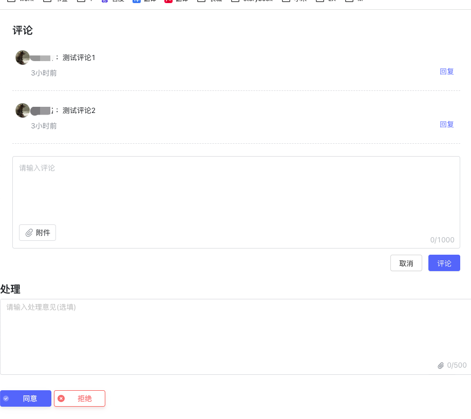

<a id="sxDJN"></a>


## 说明

- 本组件使用 WebComponents 技术开发，兼容各种框架使用，全部使用 CDN 方式接入，以下内容基于 Vue 的使用进行说明。
- 组件传入 token（鉴权）方式：直接在全局添加 approvalConfig 配置，可以在 main.js 中添加。
- 推荐使用Vue3.0以上版本

​

<a id="mcaL4"></a>


## 平台版本对应组件版本

|  |  |  |  |  |  |
| --- | --- | --- | --- | --- | --- |
| **平台版本** | **PC审批组件** | **Mobile审批组件** | **PC OK组件** | **Mobile OK组件** | **备注** |
| release-4.5.0 | approval-wc-widgets-desktop/2.5.27 | approval-wc-widgets-mobile/2.5.9 | ok-wc-ui/3.8.23 | ok-wc-mui/3.5.15 | PC2.5.18版本、Mobile 2.5.2及以上已修复xss漏洞 |

<a id="UDMZ2"></a>


## 引入全局配置


```javascript
  // UI组件库全局配置
  window.okuiConfig = {
      theme: themeColor,
      cdn: 'https://fe-resource.baiteda.com', //非必填，不写该属性则使用默认的
      env: 'PRD',
      apiPath: location.origin + '/apps/api/',    //人员、部门、附件、图片组件接口调用地址
      cardPath: location.origin + '/apps/api/',   //人员卡片接口调用地址，不写内部会使用apiPath代替
      locale: 'zh-CN', //国际化，非必填，不写则使用zh-CN
  }

  // 审批组件全局配置
  window.approvalConfig = {
      authUrl: "http://localhost:8081/apps/api/v1/private/user/getAuth",  // 鉴权URL
      blaPath: 'http://localhost:8081/ego_api/',          //流程v2接口地址，必须填写
      apiPath:'http://localhost:8081/ego_api/',  //流程v1接口地址，必须填写
      // withCredentials 默认值为true (1.3.3 版本新增)
      withCredentials: true,
      blaAtt: 'http://localhost:8081/context_path/'  //context_path为用户自定义的附件服务地址
  };
//移动端需要在window加 widgetsConfig
  window.widgetsConfig = {
      authUrl: "http://localhost:8081/apps/api/v1/private/user/getAuth",  // 鉴权URL
      blaPath: 'http://localhost:8081/ego_api/',          //流程v2接口地址，必须填写
      apiPath:'http://localhost:8081/ego_api/client/v1/',  //流程v1接口地址，必须填写
      // withCredentials 默认值为true (1.3.3 版本新增)
    	env: 'PRD',//可选
      withCredentials: true,
  };
```

<a id="WS3nt"></a>


## 通过 CDN 的方式引入css和jS


```javascript

// PC
  // css
  <link rel="stylesheet" href="https://fe-resource.baiteda.com/iconfonts/lowcode-fonts/iconfont.css">
  <link rel="stylesheet" href="https://fe-resource.baiteda.com/lib/ok-wc-ui/3.8.33/dist/style.css"/>
  <link rel="stylesheet" href="https://fe-resource.baiteda.com/lib/%40byteluck/approval-wc-widgets-desktop/2.5.27/dist/css/index.css">
  <link rel="stylesheet" href="https://fe-resource.baiteda.com/lib/byteluck-theme/0.1.13/byteluck.theme.blue.ant.css">
  <link rel="stylesheet" href="https://fe-resource.baiteda.com/lib/byteluck-theme/0.3.9/byteluck.layout.cover.css?t=1709880781393">
  <link rel="stylesheet" href="https://fe-resource.baiteda.com/lib/byteluck-theme/css/layout-theme-variable.css">
  // js
  <script src="https://fe-resource.baiteda.com/lib/ok-wc-ui/3.8.33/dist/ok-wc-ui.umd.js"></script>
  <script src="https://fe-resource.baiteda.com/lib/%40byteluck/approval-wc-widgets-desktop/2.5.27/dist/js/index.js"></script>
  <script src="https://fe-resource.baiteda.com/lib/%40byteluck/approval-wc-widgets-desktop/2.5.27/dist/js/chunk-vendors.js"></script>

// Mobile
  // css
  <link rel="stylesheet" href="https://fe-resource.baiteda.com/iconfonts/lowcode-fonts/iconfont.css">
  <link rel="stylesheet" href="https://fe-resource.baiteda.com/lib/ok-wc-mui/3.5.17/dist/style.css">
  <link rel="stylesheet" href="https://fe-resource.baiteda.com/lib/%40byteluck/approval-wc-widgets-mobile/2.5.13/dist/style.css">
  <link rel="stylesheet" href="https://fe-resource.baiteda.com/libs/vant-3.6.10/index.css">
  // js
  <script async="" src="https://fe-resource.baiteda.com/lib/ok-wc-mui/3.5.17/dist/ok-wc-mui.umd.js"></script>
  <script async="" src="https://fe-resource.baiteda.com/lib/%40byteluck/approval-wc-widgets-mobile/2.5.13/dist/%40byteluck/approval-wc-widgets-mobile.umd.js"></script>
```

<a id="SZoeo"></a>


## 使用案例

(注：HTML文件demo中如task-id使用中划线，在Vue项目中需使用驼峰)

<a id="oKi4B"></a>


### Html页面使用案例


```javascript
<!DOCTYPE html>
<html lang="">

<head>
    <meta charset="utf-8" />
    <meta http-equiv="X-UA-Compatible" content="IE=edge" />
    <meta name="viewport" content="width=device-width,initial-scale=1.0" />
    <!-- PC -->
    <link rel="stylesheet" href="https://fe-resource.baiteda.com/iconfonts/lowcode-fonts/iconfont.css">
    <link rel="stylesheet" href="https://fe-resource.baiteda.com/lib/ok-wc-ui/3.8.33/dist/style.css" />
    <link rel="stylesheet" href="https://fe-resource.baiteda.com/lib/%40byteluck/approval-wc-widgets-desktop/2.5.27/dist/css/index.css">
    <link rel="stylesheet" href="https://fe-resource.baiteda.com/lib/byteluck-theme/0.1.13/byteluck.theme.blue.ant.css">
    <link rel="stylesheet" href="https://fe-resource.baiteda.com/lib/byteluck-theme/0.3.9/byteluck.layout.cover.css?t=1709880781393">
    <link rel="stylesheet" href="https://fe-resource.baiteda.com/lib/byteluck-theme/css/layout-theme-variable.css">
    <!-- Mobile -->
    <!-- <link rel="stylesheet" href="https://fe-resource.baiteda.com/iconfonts/lowcode-fonts/iconfont.css"> -->
    <!-- <link rel="stylesheet" href="https://fe-resource.baiteda.com/lib/ok-wc-mui/3.5.17/dist/style.css"> -->
    <!-- <link rel="stylesheet" href="https://fe-resource.baiteda.com/lib/%40byteluck/approval-wc-widgets-mobile/2.5.13/dist/style.css"> -->
    <!-- <link rel="stylesheet" href="https://fe-resource.baiteda.com/libs/vant-3.6.10/index.css"> -->
</head>

<body>
    <script>
    // <!--OK组件全局配置-->
  	window.okuiConfig = {
  		cdn: 'https://fe-resource.baiteda.com', //非必填，不写该属性则使用默认的
  		env: 'PRD',
  		apiPath: location.origin + '/apps/api/', //人员、部门、附件、图片组件接口调用地址
  		cardPath: location.origin + '/apps/api/', //人员卡片接口调用地址，不写内部会使用apiPath代替
  		locale: 'zh-CN', //国际化，非必填，不写则使用zh-CN
  	}

    // 新版审批组件
    window.approvalConfig = {
        env: "PRD",
        blaPath: "https://testqw.baiteda.com/ego_api/",
        // 鉴权URL
        authUrl: "https://testqw.baiteda.com/apps/api/v1/private/user/getAuth",
        // 接口请求前缀
        apiPath: "https://testqw.baiteda.com/ego_api/",
        withCredentials: true,
    }
  //移动端需要在window加 widgetsConfig
    window.widgetsConfig = {
			env: 'PRD',
			blaPath: 'https://testqw.baiteda.com/ego_api/',
			// 鉴权URL
			authUrl: 'https://testqw.baiteda.com/apps/api/v1/private/user/getAuth',
			// 接口请求前缀
			apiPath: 'https://testqw.baiteda.com/ego_api/client/v1/"',
			withCredentials: true,
		}
    </script>
    <!--审批框组件-->
    <bla-decision task-id="6213b588-6794-4afb-9f15-33c9ca2a5868"></bla-decision>
    <!-- 一键建群-->
    <!--def-key：流程定义key -->
    <bla-chatgroup process-Instance-Id="091b1e75-abe1-4e05-adf2-07051122a12b" def-key="sdfdsf" biz-num="3f64de6bcc2c4fdb8ccfd8f01a5ad5d1"></bla-chatgroup>
    <!--    流程预览-->
    <bla-forecast layout="theme2" process-Instance-Id="091b1e75-abe1-4e05-adf2-07051122a12b"></bla-forecast>
    <!--    审批记录-->
    <bla-record process-Instance-Id="091b1e75-abe1-4e05-adf2-07051122a12b"></bla-record>
    <!--   评论组件-->
    <bla-discuss process-Instance-Id="091b1e75-abe1-4e05-adf2-07051122a12b"></bla-discuss>
    <!-- PC -->
    <script src="https://fe-resource.baiteda.com/lib/ok-wc-ui/3.8.23/dist/ok-wc-ui.umd.js"></script>
    <script src="https://fe-resource.baiteda.com/lib/%40byteluck/approval-wc-widgets-desktop/2.5.27/dist/js/index.js"></script>
    <script src="https://fe-resource.baiteda.com/lib/%40byteluck/approval-wc-widgets-desktop/2.5.27/dist/js/chunk-vendors.js"></script>
    <!-- Mobile -->
    <!-- <script async="" src="https://fe-resource.baiteda.com/lib/ok-wc-mui/3.5.17/dist/ok-wc-mui.umd.js"></script> -->
    <!-- <script async="" src="https://fe-resource.baiteda.com/lib/%40byteluck/approval-wc-widgets-mobile/2.5.13/dist/%40byteluck/approval-wc-widgets-mobile.umd.js"></script> -->
</body>

</html>
```

<a id="fuy7b"></a>


### Vue3及以上版本框架使用案例

**（注：属性传参，****PC****推荐使用. eg: .taskId="taskId"，****移动端****推荐使用: eg: :taskId="taskId"）**


```javascript
<template>
		<bla-decision
			.taskId="taskId"
			.locale="locale"
			.hideUrge="false"
			.decisionClick="decisionClick"
			.closeUpload="false"
			.requestResult="requestResult"
		></bla-decision>
		<bla-discuss
			ref="discussRef"
			.processInstanceId="processInstanceId"
			.locale="zh"
		></bla-discuss>
		<bla-forecast
			.locale="locale"
			.processInstanceId="processInstanceId"
			.promptingFlag="msgRelationType"
			.innerStyle="{ borderRadius: '8px' }"
			layout="theme2"
		/>
		<bla-record
			.locale="locale"
			.processInstanceId="processInstanceId"
			.innerStyle="{ borderRadius: '8px' }"
		></bla-record>
		<bla-chatgroup
			.locale="locale"
			.processInstanceId="processInstanceId"
			.bizNum="bizNum"
		></bla-chatgroup>
</template>
<script setup lang="ts">
import { onMounted, ref } from 'vue'
import { client, isIpad } from '@/utils'

const pcFlag = ref()
// const ipadFlag = ref()

pcFlag.value = client.isPc()
// ipadFlag.value = isIpad()
onMounted(() => {})
const locale = ref('zh')
const taskId = ref('d0034fb0-989b-4972-b930-6f18cbf2cf41')
const processInstanceId = ref('c108e04f-5b93-41b1-89b6-7347475255a8')
const msgRelationType = false
const decisionClick = () => {
	return new Promise<void>(async (resolve, reject) => {
		// 执行相关业务逻辑
	})
}
const requestResult = () => {}
</script>
```


**​**

<a id="si1Jm"></a>


### 其他框架使用

<a id="Yv1Xy"></a>


#### Vue2中使用审批组件


```javascript
<template :v-loading="mapLoading">
  <bla-discuss ref="discussRef"></bla-discuss>
</template>
<script>
  export default {
    props: [],
    name: "Demo",
    data() {
      return {
        processInstanceId : "0f5b0316-0d69-450e-bf78-ea492ba215bf",
        locale : "zh"
      };
    },
    mounted() {
      this.$refs.discussRef.locale = this.locale;
      this.$refs.discussRef.processInstanceId = this.processInstanceId;
    },

    methods: {

    }
  };
</script>
```

<a id="TtUMR"></a>


#### React中使用审批组件

- **接入效果（以PC为例）**





- **使用**


```javascript
<!DOCTYPE html>
<html lang="en">

<head>
  <meta charset="utf-8" />
  <link rel="icon" href="%PUBLIC_URL%/favicon.ico" />
  <meta name="viewport" content="width=device-width, initial-scale=1" />
  <meta name="theme-color" content="#000000" />
  <meta name="description" content="Web site created using create-react-app" />
  <link rel="apple-touch-icon" href="%PUBLIC_URL%/logo192.png" />
  <link rel="manifest" href="%PUBLIC_URL%/manifest.json" />
  <title>React App</title>
  <link rel="stylesheet" href="https://fe-resource.baiteda.com/iconfonts/lowcode-fonts/iconfont.css">
  <link rel="stylesheet" href="https://fe-resource.baiteda.com/lib/ok-wc-ui/3.8.33/dist/style.css" />
  <link rel="stylesheet"
    href="https://fe-resource.baiteda.com/lib/%40byteluck/approval-wc-widgets-desktop/2.5.27/dist/css/index.css">
  <link rel="stylesheet" href="https://fe-resource.baiteda.com/lib/byteluck-theme/0.1.13/byteluck.theme.blue.ant.css">
  <link rel="stylesheet"
    href="https://fe-resource.baiteda.com/lib/byteluck-theme/0.3.9/byteluck.layout.cover.css?t=1709880781393">
  <link rel="stylesheet" href="https://fe-resource.baiteda.com/lib/byteluck-theme/css/layout-theme-variable.css">
</head>

<body>
  <noscript>You need to enable JavaScript to run this app.</noscript>
  <div id="root"></div>
  <script>
    window.okuiConfig = {
      cdn: 'https://fe-resource.baiteda.com', //非必填，不写该属性则使用默认的
      env: 'PRD',
      apiPath: location.origin + '/apps/api/', //人员、部门、附件、图片组件接口调用地址
      cardPath: location.origin + '/apps/api/', //人员卡片接口调用地址，不写内部会使用apiPath代替
      locale: 'zh-CN', //国际化，非必填，不写则使用zh-CN
    }
    // 新版审批组件
    window.approvalConfig = {
      env: "PRD",
      blaPath: "https://testqw.baiteda.com/ego_api/",
      // 鉴权URL
      authUrl: "https://testqw.baiteda.com/apps/api/v1/private/user/getAuth",
      // 接口请求前缀
      apiPath: "https://testqw.baiteda.com/ego_api/",
      withCredentials: true,
    }
  </script>
  <script src="https://fe-resource.baiteda.com/lib/ok-wc-ui/3.8.33/dist/ok-wc-ui.umd.js"></script>
  <script src="https://fe-resource.baiteda.com/lib/%40byteluck/approval-wc-widgets-desktop/2.5.27/dist/js/index.js"></script>
  <script
    src="https://fe-resource.baiteda.com/lib/%40byteluck/approval-wc-widgets-desktop/2.5.27/dist/js/chunk-vendors.js"></script>
</body>

</html>
```


```javascript
import { useRef } from "react";

const Demo1 = () => {
  //评论组件
  const discussRef = useRef(null);
  // 审批按钮组件
  const decisionRef = useRef(null);
  const processInstanceId = useRef("8b2dac5b-2a1f-4815-a688-3585760dd727");
  const taskId = useRef("22e5be87-fac0-4be6-88d4-f4ddd6dbc582");
  const decisionClick = (val) => {
    console.log(" ----- 审批按钮事件:", val);
  };
  //项目中ref赋值需注意组件DOM加载生命周期
  setTimeout(() => {
    discussRef.current.processInstanceId = processInstanceId.current;
    decisionRef.current.taskId = taskId.current;
    decisionRef.current.decisionClick = decisionClick;
  });
  return (
    <div className="test-approval">
      <bla-discuss ref={discussRef}></bla-discuss>
      <bla-decision ref={decisionRef}></bla-decision>
    </div>
  );
};
export default Demo1;
```


- **demo地址**

<https://ego-fe.oss-cn-beijing.aliyuncs.com/resources/yuque/react-demo.zip>

<a id="cZFhp"></a>


## 补充中~

**​**

**​**

**​**

**​**

**​**

**​**

**​**

**​**

**​**

**​**

**​**

**​**

**​**

**​**

**​**
