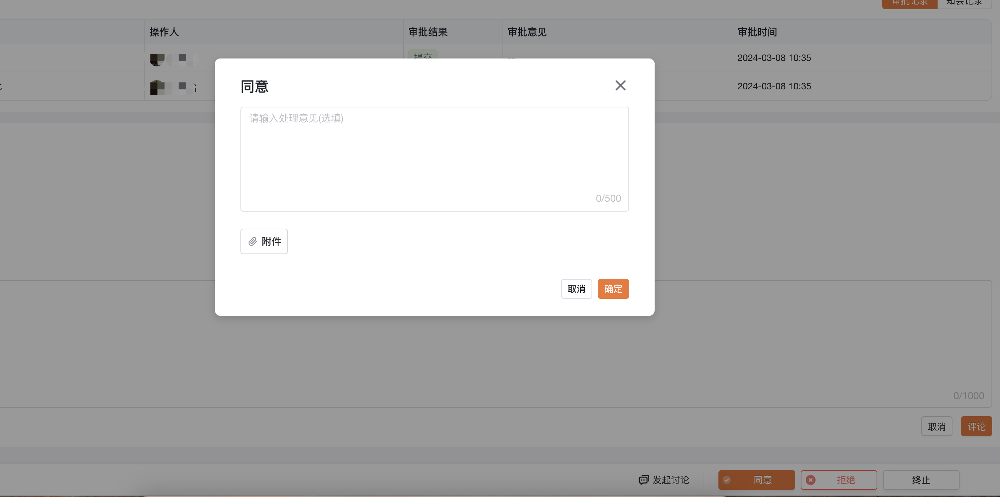
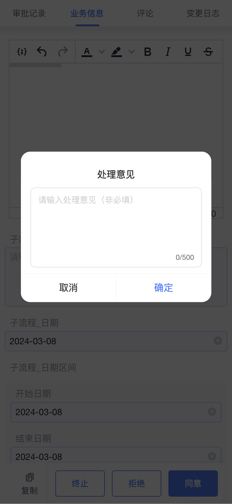

<a id="tHTsf"></a>


## 效果展示

|  |  |
| --- | --- |
| PC效果 | 移动端效果 |
|



 |



 |

<a id="sKYGy"></a>


## 如何使用

- **Vue框架**


```javascript
<template>
  <div class="hello">
    <!-- 具体参数参考上面参数说明，此处只为示例 -->
    <bla-decision
      .taskId="taskId"
      .locale="locale"
      .hideUrge="false"
      .decisionClick="decisionClick"
    ></bla-decision>
  </div>
</template>
<script>
  import { defineComponent } from "vue";
  export default defineComponent({
    setup() {
      const taskId = "0f5b0316-0d69-450e-bf78-ea492ba215bf";
      const locale = "zh";
      const decisionClick = () => {
        return new Promise<void>(async (resolve, reject) => {
          // 执行相关业务逻辑
        })
      };
      return {
        taskId,
        locale,
        decisionClick,
      };
    },
  });
</script>
```

<a id="MoDTx"></a>


## API

|  |  |  |  |  |
| --- | --- | --- | --- | --- |
| **参数** | **说明** | **类型** | **可选值** | 移动端 |
| task-id | 必选项，任务ID | String | ​ | 支持 |
| locale | 国际化设置，默认为 zh（中文） | String | en zh ja | 支持 |
| disable-click | 选填，是否禁止操作 | Boolean | ​ | - |
| notice-theme | 选填，是否由接入方自定义知会操作 | Boolean | ​ | - |
| urge-theme | 选填，是否由接入方自定义催办操作 | Boolean | ​ | - |
| hide-urge | 选填，控制催办按钮是否强制隐藏，默认为 false | Boolean | ​ | - |
| format-data-callback | 在数据返回给前端后，业务方可对参数进行预处理， | Function | ​ | - |
| request-result | 组件获取按钮数据接口调用完毕（用来控制 loading），调用完毕后返回参数，成功为{result: true}，失败为{result: false}。注意：1.8.4 和 1.11.0 以上版本支持 | Function | ​ | 支持 |
| decision-click | 点击按钮时暴露给接入方的数据,传入的方法需要返回一个promise对象 | Function | ​ | 支持 |
| before-btn-click | 执行审批操作之前的方法 | Function | ​ | 支持 |
| decision-all-btn | 返回所有审批组件中的按钮 | Function | ​ | - |
| validate | 外部表单的校验函数，点击审批按钮时会调用 | Function | ​ | 支持 |
| get-other-btn-popup-container | 重新定义popup弹窗位置，默认body | Function | ​ | - |

​
