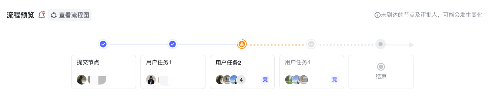

<a id="QrTQh"></a>


## 效果展示

|  |  |
| --- | --- |
| PC效果 | 移动端效果 |
|



 |


 |

<a id="zSE8X"></a>


## 如何使用

- **Vue框架**


```javascript
<template>
  <!-- 具体参数参考上面参数说明，此处只为示例 -->
	<bla-forecast
      .locale="locale"
      .processInstanceId="processInstanceId"
      .promptingFlag="msgRelationType"
      .innerStyle="{ borderRadius: '8px' }"
      layout="theme2"
      @view-chart="handleViewChart"
    ></bla-forecast>
</template>
<script>
import { defineComponent } from "vue";
export default defineComponent({
  setup() {
    const processInstanceId = "0f5b0316-0d69-450e-bf78-ea492ba215bf";
    const locale = "zh";
    const msgRelationType=false
    return {
      processInstanceId,
      locale,
      msgRelationType
    };
  },
});
</script>
```

<a id="KLnVY"></a>


## API

|  |  |  |  |  |
| --- | --- | --- | --- | --- |
| **参数** | **说明** | **类型** | **可选值** | 移动端 |
| process-instance-id | 必选项 | String | ​ | 支持 |
| locale | 国际化设置，默认为 zh（中文） | String | en zh ja | 支持 |
| prompting-flag | 选填，是否展示进度提醒功能，默认为 true 显示 | Boolean | ​ | 支持 |
| layout | 布局方式 | String | theme1  theme2 | - |
