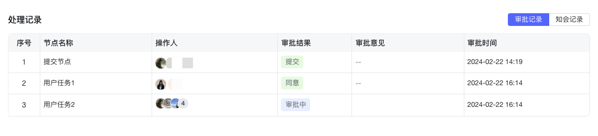
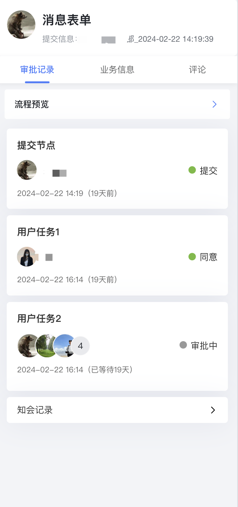

<a id="zDYNM"></a>


## 效果展示

|  |  |
| --- | --- |
| PC效果 | 移动端效果 |
|



 |



 |

<a id="lKCaJ"></a>


## 如何使用

- **Vue框架**


```javascript
<template>
  <!-- 具体参数参考上面参数说明，此处只为示例 -->
		<bla-record
				.locale="locale"
				.processInstanceId="processInstanceId"
				.innerStyle="{ borderRadius: '8px' }"
			></bla-record>
</template>
<script>
import { defineComponent } from "vue";
export default defineComponent({
  setup() {
    const processInstanceId = "0f5b0316-0d69-450e-bf78-ea492ba215bf";
    const locale = "zh";
    return {
      processInstanceId,
      locale,
    };
  },
});
</script>
```

<a id="hmnqO"></a>


## API

|  |  |  |  |  |
| --- | --- | --- | --- | --- |
| **参数** | **说明** | **类型** | **可选值** | 移动端 |
| process-instance-id | 必选项 | String | ​ | 支持 |
| locale | 国际化设置，默认为 zh（中文），1.10.0 版本以上支持日语 ja | String | en zh ja | 支持 |
| show-selection | 是否开启多选 | Boolean | false true | - |
| show-operation-column | 是否显示操作列 | Boolean | false true | - |
