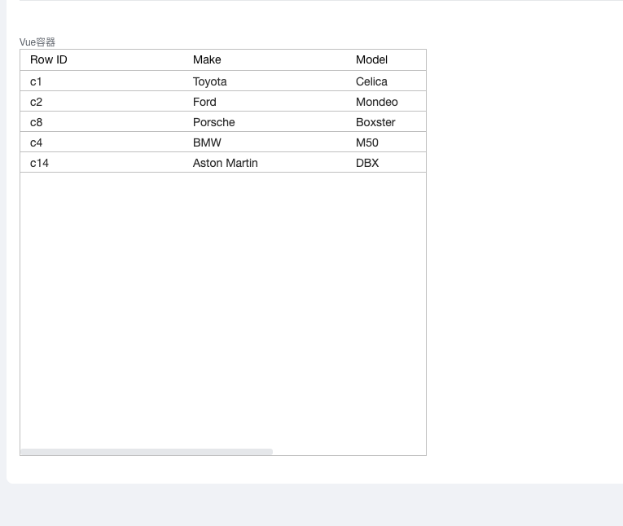

<a id="jbp1Y"></a>


# 1.简介

全局注册aggird组件，[aggrid文档](https://ag-grid.com/) 需查阅vue相关文档。

<a id="lEuxF"></a>


# 2.示例代码


```javascript
const ctx = exports.ctx;
const utils = exports.utils;
const http = utils.getHttp()
const isMobile = utils.getDevice() === 'mobile'
export const custom_vue =  {
  template: `
     <ag-grid-vue
      style="width: 500px; height: 500px;"
      :class="themeClass"
      :columnDefs="columnDefs"
      @grid-ready="onGridReady"
      :rowData="rowData"
      :getRowId="getRowId"
      />
  `,
  props: ['instance', 'name', 'value', 'rowIndex', 'pageStatus', 'permissions'],
  emits: ['change'],
  data: function () {
    return {
      columnDefs: [
        { headerName: 'Row ID', valueGetter: 'node.id' },
        { field: 'make' },
        { field: 'model' },
        { field: 'price' },
      ],
      gridApi: null,
      themeClass:
        "ag-theme-quartz",

      rowData: null,
      getRowId: null,
    };
  },
  created() {
    this.rowData = [
      { id: 'c1', make: 'Toyota', model: 'Celica', price: 35000 },
      { id: 'c2', make: 'Ford', model: 'Mondeo', price: 32000 },
      { id: 'c8', make: 'Porsche', model: 'Boxster', price: 72000 },
      { id: 'c4', make: 'BMW', model: 'M50', price: 60000 },
      { id: 'c14', make: 'Aston Martin', model: 'DBX', price: 190000 },
    ];
    this.getRowId = (params) => params.data.id;
  },
  methods: {
    onGridReady(params) {
      this.gridApi = params.api;
    },
  },
}
```

<a id="LhBZ2"></a>


# 3.示例图



